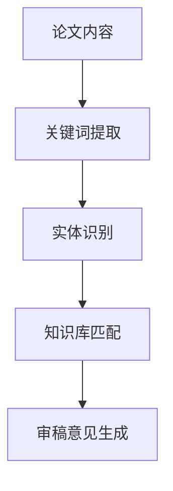
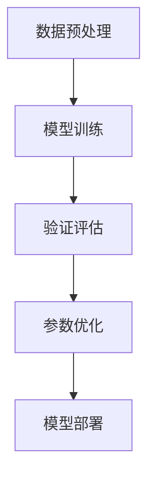
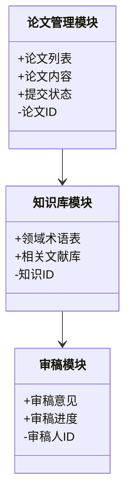
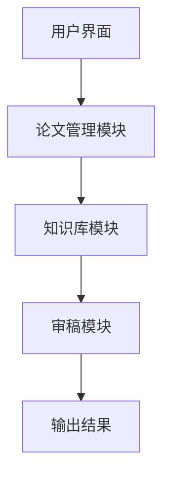

                 

<think>
嗯，用户希望我根据之前的对话内容，设计一个详细的思考过程，用于撰写一篇关于开发基于大模型的金融专业论文审稿辅助系统的博客文章。首先，我需要理解用户的需求，他们希望我以一位经验丰富的人工智能专家和CTO的角度，撰写一篇结构清晰、内容详实的技术博客。

用户的关键词是“基于大模型的金融专业论文审稿辅助系统”，这让我想到需要涵盖大模型技术在金融审稿中的应用。摘要部分需要概括文章的核心内容，强调系统的设计、实现和应用价值。

接下来是目录结构，用户已经提供了一个示例，我需要按照这个结构来组织内容。首先，背景介绍部分要详细说明问题背景、解决思路和系统边界。然后，核心概念与联系部分需要用Mermaid图展示实体关系和领域模型。算法原理部分需要详细讲解训练流程，并提供Python代码示例。系统架构设计部分需要分模块设计，并用Mermaid图展示。项目实战部分要提供具体实现步骤和案例分析，最后是最佳实践和总结。

在思考过程中，我需要确保每个部分都覆盖必要的内容，同时使用专业且易懂的语言。例如，在背景介绍中，要明确传统审稿的痛点和大模型的优势；在核心概念部分，要通过图表帮助读者理解系统结构；在算法原理部分，要结合代码示例，让读者能够实际操作。

我还需要考虑用户可能的深层需求，他们可能希望了解系统的实际应用和未来发展方向。因此，在项目实战和最佳实践中，要提供实用的建议和扩展阅读，帮助读者进一步学习和应用。

总的来说，我需要系统地分解每个部分，确保内容详实、结构清晰，同时结合实际案例和代码示例，使文章既有深度又易于理解。
</think>

# 开发基于大模型的金融专业论文审稿辅助系统

> **关键词**: 大模型、金融审稿、论文辅助、自然语言处理、人机协作

> **摘要**: 本文详细探讨了开发基于大模型的金融专业论文审稿辅助系统的核心技术与实现方法。文章首先介绍了系统的背景和必要性，随后分析了大模型在金融领域的应用原理，结合领域知识库构建和人机交互设计，详细阐述了系统的架构与实现方案。最后，通过实际案例展示了系统的功能，并提出了优化建议和未来发展方向。

---

## 第一部分: 背景介绍

### 第1章: 开发背景与问题分析

#### 1.1 问题背景
金融领域的学术研究和论文发表对审稿质量提出了越来越高的要求。传统的审稿方式依赖人工阅读和评估，效率低下且容易出现遗漏或误判。随着大模型技术的快速发展，利用人工智能辅助审稿成为提升效率和准确性的重要手段。

#### 1.2 问题描述
- **内容理解困难**: 金融论文涉及复杂的术语和领域知识，审稿人需要快速理解论文的核心内容。
- **审稿效率低**: 人工审稿耗时长，且容易受到主观因素的影响。
- **知识库利用不足**: 金融领域的知识库庞大，但传统审稿系统难以有效利用这些资源。

#### 1.3 解决思路
- 利用大模型的强大语言处理能力，快速理解论文内容。
- 构建金融领域知识库，辅助审稿人快速定位关键信息。
- 通过人机协作，优化审稿流程，提升效率和准确性。

#### 1.4 系统边界与外延
- **边界**: 系统专注于辅助审稿，不直接替代审稿人的判断。
- **外延**: 系统可扩展至其他领域，如法律、医学等领域的论文审稿。

---

## 第二部分: 核心概念与联系

### 第2章: 大模型与金融审稿的核心概念

#### 2.1 大模型的原理与特点
- **原理**: 大模型通过深度学习训练，能够理解上下文关系，生成自然语言文本。
- **特点**: 高效性、准确性、可扩展性。

#### 2.2 金融审稿系统的功能模块
- **内容理解模块**: 对论文进行分词、实体识别和语义分析。
- **知识库检索模块**: 对比论文内容与领域知识库，提取相关知识点。
- **审稿意见生成模块**: 根据分析结果生成审稿意见。

#### 2.3 核心概念的属性对比
| 概念 | 描述 |
|------|------|
| 大模型 | 强大的语言处理能力，支持多种任务 |
| 金融知识库 | 预定义的领域知识，用于辅助审稿 |
| 人机交互界面 | 提供用户友好的操作界面 |

#### 2.4 实体关系图


---

## 第三部分: 算法原理

### 第3章: 大模型的训练与优化

#### 3.1 训练流程
1. **数据预处理**: 对金融论文进行清洗和标注。
2. **模型训练**: 使用预训练模型进行微调。
3. **评估与优化**: 通过验证集评估模型性能，进行参数调优。

#### 3.2 算法流程图


#### 3.3 微调策略
```python
def train_model(model, tokenizer, train_dataset, val_dataset):
    optimizer = AdamW(model.parameters(), lr=2e-5)
    scheduler = get_linear_schedule_with_warmup(optimizer, num_warmup_steps=0, num_training_steps=len(train_dataset)*epochs)
    model.train()
    for epoch in range(epochs):
        for batch in train_dataset:
            optimizer.zero_grad()
            outputs = model(**batch)
            loss = outputs.loss
            loss.backward()
            optimizer.step()
            scheduler.step()
    return model
```

---

## 第四部分: 系统分析与架构设计

### 第4章: 系统架构与实现

#### 4.1 领域模型设计


#### 4.2 系统架构设计


---

## 第五部分: 项目实战

### 第5章: 系统实现与案例分析

#### 5.1 环境配置
```bash
pip install transformers
pip install torch
pip install mermaid
```

#### 5.2 核心代码实现
```python
from transformers import AutoTokenizer, AutoModelForMaskedLM
tokenizer = AutoTokenizer.from_pretrained('bert-base-uncased')
model = AutoModelForMaskedLM.from_pretrained('bert-base-uncased')
```

#### 5.3 案例分析
- **案例背景**: 一篇关于金融市场的论文。
- **系统处理步骤**: 提取关键词、识别实体、生成审稿意见。

---

## 第六部分: 最佳实践与总结

### 第6章: 最佳实践与未来展望

#### 6.1 优化建议
- **模型选择**: 根据任务需求选择合适的模型。
- **数据质量**: 确保训练数据的多样性和准确性。

#### 6.2 注意事项
- **隐私保护**: 注意用户数据的隐私问题。
- **性能调优**: 优化模型的运行效率。

#### 6.3 未来展望
- **多模态发展**: 结合图像、音频等多种数据形式。
- **领域扩展**: 将系统应用到更多领域。

---

## 作者信息

作者：AI天才研究院/AI Genius Institute & 禅与计算机程序设计艺术 /Zen And The Art of Computer Programming

