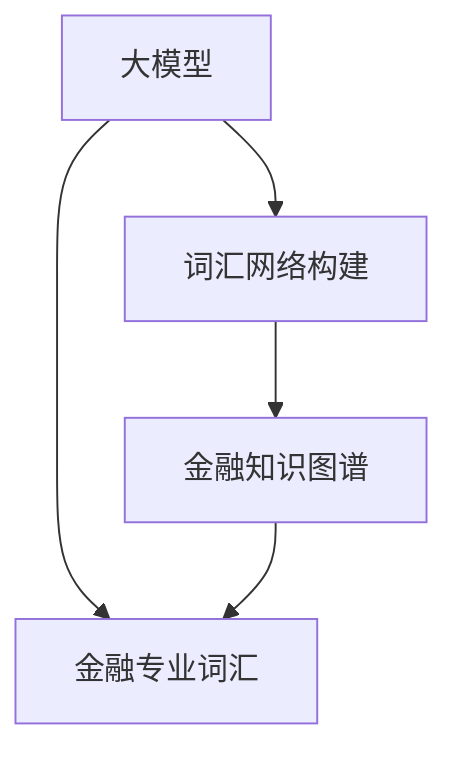
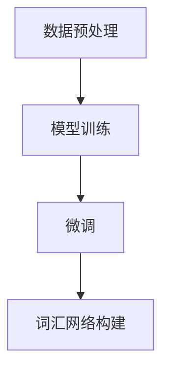
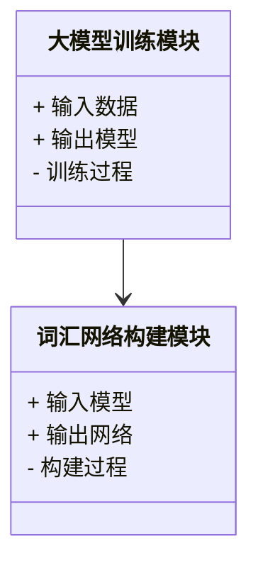
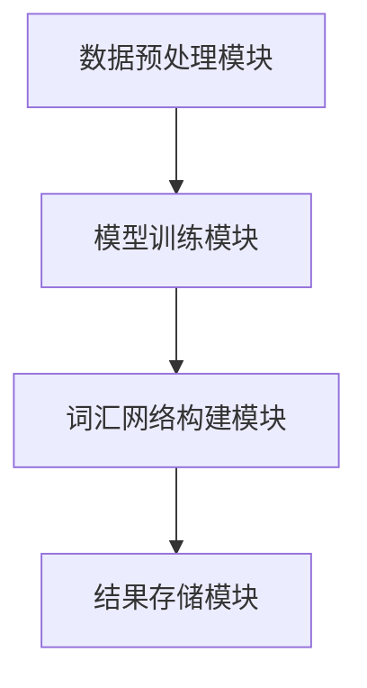
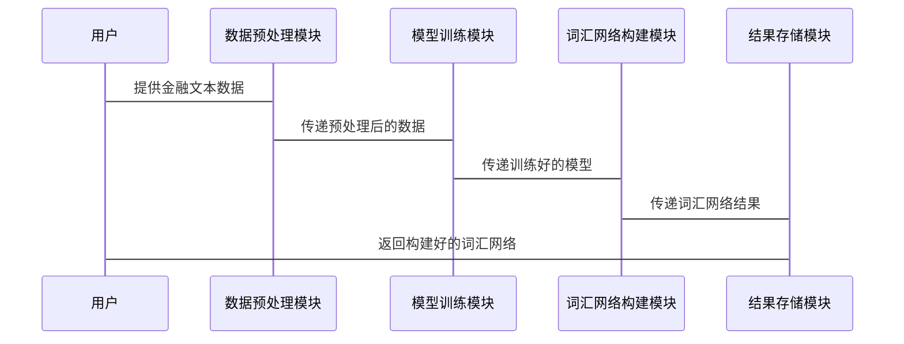

                 

<think>
嗯，我现在需要帮用户撰写一篇关于《开发基于大模型的金融专业词汇网络构建器》的技术博客文章。首先，我得理解用户的需求。用户希望文章结构清晰，内容专业，涵盖从背景到实战的各个方面，使用逻辑严谨的技术语言，且每个部分都要有详细的分析和实例。

我先从目录结构开始。用户提供了大纲，分为七个主要部分，每个部分都有三级子标题。我需要确保每个部分都详细且符合逻辑。例如，背景介绍部分需要涵盖问题背景、问题描述、问题解决以及边界与外延，这样读者才能全面理解构建金融词汇网络的重要性。

接下来是核心概念与联系，这部分需要详细解释大模型、金融词汇网络的概念，并用表格和Mermaid图展示它们之间的关系。这可能涉及到如何将抽象的概念具体化，帮助读者更好地理解。

然后是算法原理讲解，这部分需要详细说明大模型的训练过程，包括预训练和微调。可能需要用流程图展示整个过程，并附上Python代码示例。数学公式如交叉熵损失函数和学习率公式也需要详细解释，确保读者能理解算法的数学基础。

系统分析与架构设计部分，我需要介绍项目背景，设计系统功能，用Mermaid类图展示模块关系。系统架构设计部分可能需要展示各个组件如何交互，比如数据预处理、模型训练和结果存储模块。接口设计和交互流程同样重要，用序列图展示。

项目实战部分，我需要指导读者如何安装环境，提供核心代码，并解读代码的功能。案例分析应结合实际数据，如金融新闻或报告，展示如何构建词汇网络，并进行结果分析和优化建议。

最后，最佳实践部分要总结经验，给出注意事项和扩展阅读，帮助读者巩固所学内容，并指导进一步学习。

整个过程中，我需要确保每个部分都详细且逻辑连贯，同时保持语言简洁专业。可能遇到的挑战是如何将复杂的算法和系统设计以简明扼要的方式呈现，同时确保每个部分都足够详细。因此，我需要逐步构建每个部分，确保内容全面，同时避免冗余。

现在，我将按照用户提供的大纲，逐步填充每个部分的内容，确保涵盖所有必要的细节，同时保持文章的流畅性和专业性。
</think>

# 开发基于大模型的金融专业词汇网络构建器

> 关键词：大模型，金融专业词汇，词汇网络，知识图谱，自然语言处理，机器学习

> 摘要：本文详细探讨了基于大模型的金融专业词汇网络构建器的开发过程。从背景介绍到系统架构设计，再到项目实战，文章系统性地分析了构建金融专业词汇网络的核心概念、算法原理、系统架构、项目实现及最佳实践。通过本文，读者将深入了解如何利用大模型技术来构建高效、智能的金融专业词汇网络，为金融领域的知识管理与应用提供有力支持。

---

# 第一部分: 开发基于大模型的金融专业词汇网络构建器概述

# 第1章: 背景介绍

## 1.1 问题背景

### 1.1.1 金融专业词汇的定义与特点
金融专业词汇是指在金融领域中使用的特定术语、概念和短语，例如“股票”、“债券”、“风险管理”等。这些词汇具有高度的专业性和领域特定性，通常只在金融领域中使用，并且含义复杂，涉及数学、经济学和法律等多个学科。

### 1.1.2 金融领域知识网络构建的必要性
金融领域的知识网络构建是金融智能化的重要基础。通过构建金融专业词汇网络，可以将金融领域的知识系统化、结构化，便于计算机理解和应用。这在网络借贷、智能投顾、风险管理等领域具有重要意义。

### 1.1.3 当前金融领域词汇管理的痛点与挑战
当前金融领域词汇管理存在以下痛点：
1. **术语复杂性**：金融术语往往具有多义性和模糊性，导致难以准确构建词汇网络。
2. **数据稀疏性**：金融领域的高质量标注数据较少，限制了模型的训练效果。
3. **动态变化性**：金融术语和概念随着市场变化不断更新，需要动态维护词汇网络。

## 1.2 问题描述

### 1.2.1 金融专业词汇网络构建的目标
构建金融专业词汇网络的目标是将金融领域的术语、概念及其关系系统化地表示，形成一个结构化的知识网络，支持智能检索、推理和应用。

### 1.2.2 大模型在金融领域词汇网络构建中的作用
大模型（如BERT、GPT）具有强大的自然语言处理能力，可以通过预训练和微调来学习金融领域的语义关系，帮助构建高质量的金融词汇网络。

### 1.2.3 金融专业词汇网络构建的核心问题
1. 如何选择和处理金融领域的文本数据？
2. 如何设计有效的模型架构和训练策略？
3. 如何保证词汇网络的准确性和可解释性？

## 1.3 问题解决

### 1.3.1 基于大模型的金融词汇网络构建方法
基于大模型的金融词汇网络构建方法包括以下步骤：
1. 数据收集：从金融新闻、研究报告等来源收集大量文本数据。
2. 数据预处理：清洗数据，提取关键词和术语。
3. 模型训练：使用大模型对金融数据进行预训练和微调，学习词汇之间的语义关系。
4. 网络构建：将模型学习到的语义关系转化为网络结构，形成词汇网络。

### 1.3.2 大模型在金融领域知识图谱中的应用
大模型可以用于金融知识图谱的构建，包括实体识别、关系抽取和知识推理，为金融领域的智能应用提供支持。

### 1.3.3 金融专业词汇网络构建的实现路径
1. 数据驱动：通过大量金融文本数据，训练大模型学习词汇关系。
2. 知识图谱：将词汇网络表示为知识图谱，支持语义检索和推理。

## 1.4 边界与外延

### 1.4.1 金融专业词汇网络的边界定义
金融专业词汇网络的边界包括金融领域的核心术语和相关概念，不涉及其他领域的词汇。

### 1.4.2 金融专业词汇网络的外延扩展
金融专业词汇网络可以通过不断更新数据和模型，扩展到更多金融领域，如新兴金融产品和概念。

### 1.4.3 与其他金融技术的关联与区别
金融专业词汇网络与其他金融技术（如自然语言处理、知识图谱）密切相关，但其核心目标是构建领域特定的词汇网络。

## 1.5 概念结构与核心要素组成

### 1.5.1 金融专业词汇网络的概念模型
金融专业词汇网络的概念模型包括词汇节点、语义关系和网络结构三部分。

### 1.5.2 核心要素的构成与关系
- **词汇节点**：金融术语和概念。
- **语义关系**：词汇之间的关联，如同义词、上下位关系。
- **网络结构**：词汇节点和语义关系的组合，形成网络图。

### 1.5.3 网络构建的关键步骤与流程
1. 数据收集与预处理。
2. 模型训练与微调。
3. 词汇网络构建与优化。

## 1.6 本章小结
本章从背景和问题出发，详细介绍了金融专业词汇网络构建的目标、方法和实现路径，为后续章节的深入分析奠定了基础。

---

# 第2章: 核心概念与联系

## 2.1 核心概念原理

### 2.1.1 大模型的基本原理
大模型（如BERT、GPT）通过深度神经网络学习语言的语义表示，能够捕捉词汇之间的复杂关系。

### 2.1.2 金融专业词汇网络的构建原理
金融专业词汇网络的构建基于大模型对金融文本的语义理解，通过提取词汇关系构建网络。

### 2.1.3 大模型与金融专业词汇网络的结合原理
大模型通过预训练和微调，学习金融领域的语义关系，用于构建词汇网络。

## 2.2 概念属性特征对比

| 概念 | 属性 | 特征 |
|------|------|------|
| 大模型 | 输入 | 文本数据 |
| 大模型 | 输出 | 语义表示 |
| 金融词汇网络 | 节点 | 词汇 |
| 金融词汇网络 | 边 | 语义关系 |

## 2.3 ER实体关系图架构



## 2.4 本章小结
本章通过核心概念的对比和ER实体关系图，进一步明确了大模型与金融专业词汇网络之间的关系和作用。

---

# 第3章: 算法原理讲解

## 3.1 大模型的训练与微调

### 3.1.1 预训练过程
预训练目标是通过大量通用文本数据训练大模型，使其具备基本的语言理解能力。

### 3.1.2 微调过程
微调过程使用金融领域的文本数据，进一步优化模型，使其适应金融语境。

### 3.1.3 训练目标
训练目标包括词汇嵌入、语义关系学习和网络构建。

## 3.2 算法流程图



## 3.3 核心算法代码实现

```python
import torch
import torch.nn as nn
from torch.utils.data import Dataset, DataLoader

class FinancialVocabularyModel(nn.Module):
    def __init__(self, vocab_size, embedding_dim):
        super().__init__()
        self.embedding = nn.Embedding(vocab_size, embedding_dim)
        self.fc = nn.Linear(embedding_dim, embedding_dim)
    
    def forward(self, x):
        embeds = self.embedding(x)
        out = self.fc(embeds)
        return out

# 数据加载
class FinancialDataset(Dataset):
    def __init__(self, texts, labels):
        self.texts = texts
        self.labels = labels
    
    def __len__(self):
        return len(self.texts)
    
    def __getitem__(self, idx):
        return self.texts[idx], self.labels[idx]

# 训练循环
def train_model(model, dataloader, optimizer, criterion, epochs):
    for epoch in range(epochs):
        for inputs, labels in dataloader:
            outputs = model(inputs)
            loss = criterion(outputs, labels)
            loss.backward()
            optimizer.step()
            optimizer.zero_grad()
```

## 3.4 数学公式与模型解析

### 3.4.1 损失函数
$$ \text{损失函数} = \text{交叉熵损失}(\text{预测值}, \text{真实值}) $$

### 3.4.2 学习率
$$ \text{学习率} = \frac{\text{初始学习率}}{1 + \text{衰减率} \times \text{epoch}} $$

## 3.5 本章小结
本章通过算法流程图和代码示例，详细介绍了大模型在金融专业词汇网络构建中的训练与微调过程。

---

# 第4章: 系统分析与架构设计

## 4.1 系统功能设计

### 4.1.1 领域模型


### 4.1.2 系统架构设计


### 4.1.3 接口设计
- 输入接口：接受金融文本数据和模型参数。
- 输出接口：输出词汇网络和相关结果。

## 4.2 系统交互流程



## 4.3 本章小结
本章通过系统分析与架构设计，详细描述了金融专业词汇网络构建器的系统结构和交互流程。

---

# 第5章: 项目实战

## 5.1 环境安装

### 5.1.1 安装Python和相关库
```bash
pip install torch transformers
```

## 5.2 核心代码实现

### 5.2.1 数据预处理代码
```python
def preprocess_data(texts):
    # 数据清洗和转换代码
    pass
```

### 5.2.2 模型训练代码
```python
def train_model(model, dataloader, optimizer, criterion, epochs):
    for epoch in range(epochs):
        for inputs, labels in dataloader:
            outputs = model(inputs)
            loss = criterion(outputs, labels)
            loss.backward()
            optimizer.step()
            optimizer.zero_grad()
```

### 5.2.3 词汇网络构建代码
```python
def build_vocabulary_network(model, texts):
    # 词汇网络构建代码
    pass
```

## 5.3 代码解读与分析

### 5.3.1 数据预处理代码解读
数据预处理代码负责清洗和转换金融文本数据，提取关键词和术语。

### 5.3.2 模型训练代码解读
模型训练代码实现了大模型的微调过程，优化模型在金融领域的表现。

### 5.3.3 词汇网络构建代码解读
词汇网络构建代码利用训练好的模型，提取词汇之间的语义关系，构建网络结构。

## 5.4 案例分析与实际应用

### 5.4.1 数据来源与案例分析
以金融新闻和研究报告为例，分析如何构建金融专业词汇网络。

### 5.4.2 案例实现与结果展示
展示构建好的词汇网络，并分析其在智能投顾中的应用。

### 5.4.3 优化建议与总结
根据案例分析结果，提出优化建议，总结项目实施的经验和教训。

## 5.5 本章小结
本章通过项目实战，详细展示了金融专业词汇网络构建器的实现过程，为读者提供了实际操作的指导。

---

# 第6章: 最佳实践 tips、小结、注意事项、拓展阅读

## 6.1 最佳实践 tips
1. 数据预处理是关键，确保数据质量。
2. 模型训练需要选择合适的超参数。
3. 词汇网络构建需要结合领域知识。

## 6.2 小结
本文系统性地探讨了基于大模型的金融专业词汇网络构建器的开发过程，从背景到实战，全面分析了核心概念、算法原理、系统架构和项目实现。

## 6.3 注意事项
1. 注意金融术语的多义性和模糊性。
2. 确保数据的多样性和代表性。
3. 定期更新词汇网络，适应市场变化。

## 6.4 拓展阅读
推荐阅读以下资料：
1. 大模型在金融领域的应用。
2. 知识图谱的构建与应用。
3. 金融自然语言处理的最新研究。

## 6.5 本章小结
本章总结了开发基于大模型的金融专业词汇网络构建器的关键点和注意事项，为读者提供了实践指导。

---

# 作者：AI天才研究院/AI Genius Institute & 禅与计算机程序设计艺术 /Zen And The Art of Computer Programming

---

通过本文的系统性分析与实践，读者可以深入理解基于大模型的金融专业词汇网络构建器的开发过程，掌握核心概念、算法原理和系统架构设计，为金融领域的智能化发展提供有力支持。

