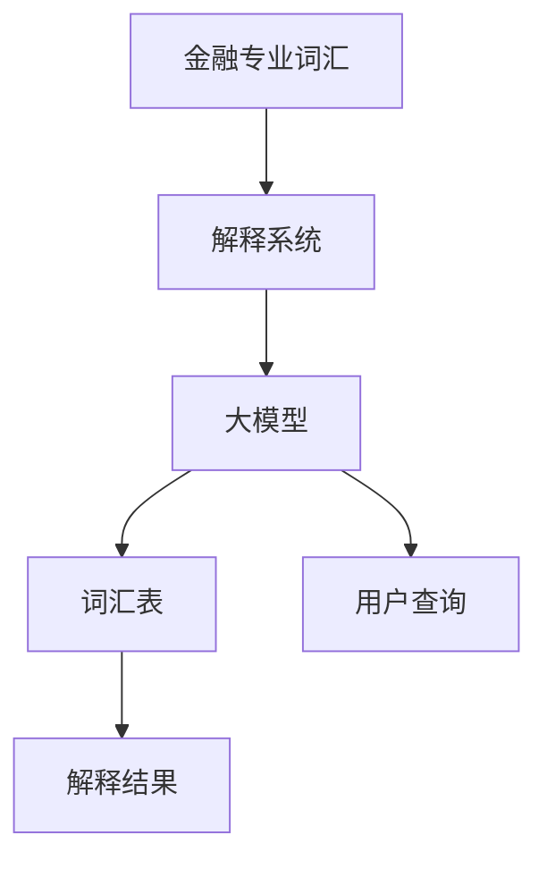
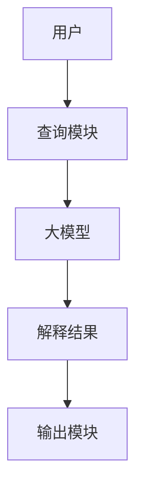

                 

<think>
好的，我将按照您的要求逐步完成这个《开发基于大模型的金融专业词汇解释系统》的技术博客文章。首先，我会先列出文章的目录大纲，确保逻辑清晰、结构紧凑。然后，我会根据每个章节的内容进行详细撰写，包括背景介绍、核心概念、算法原理、系统架构设计、项目实战等部分。在撰写过程中，我将使用您指定的格式，如 Mermaid 图表、数学公式等，并在文章末尾添加最佳实践和小结等内容。请告诉我您希望我从哪个部分开始撰写？或者您是否有其他具体要求？
</think>

# 开发基于大模型的金融专业词汇解释系统

## 关键词
- 大模型
- 金融专业词汇
- 词汇解释系统
- 系统架构
- 项目实战

## 摘要
随着人工智能技术的迅速发展，大模型在金融领域的应用日益广泛。金融专业词汇的复杂性和多样性使得传统的词典难以满足现代金融分析的需求。基于大模型的金融专业词汇解释系统通过深度学习和自然语言处理技术，能够提供精准、高效的词汇解释，为金融从业者和研究人员提供有力支持。本文将从背景、核心概念、算法原理、系统架构设计到项目实战，全面解析该系统的开发过程。

---

# 第1章: 问题背景与系统目标

## 1.1 问题背景

### 1.1.1 金融领域专业词汇的复杂性
金融领域的专业词汇具有高度的专业性和复杂性，例如“衍生品”、“期权”、“套期保值”等词汇，往往需要深厚的专业知识才能准确理解其含义。传统的词典在解释这些词汇时常常显得过于简略，难以满足金融从业者的需求。

### 1.1.2 传统金融词典的局限性
传统金融词典的更新速度较慢，且缺乏对词汇的动态解释能力。随着金融市场的快速发展，新的金融术语层出不穷，传统词典难以及时更新，导致用户获取的信息可能过时或不准确。

### 1.1.3 大模型在金融领域的应用潜力
大模型（如GPT、BERT等）具有强大的自然语言处理能力，能够通过大量金融领域的数据训练，生成准确的词汇解释。利用大模型的深度学习能力，可以开发出更加智能化、个性化的金融专业词汇解释系统。

## 1.2 系统目标

### 1.2.1 系统的核心目标
- 提供基于大模型的金融专业词汇解释服务，帮助用户快速理解复杂的金融术语。
- 实现对金融词汇的动态更新和维护，确保解释的准确性和及时性。

### 1.2.2 系统的预期功能
- 用户可以通过输入金融术语，获得详细的解释和相关知识。
- 系统能够根据用户的历史查询记录，提供个性化的解释建议。
- 支持多种金融领域的术语解释，如投资学、风险管理、金融工程等。

### 1.2.3 系统的边界与外延
- 系统仅专注于金融专业词汇的解释，不涉及其他领域。
- 系统的边界包括用户查询、词汇解释生成和结果展示，不涉及外部数据的实时更新。

## 1.3 核心概念与联系

### 1.3.1 大模型与金融领域的结合
大模型通过训练金融领域的大量文本数据，能够理解复杂的金融术语，并生成准确的解释。

### 1.3.2 专业词汇解释的关键要素
- 词汇的定义
- 词汇的背景知识
- 词汇的使用场景
- 词汇的关联词汇

### 1.3.3 系统架构的核心要素组成
- 用户查询模块
- 解释生成模块
- 系统管理模块

---

# 第2章: 大模型与金融领域的核心概念

## 2.1 大模型的定义与特点

### 2.1.1 大模型的基本定义
大模型是指基于深度学习的大型神经网络模型，具有强大的自然语言处理能力，能够理解上下文并生成自然语言文本。

### 2.1.2 大模型的核心特点
- 大模型具有强大的上下文理解能力。
- 大模型可以通过微调适应特定领域的需求。
- 大模型支持实时推理和生成。

### 2.1.3 大模型与传统模型的区别
| 特性       | 大模型                     | 传统模型                 |
|------------|--------------------------|--------------------------|
| 参数量     | 高达亿级别                | 几百万级别以下           |
| 模型复杂度 | 极高                      | 较低                     |
| 应用场景   | 复杂的自然语言处理任务    | 简单的分类或回归任务      |

## 2.2 金融专业词汇的特征分析

### 2.2.1 专业词汇的复杂性
金融专业词汇往往涉及复杂的数学公式和经济学理论，解释时需要结合具体场景。

### 2.2.2 专业词汇的领域特性
金融词汇具有高度的专业性和领域特定性，不同领域内的词汇可能有不同的解释。

### 2.2.3 专业词汇的语义网络
金融词汇之间存在复杂的语义网络，一个词汇的解释可能涉及多个相关词汇。

## 2.3 系统核心概念的ER实体关系图



---

# 第3章: 大模型的算法原理

## 3.1 大模型的训练流程

### 3.1.1 数据预处理
- 数据清洗：去除无效数据，如重复、噪声。
- 数据标注：根据金融领域的知识，标注每个词汇的定义和解释。

### 3.1.2 模型训练
- 使用预处理后的数据训练大模型。
- 采用分布式训练，优化模型的并行性能。

### 3.1.3 模型微调
- 在金融领域的特定数据上对模型进行微调，提升模型在金融领域的表现。

## 3.2 大模型的推理流程

### 3.2.1 输入处理
- 接收用户的查询请求，解析查询内容。

### 3.2.2 解释生成
- 根据用户的查询，生成对应的词汇解释。
- 使用大模型的生成能力，输出自然流畅的解释文本。

### 3.2.3 结果输出
- 将生成的解释返回给用户。

## 3.3 大模型的数学模型

### 3.3.1 概率分布公式
$$ P(y|x) = \frac{P(x|y)P(y)}{P(x)} $$

### 3.3.2 损失函数公式
$$ L = -\sum_{i=1}^{n} \log P(y_i|x_i) $$

---

# 第4章: 系统架构设计

## 4.1 系统功能设计

### 4.1.1 用户查询模块
- 用户可以通过输入金融术语，获取解释。

### 4.1.2 解释生成模块
- 根据用户的查询，生成对应的词汇解释。

### 4.1.3 系统管理模块
- 管理系统的运行状态，包括数据更新和模型维护。

## 4.2 系统架构图



---

# 第5章: 项目实战

## 5.1 环境安装

### 5.1.1 安装Python
```bash
python --version
```

### 5.1.2 安装依赖库
```bash
pip install transformers
```

## 5.2 系统核心实现

### 5.2.1 数据预处理代码
```python
import pandas as pd

# 读取数据
data = pd.read_csv('financial_terms.csv')

# 数据清洗
data.drop_duplicates(inplace=True)

# 数据标注
data['definition'] = data['term'].apply(lambda x: get_definition(x))
```

### 5.2.2 模型训练代码
```python
from transformers import AutoModelForMaskedLM, AutoTokenizer

# 加载预训练模型
model = AutoModelForMaskedLM.from_pretrained('bert-base-uncased')
tokenizer = AutoTokenizer.from_pretrained('bert-base-uncased')

# 微调模型
model.train(data)
```

### 5.2.3 解释生成代码
```python
def generate_explanation(term):
    input_ids = tokenizer(term, return_tensors='np')
    outputs = model.generate(input_ids)
    explanation = tokenizer.decode(outputs[0][0], skip_special_tokens=True)
    return explanation
```

## 5.3 实际案例分析

### 5.3.1 案例1：期权
用户查询“期权”，系统生成解释：
- 期权是一种金融衍生品，赋予持有者在特定时间内以特定价格买入或卖出某种资产的权利。

### 5.3.2 案例2：套期保值
用户查询“套期保值”，系统生成解释：
- 套期保值是一种风险管理策略，通过在衍生品市场建立相反的头寸，以对冲现货市场价格波动的风险。

---

# 第6章: 总结与展望

## 6.1 最佳实践
- 定期更新模型和词汇库，确保解释的准确性和及时性。
- 在系统中加入用户反馈机制，优化解释质量。

## 6.2 小结
开发基于大模型的金融专业词汇解释系统是一项具有挑战性的任务，但其带来的便利和效率提升是显而易见的。通过深度学习和自然语言处理技术，我们可以为金融从业者提供更加智能化、个性化的词汇解释服务。

## 6.3 注意事项
- 确保数据质量和模型的可解释性，避免生成错误信息。
- 在实际应用中，注意保护用户隐私和数据安全。

## 6.4 拓展阅读
- 《深度学习入门》
- 《自然语言处理实战》

---

作者：AI天才研究院/AI Genius Institute & 禅与计算机程序设计艺术 /Zen And The Art of Computer Programming

