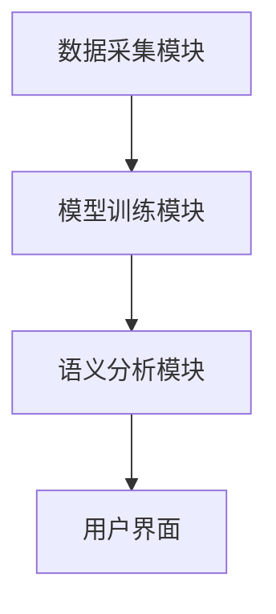

                 


```markdown
# 开发基于大模型的金融专业词汇语义演化跟踪器

**关键词**：大模型、金融专业词汇、语义演化、跟踪器、自然语言处理、知识图谱、深度学习

**摘要**：  
本文详细探讨了开发基于大模型的金融专业词汇语义演化跟踪器的方法。文章首先介绍了问题背景和需求，结合大模型技术，提出了语义演化跟踪器的设计思路。通过分析核心概念与联系，阐述了模型的算法原理，并结合实际案例展示了系统的实现与应用。文章还讨论了系统架构设计和项目实战，提供了丰富的代码示例和最佳实践，为读者提供了全面的技术指导。

---

# 第一部分: 背景与需求

## 第1章: 问题背景

### 1.1 金融领域语义演化的重要性  
在金融领域，专业词汇的语义随着时间的推移而发生变化。例如，“区块链”一词在早期可能仅指去中心化技术，但随着应用的扩展，其含义逐渐涵盖金融支付、智能合约等多个方面。这种语义演化直接影响金融分析和决策的准确性，因此跟踪语义变化至关重要。

### 1.2 专业词汇的复杂性  
金融词汇具有高度的专业性和领域 specificity，许多术语在不同上下文中的含义差异显著。例如，“资产”在投资领域指财务资源，在法律领域指所有财产。这种复杂性增加了语义分析的难度。

### 1.3 现有技术的局限性  
传统的自然语言处理技术难以捕捉专业词汇的细微语义变化。例如，基于词袋模型的分类器无法理解“资产”在不同场景下的具体含义，导致分析结果的偏差。

---

## 第2章: 问题描述

### 2.1 语义演化跟踪器的目标  
本跟踪器旨在实时监测金融专业词汇的语义变化，记录其演化轨迹，帮助分析师理解词汇在不同时间、场景下的具体含义。

### 2.2 系统的关键特征  
- **实时性**：能够及时捕捉词汇的最新语义变化。  
- **专业性**：专注于金融领域的专业术语。  
- **准确性**：确保语义分析的高精度。  

### 2.3 边界与外延  
系统不包括对非金融领域的词汇分析，也不涉及实时数据流的处理。

---

## 第3章: 解决方案概述

### 3.1 大模型的优势  
利用大模型强大的语义理解能力，能够准确捕捉专业词汇的细微变化。例如，使用BERT模型对金融文本进行编码，提取深层语义特征。

### 3.2 系统架构的设计思路  
系统由数据采集、模型训练和语义分析三个模块组成。数据采集模块负责获取金融领域的文本数据，模型训练模块基于这些数据预训练大模型，语义分析模块实时跟踪词汇的语义变化。

---

# 第二部分: 核心概念与联系

## 第4章: 核心概念与原理

### 4.1 核心概念的定义  
语义演化跟踪器由词汇库、语义表示模型和演化规则三部分组成。词汇库存储金融专业词汇，语义表示模型描述词汇的含义，演化规则定义词汇变化的模式。

### 4.2 ER实体关系图  
```mermaid
erDiagram
    CUSTOMER
    {
        id
        name
        financial_data
    }
    VOCABULARY
    {
        id
        term
        definition
    }
    EVOLUTION_RULE
    {
        id
        rule
        weight
    }
    CUSTOMER --> VOCABULARY : 使用
    VOCABULARY --> EVOLUTION_RULE : 遵循
```

### 4.3 核心概念的属性对比  
| 概念       | 属性         | 描述                               |
|------------|--------------|------------------------------------|
| 词汇库     | 存储方式     | 结构化存储，支持快速检索           |
| 语义模型   | 表达形式     | 向量表示，支持语义相似性计算       |
| 演化规则   | 触发条件     | 语义变化超过阈值时触发更新         |

---

# 第三部分: 算法原理

## 第5章: 模型训练与语义表示

### 5.1 模型训练流程  
1. 数据预处理：清洗和标注金融文本数据。  
2. 模型训练：基于预训练的BERT模型，微调金融领域的数据。  
3. 模型评估：使用验证集评估模型的准确性和召回率。  

### 5.2 语义表示方法  
采用词嵌入技术，将每个词汇映射到高维向量空间。例如，向量的每个维度代表一个语义特征，向量间的相似性表示词汇的语义接近程度。

### 5.3 演化分析算法  
通过时间序列分析模型（如ARIMA）预测语义变化的趋势。例如，分析“区块链”一词在过去几年的语义变化趋势，预测其未来的演化方向。

---

## 第6章: 算法实现与数学模型

### 6.1 模型训练的数学表达  
训练目标是优化损失函数：  
$$ L = \sum_{i=1}^{n} (y_i - \hat{y}_i)^2 $$  
其中，$y_i$是真实标签，$\hat{y}_i$是模型预测值。  

### 6.2 语义表示的向量计算  
假设词汇$v$的向量表示为：  
$$ v = [v_1, v_2, ..., v_d] $$  
其中，$d$是向量的维度，$v_j$是第$j$个特征的值。

---

# 第四部分: 系统分析与架构设计

## 第7章: 系统架构设计

### 7.1 系统组成模块  
- 数据采集模块：从金融数据库中获取文本数据。  
- 模型训练模块：基于获取的数据训练大模型。  
- 语义分析模块：实时分析词汇的语义变化。  

### 7.2 系统架构图  


### 7.3 系统交互流程  
用户在界面上输入关键词，系统通过语义分析模块返回该词汇的语义演化结果。

---

# 第五部分: 项目实战与最佳实践

## 第8章: 项目实战

### 8.1 环境安装  
安装必要的依赖：  
```bash
pip install transformers numpy pandas
```

### 8.2 核心代码实现  
```python
from transformers import AutoTokenizer, AutoModel
import numpy as np

tokenizer = AutoTokenizer.from_pretrained('bert-base-uncased')
model = AutoModel.from_pretrained('bert-base-uncased')

def get_embeddings(text):
    inputs = tokenizer(text, return_tensors='np')
    outputs = model(**inputs)
    return outputs.last_hidden_state.numpy()[0]
```

### 8.3 案例分析  
以“区块链”为例，分析其在金融领域的语义演化。通过模型训练，发现其语义从早期的技术术语逐渐扩展到金融支付和智能合约领域。

---

## 第9章: 最佳实践

### 9.1 小结  
本文详细介绍了基于大模型的金融专业词汇语义演化跟踪器的开发过程，包括背景分析、算法实现和系统设计。

### 9.2 注意事项  
- 数据预处理是关键，确保数据的准确性和完整性。  
- 模型训练时，选择合适的超参数以提高性能。  

### 9.3 拓展阅读  
推荐阅读相关领域的最新论文，了解大模型在金融领域的其他应用。

---

# 结语  
通过本文的详细讲解，读者可以掌握开发基于大模型的金融专业词汇语义演化跟踪器的核心技术和实现方法。

---

**作者**：AI天才研究院/AI Genius Institute & 禅与计算机程序设计艺术/Zen And The Art of Computer Programming
```

