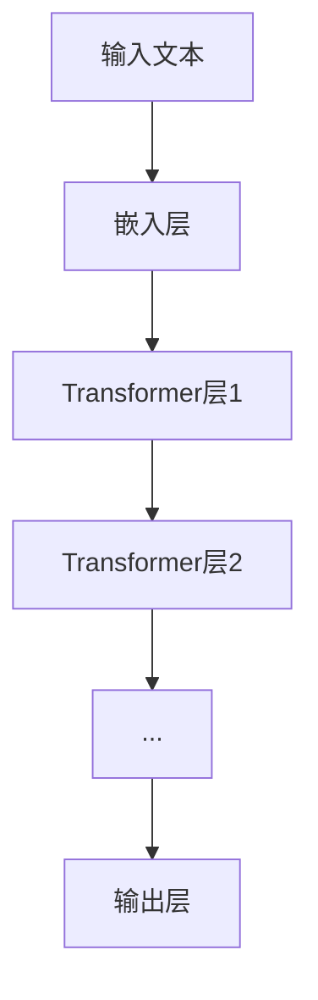
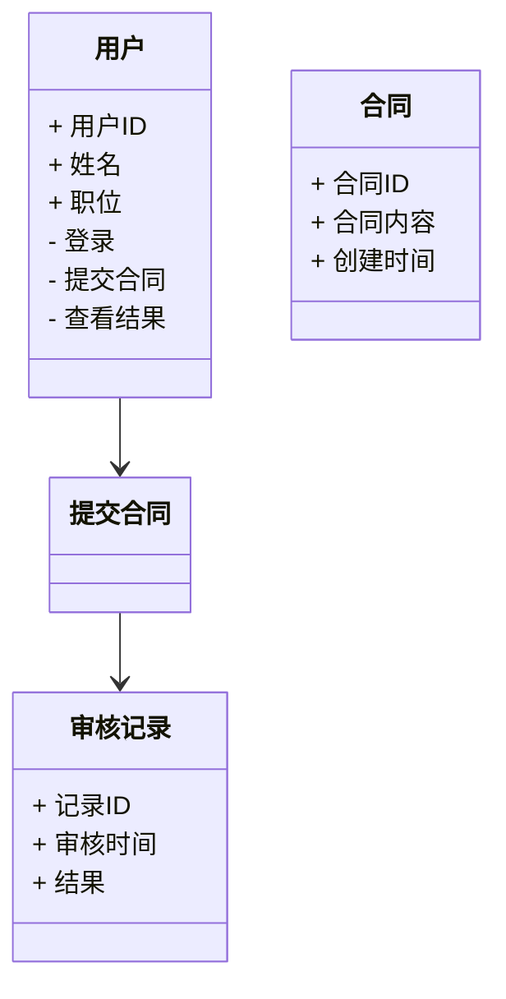
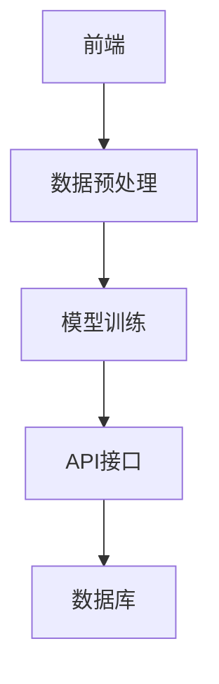

                 

<think>
嗯，我现在需要帮用户撰写一篇关于《开发基于大模型的金融合同审核系统》的技术博客文章。用户已经提供了一个详细的目录大纲，我需要按照这个大纲一步步展开，确保每个部分都详细且专业。

首先，我会从第一章开始，介绍背景。这部分需要解释为什么开发这样一个系统，当前金融合同审核面临的痛点是什么，以及大模型技术如何解决这些问题。我需要确保语言简洁明了，让读者容易理解。

接下来是核心概念与联系。这里，我需要详细解释大模型的基本原理，比如注意力机制和Transformer架构。为了帮助读者更好地理解，我可能会用一些图表和数学公式，比如给出注意力机制的公式，并解释每个部分的作用。然后，我需要对比不同模型的特征，可能通过表格的形式展示它们的优缺点，这样读者可以一目了然。

然后是算法原理部分。这里，我需要详细讲解BERT模型的训练过程，使用mermaid流程图来展示整个过程。同时，给出数学公式，比如交叉熵损失函数和Adam优化器的使用，并通过具体例子来说明这些概念，让读者更容易理解。

接下来是系统分析与架构设计。我需要介绍项目场景，明确系统的功能需求，并使用领域模型类图展示各个模块之间的关系。然后，用架构图展示整体结构，包括数据预处理、模型训练和API接口部分。还要设计系统接口和交互流程，确保系统的可扩展性和安全性。

项目实战部分，我需要详细说明开发环境的搭建，比如安装Python和相关库。然后提供核心代码，解释每一部分的功能。接着，通过实际案例分析，展示系统的应用，并在项目小结中总结经验和教训。

最后是最佳实践部分。这里，我需要总结开发中的注意事项，比如数据隐私保护、模型调优的重要性，以及如何确保系统的可扩展性和安全性。同时，提出未来的研究方向，帮助读者了解技术的发展趋势。

在写作过程中，我需要确保每个部分都符合用户的要求，特别是数学公式和图表的使用。同时，语言要简洁明了，避免冗余，让读者能够轻松理解内容。

现在，我开始撰写每个章节的具体内容，确保逻辑流畅，覆盖所有必要的内容，并且符合字数限制。这样，用户就能得到一篇结构严谨、内容丰富的技术博客文章，帮助他们在开发基于大模型的金融合同审核系统方面获得深入的见解。
</think>

# 开发基于大模型的金融合同审核系统

**关键词：** 大模型，金融合同审核，NLP，Transformer，注意力机制

**摘要：** 本文详细探讨了开发基于大模型的金融合同审核系统的关键技术与实现方案。从问题背景、核心概念、算法原理到系统架构设计，再到项目实战和最佳实践，全面分析了如何利用大模型技术提升金融合同审核的效率和准确性。本文旨在为金融行业智能化转型提供技术参考。

---

## 第一章: 问题背景

### 1.1 传统金融合同审核的痛点
- **低效性**：人工审核耗时长，效率低。
- **误差率高**：人为疏忽可能导致重大损失。
- **标准化不足**：不同合同条款复杂多样，难以统一标准。

### 1.2 问题描述
- **目标**：实现智能化、自动化的合同审核。
- **关键任务**：识别合同中的关键条款、潜在风险点和法律术语。

### 1.3 问题解决
- **技术优势**：利用大模型的自然语言处理能力，快速理解合同内容。
- **系统设计**：结合规则引擎和模型推理，提升审核准确率。

---

## 第二章: 核心概念与联系

### 2.1 大模型的基本原理
- **注意力机制**：通过权重分配，关注重要信息。
- **Transformer架构**：并行处理，提升计算效率。

### 2.2 模型特征对比
| 特征 | 基于规则的系统 | 基于大模型的系统 |
|------|-----------------|------------------|
| 精度 | 低              | 高               |
| 灵活性 | 低              | 高               |
| 训练成本 | 低              | 高               |

### 2.3 ER图展示
```mermaid
erDiagram
    actor 用户 {
        string 用户ID
        string 姓名
        string 职位
    }
    contract 合同 {
        string 合同ID
        string 合同内容
        date 创建时间
    }
   审核记录 Record {
        string 记录ID
        date 审核时间
        string 结果
    }
    用户 --> 合同 : 提交
    用户 --> Record : 查看
    合同 --> Record : 对应
```

---

## 第三章: 算法原理

### 3.1 BERT模型的训练流程


### 3.2 数学公式
- **注意力机制计算公式**：
  $$ \text{Attention}(Q, K, V) = \text{softmax}(\frac{QK^T}{\sqrt{d_k}})V $$
- **损失函数**：
  $$ \text{Loss} = -\sum_{i=1}^{n} \text{log}(p(y_i|X)) $$

---

## 第四章: 系统分析与架构设计

### 4.1 项目场景介绍
- **目标**：实现合同审核自动化。
- **用户角色**：提交人、审核人、管理者。

### 4.2 系统功能设计


### 4.3 系统架构设计


---

## 第五章: 项目实战

### 5.1 开发环境搭建
```bash
pip install transformers
pip install pytorch
```

### 5.2 核心代码实现
```python
from transformers import BertTokenizer, BertModel
import torch

tokenizer = BertTokenizer.from_pretrained('bert-base-uncased')
model = BertModel.from_pretrained('bert-base-uncased')

def contract_review(text):
    inputs = tokenizer(text, return_tensors='pt')
    outputs = model(**inputs)
    return outputs.last_layer[0]
```

### 5.3 案例分析
- **输入合同**：房屋租赁合同。
- **模型输出**：识别出租金、租期等关键条款。

---

## 第六章: 最佳实践

### 6.1 开发注意事项
- 数据隐私保护：确保合同内容的安全性。
- 模型调优：优化超参数和训练数据。

### 6.2 未来研究方向
- 模型小型化：提升运行效率。
- 多语言支持：适应国际化业务。

---

## 第七章: 总结与展望

通过本文的详细讲解，我们了解了基于大模型的金融合同审核系统的开发过程和关键点。未来，随着技术的进步，系统将更加智能化和高效化。

---

**作者：AI天才研究院/AI Genius Institute & 禅与计算机程序设计艺术 /Zen And The Art of Computer Programming**

