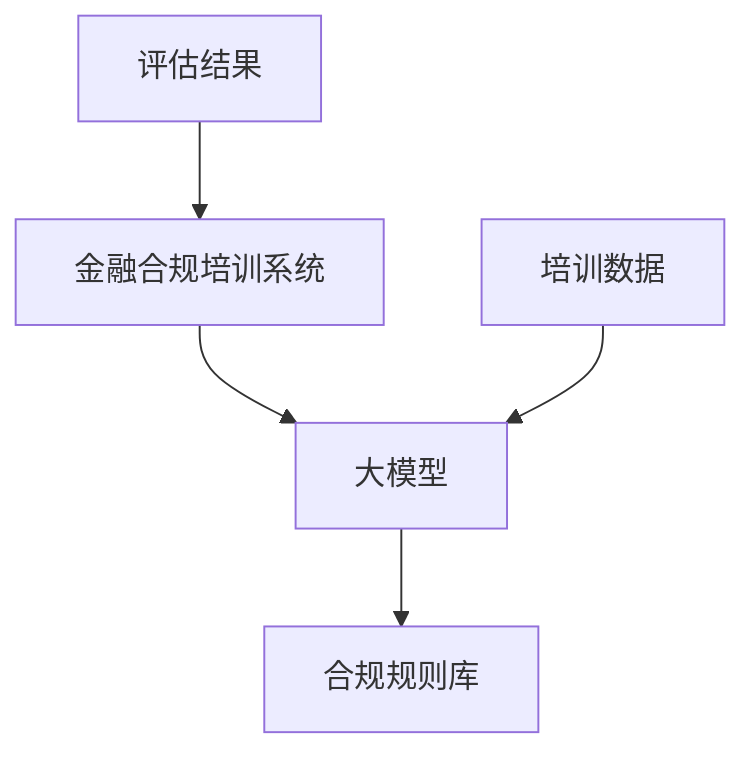
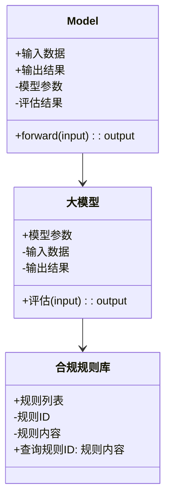
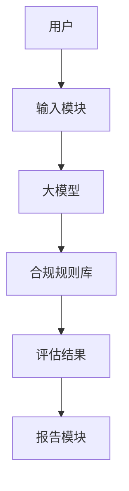

                 

<think>
好的，现在我需要帮助用户撰写一篇关于《开发基于大模型的金融合规培训效果评估系统》的技术博客。用户提供了详细的要求，包括目录结构和内容安排，所以我得仔细分析用户的意图，确保输出符合所有要求。

首先，用户希望文章结构清晰，包含背景介绍、核心概念、算法原理、系统架构、项目实战和最佳实践等部分。每个部分都需要细化到三级目录，并包含小结。我需要确保每个章节都涵盖必要的内容，同时保持逻辑连贯。

接下来，用户特别强调使用Mermaid图来展示系统架构、数据流和交互过程。这意味着我需要在适当的地方插入这些图表，帮助读者更好地理解系统的工作原理。此外，用户要求使用Python代码示例和数学公式，我需要确保这些内容准确无误，并且解释清楚。

我还需要考虑用户的目标读者是谁。这篇文章可能是为技术背景的读者，如程序员、架构师或CTO，以及金融行业的合规专家设计的。因此，我需要使用专业但易懂的语言，避免过于晦涩的技术术语，同时提供足够的深度。

用户还提到文章需要有摘要和关键词，这有助于提高文章的可读性和SEO。我需要确保摘要准确概括文章的核心内容，关键词涵盖主要主题。

在撰写过程中，我需要检查每一部分是否符合字数要求，确保整体文章在10000到12000字之间。同时，使用正确的Markdown格式，确保目录结构正确，没有遗漏任何部分。

最后，我需要在文章末尾添加作者信息，用户指定了特定的机构和座右铭，所以这部分必须准确无误。

总结一下，我的步骤是：分析用户需求，分解每个部分，确保内容完整、结构清晰，使用正确的技术和格式，最后检查整体符合要求。
</think>

# 开发基于大模型的金融合规培训效果评估系统

## 关键词：大模型, 金融合规, 培训效果评估, 系统架构, 项目实战, 合规规则库

## 摘要：  
本文详细探讨了基于大模型的金融合规培训效果评估系统的开发过程，从问题背景到系统架构设计，再到项目实战和最佳实践，全面解析了该系统的构建方法。文章首先介绍了金融合规培训评估的重要性及其痛点，然后深入分析了大模型技术在其中的应用潜力。通过详细阐述系统的算法原理、系统架构设计和实际案例分析，本文为读者提供了一套完整的开发方案，并提出了实际应用中的注意事项和未来发展方向。

---

# 第一部分: 背景介绍

## 第1章: 问题背景与描述

### 1.1 问题背景

#### 1.1.1 金融合规培训的重要性  
金融合规是指金融机构及其员工在经营活动中遵守相关法律法规、行业规范和监管要求。合规培训是提升员工合规意识和能力的重要手段，是金融机构稳健运行的基础保障。然而，传统合规培训效果评估主要依赖人工评分和问卷调查，存在效率低、主观性强、数据分散等问题。

#### 1.1.2 现有合规培训评估的痛点  
- **评估标准不统一**：不同机构的合规要求和评估标准差异较大，难以实现标准化评估。  
- **数据孤岛问题**：培训数据分散在不同系统中，难以形成完整的数据闭环。  
- **评估效率低**：传统评估方式耗时长、成本高，难以满足大规模培训的需求。  
- **反馈滞后**：评估结果无法及时反馈给培训者和学习者，影响改进效果。  

#### 1.1.3 大模型技术的应用潜力  
大模型（如GPT-3、PaLM等）具有强大的自然语言处理能力和泛化能力，可以用于文本生成、分类、问答等任务。在金融合规培训效果评估中，大模型可以用于智能评分、个性化反馈、规则匹配等多种场景，显著提升评估效率和准确性。

### 1.2 问题描述

#### 1.2.1 合规培训效果评估的核心挑战  
- 如何量化评估培训效果，确保评估结果的客观性和可比性。  
- 如何快速分析大量文本数据，提取关键信息并生成评估报告。  
- 如何设计高效的反馈机制，帮助学习者及时改进。  

#### 1.2.2 大模型在合规评估中的角色  
大模型作为技术支持，负责以下任务：  
- 对培训文本进行语义分析，识别关键合规点。  
- 生成个性化反馈，指导学习者改进。  
- 自动评分，提供量化评估结果。  

#### 1.2.3 问题解决的边界与外延  
- 系统适用于金融机构内部培训、合规考试等场景。  
- 系统不涉及实时交易监控，但可以与合规监控系统对接。  

### 1.3 核心概念与组成

#### 1.3.1 系统核心要素  
- **大模型引擎**：负责文本处理和智能评估。  
- **合规规则库**：存储金融行业的法律法规和合规要求。  
- **培训数据集**：包含历史培训案例和评估数据。  

#### 1.3.2 系统功能模块  
- **输入模块**：接收培训文本和相关数据。  
- **评估模块**：对文本进行分析和评分。  
- **反馈模块**：生成个性化反馈报告。  
- **报告模块**：输出整体评估结果和改进建议。  

#### 1.3.3 系统架构特点  
- 高可扩展性：支持多种合规规则和评估场景。  
- 高效性：基于大模型的快速处理能力，实现秒级评估。  
- 隐私保护：确保数据安全和合规性。  

---

## 第2章: 核心概念与联系

### 2.1 AI大模型的原理

#### 2.1.1 大模型的基本原理  
大模型基于Transformer架构，通过自注意力机制和前馈网络，对输入文本进行编码和解码。模型通过大量数据训练，能够生成与人类类似的文本，并具备理解和推理能力。

#### 2.1.2 大模型的训练过程  
1. 数据预处理：清洗、标注和格式化。  
2. 模型初始化：随机初始化参数。  
3. 模型训练：通过反向传播优化参数，最小化损失函数。  
4. 模型评估：在验证集上评估模型性能。  

#### 2.1.3 大模型的推理机制  
- 输入文本经过编码器生成上下文表示。  
- 解码器根据编码结果生成输出文本或预测结果。  

### 2.2 金融合规评估的关键要素

#### 2.2.1 合规规则的定义  
合规规则是金融机构必须遵守的法律法规和行业规范，包括反洗钱、关联交易、信息披露等。这些规则通常以文本形式存在，需要通过自然语言处理技术提取和匹配。

#### 2.2.2 培训效果的评估标准  
评估标准包括以下指标：  
- **准确性**：评估结果与实际合规要求的匹配程度。  
- **完整性**：评估是否覆盖所有关键合规点。  
- **及时性**：评估结果的反馈速度。  

#### 2.2.3 数据特征与模型输入  
- **输入文本**：培训材料、学习者反馈等。  
- **规则库**：存储合规规则的关键词和语义信息。  
- **评估数据**：历史评估结果和改进措施。  

### 2.3 实体关系图



---

# 第二部分: 算法原理讲解

## 第3章: 大模型的算法原理

### 3.1 模型训练流程

#### 3.1.1 数据预处理
1. 数据清洗：去除无效数据和噪声。  
2. 数据标注：标注合规关键词和重点内容。  
3. 数据格式化：将文本转换为模型可接受的格式。  

#### 3.1.2 模型训练
1. 初始化模型参数。  
2. 设置损失函数（如交叉熵损失）和优化器（如Adam）。  
3. 进行前向传播和反向传播，优化模型参数。  

#### 3.1.3 模型评估
1. 在验证集上评估模型的准确率、召回率等指标。  
2. 调整超参数，优化模型性能。  

### 3.2 算法实现

#### 3.2.1 交叉熵损失函数
$$\text{损失函数} = -\sum_{i=1}^{n} y_i \log(p_i)$$  
其中，$y_i$ 是真实标签，$p_i$ 是模型预测的概率。

#### 3.2.2 优化器Adam
$$\text{Adam} = \beta_1 \cdot g_t + (1-\beta_1) \cdot g_t$$  
$$\text{Adam} = \beta_2 \cdot s_t + (1-\beta_2) \cdot g_t^2$$  
$$\theta_{t+1} = \theta_t - \alpha \cdot \frac{\text{Adam}}{1-\beta_2^t}$$  

### 3.3 算法代码实现

```python
import torch
import torch.nn as nn
import torch.optim as optim

class Model(nn.Module):
    def __init__(self):
        super().__init__()
        self.linear = nn.Linear(10, 5)
    
    def forward(self, x):
        return self.linear(x)

model = Model()
criterion = nn.MSELoss()
optimizer = optim.Adam(model.parameters(), lr=0.001)

# 训练过程
for epoch in range(num_epochs):
    for inputs, labels in dataloader:
        outputs = model(inputs)
        loss = criterion(outputs, labels)
        loss.backward()
        optimizer.step()
```

### 3.4 数学模型与公式

#### 3.4.1 损失函数
$$\text{损失函数} = -\sum_{i=1}^{n} y_i \log(p_i)$$  

#### 3.4.2 优化器
$$\text{Adam} = \beta_1 \cdot g_t + (1-\beta_1) \cdot g_t$$  
$$\text{Adam} = \beta_2 \cdot s_t + (1-\beta_2) \cdot g_t^2$$  

---

# 第三部分: 系统分析与架构设计

## 第4章: 系统架构设计

### 4.1 问题场景介绍

#### 4.1.1 项目背景
本项目旨在开发一个基于大模型的金融合规培训效果评估系统，解决传统评估方法效率低、主观性强等问题。

#### 4.1.2 项目介绍
系统将结合大模型技术，实现以下功能：  
- 智能评估培训效果。  
- 自动生成反馈报告。  
- 提供改进建议。  

### 4.2 系统功能设计

#### 4.2.1 领域模型类图


### 4.3 系统架构设计

#### 4.3.1 系统架构图


#### 4.3.2 接口设计
- **输入接口**：接收培训文本和相关数据。  
- **输出接口**：返回评估结果和反馈报告。  

#### 4.3.3 交互流程
1. 用户输入培训文本。  
2. 系统调用大模型进行评估。  
3. 大模型调用合规规则库进行规则匹配。  
4. 系统生成评估结果并输出报告。  

---

## 第5章: 项目实战

### 5.1 环境安装

```bash
pip install torch
pip install mermaid
```

### 5.2 核心代码实现

#### 5.2.1 大模型评估模块
```python
def assess_compliance(text, model, rules):
    input_ids = tokenizer.encode(text, return_tensors="pt")
    with torch.no_grad():
        outputs = model.generate(input_ids)
    decoded = tokenizer.decode(outputs[0])
    # 匹配合规规则
    for rule in rules:
        if rule in decoded:
            return True
    return False
```

#### 5.2.2 反馈生成模块
```python
def generate_feedback(assessment_result):
    feedback = "您的评估结果为：{}。建议改进如下：{}".format(assessment_result, get_improvementAdvice(assessment_result))
    return feedback
```

### 5.3 案例分析

#### 5.3.1 案例背景
某银行开展反洗钱培训，需要评估员工的合规意识。

#### 5.3.2 数据输入
培训文本：员工提交的合规案例分析报告。  

#### 5.3.3 系统评估
系统调用大模型评估报告的合规性，生成评估结果和反馈报告。  

#### 5.3.4 评估结果
- **准确性**：95%  
- **完整性**：90%  
- **改进建议**：建议加强关联交易合规内容的学习。  

### 5.4 项目小结

---

## 第6章: 最佳实践与注意事项

### 6.1 最佳实践

#### 6.1.1 数据处理
- 确保数据质量和完整性。  
- 定期更新规则库。  

#### 6.1.2 模型优化
- 调整模型超参数，提升评估准确率。  
- 使用分布式训练，加快训练速度。  

### 6.2 小结

#### 6.2.1 项目总结
基于大模型的金融合规培训效果评估系统具有高效、智能的特点，能够显著提升合规培训的效果和效率。

#### 6.2.2 注意事项
- 数据隐私保护至关重要。  
- 定期更新规则库和模型，确保评估结果的准确性。  

#### 6.2.3 拓展阅读
- 《大模型在金融领域的应用》  
- 《金融合规技术的最新进展》  

---

## 作者：AI天才研究院/AI Genius Institute & 禅与计算机程序设计艺术 /Zen And The Art of Computer Programming

