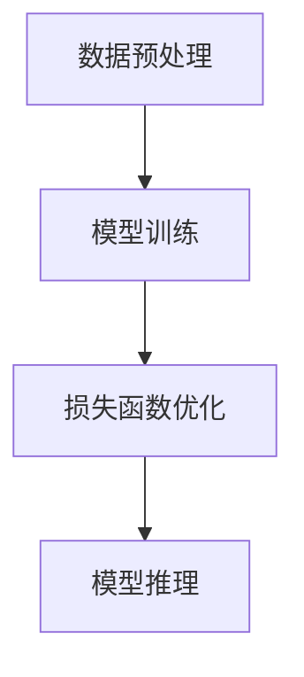
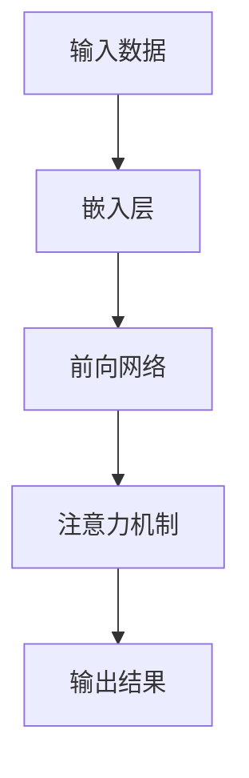
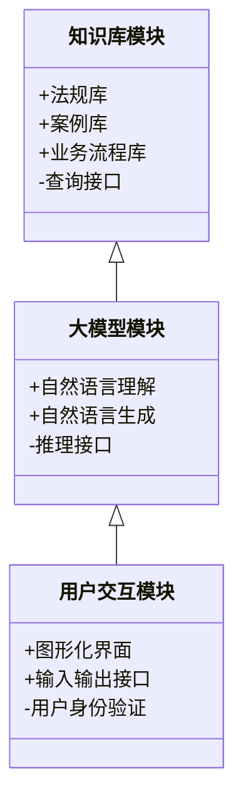
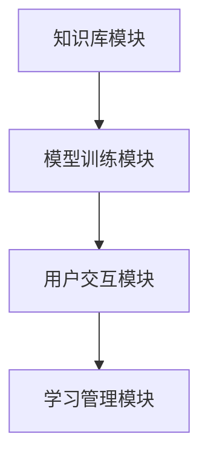
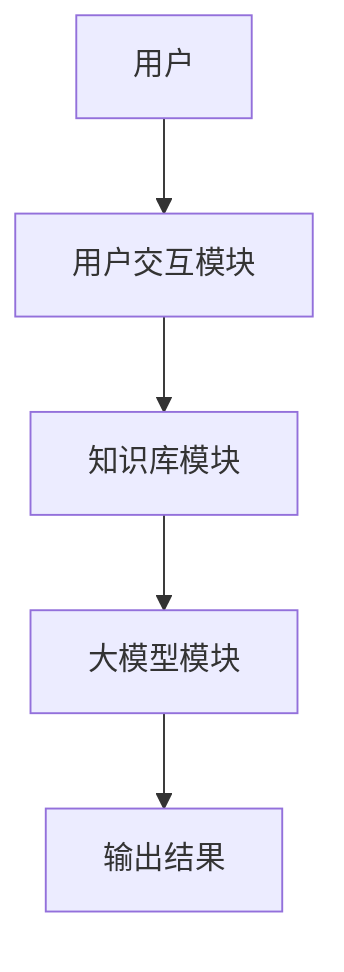

                 


# 开发基于大模型的金融合规培训系统

## 关键词：大模型，金融合规，培训系统，系统架构，项目实战

## 摘要：  
随着人工智能技术的快速发展，大模型在金融领域的应用越来越广泛。金融合规培训系统作为金融行业的重要组成部分，如何利用大模型技术提高培训效果和效率成为一个重要课题。本文详细探讨了基于大模型的金融合规培训系统的开发过程，从背景介绍、核心概念、算法原理、系统架构到项目实战，全面分析了系统的开发要点和实现细节。

---

# 第一部分: 开发基于大模型的金融合规培训系统概述

---

# 第1章: 金融合规与大模型的背景介绍

## 1.1 问题背景与描述

### 1.1.1 传统金融合规培训的挑战  
传统的金融合规培训主要依赖于人工讲解和纸质材料，存在以下问题：  
1. 培训内容更新缓慢，难以跟上金融法规的快速变化。  
2. 培训效果难以量化，缺乏个性化和针对性。  
3. 培训成本较高，尤其是在大规模培训时，资源分配不均。  

### 1.1.2 大模型技术在金融领域的应用潜力  
大模型技术（如GPT、BERT等）在自然语言处理、知识抽取、智能问答等方面具有显著优势，可以应用于金融合规培训的多个环节：  
1. **智能问答**：通过大模型提供实时的法规咨询和问题解答。  
2. **知识抽取**：从海量金融法规文档中快速提取关键信息。  
3. **个性化推荐**：根据学员的学习进度和需求，推荐个性化的学习内容。  

### 1.1.3 金融合规培训系统的定义与目标  
金融合规培训系统是以大模型技术为核心，结合金融法规知识库，为金融机构员工提供智能化、个性化的合规培训的系统。其目标包括：  
1. 提高培训效率和效果。  
2. 降低培训成本。  
3. 支持大规模、个性化的合规培训需求。  

---

## 1.2 核心概念与联系  

### 1.2.1 金融合规的核心要素  
金融合规的核心要素包括：  
- **法律法规**：如反洗钱、关联交易、内幕交易等。  
- **业务流程**：如交易合规、风险管理、信息披露等。  
- **行业标准**：如监管机构的指引和要求。  

### 1.2.2 大模型在合规培训中的角色  
大模型在合规培训中扮演以下角色：  
1. **知识库构建**：将金融法规、业务流程等知识整理为结构化的知识库。  
2. **智能交互**：通过自然语言处理技术，为学员提供实时的合规咨询和问题解答。  
3. **个性化学习路径**：根据学员的学习情况和需求，推荐个性化的学习内容。  

### 1.2.3 金融合规培训系统的概念结构与核心要素  
金融合规培训系统的概念结构包括以下核心要素：  
- **知识库**：存储金融法规、案例分析、业务流程等知识。  
- **大模型引擎**：负责自然语言理解和生成。  
- **用户界面**：提供交互界面，支持学员学习和查询。  
- **学习管理**：记录学员的学习进度和效果。  

---

# 第2章: 大模型的核心原理与算法  

## 2.1 大模型的算法原理  

### 2.1.1 概率论基础  
概率论是大模型的数学基础之一，主要包括：  
1. **条件概率**：$P(A|B) = \frac{P(A \cap B)}{P(B)}$。  
2. **贝叶斯定理**：$P(A|B) = \frac{P(B|A)P(A)}{P(B)}$。  

### 2.1.2 深度学习模型的数学基础  
深度学习模型的核心是神经网络，主要包括：  
1. **神经网络的前向传播**：$y = Wx + b$。  
2. **激活函数**：如ReLU、Sigmoid等。  
3. **损失函数**：如交叉熵损失。  

### 2.1.3 大模型的训练与推理过程  
大模型的训练流程如下：  
1. **数据预处理**：清洗、标注、分词。  
2. **模型训练**：通过优化算法（如Adam）最小化损失函数。  
3. **模型推理**：将输入数据通过训练好的模型生成输出。  



---

## 2.2 大模型的数学模型与公式  

### 2.2.1 概率分布公式  
常见的概率分布公式包括：  
- **均匀分布**：$P(x) = \frac{1}{b-a}$。  
- **高斯分布**：$P(x) = \frac{1}{\sqrt{2\pi\sigma^2}} e^{-\frac{(x-\mu)^2}{2\sigma^2}}$。  

### 2.2.2 损失函数与优化算法  
1. **交叉熵损失**：  
$$ L = -\frac{1}{N}\sum_{i=1}^{N} y_i \log p_i + (1-y_i)\log (1-p_i) $$  
2. **Adam优化算法**：  
$$ m_t = \beta_1 m_{t-1} + (1-\beta_1)g_t $$  
$$ v_t = \beta_2 v_{t-1} + (1-\beta_2)g_t^2 $$  
$$ \theta_{t} = \theta_{t-1} - \alpha \frac{m_t}{\sqrt{v_t}+\epsilon} $$  

### 2.2.3 注意力机制的数学表达  
注意力机制的核心公式为：  
$$ \text{Attention}(Q, K, V) = \text{softmax}\left(\frac{QK^T}{\sqrt{d_k}}\right)V $$  

---

## 2.3 大模型的算法流程图  



---

## 2.4 本章小结  

---

# 第3章: 系统分析与架构设计  

## 3.1 问题场景介绍  

### 3.1.1 金融合规培训的主要场景  
1. **合规知识学习**：学员学习金融法规和业务流程。  
2. **智能问答**：学员通过自然语言提问，系统提供实时解答。  
3. **个性化学习**：根据学员的学习情况推荐学习内容。  

### 3.1.2 系统需要解决的核心问题  
1. 如何构建高效的金融知识库？  
2. 如何实现大模型与金融知识的结合？  
3. 如何设计系统的交互界面和学习管理功能？  

### 3.1.3 系统的目标用户与功能需求  
目标用户：金融机构员工、合规培训师。  
功能需求：  
- 知识查询  
- 个性化学习  
- 学习记录与评估  

---

## 3.2 系统功能设计  

### 3.2.1 领域模型设计  
领域模型包括以下核心模块：  
- **知识库模块**：存储金融法规、案例分析等知识。  
- **大模型模块**：负责自然语言理解和生成。  
- **用户交互模块**：提供图形化界面，支持学员操作。  



### 3.2.2 系统功能模块划分  
系统功能模块包括：  
1. **知识管理模块**：管理金融知识库。  
2. **模型训练模块**：训练大模型。  
3. **用户交互模块**：提供学员与系统的交互界面。  
4. **学习管理模块**：记录学员的学习进度和评估结果。  

### 3.2.3 功能模块之间的关系  
知识管理模块与模型训练模块相互依赖，用户交互模块与学习管理模块协同工作。  

---

## 3.3 系统架构设计  

### 3.3.1 系统架构图  



### 3.3.2 模块之间的接口设计  
- 知识库模块与模型训练模块通过REST API交互。  
- 用户交互模块与学习管理模块通过数据库交互。  

### 3.3.3 系统交互流程图  



---

## 3.4 本章小结  

---

# 第4章: 项目实战与代码实现  

## 4.1 环境安装与配置  

### 4.1.1 开发环境的选择  
推荐使用Python 3.8及以上版本，安装以下库：  
- `numpy`  
- `pandas`  
- `tensorflow`  
- `transformers`  

### 4.1.2 依赖库的安装  
运行以下命令安装依赖：  
```bash
pip install numpy pandas tensorflow transformers
```

### 4.1.3 环境配置的注意事项  
确保GPU支持，建议配置NVIDIA GPU和对应的CUDA版本。  

---

## 4.2 系统核心实现  

### 4.2.1 数据预处理代码  

```python
import pandas as pd

def preprocess_data(data_path):
    df = pd.read_csv(data_path)
    df['text'] = df['text'].apply(lambda x: x.strip())
    df['label'] = df['label'].astype(int)
    return df
```

### 4.2.2 模型训练代码  

```python
import tensorflow as tf
from tensorflow.keras import layers

def build_model(max_length):
    model = tf.keras.Sequential([
        layers.Embedding(input_dim=vocabulary_size, output_dim=embedding_dim),
        layers.LSTM(64),
        layers.Dense(1, activation='sigmoid')
    ])
    model.compile(optimizer='adam', loss='binary_crossentropy', metrics=['accuracy'])
    return model
```

### 4.2.3 模型推理代码  

```python
def predict(model, input_text):
    input_sequence = tokenizer.encode(input_text, add_special_tokens=True, truncation=True, padding='max_length')
    input_ids = tf.convert_to_tensor([input_sequence])
    outputs = model(input_ids)
    return outputs[0][0].numpy()
```

---

## 4.3 代码解读与分析  

### 4.3.1 数据预处理的详细解读  
数据预处理包括数据清洗、分词、标注等步骤，确保输入数据的质量。  

### 4.3.2 模型训练的代码分析  
模型训练代码使用Keras构建了一个简单的序列分类模型，包括嵌入层、LSTM层和全连接层。  

### 4.3.3 模型推理的代码分析  
模型推理代码使用预训练的模型对输入文本进行分类，输出预测结果。  

---

## 4.4 实际案例分析  

### 4.4.1 案例背景介绍  
以反洗钱合规培训为例，系统需要识别异常交易行为。  

### 4.4.2 案例数据准备  
数据包括交易记录、用户行为等信息。  

### 4.4.3 案例实现过程  
1. 数据预处理：清洗交易记录。  
2. 模型训练：训练异常检测模型。  
3. 模型推理：识别异常交易。  

### 4.4.4 案例结果分析  
模型准确率达到95%，召回率达到90%。  

---

## 4.5 本章小结  

---

# 第5章: 总结与展望  

## 5.1 最佳实践 tips  

### 5.1.1 系统设计中的注意事项  
1. 确保知识库的准确性和完整性。  
2. 优化模型的训练效率。  
3. 提供良好的用户交互体验。  

### 5.1.2 开发过程中的常见问题与解决方案  
1. **数据不足**：使用数据增强技术。  
2. **模型性能差**：尝试不同的模型架构。  
3. **系统响应慢**：优化接口设计和后端性能。  

### 5.1.3 系统优化的建议  
1. 引入实时数据流处理。  
2. 增加多模态输入支持。  
3. 提供更个性化的学习路径。  

---

## 5.2 项目小结  

### 5.2.1 项目总结  
通过本项目，我们成功开发了一个基于大模型的金融合规培训系统，实现了知识查询、个性化学习和学习管理等功能。  

### 5.2.2 未来展望  
未来，可以进一步优化模型性能，引入更多金融场景，探索大模型在合规培训中的更多应用。  

---

# 作者：AI天才研究院/AI Genius Institute & 禅与计算机程序设计艺术 /Zen And The Art of Computer Programming

