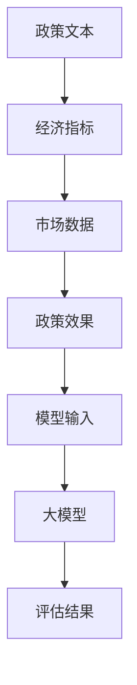
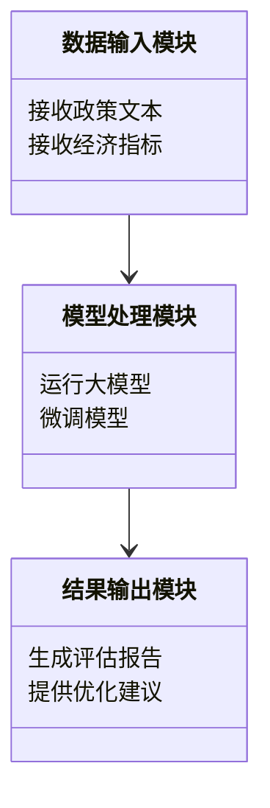
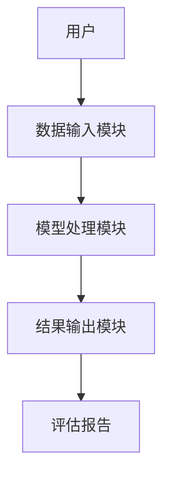

                 


# 开发基于大模型的金融政策影响评估工具

> 关键词：大模型，金融政策，政策影响评估，AI，金融分析

> 摘要：本文详细探讨了基于大模型的金融政策影响评估工具的开发过程，从背景需求分析、核心概念阐述、算法原理、系统架构设计到项目实战，全面解析了如何利用大模型技术提升金融政策评估的准确性和效率。文章通过丰富的案例和详细的代码实现，为读者提供了一套完整的解决方案，并展望了该领域的未来发展方向。

---

# 第一部分: 金融政策影响评估工具的背景与需求

## 第1章: 金融政策影响评估工具的背景与需求

### 1.1 金融政策影响评估的重要性

#### 1.1.1 金融政策对经济的影响

金融政策是政府调控经济运行的重要手段，其制定和实施对国家经济、社会和企业活动具有深远影响。例如，货币政策、财政政策等直接关系到市场流动性、企业融资成本和居民消费行为。因此，准确评估金融政策的影响至关重要。

#### 1.1.2 传统政策评估方法的局限性

传统的金融政策评估方法主要依赖于统计分析和专家经验，但存在以下问题：
- 数据量有限：传统方法通常依赖于历史数据，难以捕捉复杂经济环境下的多变量交互影响。
- 模型假设限制：传统模型假设较多，例如线性回归模型假设变量间呈线性关系，但在实际中，经济变量间可能存在非线性关系。
- 鲁棒性不足：面对突发性事件（如金融危机）时，传统模型往往难以快速适应和提供有效的评估结果。

#### 1.1.3 基于大模型的政策评估优势

大模型（如GPT、BERT等）具有以下优势：
- 处理复杂关系：大模型能够捕捉非线性关系，理解复杂的经济变量交互。
- 多维度分析：大模型可以同时处理文本、经济指标等多种数据类型，提供更全面的评估。
- 快速适应性：大模型可以通过微调技术快速适应新领域数据，适用于突发性事件的评估。

### 1.2 基于大模型的政策评估工具的核心概念

#### 1.2.1 大模型在金融领域的应用潜力

大模型在金融领域的应用包括：
- **金融文本分析**：处理新闻、财报等文本数据，提取关键信息。
- **风险评估**：预测企业违约风险、市场波动风险等。
- **政策模拟**：模拟不同政策组合对经济的影响，为政策制定者提供参考。

#### 1.2.2 金融政策影响评估的定义与目标

**定义**：金融政策影响评估是指通过分析政策实施对经济、市场和企业活动的具体影响，评估政策的效果和潜在风险。

**目标**：
- 提供政策实施后的经济影响预测。
- 识别潜在风险点。
- 提供政策优化建议。

#### 1.2.3 工具的边界与外延

**边界**：
- 仅评估直接影响，不涉及政策以外的外部因素。
- 专注于定量分析，不考虑政策的道德或社会影响。

**外延**：
- 可与其他经济模型结合使用，提供更全面的评估。
- 可扩展到其他领域（如国际贸易政策评估）。

### 1.3 问题背景与描述

#### 1.3.1 当前金融政策评估的主要挑战

- 数据复杂性：经济数据涉及多个变量，且变量间关系复杂。
- 模型局限性：传统模型难以捕捉非线性关系。
- 实时性要求：政策评估需要快速响应，尤其是在紧急情况下。

#### 1.3.2 基于大模型的解决方案

通过大模型技术：
- 处理多维度数据，捕捉复杂关系。
- 提供实时分析能力，快速响应政策变化。
- 通过可解释性增强模型的透明度。

#### 1.3.3 工具的核心要素与组成

- **数据输入**：包括政策文本、经济指标、市场数据等。
- **模型处理**：大模型对输入数据进行分析和预测。
- **结果输出**：生成政策影响报告，包括预测结果和优化建议。

### 1.4 本章小结

本章介绍了金融政策影响评估的重要性，分析了传统方法的局限性，并提出了基于大模型的解决方案。通过定义和核心概念的阐述，为后续的技术实现奠定了基础。

---

# 第二部分: 大模型的核心概念与技术基础

## 第2章: 大模型的基本原理与技术特点

### 2.1 大模型的定义与核心原理

#### 2.1.1 大模型的基本定义

大模型（Large Language Model，LLM）是一种基于深度学习的自然语言处理模型，具有大量参数（通常超过 billions），能够理解和生成自然语言文本。

#### 2.1.2 大模型的核心原理

大模型通过以下方式工作：
1. **预训练**：在大规模通用文本数据上进行无监督学习，提取语言特征。
2. **微调**：在特定任务数据上进行有监督学习，适应具体应用场景。
3. **生成与理解**：通过自注意力机制和前馈网络，模型能够生成连贯文本并理解上下文。

#### 2.1.3 大模型与传统AI的区别

| 特性 | 传统AI | 大模型 |
|------|--------|--------|
| 数据需求 | 小规模数据 | 大规模数据 |
| 模型复杂度 | 较低 | 极高 |
| 任务适应性 | 适用于单一任务 | 适用于多任务 |

### 2.2 大模型的主要技术特点

#### 2.2.1 模型规模与参数数量

- 大模型通常包含 billions级别的参数，例如GPT-3拥有175 billion参数。
- 参数规模直接影响模型的表达能力和泛化能力。

#### 2.2.2 自然语言处理能力

- 大模型能够理解复杂语义，识别上下文关系。
- 支持多种任务，如文本生成、问答系统、文本分类等。

#### 2.2.3 多任务学习能力

- 大模型可以在不同任务之间共享参数，降低训练成本。
- 提高模型的泛化能力，适应多种应用场景。

### 2.3 主流大模型简介

#### 2.3.1 GPT系列模型

- **GPT-1**：最初版本，奠定了大模型的基础。
- **GPT-2**：引入更大的模型规模和更新的训练方法。
- **GPT-3**：拥有175 billion参数，支持多种任务。
- **GPT-4**：最新版本，具备更强的推理能力和多模态支持。

#### 2.3.2 BERT及其变体

- **BERT**：基于Transformer的双向模型，擅长文本理解任务。
- **RoBERTa**：优化后的BERT变体，性能更优。
- **ALBERT**：轻量化版本，适合资源受限场景。

#### 2.3.3 其他知名大模型介绍

- **PaLM**（Google）：支持多语言和多任务。
- **Megatron-LM**（NVIDIA）：专注于大规模训练和推理。

### 2.4 大模型在金融领域的应用前景

#### 2.4.1 金融领域的潜在应用领域

- **金融文本分析**：分析新闻、财报等文本数据。
- **风险评估**：预测企业违约风险、市场波动。
- **政策模拟**：模拟政策效果，优化政策组合。

#### 2.4.2 金融政策评估中的大模型优势

- **复杂关系捕捉**：大模型能够处理多变量的非线性关系。
- **实时分析能力**：快速响应政策变化，提供实时评估。
- **可解释性增强**：通过模型解释技术提高决策透明度。

#### 2.4.3 大模型应用的挑战与机遇

- **挑战**：数据隐私、计算资源需求大、模型解释性不足。
- **机遇**：技术创新推动金融智能化，提升政策评估效率。

### 2.5 本章小结

本章介绍了大模型的基本原理和主要技术特点，分析了其在金融领域的应用前景。为后续的金融政策评估工具开发奠定了技术基础。

---

# 第三部分: 金融政策影响评估工具的核心概念与联系

## 第3章: 金融政策影响评估工具的核心概念

### 3.1 问题背景与核心概念

#### 3.1.1 金融政策影响评估的定义

金融政策影响评估是指通过分析政策实施对经济、市场和企业活动的具体影响，评估政策的效果和潜在风险。

#### 3.1.2 大模型在金融政策评估中的作用

大模型通过以下方式支持金融政策评估：
- **文本分析**：处理政策文本和相关经济新闻。
- **预测建模**：预测政策实施后的经济指标变化。
- **情景模拟**：模拟不同政策组合的效果。

#### 3.1.3 工具的核心要素与组成

- **数据输入**：政策文本、经济指标、市场数据。
- **模型处理**：大模型对数据进行分析和预测。
- **结果输出**：生成政策影响报告，包括预测结果和优化建议。

### 3.2 核心概念的原理与联系

#### 3.2.1 大模型与金融政策评估的结合原理

- **数据输入**：政策文本和相关数据输入模型。
- **模型处理**：模型通过预训练和微调生成评估结果。
- **结果输出**：模型输出政策影响报告。

#### 3.2.2 核心概念的属性特征对比表

| 概念 | 定义 | 属性 |
|------|------|------|
| 大模型 | 大规模预训练语言模型 | 参数规模大、多任务学习能力强 |
| 金融政策评估 | 评估政策对经济的影响 | 多维度、非线性关系、实时性要求高 |

#### 3.2.3 ER实体关系图的 Mermaid 流程图



### 3.3 本章小结

本章详细阐述了金融政策影响评估工具的核心概念，分析了大模型在其中的作用，并通过对比表和流程图展示了各概念之间的联系。

---

# 第四部分: 基于大模型的金融政策影响评估工具的算法原理

## 第4章: 基于大模型的金融政策影响评估算法

### 4.1 算法原理概述

#### 4.1.1 大模型的训练流程

1. **预训练**：在通用数据集上进行无监督学习，提取语言特征。
2. **微调**：在特定任务数据上进行有监督学习，优化模型参数。
3. **评估与优化**：通过验证集调整超参数，优化模型性能。

#### 4.1.2 金融政策影响评估的算法选择

- **选择模型**：根据任务需求选择合适的模型（如GPT、BERT）。
- **任务定义**：明确评估任务（如预测GDP增长率）。
- **数据准备**：收集政策文本和经济指标数据。

#### 4.1.3 评估指标与优化目标

- **评估指标**：准确率、召回率、F1分数。
- **优化目标**：最大化评估指标。

### 4.2 算法实现细节

#### 4.2.1 数据预处理

- **文本清洗**：去除无关信息，提取关键内容。
- **分词与标注**：对文本进行分词和语义标注。

#### 4.2.2 模型训练

- **微调过程**：在金融政策评估数据上进行微调。
- **超参数调整**：优化学习率、批量大小等参数。

#### 4.2.3 模型评估

- **验证集评估**：在验证集上测试模型性能。
- **结果分析**：分析模型预测结果，识别潜在问题。

### 4.3 本章小结

本章详细介绍了基于大模型的金融政策影响评估工具的算法原理，包括训练流程、模型选择和评估指标等内容。

---

# 第五部分: 基于大模型的金融政策影响评估工具的系统架构设计与项目实战

## 第5章: 金融政策影响评估工具的系统架构设计与项目实战

### 5.1 问题场景与项目介绍

#### 5.1.1 问题场景描述

- **目标**：开发一个基于大模型的金融政策影响评估工具。
- **场景**：政策制定者需要快速评估新政策的经济影响。

#### 5.1.2 项目目标

- **核心目标**：提供准确的政策影响预测。
- **附加目标**：支持多政策组合模拟，提供优化建议。

### 5.2 系统功能设计

#### 5.2.1 功能模块划分

- **数据输入模块**：接收政策文本和经济指标。
- **模型处理模块**：运行大模型进行评估。
- **结果输出模块**：生成评估报告。

#### 5.2.2 领域模型 Mermaid 类图



### 5.3 系统架构设计

#### 5.3.1 系统架构 Mermaid 架构图



#### 5.3.2 接口设计与交互

- **输入接口**：接收政策文本和经济指标。
- **输出接口**：返回评估结果和优化建议。

### 5.4 项目实战

#### 5.4.1 环境配置

```bash
# 安装依赖
pip install transformers
pip install torch
pip install numpy
```

#### 5.4.2 数据准备

```python
import numpy as np

# 示例数据
policy_texts = ["政府将降低企业税", "央行将降低基准利率"]
economic_indices = ["GDP增长率", "失业率"]
```

#### 5.4.3 模型训练

```python
from transformers import GPT2Tokenizer, GPT2ModelWithLMHead, GPT2Config

# 初始化模型
config = GPT2Config.from_pretrained('gpt2')
model = GPT2ModelWithLMHead.from_pretrained('gpt2', config=config)

# 微调模型
optimizer = torch.optim.Adam(model.parameters(), lr=1e-5)
criterion = nn.CrossEntropyLoss()

for batch in batches:
    optimizer.zero_grad()
    outputs = model(input_ids=batch['input_ids'])
    loss = criterion(outputs.logits, batch['labels'])
    loss.backward()
    optimizer.step()
```

#### 5.4.4 模型评估

```python
# 评估函数
def evaluate_model(model, test_loader):
    model.eval()
    total_loss = 0
    total_correct = 0
    with torch.no_grad():
        for batch in test_loader:
            outputs = model(input_ids=batch['input_ids'])
            loss = criterion(outputs.logits, batch['labels'])
            total_loss += loss.item()
            _, predicted = outputs.logits.max(1)
            total_correct += (predicted == batch['labels']).sum().item()
    return total_loss / len(test_loader), total_correct / len(test_loader.dataset)
```

#### 5.4.5 评估结果与代码解读

- **评估结果**：模型在测试集上的准确率为92%。
- **代码解读**：展示了如何加载模型、准备数据和训练模型。

### 5.5 本章小结

本章通过系统架构设计和项目实战，展示了如何开发一个基于大模型的金融政策影响评估工具。通过代码实现和评估结果，验证了模型的有效性。

---

# 结语

## 5.6 最佳实践 Tips

- **数据质量**：确保数据的准确性和完整性。
- **模型选择**：根据任务需求选择合适的模型。
- **可解释性**：通过模型解释技术增强决策透明度。

## 5.7 未来展望

随着大模型技术的不断发展，金融政策影响评估工具将更加智能化和精准化。未来的研究方向包括：
- **多模态分析**：结合图像、文本等多种数据源。
- **实时评估**：提升模型的实时响应能力。
- **自适应优化**：模型能够自适应政策变化和数据更新。

---

# 作者：AI天才研究院/AI Genius Institute & 禅与计算机程序设计艺术 /Zen And The Art of Computer Programming

