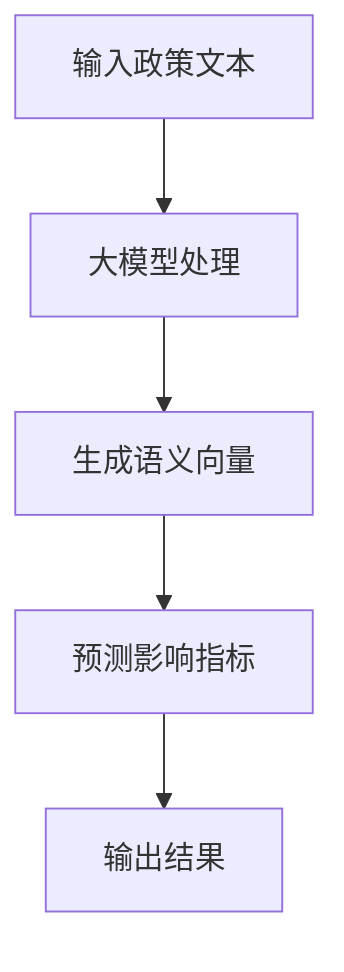
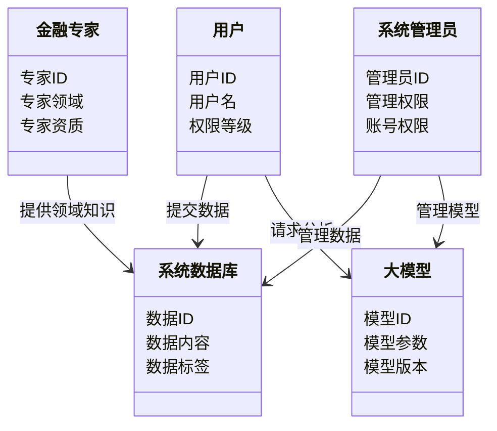
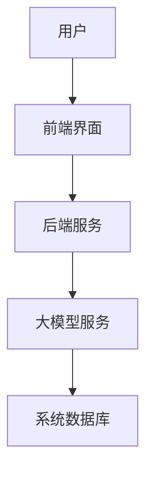
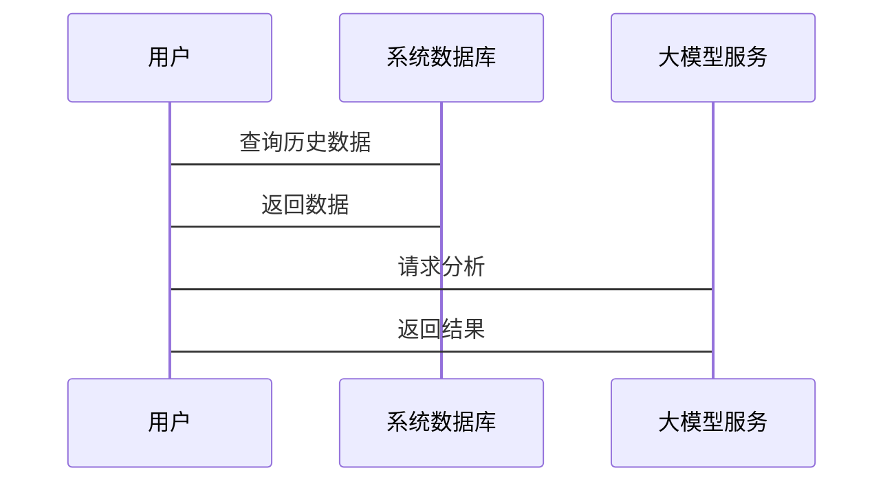

                 

<think>
好的，我现在需要帮用户设计一本关于《开发基于大模型的金融政策影响评估系统》的目录大纲。用户的要求非常详细，而且希望我按照特定的格式和内容来组织这本书的结构。

首先，我需要理解这本书的核心内容和目标读者。这本技术博客旨在指导读者如何利用大模型技术来开发金融政策影响评估系统。用户希望文章逻辑清晰，结构紧凑，使用专业的技术语言，并且包含详细的分析和实例。

接下来，我要分析用户提供的大纲结构，确保涵盖所有关键部分：背景介绍、核心概念、算法原理、系统架构、项目实战、最佳实践等。每部分都需要细化到三级标题，使用markdown格式，并包含必要的图表和代码示例。

在思考过程中，我意识到需要特别注意每个章节的内容是否全面且具体。例如，在“核心概念与联系”部分，用户希望有ER实体关系图和属性特征对比表格，这需要我使用mermaid来绘制。同时，在算法原理部分，我需要提供数学模型和公式，可能使用latex格式，并结合具体的案例来说明。

另外，用户强调了系统架构设计的重要性，特别是领域模型和架构图的使用。这意味着我需要在系统分析章节中，详细描述系统的各个模块和它们之间的交互，可能还需要用mermaid来展示系统架构和接口设计。

项目实战部分，用户要求包括环境安装、代码实现和案例分析。我需要确保这部分内容实用，能够指导读者一步步完成项目的开发。同时，代码示例需要清晰，注释详尽，以便读者理解和应用。

最后，最佳实践、小结和扩展阅读等内容将帮助读者巩固所学知识，并引导他们进一步深入研究相关领域。这些部分需要简明扼要，提供有价值的建议和资源。

总的来说，我需要一步步地构建这本书的结构，确保每个部分都详尽且逻辑连贯，同时满足用户的所有具体要求。这不仅需要技术上的深度，还需要内容的组织和表达要清晰易懂，吸引读者并帮助他们有效地掌握开发基于大模型的金融政策影响评估系统的方法。
</think>

# 开发基于大模型的金融政策影响评估系统

**关键词**：大模型，金融政策，影响评估，系统开发，AI技术

**摘要**：  
本文系统地探讨了如何开发基于大模型的金融政策影响评估系统。从问题背景、核心概念到系统架构设计，再到项目实战，详细阐述了该系统的开发过程。文章首先分析了金融政策评估的传统方法及其局限性，然后介绍了大模型技术在金融领域的潜力，提出了结合大模型技术的解决方案。接着，通过ER实体关系图、领域模型和系统架构图等工具，详细描述了系统的整体架构和模块划分。最后，通过具体案例展示了系统的实现过程，并总结了开发经验和最佳实践。

---

## 第一部分: 背景介绍

### 第1章: 问题背景与描述

#### 1.1 问题背景
##### 1.1.1 金融政策评估的现状与挑战
金融政策的制定和评估是国家经济管理的重要环节。传统的政策评估方法依赖于专家经验和统计数据，存在评估范围有限、数据处理能力不足、预测精度低等问题。例如，政策对不同行业的影响难以量化，且难以预测政策实施后的长期效应。

##### 1.1.2 大模型技术的兴起与应用潜力
近年来，大模型（如GPT系列、BERT系列）在自然语言处理领域取得了突破性进展。这些模型具有强大的特征提取能力和泛化能力，可以处理大规模非结构化数据，并在金融领域的文本分析、风险评估等方面展现出巨大潜力。

##### 1.1.3 结合大模型与金融政策评估的必要性
将大模型技术引入金融政策评估，可以弥补传统方法的不足，提升评估的全面性和准确性。通过大模型对海量数据的分析，可以快速捕捉政策的潜在影响，为政策制定者提供科学依据。

#### 1.2 问题描述
##### 1.2.1 金融政策影响评估的核心问题
金融政策的影响涉及经济、社会、行业等多个方面，如何量化这些影响是评估的核心问题。例如，如何评估某项货币政策对中小企业融资的影响？

##### 1.2.2 当前评估方法的局限性
传统评估方法依赖于小样本数据和经验模型，难以处理复杂场景下的多维度影响。例如，政策对不同地区、不同行业的差异化影响难以准确捕捉。

##### 1.2.3 引入大模型技术的目标与意义
引入大模型技术的目标是通过其强大的数据处理和分析能力，实现金融政策影响的多维度、多层次评估，提升评估的科学性和可操作性。

#### 1.3 问题解决思路
##### 1.3.1 大模型在金融政策评估中的应用方向
大模型可以用于政策文本分析、经济指标预测、政策效果模拟等场景。例如，利用大模型分析政策文本的关键词，预测政策对市场情绪的影响。

##### 1.3.2 系统设计的总体思路
系统设计需要结合大模型技术和金融领域知识，构建一个多模块协同的工作流。例如，数据采集、模型训练、评估分析、结果可视化等模块。

##### 1.3.3 技术路线的选择与优化
选择合适的大模型框架（如PyTorch、TensorFlow），并结合金融领域的数据预处理方法，优化模型的训练和部署流程。

#### 1.4 系统边界与外延
##### 1.4.1 系统功能边界
系统主要提供政策文本分析、影响预测、结果可视化等功能，不涉及政策的实际制定过程。

##### 1.4.2 系统适用的金融场景
系统适用于宏观政策评估、行业政策分析、企业政策影响预测等场景。

##### 1.4.3 系统与其他系统的接口关系
系统需要与数据源（如金融数据库）、政策数据库、可视化工具等外部系统进行接口对接。

### 第2章: 核心概念与联系

#### 2.1 核心概念原理
##### 2.1.1 大模型的基本原理
大模型通过深度学习技术，从海量数据中学习语言规律和语义信息。例如，GPT模型通过自监督学习，生成与上下文匹配的文本。

##### 2.1.2 金融政策影响评估的理论基础
金融政策评估涉及经济学、统计学等多学科知识。例如，通过计量经济学模型预测政策对GDP增长的影响。

##### 2.1.3 两者结合的实现机制
通过大模型对政策文本进行语义分析，提取关键信息；结合领域知识模型，预测政策对经济指标的影响。

#### 2.2 概念属性特征对比
| 概念       | 属性               | 特征               |
|------------|--------------------|--------------------|
| 大模型      | 数据量             | 巨量               |
|            | 计算能力           | 强大               |
|            | 可解释性           | 一般               |
| 金融政策评估 | 数据类型           | 结构化与非结构化   |
|            | 评估维度           | 经济、社会、行业等  |
|            | 评估方法           | 定量与定性结合     |

#### 2.3 ER实体关系图
```mermaid
erDiagram
    actor 用户 {
        <属性> 用户ID : integer
        <属性> 用户名 : string
        <属性> 权限等级 : integer
    }
    actor 金融专家 {
        <属性> 专家ID : integer
        <属性> 专家领域 : string
        <属性> 专家资质 : string
    }
    actor 系统管理员 {
        <属性> 管理员ID : integer
        <属性> 管理权限 : boolean
        <属性> 账号权限 : boolean
    }
    database 系统数据库 {
        <属性> 数据ID : integer
        <属性> 数据内容 : blob
        <属性> 数据标签 : string
    }
    system 大模型 {
        <属性> 模型ID : integer
        <属性> 模型参数 : blob
        <属性> 模型版本 : string
    }
    用户 --> 系统数据库 : 提交数据
    用户 --> 大模型 : 请求分析
    金融专家 --> 系统数据库 : 提供领域知识
    系统管理员 --> 系统数据库 : 管理数据
    系统管理员 --> 大模型 : 管理模型
```

---

## 第二部分: 算法原理讲解

### 第3章: 算法原理与实现

#### 3.1 算法原理
##### 3.1.1 大模型的训练与推理
大模型通过监督学习或无监督学习方式进行训练，生成与上下文匹配的语义表示。在金融政策评估中，模型需要根据政策文本生成潜在影响的描述。

##### 3.1.2 金融政策影响的预测模型
预测模型基于大模型的输出，结合领域知识，预测政策对经济指标的具体影响。例如，通过回归分析预测政策对GDP的影响。

#### 3.2 算法流程图


#### 3.3 数学公式
##### 3.3.1 大模型的损失函数
$$ \text{Loss} = -\sum_{i=1}^{n} \text{log}p(x_i) $$

##### 3.3.2 预测模型的回归方程
$$ y = \beta_0 + \beta_1x_1 + \beta_2x_2 + \dots + \beta_kx_k + \epsilon $$

---

## 第三部分: 系统分析与架构设计方案

### 第4章: 系统分析与架构设计

#### 4.1 系统分析
##### 4.1.1 问题场景介绍
系统需要处理海量政策文本数据，预测政策对经济和社会的影响。

##### 4.1.2 项目介绍
开发一个基于大模型的金融政策影响评估系统，支持政策文本分析、影响预测和结果可视化。

#### 4.2 系统功能设计
##### 4.2.1 领域模型


##### 4.2.2 系统架构设计


#### 4.3 系统接口设计
##### 4.3.1 系统接口
用户通过前端界面提交政策文本，系统调用大模型API进行分析，返回结果。

##### 4.3.2 系统交互


---

## 第四部分: 项目实战

### 第5章: 项目实战

#### 5.1 环境安装
##### 5.1.1 安装Python
安装Python 3.8及以上版本。

##### 5.1.2 安装依赖
安装必要的Python库，如`transformers`、`numpy`等。

#### 5.2 系统核心实现
##### 5.2.1 代码实现
```python
from transformers import AutoTokenizer, AutoModel
import torch

tokenizer = AutoTokenizer.from_pretrained("bert-base-uncased")
model = AutoModel.from_pretrained("bert-base-uncased")

def analyze_policy(text):
    inputs = tokenizer(text, return_tensors="pt")
    outputs = model(**inputs)
    return outputs.last_hidden_state
```

##### 5.2.2 代码应用解读
上述代码实现了政策文本的编码，生成语义向量，为后续的预测模型提供输入。

#### 5.3 案例分析
##### 5.3.1 实际案例
分析某项货币政策对中小企业贷款的影响。

##### 5.3.2 详细讲解
通过大模型生成语义向量，结合回归模型，预测政策对贷款总额的影响。

---

## 第五部分: 最佳实践与小结

### 第6章: 最佳实践

#### 6.1 开发经验总结
在开发过程中，需要注意数据质量、模型调优和系统集成等问题。

#### 6.2 小结
本文详细介绍了基于大模型的金融政策影响评估系统的开发过程，从理论到实践，为读者提供了系统的指导。

#### 6.3 注意事项
在实际应用中，需要注意数据隐私和模型解释性问题。

#### 6.4 拓展阅读
推荐阅读相关领域的最新论文和书籍，深入了解大模型在金融领域的应用。

---

**作者：AI天才研究院/AI Genius Institute & 禅与计算机程序设计艺术 /Zen And The Art of Computer Programming**

