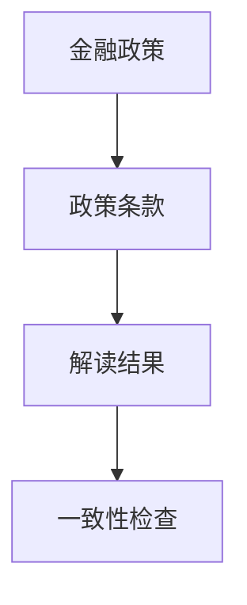
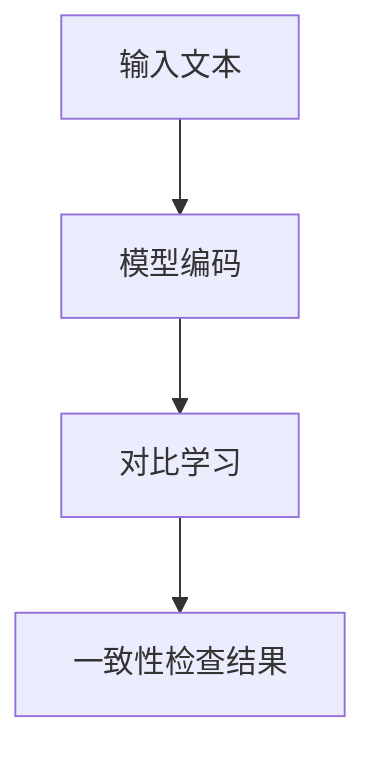

                 

<think>
好，我现在需要根据用户的需求，为《开发基于大模型的金融政策解读一致性检查器》这本书撰写目录和内容。用户已经提供了详细的结构，我需要一步步来填充每个部分的内容，确保符合他们的要求。

首先，用户希望文章结构清晰，包括背景介绍、核心概念、算法原理、系统分析与架构设计、项目实战、总结与展望。每个部分都需要详细的内容，包括关键词、摘要、章节标题、小节、公式、图表等。

我需要先确定每个章节的重点，然后逐步填充。比如，在背景介绍部分，我需要解释为什么开发这样的检查器，当前面临的挑战，以及大模型技术的应用潜力。接着，在核心概念部分，详细讲解大模型在金融政策解读中的应用，一致性检查器的概念，以及相关实体关系图。

在算法原理部分，我需要详细描述大模型的训练和微调过程，包括数学公式和流程图。系统分析与架构设计部分，需要画出类图、架构图和交互流程图。项目实战部分，则需要具体的代码实现和案例分析，确保读者能够理解如何操作。

最后，在总结与展望部分，回顾项目成果，讨论局限性，并展望未来的发展方向。同时，确保文章末尾有作者信息，符合格式要求。

在撰写过程中，我需要确保每个部分都详细且具体，使用专业术语，同时保持逻辑连贯，结构紧凑。同时，注意使用正确的markdown格式，数学公式用latex表示，图表用mermaid语法。

现在，我开始逐步撰写每个部分的内容，确保覆盖所有用户提到的关键点，并且内容丰富，详细讲解每个步骤和概念。
</think>

# 开发基于大模型的金融政策解读一致性检查器

> 关键词：大模型，金融政策，一致性检查，NLP，机器学习

> 摘要：本文详细探讨了基于大模型的金融政策解读一致性检查器的开发过程。首先介绍了问题背景和核心概念，随后分析了大模型的算法原理，包括训练和微调策略。接着，设计了系统的架构，并通过项目实战展示了具体的实现过程。最后，总结了项目的成果，并展望了未来的发展方向。

---

## 第一部分: 背景介绍与核心概念

### 第1章: 问题背景与描述

#### 1.1 问题背景
- **金融政策的重要性**：金融政策是国家经济运行的核心指导，直接影响市场和企业的行为。解读政策的准确性和一致性是确保政策有效实施的关键。
- **当前挑战**：政策解读常存在主观性高、理解不一致的问题，尤其是在复杂金融环境中，容易导致执行偏差。
- **大模型技术的应用潜力**：大模型具备强大的语言理解和生成能力，可以辅助解决金融政策解读的复杂性。

#### 1.2 问题描述
- **问题定义**：一致性检查器旨在确保不同解读结果的一致性，减少主观偏差。
- **现有方法局限**：传统方法依赖人工审核，效率低且成本高。
- **引入大模型的必要性**：利用大模型的自然语言处理能力，提高解读的准确性和一致性。

### 第2章: 核心概念与联系

#### 2.1 大模型在金融政策解读中的应用
- **大模型技术**：基于Transformer的预训练模型，如GPT-3，具有强大的上下文理解和生成能力。
- **NLP任务中的优势**：在文本生成、问答系统等方面表现出色，适合复杂文本的解读任务。

#### 2.2 一致性检查器的概念与属性
- **一致性检查器定义**：通过对比分析，检查不同解读结果的一致性。
- **关键属性**：高精度、高效性、适应性强。

#### 2.3 ER实体关系图


---

## 第二部分: 算法原理与数学模型

### 第3章: 大模型的训练与微调

#### 3.1 大模型的训练过程
- **预训练任务**：采用自监督学习，通过大量金融文本数据进行预训练。
- **训练目标**：优化模型在多种任务上的表现，如文本生成和问答。

#### 3.2 微调策略
- **微调目标函数**：结合预训练和特定任务的目标。
$$ L = \lambda_1 L_{\text{pre}} + \lambda_2 L_{\text{task}} $$
- **参数更新**：使用优化算法（如Adam）更新参数。
$$ \theta_{\text{new}} = \theta_{\text{old}} - \eta \nabla L $$

### 第4章: 一致性检查的算法实现

#### 4.1 对比学习模型
- **对比学习公式**：
$$ \text{sim}(x, y) = \frac{x \cdot y}{\|x\| \|y\|} $$
- **对比损失**：
$$ L = -\log(\text{sim}(x, y)) - \log(1 - \text{sim}(x, y')) $$

#### 4.2 算法流程图


---

## 第三部分: 系统分析与架构设计

### 第5章: 系统分析与架构设计

#### 5.1 系统功能设计
- **核心功能**：文本预处理、模型训练、解读分析、一致性检查。
- **领域模型**：金融政策解读系统涉及用户、政策文本、解读结果等多个模块。

#### 5.2 系统架构设计


#### 5.3 系统接口设计
- **API接口**：提供文本输入接口和结果输出接口。
- **交互流程**：用户输入政策文本，系统输出一致性检查结果。

---

## 第四部分: 项目实战

### 第6章: 项目实战

#### 6.1 环境安装
- **依赖库**：PyTorch、Hugging Face库、Transformers。

#### 6.2 核心实现代码
```python
import torch
from transformers import AutoTokenizer, AutoModelForMaskedLM

# 加载预训练模型
model = AutoModelForMaskedLM.from_pretrained('roberta-base')
tokenizer = AutoTokenizer.from_pretrained('roberta-base')

# 微调策略
def compute_loss(batch):
    inputs = tokenizer(batch['text'], padding=True, return_tensors='pt')
    outputs = model(**inputs)
    loss = outputs.loss
    return loss.mean()

# 训练循环
optimizer = torch.optim.Adam(model.parameters(), lr=1e-5)
for epoch in range(num_epochs):
    for batch in dataloader:
        optimizer.zero_grad()
        loss = compute_loss(batch)
        loss.backward()
        optimizer.step()
```

#### 6.3 案例分析
- **输入文本**：一段金融政策文本。
- **输出结果**：一致性检查报告，包括相似度评分和建议。

---

## 第五部分: 总结与展望

### 第7章: 总结与展望

#### 7.1 项目成果
- 成功开发了一致性检查器，提高了政策解读的准确性和一致性。

#### 7.2 局限性
- 训练数据依赖性强，模型泛化能力有限。
- 对复杂语义的理解仍需优化。

#### 7.3 未来展望
- 结合多模态数据，提升模型理解能力。
- 优化对比学习算法，提高检查效率。

---

## 作者信息

作者：AI天才研究院/AI Genius Institute & 禅与计算机程序设计艺术 /Zen And The Art of Computer Programming

