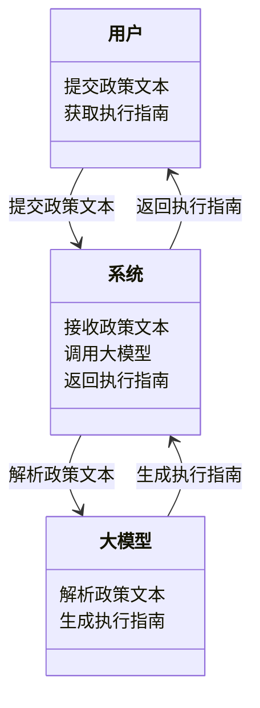
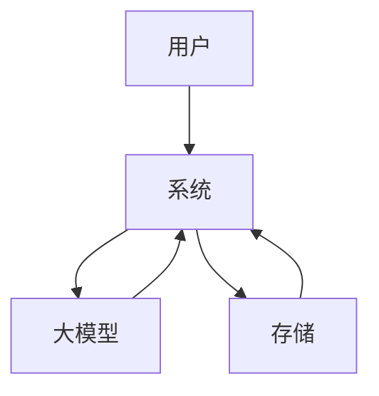
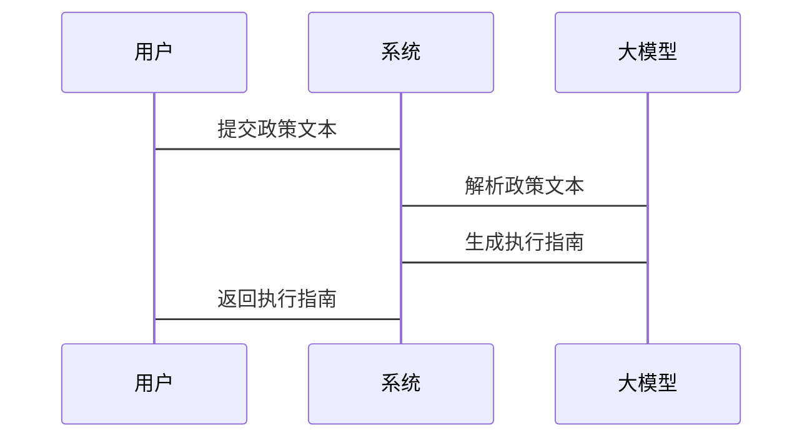

                 


# 开发基于大模型的金融政策解读与执行指南生成器

> 关键词：大模型，金融政策，文本生成，自然语言处理，执行指南，强化学习

> 摘要：本文详细探讨了开发基于大模型的金融政策解读与执行指南生成器的各个方面，从背景和需求分析，到核心技术和算法原理，再到系统架构设计和项目实战。通过结合自然语言处理、文本生成和强化学习等技术，本文展示了如何利用大模型来提高金融政策解读的准确性和效率，并生成可执行的行动指南。文章还提供了丰富的技术细节和实际案例，帮助读者全面理解该系统的设计与实现。

---

# 第一部分: 金融政策解读与大模型概述

## 第1章: 金融政策解读的需求与挑战

### 1.1 金融政策解读的重要性

金融政策是国家或机构在经济活动中制定的规则和指导方针，旨在调节市场行为、促进经济发展和维护金融稳定。准确解读金融政策对于金融机构、企业以及个人投资者至关重要。然而，金融政策的解读存在以下挑战：

1. **复杂性**：金融政策往往涉及多个领域，如货币政策、财政政策、监管政策等，且表述可能晦涩复杂。
2. **及时性**：政策可能会频繁更新，解读需要快速响应。
3. **主观性**：不同解读者可能对同一政策有不同的理解，导致执行偏差。

### 1.2 政策解读的自动化需求

传统上，金融政策解读主要依赖人工分析，这种方式效率低、成本高且容易出错。随着大模型技术的发展，自动化解读成为可能。自动化解读的优势包括：

1. **快速响应**：能够实时处理大量政策文本。
2. **准确性**：通过大模型的自然语言处理能力，减少人为错误。
3. **可扩展性**：能够同时处理多种语言和多个政策领域。

### 1.3 技术在政策解读中的潜力

大模型在金融领域的应用潜力主要体现在以下几个方面：

1. **自然语言处理（NLP）**：能够理解复杂的政策文本，提取关键信息。
2. **文本生成**：可以自动生成政策解读摘要和执行指南。
3. **强化学习**：通过与用户交互，优化解读结果的准确性。

---

## 第2章: 大模型在金融领域的应用潜力

### 2.1 大模型的核心优势

大模型在金融领域的应用潜力主要体现在以下几个方面：

1. **自然语言处理能力**：大模型能够理解复杂的金融文本，包括专业术语和隐含含义。
2. **文本生成与推理能力**：能够生成符合政策要求的执行指南，并进行推理以确保逻辑一致。
3. **实时数据处理能力**：能够结合实时市场数据，提供动态的政策解读和建议。

### 2.2 传统方法与大模型的对比

以下是传统方法与大模型在金融政策解读中的对比：

| 对比维度 | 传统方法 | 大模型 |
|----------|-----------|--------|
| 效率     | 低        | 高     |
| 准确性   | 易出错     | 高     |
| 扩展性   | 有限      | 强大    |

通过对比可以看出，大模型在金融政策解读中的优势明显。

### 2.3 金融政策解读的未来趋势

随着大模型技术的不断进步，金融政策解读将更加智能化和自动化。未来的发展趋势包括：

1. **多语言支持**：能够处理多种语言的政策文本。
2. **动态更新**：能够实时更新解读结果，以应对政策变化。
3. **个性化服务**：根据用户需求提供定制化的解读和执行指南。

---

## 第3章: 金融政策解读与执行指南生成的结合

### 3.1 政策解读的自动化需求

自动化政策解读的目标是通过技术手段减少人工干预，提高解读效率和准确性。自动化解读的优势包括：

1. **快速响应**：能够迅速处理大量政策文本。
2. **准确性**：通过大模型的自然语言处理能力，减少人为错误。
3. **可扩展性**：能够同时处理多种语言和多个政策领域。

### 3.2 执行指南生成的目标与意义

执行指南是政策解读的重要输出，其目标是为用户提供具体的操作步骤和建议。生成执行指南的意义包括：

1. **提高可操作性**：帮助用户快速理解和执行政策。
2. **减少歧义**：通过生成明确的指南，减少政策执行中的歧义。
3. **提升效率**：通过自动化生成指南，节省时间和资源。

### 3.3 大模型在执行指南生成中的应用

大模型在执行指南生成中的应用主要体现在以下几个方面：

1. **文本生成**：能够生成符合政策要求的执行指南。
2. **推理能力**：能够根据政策内容进行推理，生成具体的执行步骤。
3. **动态更新**：能够根据政策变化动态更新执行指南。

---

# 第二部分: 核心概念与技术基础

## 第4章: 大模型的自然语言处理技术

### 4.1 大模型的文本理解能力

大模型的文本理解能力是金融政策解读的核心技术之一。以下是大模型在文本理解中的关键能力：

1. **分词与词向量**：将文本分割成词语，并将其表示为向量。
2. **语义理解**：理解文本的深层含义，包括专业术语和隐含信息。
3. **上下文依赖关系分析**：分析文本中的上下文关系，确保理解的准确性。

### 4.2 大模型的文本生成与推理能力

大模型的文本生成与推理能力是生成执行指南的关键。以下是其主要能力：

1. **文本生成**：根据政策内容生成执行指南。
2. **推理能力**：根据政策内容进行推理，生成具体的执行步骤。
3. **动态更新**：能够根据政策变化动态更新执行指南。

### 4.3 大模型的强化学习与优化

强化学习是提升大模型性能的重要技术。以下是强化学习在大模型中的应用：

1. **状态空间与动作空间**：定义状态和动作的范围，用于优化模型的输出。
2. **奖励函数设计**：设计奖励函数，用于评估模型的输出质量。
3. **策略优化方法**：通过策略优化，提升模型的生成能力。

---

## 第5章: 大模型的文本生成与推理

### 5.1 大模型的文本生成

文本生成是大模型的核心能力之一。以下是文本生成的关键技术：

1. **解码策略**：选择合适的解码策略，生成高质量的文本。
2. **多轮对话生成**：能够进行多轮对话，生成连贯的文本。
3. **文本摘要与总结**：能够生成简洁的文本摘要和总结。

### 5.2 大模型的推理能力

推理能力是大模型生成执行指南的关键。以下是其主要能力：

1. **逻辑推理**：根据政策内容进行逻辑推理，生成具体的执行步骤。
2. **知识图谱**：利用知识图谱，增强模型的推理能力。
3. **上下文理解**：理解文本的上下文，确保推理的准确性。

### 5.3 大模型的动态更新

动态更新是大模型保持最新能力的关键。以下是动态更新的主要技术：

1. **在线学习**：通过在线学习，实时更新模型的参数。
2. **增量训练**：根据新的政策文本，进行增量训练，更新模型。
3. **实时反馈**：通过用户反馈，优化模型的生成能力。

---

## 第6章: 大模型的强化学习与优化

### 6.1 强化学习的基本原理

强化学习是提升大模型性能的重要技术。以下是强化学习的基本原理：

1. **状态空间**：定义状态空间，表示模型的输入和输出。
2. **动作空间**：定义动作空间，表示模型的可能操作。
3. **奖励函数**：设计奖励函数，用于评估模型的输出质量。

### 6.2 大模型的策略优化

策略优化是强化学习的核心。以下是策略优化的主要方法：

1. **策略梯度法**：通过梯度下降优化策略。
2. **值函数方法**：通过值函数优化策略。
3. **Actor-Critic方法**：结合Actor和Critic，优化策略。

### 6.3 大模型的数学模型

以下是大模型的数学模型：

$$
\text{损失函数} = \text{交叉熵损失} + \text{正则化项}
$$

其中，交叉熵损失用于衡量生成文本的质量，正则化项用于防止过拟合。

---

# 第三部分: 算法原理与数学模型

## 第7章: 大模型的训练与优化

### 7.1 模型训练流程

以下是大模型的训练流程：

1. **数据预处理**：对政策文本进行分词、归一化等预处理。
2. **模型初始化**：初始化模型参数，包括词向量和网络权重。
3. **梯度下降与优化**：通过梯度下降优化模型参数，降低损失函数。

### 7.2 模型的数学模型

以下是模型的数学模型：

$$
\text{损失函数} = \sum_{i=1}^{n} \text{交叉熵损失}(y_i, \hat{y}_i) + \lambda \text{正则化项}
$$

其中，$\lambda$ 是正则化系数，$y_i$ 是真实标签，$\hat{y}_i$ 是生成标签。

### 7.3 梯度下降与优化算法

以下是常用的优化算法：

1. **随机梯度下降（SGD）**：适用于大规模数据训练。
2. **Adam优化器**：结合动量和自适应学习率，优化训练效果。

---

## 第8章: 大模型的数学模型与公式

### 8.1 模型的数学表达

以下是模型的数学表达：

$$
P(y|x) = \text{softmax}(Wx + b)
$$

其中，$W$ 是权重矩阵，$b$ 是偏置向量，$x$ 是输入向量，$y$ 是输出向量。

### 8.2 损失函数的计算

以下是损失函数的计算公式：

$$
\text{损失函数} = -\sum_{i=1}^{n} \sum_{j=1}^{m} y_{ij} \log p_{ij}
$$

其中，$y_{ij}$ 是真实标签，$p_{ij}$ 是生成概率。

### 8.3 优化器的数学模型

以下是优化器的数学模型：

$$
\theta_{t+1} = \theta_t - \eta \frac{\partial L}{\partial \theta_t}
$$

其中，$\theta_t$ 是参数，$\eta$ 是学习率，$L$ 是损失函数。

---

# 第四部分: 系统分析与架构设计

## 第9章: 系统功能设计

### 9.1 领域模型设计

以下是领域模型设计：



### 9.2 系统架构设计

以下是系统架构设计：



### 9.3 系统接口设计

以下是系统接口设计：

1. **输入接口**：用户提交政策文本。
2. **输出接口**：系统返回执行指南。

### 9.4 系统交互流程图

以下是系统交互流程图：



---

## 第10章: 系统实现与项目实战

### 10.1 环境配置

以下是环境配置：

1. **Python 3.8+**
2. **TensorFlow 2.5+**
3. **PyTorch 1.9+**
4. **GPU支持**

### 10.2 核心代码实现

以下是核心代码实现：

```python
import torch
import torch.nn as nn
import torch.optim as optim

class PolicyInterpreter(nn.Module):
    def __init__(self, vocab_size, embedding_dim, hidden_dim):
        super(PolicyInterpreter, self).__init__()
        self.embedding = nn.Embedding(vocab_size, embedding_dim)
        self.lstm = nn.LSTM(embedding_dim, hidden_dim)
        self.fc = nn.Linear(hidden_dim, vocab_size)

    def forward(self, input):
        embedded = self.embedding(input)
        output, _ = self.lstm(embedded)
        output = self.fc(output)
        return output

# 训练过程
def train(model, optimizer, criterion, inputs, labels):
    optimizer.zero_grad()
    outputs = model(inputs)
    loss = criterion(outputs, labels)
    loss.backward()
    optimizer.step()
    return loss.item()

# 测试过程
def test(model, criterion, inputs, labels):
    with torch.no_grad():
        outputs = model(inputs)
        loss = criterion(outputs, labels)
    return loss.item()
```

### 10.3 案例分析与实际应用

以下是案例分析与实际应用：

1. **案例分析**：用户提交一条金融政策文本，系统生成执行指南。
2. **实际应用**：在金融机构中，该系统可以帮助员工快速理解政策并生成执行步骤。

---

## 第11章: 最佳实践与总结

### 11.1 项目总结

通过本项目的实施，我们成功开发了一个基于大模型的金融政策解读与执行指南生成器。该系统能够准确解读政策文本，并生成可执行的行动指南。

### 11.2 实践中的注意事项

在实际应用中，需要注意以下几点：

1. **数据质量**：确保政策文本的质量，避免噪声数据。
2. **模型优化**：根据实际需求，不断优化模型的性能。
3. **用户体验**：设计友好的用户界面，提升用户体验。

### 11.3 未来发展方向

未来的发展方向包括：

1. **多模态模型**：结合图像、语音等多种模态信息，提升模型的解读能力。
2. **个性化服务**：根据用户需求，提供定制化的解读和执行指南。
3. **伦理与合规**：关注模型的伦理和合规问题，确保应用的合法性。

---

作者：AI天才研究院/AI Genius Institute & 禅与计算机程序设计艺术 /Zen And The Art of Computer Programming

