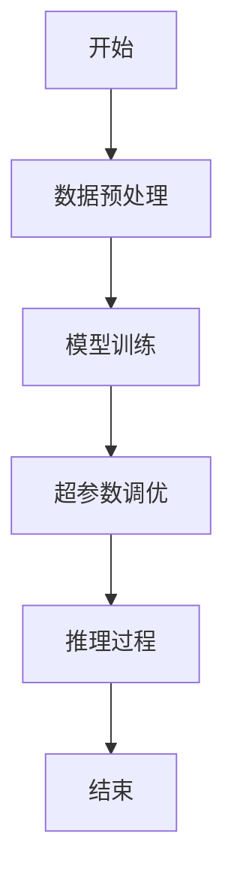
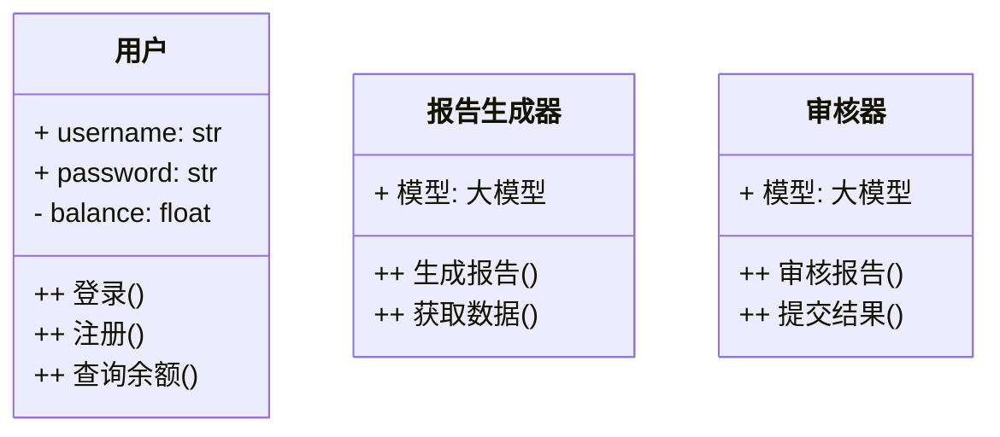
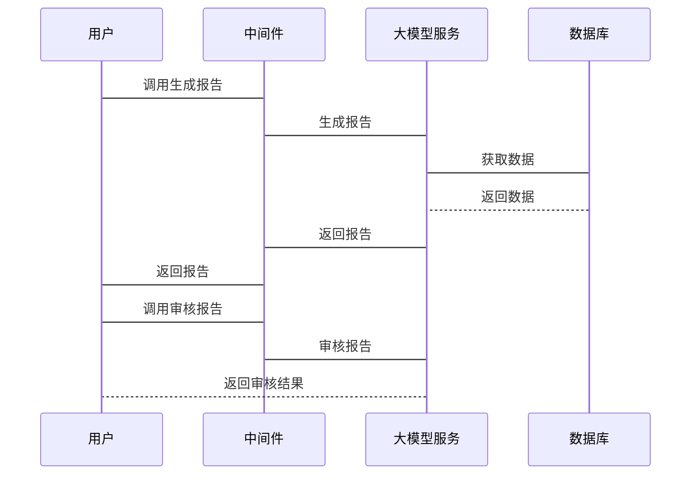

                 


# 开发基于大模型的金融监管报告智能生成与审核助手

> 关键词：大模型，金融监管，报告生成，智能审核，NLP技术

> 摘要：本文详细探讨了如何利用大模型技术开发金融监管报告的智能生成与审核助手。从背景介绍到系统架构设计，再到项目实战，全面解析了该系统的开发过程与实现细节，为读者提供了一套完整的解决方案。

---

# 第一部分: 背景介绍

## 第1章: 问题背景与需求分析

### 1.1 问题背景

#### 1.1.1 金融监管的重要性
金融监管是维护金融市场稳定、保护投资者利益的重要手段。传统的监管方式依赖人工审核，效率低下且容易出错。

#### 1.1.2 传统金融监管报告的痛点
- 数据量大：金融机构产生大量报告，人工处理耗时长。
- 内容复杂：报告内容涉及多领域知识，人工审核难以覆盖所有细节。
- 成本高昂：需要大量专业人员，增加了企业的运营成本。

#### 1.1.3 大模型技术的应用潜力
大模型在自然语言处理（NLP）方面具有显著优势，能够高效生成和理解文本，为金融监管报告的自动化处理提供了可能。

### 1.2 问题描述

#### 1.2.1 金融监管报告生成的复杂性
报告生成需要整合多方数据，涉及复杂的业务逻辑和合规要求。

#### 1.2.2 报告审核的效率瓶颈
人工审核速度慢，容易遗漏重要信息，影响监管效率。

#### 1.2.3 人工审核的局限性
审核人员容易受到主观因素影响，且知识储备有限，难以应对复杂情况。

### 1.3 问题解决

#### 1.3.1 引入大模型的必要性
利用大模型的自然语言处理能力，提高报告生成和审核的效率与准确性。

#### 1.3.2 智能生成与审核的解决方案
通过大模型生成初步报告，并利用其审核能力进行自动校对，提升整体效率。

#### 1.3.3 提高监管效率的目标
实现监管流程的自动化，减少人工干预，提高监管的及时性和准确性。

### 1.4 边界与外延

#### 1.4.1 金融监管的边界
明确监管的范围和限制，确保系统在合法合规的前提下运行。

#### 1.4.2 大模型应用的外延
探讨大模型在金融领域的其他应用，如风险评估、客户画像等。

#### 1.4.3 与其他技术的协同
结合其他技术，如区块链、大数据分析，进一步提升金融监管的效果。

### 1.5 概念结构与核心要素

#### 1.5.1 核心概念的层次结构
- 上层概念：金融监管
- 中层概念：报告生成、审核
- 下层概念：大模型技术

#### 1.5.2 核心要素的对比分析
| 核心要素 | 特性 |
|----------|------|
| 大模型   | 高效处理自然语言 |
| 金融监管报告 | 包含多领域数据 |
| 智能生成与审核助手 | 提高效率与准确性 |

---

# 第二部分: 核心概念与联系

## 第2章: 核心概念与联系

### 2.1 核心概念定义

#### 2.1.1 大模型的定义
大模型是指具有大量参数的深度学习模型，如GPT系列，能够处理复杂的自然语言任务。

#### 2.1.2 金融监管报告的定义
金融监管报告是金融机构为遵守监管要求而编制的文件，包含财务数据、业务分析等内容。

#### 2.1.3 智能生成与审核助手的定义
智能生成与审核助手是基于大模型的工具，能够自动生成报告并进行自动审核。

### 2.2 核心概念属性对比

| 核心概念 | 属性对比 |
|----------|----------|
| 大模型    | 高参数量，强自然语言处理能力 |
| 金融监管报告 | 多领域数据，合规性要求高 |
| 智能生成与审核助手 | 高效，准确，自动化 |

### 2.3 ER实体关系图

```mermaid
er
actor: 用户
model: 大模型
report: 金融监管报告
function: 生成/审核功能
relationship: 关联
```

---

# 第三部分: 算法原理讲解

## 第3章: 大模型的算法原理

### 3.1 大模型的训练流程

#### 3.1.1 数据预处理
- 清洗数据：去除噪声，确保数据质量。
- 分割数据：将数据分为训练集、验证集和测试集。

#### 3.1.2 模型训练
- 初始化模型参数。
- 前向传播：计算模型输出。
- 计算损失：使用交叉熵损失函数。
- 反向传播：更新模型参数。

#### 3.1.3 超参数调优
- 学习率：通常选择较小的值，如0.001。
- 批大小：根据硬件配置选择合适值。
- 迭代次数：确保模型充分训练。

### 3.2 大模型的推理机制

#### 3.2.1 解码过程
- 输入序列：将输入文本转换为模型可理解的形式。
- 解码策略：如贪心解码或Beam Search。
- 输出结果：生成最终的报告文本。

#### 3.2.2 注意力机制
- 注意力计算：使用自注意力机制，捕捉文本中的关键信息。
- 加权求和：将注意力权重与词向量相乘，得到最终的表示。

#### 3.2.3 概率生成
- 生成概率：模型输出每个词的概率分布。
- 采样方法：如最高概率采样或随机采样。

### 3.3 算法流程图



### 3.4 Python源代码实现

```python
import torch
def model_train(data):
    # 数据预处理
    data = preprocess(data)
    # 初始化模型
    model = Model()
    # 训练过程
    optimizer = torch.optim.Adam(model.parameters(), lr=0.001)
    for epoch in range(num_epochs):
        for batch in data:
            outputs = model(batch)
            loss = calculate_loss(outputs, batch_labels)
            optimizer.zero_grad()
            loss.backward()
            optimizer.step()
    return model
```

---

## 第4章: 数学模型与公式

### 4.1 模型训练的数学公式

#### 4.1.1 损失函数
$$ \text{Loss} = -\sum_{i=1}^{n} \sum_{j=1}^{m} y_{i,j} \log(p_{i,j}) $$
其中，$y_{i,j}$ 是真实标签，$p_{i,j}$ 是模型预测的概率。

#### 4.1.2 优化目标
$$ \text{优化目标} = \text{Minimize Loss} $$

### 4.2 注意力机制的数学表达

#### 4.2.1 注意力权重计算
$$ \text{Attention}(Q, K, V) = \text{softmax}\left(\frac{QK^T}{\sqrt{d_k}}\right)V $$
其中，$Q$ 是查询向量，$K$ 是键向量，$V$ 是值向量。

#### 4.2.2 解码过程
$$ \text{输出} = \text{模型}(输入, \text{注意力权重}) $$

---

# 第四部分: 系统分析与架构设计方案

## 第5章: 系统分析与架构设计

### 5.1 问题场景介绍

#### 5.1.1 系统目标
实现金融监管报告的智能生成与审核，提高效率和准确性。

#### 5.1.2 项目介绍
开发一个基于大模型的金融监管报告生成与审核系统，覆盖从数据输入到输出的全流程。

### 5.2 系统功能设计

#### 5.2.1 领域模型类图



#### 5.2.2 系统架构设计


### 5.3 系统接口设计

#### 5.3.1 API接口
- `/api/generate_report`：生成报告。
- `/api/audit_report`：审核报告。

#### 5.3.2 接口交互流程
1. 用户调用生成接口，传递数据。
2. 中间件接收请求，调用大模型生成报告。
3. 返回生成的报告给用户。
4. 用户调用审核接口，系统自动审核报告。
5. 返回审核结果。

### 5.4 系统交互流程图



---

## 第6章: 项目实战

### 6.1 环境安装

#### 6.1.1 安装Python
```bash
python --version
# 确保Python版本为3.8以上
```

#### 6.1.2 安装依赖
```bash
pip install torch transformers
```

### 6.2 核心代码实现

#### 6.2.1 数据预处理
```python
def preprocess(data):
    # 数据清洗和格式化
    return processed_data
```

#### 6.2.2 模型训练
```python
def train_model(data):
    model = Model()
    optimizer = torch.optim.Adam(model.parameters(), lr=0.001)
    for epoch in range(10):
        for batch in data:
            outputs = model(batch)
            loss = calculate_loss(outputs, labels)
            optimizer.zero_grad()
            loss.backward()
            optimizer.step()
    return model
```

#### 6.2.3 报告生成与审核
```python
def generate_report(data):
    model.eval()
    with torch.no_grad():
        outputs = model(data)
    return outputs
```

### 6.3 案例分析与实现解读

#### 6.3.1 案例分析
假设我们有一个金融机构的财务数据，需要生成一份季度报告。

#### 6.3.2 代码实现解读
- 数据预处理：清洗数据，确保格式一致。
- 模型训练：使用预处理后的数据训练大模型。
- 报告生成：输入数据，生成初步报告。
- 审核流程：模型自动审核报告，返回结果。

### 6.4 项目小结

#### 6.4.1 项目成果
成功开发了一个基于大模型的金融监管报告生成与审核系统，提高了效率和准确性。

#### 6.4.2 经验总结
- 数据预处理是关键，确保数据质量。
- 模型调优需要大量实验，找到最优参数。
- 系统架构设计要合理，确保扩展性和维护性。

---

# 第五部分: 最佳实践与小结

## 第7章: 最佳实践与小结

### 7.1 最佳实践 tips

#### 7.1.1 数据处理
- 确保数据的多样性和代表性。
- 处理缺失值和异常值。

#### 7.1.2 模型优化
- 使用合适的评估指标，如准确率、召回率。
- 定期更新模型，保持其性能。

#### 7.1.3 系统维护
- 定期检查系统日志，及时发现和解决问题。
- 确保系统安全，防止数据泄露。

### 7.2 小结

本文详细介绍了基于大模型的金融监管报告生成与审核助手的开发过程，从背景分析到系统实现，为读者提供了一套完整的解决方案。通过实际案例分析和代码实现，展示了该系统的可行性和高效性。

### 7.3 注意事项

- 数据隐私保护：确保用户数据的安全性和隐私性。
- 模型的可解释性：便于审核人员理解模型的决策过程。
- 系统的稳定性：确保系统在高负载下的稳定运行。

### 7.4 拓展阅读

- 《大模型在金融领域的应用》
- 《自然语言处理技术在监管合规中的应用》
- 《金融监管系统的架构设计与实现》

---

# 作者

作者：AI天才研究院/AI Genius Institute & 禅与计算机程序设计艺术 /Zen And The Art of Computer Programming

