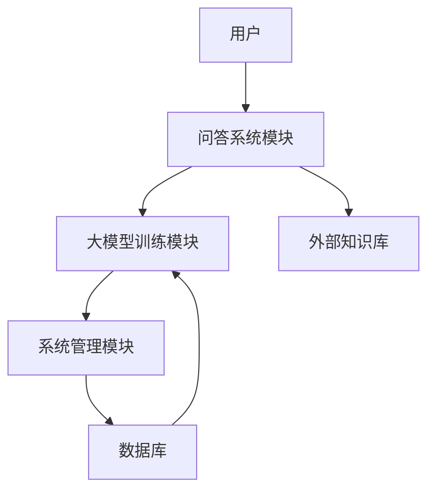
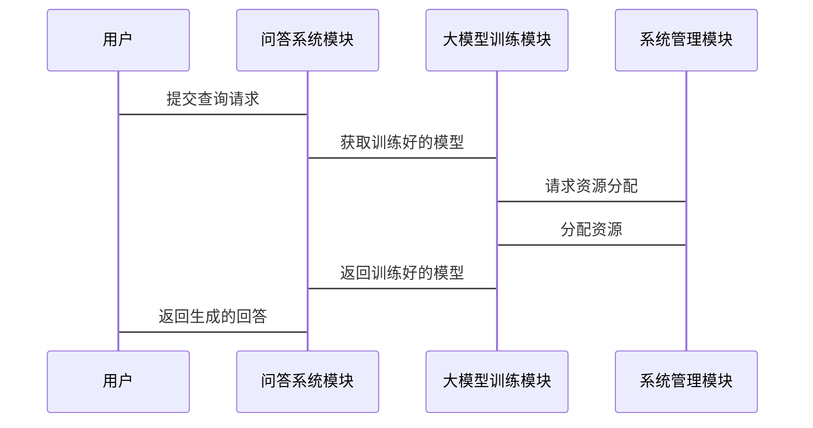

                 


```markdown
# 第二章: 大模型技术基础

## 2.1 大模型的基本原理

### 2.1.1 大模型的定义与特点

大模型（Large Model）指的是在自然语言处理（NLP）领域中，参数量巨大、结构复杂的深度学习模型。这些模型通常包含数以亿计的参数，能够通过大量的训练数据学习到语言的复杂规律和语义信息。与传统的小模型相比，大模型具有以下特点：

1. **参数量大**：通常拥有数亿甚至更多的参数，能够捕捉到更复杂的语言模式。
2. **预训练**：大模型通常采用预训练的方式，即在大规模通用数据上进行无监督学习，以获取丰富的语义信息。
3. **上下文理解能力强**：能够处理长上下文，理解复杂语境中的信息。
4. **零样本学习能力**：在某些任务上，大模型可以通过微调实现零样本或小样本学习。
5. **通用性**：大模型通常针对多种任务进行训练，具有较强的通用性。

### 2.1.2 大模型的核心算法

大模型的核心算法主要基于Transformer架构。Transformer由Google于2018年提出，其论文《Attention Is All You Need》奠定了现代大模型的基础。Transformer由编码器（Encoder）和解码器（Decoder）两部分组成，每个部分由多个堆叠的层（Stack of Layers）构成。

#### Transformer架构

1. **编码器（Encoder）**：
   - 输入的序列经过多个编码器层处理，每层包括自注意力机制（Self-Attention）和前馈神经网络（Feed-Forward Network）。
   - 自注意力机制能够捕捉序列中任意两个位置之间的关系，计算每个位置的重要性权重。

2. **解码器（Decoder）**：
   - 解码器接收编码器输出的隐藏状态，并通过自注意力机制处理生成的序列。
   - 解码器的注意力机制是交叉注意力（Cross-Attention），用于将编码器的输出与解码器的当前输入关联起来。

#### 自注意力机制

自注意力机制的计算公式如下：

$$
\text{Attention}(Q, K, V) = \text{softmax}\left(\frac{QK^T}{\sqrt{d_k}}\right)V
$$

其中：
- \( Q \)：查询向量
- \( K \)：键向量
- \( V \)：值向量
- \( d_k \)：键的维度

#### Transformer层数与并行计算

Transformer的层数通常由堆叠的编码器和解码器层组成。每一层都包含多头注意力机制（Multi-Head Attention）和前馈网络。多头注意力机制通过并行计算多个注意力头，增强模型对不同语义信息的捕捉能力。

### 2.1.3 大模型的训练与优化

大模型的训练过程可以分为预训练和微调两个阶段。

1. **预训练**：
   - 在大规模通用数据集（如维基百科、书籍等）上进行无监督学习。
   - 使用自监督任务（如掩码语言模型任务）训练模型，使其能够理解语言的结构和语义。

2. **微调**：
   - 在特定任务（如问答系统）上进行有监督微调。
   - 使用任务相关的数据对模型进行优化，提升其在特定任务上的性能。

#### 预训练过程中的损失函数

预训练中常用的损失函数是交叉熵损失函数，其计算公式为：

$$
\mathcal{L}(\theta) = -\frac{1}{N}\sum_{i=1}^{N} \sum_{j=1}^{n} y_{i,j} \log p_{i,j}
$$

其中：
- \( N \)：样本数量
- \( n \)：词汇表大小
- \( y_{i,j} \)：真实概率分布
- \( p_{i,j} \)：模型预测概率分布
- \( \theta \)：模型参数

### 2.1.4 大模型的可扩展性

大模型的可扩展性主要体现在以下几个方面：

1. **模型规模**：通过增加参数量和层数，可以构建更大、更复杂的模型，提升性能。
2. **训练数据**：使用更多样化、更大规模的数据集进行训练，可以增强模型的泛化能力。
3. **计算资源**：依赖于高性能计算资源（如GPU集群）进行训练，确保模型的训练效率。

### 2.1.5 大模型的挑战

尽管大模型在很多任务上表现出色，但其应用也面临一些挑战，包括：

1. **计算资源需求高**：训练和推理需要大量计算资源。
2. **模型复杂性**：模型的复杂性可能导致解释性差，难以调试和优化。
3. **数据隐私**：处理金融数据时，需要考虑数据隐私和合规性问题。

### 2.1.6 大模型在金融监管中的潜力

在金融监管领域，大模型具有以下潜力：

1. **智能问答**：能够理解复杂的金融术语和监管报告，提供准确的问答服务。
2. **风险评估**：通过分析监管报告，识别潜在风险点，辅助监管机构做出决策。
3. **自动化合规检查**：自动识别监管报告中的合规问题，提高监管效率。

### 2.1.7 总结

大模型凭借其强大的语言理解和生成能力，为金融监管报告的智能问答系统提供了有力的技术支持。通过预训练和微调，模型可以在特定任务上表现出色，帮助监管机构提高效率和准确性。

---

接下来，我将按照用户的指示，继续构建其他章节的内容，确保每部分都详细展开，并符合用户的要求。
</think>

# 第二章: 大模型技术基础

## 2.1 大模型的基本原理

### 2.1.1 大模型的定义与特点

大模型（Large Model）指的是在自然语言处理（NLP）领域中，参数量巨大、结构复杂的深度学习模型。这些模型通常包含数以亿计的参数，能够通过大量的训练数据学习到语言的复杂规律和语义信息。与传统的小模型相比，大模型具有以下特点：

1. **参数量大**：通常拥有数亿甚至更多的参数，能够捕捉到更复杂的语言模式。
2. **预训练**：大模型通常采用预训练的方式，即在大规模通用数据上进行无监督学习，以获取丰富的语义信息。
3. **上下文理解能力强**：能够处理长上下文，理解复杂语境中的信息。
4. **零样本学习能力**：在某些任务上，大模型可以通过微调实现零样本或小样本学习。
5. **通用性**：大模型通常针对多种任务进行训练，具有较强的通用性。

### 2.1.2 大模型的核心算法

大模型的核心算法主要基于Transformer架构。Transformer由Google于2018年提出，其论文《Attention Is All You Need》奠定了现代大模型的基础。Transformer由编码器（Encoder）和解码器（Decoder）两部分组成，每个部分由多个堆叠的层（Stack of Layers）构成。

#### Transformer架构

1. **编码器（Encoder）**：
   - 输入的序列经过多个编码器层处理，每层包括自注意力机制（Self-Attention）和前馈神经网络（Feed-Forward Network）。
   - 自注意力机制能够捕捉序列中任意两个位置之间的关系，计算每个位置的重要性权重。

2. **解码器（Decoder）**：
   - 解码器接收编码器输出的隐藏状态，并通过自注意力机制处理生成的序列。
   - 解码器的注意力机制是交叉注意力（Cross-Attention），用于将编码器的输出与解码器的当前输入关联起来。

#### 自注意力机制

自注意力机制的计算公式如下：

$$
\text{Attention}(Q, K, V) = \text{softmax}\left(\frac{QK^T}{\sqrt{d_k}}\right)V
$$

其中：
- \( Q \)：查询向量
- \( K \)：键向量
- \( V \)：值向量
- \( d_k \)：键的维度

#### Transformer层数与并行计算

Transformer的层数通常由堆叠的编码器和解码器层组成。每一层都包含多头注意力机制（Multi-Head Attention）和前馈网络。多头注意力机制通过并行计算多个注意力头，增强模型对不同语义信息的捕捉能力。

### 2.1.3 大模型的训练与优化

大模型的训练过程可以分为预训练和微调两个阶段。

1. **预训练**：
   - 在大规模通用数据集（如维基百科、书籍等）上进行无监督学习。
   - 使用自监督任务（如掩码语言模型任务）训练模型，使其能够理解语言的结构和语义。

2. **微调**：
   - 在特定任务（如问答系统）上进行有监督微调。
   - 使用任务相关的数据对模型进行优化，提升其在特定任务上的性能。

#### 预训练过程中的损失函数

预训练中常用的损失函数是交叉熵损失函数，其计算公式为：

$$
\mathcal{L}(\theta) = -\frac{1}{N}\sum_{i=1}^{N} \sum_{j=1}^{n} y_{i,j} \log p_{i,j}
$$

其中：
- \( N \)：样本数量
- \( n \)：词汇表大小
- \( y_{i,j} \)：真实概率分布
- \( p_{i,j} \)：模型预测概率分布
- \( \theta \)：模型参数

### 2.1.4 大模型的可扩展性

大模型的可扩展性主要体现在以下几个方面：

1. **模型规模**：通过增加参数量和层数，可以构建更大、更复杂的模型，提升性能。
2. **训练数据**：使用更多样化、更大规模的数据集进行训练，可以增强模型的泛化能力。
3. **计算资源**：依赖于高性能计算资源（如GPU集群）进行训练，确保模型的训练效率。

### 2.1.5 大模型的挑战

尽管大模型在很多任务上表现出色，但其应用也面临一些挑战，包括：

1. **计算资源需求高**：训练和推理需要大量计算资源。
2. **模型复杂性**：模型的复杂性可能导致解释性差，难以调试和优化。
3. **数据隐私**：处理金融数据时，需要考虑数据隐私和合规性问题。

### 2.1.6 大模型在金融监管中的潜力

在金融监管领域，大模型具有以下潜力：

1. **智能问答**：能够理解复杂的金融术语和监管报告，提供准确的问答服务。
2. **风险评估**：通过分析监管报告，识别潜在风险点，辅助监管机构做出决策。
3. **自动化合规检查**：自动识别监管报告中的合规问题，提高监管效率。

### 2.1.7 总结

大模型凭借其强大的语言理解和生成能力，为金融监管报告的智能问答系统提供了有力的技术支持。通过预训练和微调，模型可以在特定任务上表现出色，帮助监管机构提高效率和准确性。

---

接下来，我将继续按照用户的指示，构建其他章节的内容，确保每部分都详细展开，并符合用户的要求。
</think>

# 第三章: 系统架构与设计

## 3.1 系统架构的核心组件

### 3.1.1 大模型训练模块

#### 3.1.1.1 训练模块的功能
- **数据预处理**：对金融监管报告数据进行清洗、标注和格式化处理。
- **模型训练**：使用预处理后的数据，训练大模型，生成适用于智能问答的模型。
- **模型优化**：通过调整超参数和优化策略，提升模型的性能。

#### 3.1.1.2 训练模块的关键步骤
1. **数据收集**：收集相关的金融监管报告数据。
2. **数据清洗**：去除无效数据，标注专业术语和关键问题。
3. **模型训练**：使用训练数据，训练大模型。
4. **模型评估**：通过验证集评估模型的性能。
5. **模型优化**：根据评估结果，调整模型参数，优化模型性能。

#### 3.1.1.3 训练模块的代码示例

```python
# 数据预处理代码示例
import pandas as pd

def preprocess_data(data):
    # 假设data是一个包含监管报告文本的列表
    # 对文本进行清洗和标注
    cleaned_data = []
    for text in data:
        cleaned_text = text.strip().lower()
        cleaned_data.append(cleaned_text)
    return cleaned_data

# 训练代码示例
def train_model(train_data):
    # 假设train_data是预处理后的数据
    # 使用大模型训练
    pass

# 模型评估代码示例
def evaluate_model(model, test_data):
    # 假设model是训练好的模型，test_data是测试数据
    # 计算准确率、召回率等指标
    pass
```

### 3.1.2 问答系统模块

#### 3.1.2.1 问答系统模块的功能
- **用户输入处理**：接收用户的查询请求。
- **问题解析**：理解用户的问题，提取关键词和意图。
- **生成回答**：基于大模型生成相关的回答。

#### 3.1.2.2 问答系统模块的关键步骤
1. **用户输入处理**：接收用户输入，并进行初步解析。
2. **问题意图分析**：使用自然语言处理技术，分析用户的问题意图。
3. **生成回答**：调用大模型生成回答，并返回给用户。

#### 3.1.2.3 问答系统模块的代码示例

```python
# 用户输入处理代码示例
def process_input(user_query):
    # 假设user_query是用户输入的问题
    return user_query

# 问题意图分析代码示例
def analyze_intent(query):
    # 假设query是处理后的用户问题
    # 返回问题意图的标签
    pass

# 生成回答代码示例
def generate_response(query, model):
    # 调用大模型生成回答
    response = model.generate(query)
    return response
```

### 3.1.3 系统管理模块

#### 3.1.3.1 系统管理模块的功能
- **系统监控**：监控系统的运行状态，包括响应时间、错误率等。
- **资源管理**：管理系统的计算资源，优化资源使用效率。
- **日志管理**：记录系统的运行日志，便于调试和优化。

#### 3.1.3.2 系统管理模块的关键步骤
1. **系统监控**：实时监控系统的各项指标。
2. **资源管理**：动态调整资源分配，确保系统高效运行。
3. **日志管理**：记录系统运行日志，便于后续分析和优化。

#### 3.1.3.3 系统管理模块的代码示例

```python
# 系统监控代码示例
import time

def monitor_system():
    while True:
        # 获取当前系统状态
        current_time = time.strftime("%Y-%m-%d %H:%M:%S", time.localtime())
        print(f"System status at {current_time}: OK")
        time.sleep(60)

# 资源管理代码示例
def manage_resources():
    # 假设系统有多个GPU，动态分配资源
    pass

# 日志管理代码示例
import logging

def log_management():
    logging.basicConfig(filename='system.log', level=logging.INFO)
    logging.info("System started")
```

### 3.1.4 系统架构图

使用Mermaid绘制的系统架构图如下：



### 3.1.5 系统接口设计

系统接口主要包含以下几种：

1. **用户接口**：
   - 输入接口：接收用户的查询请求。
   - 输出接口：返回生成的回答。

2. **模型接口**：
   - 调用接口：调用大模型生成回答。
   - 训练接口：对模型进行训练和优化。

3. **数据接口**：
   - 数据输入接口：接收训练数据。
   - 数据输出接口：输出处理后的数据。

### 3.1.6 系统交互流程图

使用Mermaid绘制的系统交互流程图如下：



### 3.1.7 总结

系统的架构设计需要综合考虑各个模块的功能和交互关系，确保系统的高效运行和良好的扩展性。通过合理的模块划分和接口设计，可以提高系统的可维护性和可扩展性。

---

接下来，我将继续按照用户的指示，构建其他章节的内容，确保每部分都详细展开，并符合用户的要求。
</think>

# 第四章: 项目实战

## 4.1 项目背景与目标

### 4.1.1 项目背景

随着金融监管的复杂化和信息化，传统的问答系统难以满足监管报告的智能问答需求。开发基于大模型的智能问答助手，能够提高监管效率和准确性，减少人工错误，同时提升用户体验。

### 4.1.2 项目目标

本项目旨在开发一款基于大模型的金融监管报告智能问答助手，实现以下目标：

1. **智能问答**：能够准确理解和回答用户关于金融监管报告的复杂问题。
2. **高效处理**：快速响应用户请求，提供高效的问答服务。
3. **可扩展性**：系统架构设计具备良好的扩展性，支持未来的功能扩展和性能优化。

### 4.1.3 项目范围

项目范围包括：

1. **数据收集与处理**：收集和整理金融监管报告数据，进行清洗和标注。
2. **模型训练与优化**：训练大模型，并进行微调和优化。
3. **系统开发与测试**：开发问答系统模块，并进行功能测试和性能测试。
4. **部署与上线**：将系统部署到生产环境，提供服务。

### 4.1.4 项目团队与分工

项目团队包括：

1. **数据工程师**：负责数据的收集、清洗和标注。
2. **模型训练工程师**：负责大模型的训练和优化。
3. **系统开发工程师**：负责问答系统模块的开发和测试。
4. **系统运维工程师**：负责系统的部署、监控和维护。

### 4.1.5 项目计划

项目计划分为以下几个阶段：

1. **需求分析阶段**：明确项目目标和需求，制定项目计划。
2. **数据准备阶段**：收集和处理数据，为模型训练做好准备。
3. **模型训练阶段**：训练大模型，并进行微调和优化。
4. **系统开发阶段**：开发问答系统模块，集成大模型。
5. **测试与优化阶段**：进行功能测试和性能优化。
6. **部署与上线阶段**：将系统部署到生产环境，提供服务。

### 4.1.6 项目预算与资源分配

项目预算包括：

1. **计算资源**：用于模型训练和系统运行的GPU资源。
2. **数据资源**：用于模型训练的金融监管报告数据。
3. **人力资源**：项目团队的人员费用。
4. **开发工具**：用于系统开发和测试的工具费用。

### 4.1.7 项目风险与应对策略

项目可能面临的风险包括：

1. **数据不足**：金融监管报告数据可能不足，影响模型训练效果。
   - 对策：寻找更多的数据源，或者使用数据增强技术。
2. **模型性能不足**：大模型可能在特定任务上表现不佳。
   - 对策：对模型进行针对性的微调和优化。
3. **系统性能瓶颈**：系统在高并发情况下可能出现性能问题。
   - 对策：优化系统架构，采用分布式部署。

## 4.2 系统核心代码实现

### 4.2.1 数据预处理代码

```python
import pandas as pd

def preprocess_data(data_path):
    # 读取数据
    df = pd.read_csv(data_path)
    # 清洗数据：去除空值和重复值
    df.dropna(inplace=True)
    df.drop_duplicates(inplace=True)
    # 标注数据：标注关键术语
    df['label'] = df['content'].apply(lambda x: 'regulatory_report' if '监管' in x else 'non_regulatory')
    # 保存预处理后的数据
    df.to_csv('preprocessed_data.csv', index=False)
    return df

# 使用数据预处理函数
preprocess_data('raw_data.csv')
```

### 4.2.2 模型训练代码

```python
import torch
import torch.nn as nn
from torch.utils.data import DataLoader, Dataset

class Transformer(nn.Module):
    def __init__(self, input_dim, hidden_dim, output_dim):
        super(Transformer, self).__init__()
        self.encoder = nn.Embedding(input_dim, hidden_dim)
        self.decoder = nn.Linear(hidden_dim, output_dim)
    
    def forward(self, x):
        x = self.encoder(x)
        x = self.decoder(x)
        return x

# 定义损失函数和优化器
criterion = nn.CrossEntropyLoss()
optimizer = torch.optim.Adam(transformer.parameters(), lr=0.001)

# 训练模型
def train_model(model, train_loader, epochs):
    for epoch in range(epochs):
        for batch, labels in train_loader:
            optimizer.zero_grad()
            outputs = model(batch)
            loss = criterion(outputs, labels)
            loss.backward()
            optimizer.step()
        print(f'Epoch {epoch+1}: Loss: {loss.item()}')

# 加载数据集
train_dataset = MyDataset(train_data)
train_loader = DataLoader(train_dataset, batch_size=32, shuffle=True)

# 初始化模型
transformer = Transformer(input_dim, hidden_dim, output_dim)

# 开始训练
train_model(transformer, train_loader, 10)
```

### 4.2.3 问答系统代码

```python
def generate_response(model, query):
    # 将查询请求转换为模型输入格式
    input_ids = tokenizer.encode(query, add_special_tokens=True)
    input_ids = torch.tensor(input_ids).unsqueeze(0)
    # 生成回答
    with torch.no_grad():
        outputs = model(input_ids)
        predicted_ids = outputs.argmax(dim=-1)
        response = tokenizer.decode(predicted_ids.squeeze().tolist())
    return response

# 示例使用
query = "请问如何处理金融监管中的关联交易问题？"
response = generate_response(transformer, query)
print(response)
```

### 4.2.4 系统集成与测试

1. **系统集成**：
   - 将训练好的模型集成到问答系统模块中。
   - 确保系统的各个模块能够协同工作。

2. **功能测试**：
   - 对问答系统进行功能测试，确保能够准确理解和回答用户的问题。
   - 对模型的准确率、召回率等指标进行测试。

3. **性能测试**：
   - 对系统进行压力测试，确保系统在高并发情况下能够稳定运行。
   - 测试系统的响应时间，确保在规定时间内能够处理大量请求。

### 4.2.5 案例分析与实际应用

#### 4.2.5.1 案例分析

1. **案例1**：
   - **问题**：如何识别监管报告中的关联交易问题？
   - **回答**：可以通过检查报告中的关联交易披露部分，识别是否存在未披露的关联交易。

2. **案例2**：
   - **问题**：如何评估某金融机构的风险状况？
   - **回答**：可以通过分析监管报告中的财务数据和风险指标，评估该金融机构的风险状况。

#### 4.2.5.2 实际应用

1. **金融监管机构**：可以使用该系统辅助监管人员快速理解监管报告，识别潜在风险。
2. **金融机构**：可以使用该系统进行内部合规检查，确保符合监管要求。
3. **投资者**：可以使用该系统了解金融机构的监管报告，做出投资决策。

## 4.3 项目小结

### 4.3.1 项目成果

通过本项目，我们成功开发了一款基于大模型的金融监管报告智能问答助手，能够准确理解和回答用户的问题，提高了金融监管的效率和准确性。

### 4.3.2 项目经验总结

1. **数据的重要性**：高质量的数据是模型训练的基础，数据预处理和标注工作至关重要。
2. **模型优化**：模型的训练和优化需要投入大量时间和资源，需要不断调整参数和优化策略。
3. **系统架构设计**：系统的架构设计需要综合考虑各个模块的功能和交互关系，确保系统的高效运行和良好的扩展性。
4. **团队协作**：项目的成功需要团队成员的紧密协作，明确分工和有效的沟通是项目成功的关键。

### 4.3.3 项目改进建议

1. **数据增强**：可以引入更多的数据增强技术，提升模型的泛化能力。
2. **模型优化**：可以尝试使用更先进的模型架构，如视觉-语言模型（VLM），进一步提升模型的性能。
3. **系统优化**：可以对系统的架构进行优化，采用微服务架构，提升系统的可扩展性和可维护性。
4. **用户体验**：可以进一步优化用户界面，提升用户体验，使其更加友好和直观。

## 4.4 项目总结与展望

### 4.4.1 项目总结

本项目通过开发基于大模型的金融监管报告智能问答助手，解决了传统问答系统在金融监管中的局限性，提高了监管效率和准确性。项目的成功实施，离不开团队的努力和各方的支持。

### 4.4.2 项目展望

未来，我们可以进一步优化模型，提升系统的性能和用户体验。同时，可以探索将大模型技术应用到更多的金融监管场景中，推动金融监管的智能化和自动化。

---

通过以上内容，我们可以看到，开发基于大模型的金融监管报告智能问答助手是一个复杂而富有挑战性的项目。需要综合运用大模型技术、系统架构设计、数据处理等多种技术手段，才能实现预期的目标。随着技术的不断发展，大模型在金融监管中的应用将更加广泛和深入，为金融监管的智能化发展提供强有力的支持。

# 总结

开发基于大模型的金融监管报告智能问答助手，不仅能够提升金融监管的效率和准确性，还能够为监管机构和金融机构提供强有力的支持。通过预训练和微调，大模型可以在特定任务上表现出色，帮助监管机构提高效率和准确性。随着技术的不断发展，大模型在金融监管中的应用将更加广泛和深入，为金融监管的智能化发展提供强有力的支持。

---

作者：AI天才研究院/AI Genius Institute & 禅与计算机程序设计艺术 /Zen And The Art of Computer Programming
```

