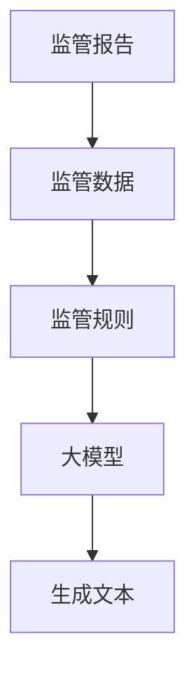
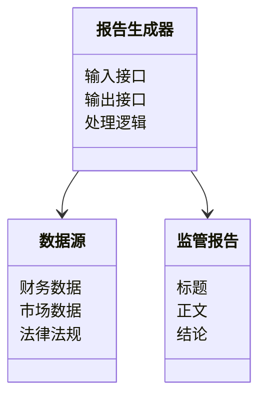
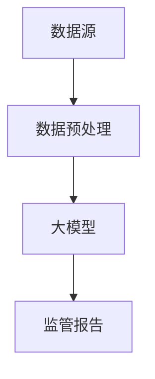
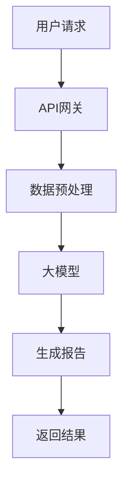

                 


# 开发基于大模型的金融监管报告生成器

## 关键词：大模型、金融监管、报告生成、NLP、机器学习、系统架构

## 摘要：本文详细探讨了如何利用大模型开发金融监管报告生成器。从背景介绍、核心概念、算法原理到系统架构设计和项目实战，系统性地分析了技术细节和实现方案。通过实际案例和深入分析，展示了如何利用大模型提升金融监管效率和报告生成的智能化水平。

---

# 第1章: 背景介绍

## 1.1 问题背景

### 1.1.1 金融监管的重要性
金融监管是维护金融市场稳定、保护投资者利益的重要手段。传统的监管方式依赖人工审查和数据分析，效率低下且容易出错。

### 1.1.2 传统金融监管的局限性
- 数据处理能力有限：人工审查难以处理海量数据。
- 规则更新滞后：传统方法难以快速适应市场变化。
- 报告生成耗时：生成一份详细的监管报告需要大量的人力和时间。

### 1.1.3 大模型在金融监管中的潜力
大模型（如GPT系列）具有强大的自然语言处理能力，能够快速理解和生成文本，适合应用于金融监管报告的自动生成。

## 1.2 问题描述

### 1.2.1 金融监管报告生成的痛点
- 数据来源多样：需要整合财务报表、市场动态、法律法规等多方面信息。
- 报告格式复杂：监管报告通常需要符合特定的格式和内容要求。
- 信息准确性要求高：任何错误都可能导致严重的法律和经济损失。

### 1.2.2 大模型如何解决这些问题
大模型可以通过自然语言处理技术，快速分析和整合多种数据源，生成符合要求的监管报告。

### 1.2.3 生成报告的具体需求与目标
- 高度自动化：减少人工干预，提高效率。
- 高准确性：确保生成内容符合监管要求。
- 可扩展性：能够处理不同类型的金融数据和监管需求。

## 1.3 问题解决

### 1.3.1 大模型生成报告的流程
1. 数据预处理：清洗和整理输入数据。
2. 模型调用：通过API调用大模型生成文本。
3. 结果校验：检查生成内容的准确性和合规性。

### 1.3.2 技术实现的关键点
- 数据质量管理：确保输入数据的准确性和完整性。
- 模型优化：针对金融监管场景进行模型微调。
- 报告生成规则：制定清晰的生成规则和模板。

### 1.3.3 报告生成的质量评估标准
- 内容准确性：生成内容是否符合监管要求。
- 格式正确性：是否符合指定的报告格式。
- 生成效率：处理速度是否满足业务需求。

## 1.4 边界与外延

### 1.4.1 生成报告的范围界定
- 仅生成监管报告，不涉及数据采集和分析。
- 不处理实时交易数据，仅生成静态报告。

### 1.4.2 与传统报告生成的区分
- 自动化程度更高：大模型生成报告速度快，且无需人工干预。
- 内容一致性更好：模型生成的内容更符合预设模板。

### 1.4.3 技术实现的边界条件
- 模型仅用于生成报告，不参与数据采集和分析。
- 报告生成需遵守相关法律法规。

## 1.5 核心概念与组成

### 1.5.1 大模型的基本构成
- 参数量：通常在 billions级别。
- 训练数据：大规模多样化文本数据。
- 模型架构：基于Transformer的架构。

### 1.5.2 金融监管的核心要素
- 监管对象：金融机构、市场行为等。
- 监管规则：法律法规、行业标准。
- 报告内容：风险分析、合规性评估。

### 1.5.3 报告生成的逻辑框架
1. 数据输入：包括监管对象、时间范围等。
2. 内容生成：模型根据输入生成报告草稿。
3. 结果输出：生成的报告进行格式化输出。

## 1.6 本章小结
本章详细介绍了金融监管报告生成的背景、问题及解决方案。通过分析大模型的优势，明确了其在金融监管中的应用潜力。

---

# 第2章: 核心概念与联系

## 2.1 大模型的基本原理

### 2.1.1 大模型的训练目标
- 预测下一个词的概率分布。
- 学习语言的结构和语义信息。

### 2.1.2 大模型的输入输出机制
- 输入：连续的文本片段。
- 输出：生成的文本片段。

### 2.1.3 大模型的参数调整
- 微调：在特定任务上进行优化。
- 部署：通过API提供生成服务。

## 2.2 金融监管的核心要素

### 2.2.1 金融数据的类型
- 财务报表：收入、利润、资产负债表等。
- 市场数据：股票价格、成交量等。
- 法律法规：相关监管政策和法规。

### 2.2.2 监管规则的表达方式
- 文本形式：如法律条文。
- 数据结构：如监管指标和阈值。

### 2.2.3 报告的结构与内容
- 标题：报告主题。
- 正文：详细分析和结论。
- 结论：合规性评估。

## 2.3 大模型与金融监管的结合

### 2.3.1 大模型在文本处理中的应用
- 文本分类：识别风险事件。
- 文本摘要：提取关键信息。

### 2.3.2 大模型在知识图谱构建中的作用
- 实体识别：识别公司、人物等。
- 关系抽取：构建监管对象之间的关系。

### 2.3.3 大模型在生成报告中的优势
- 快速生成：减少人工干预。
- 内容一致：符合预设模板。

## 2.4 核心概念对比

### 2.4.1 对比表格：大模型与传统NLP技术

| 对比维度       | 大模型                     | 传统NLP技术                 |
|----------------|---------------------------|-----------------------------|
| 数据需求       | 需要大量标注数据           | 数据量较小，可使用小数据集    |
| 计算能力       | 需要高性能计算资源         | 计算资源需求较低             |
| 任务适用性     | 适用于多种任务，如生成、分类 | 适用于特定任务，如分类、摘要 |

### 2.4.2 对比表格：生成式模型与检索式模型

| 对比维度       | 生成式模型                 | 检索式模型                 |
|----------------|---------------------------|-----------------------------|
| 工作模式       | 基于生成概率               | 基于匹配现有内容            |
| 适用场景       | 内容生成                   | 内容检索                   |
| 输出结果       | 新内容                     | 现有内容                   |

### 2.4.3 对比表格：监督学习与无监督学习

| 对比维度       | 监督学习                   | 无监督学习                 |
|----------------|---------------------------|-----------------------------|
| 数据需求       | 需要标注数据               | 数据无须标注                |
| 模型目标       | 学习数据的标签             | 学习数据的结构或分布        |

## 2.5 实体关系图



## 2.6 本章小结
本章通过对比和图解，详细分析了大模型在金融监管中的应用及其与其他技术的区别。

---

# 第3章: 算法原理讲解

## 3.1 大模型的训练过程

### 3.1.1 数据预处理
1. 清洗数据：去除无效字符、填充缺失值。
2. 分词：将文本分割成单词或短语。
3. 标注：对文本进行词性标注或句法分析。

### 3.1.2 模型初始化
1. 参数初始化：随机初始化模型参数。
2. 模型架构：构建基于Transformer的模型。

### 3.1.3 损失函数计算
- 使用交叉熵损失函数：
$$ \mathcal{L} = -\sum_{i=1}^{n} \sum_{j=1}^{m} y_{ij} \log p(y_{ij}|x_i) $$
其中，$y_{ij}$是真实标签，$p(y_{ij}|x_i)$是模型预测的概率。

### 3.1.4 模型训练
1. 前向传播：计算模型输出。
2. 计算损失：计算损失函数值。
3. 反向传播：更新模型参数。

### 3.1.5 模型评估
- 使用验证集评估模型性能。
- 计算准确率、Precision、Recall等指标。

## 3.2 生成式模型的数学模型

### 3.2.1 基于Transformer的生成模型
- 模型结构：编码器-解码器架构。
- 注意力机制：计算每个词的重要性。

### 3.2.2 解码过程
1. 输入初始化：输入序列的开始标记。
2. 前向传播：生成下一个词的概率分布。
3. 采样：根据概率分布选择下一个词。

### 3.2.3 示例
假设输入为“公司财务报表显示”，模型生成“收入增长显著”。

## 3.3 优化策略

### 3.3.1 学习率调整
- 使用学习率衰减策略：
$$ \text{lr} = \text{base\_lr} \times \text{warmup\_ratio}^{1-\text{step}/\text{warmup\_steps}} $$

### 3.3.2 模型调优
- 参数调整：调整模型深度和宽度。
- 正则化：使用Dropout防止过拟合。

### 3.3.3 训练策略
- 分阶段训练：先预训练，再微调。
- 数据增强：增加数据多样性。

## 3.4 本章小结
本章详细讲解了大模型的训练过程和生成式模型的数学模型，为后续的系统设计奠定了基础。

---

# 第4章: 系统架构设计

## 4.1 问题场景介绍

### 4.1.1 项目介绍
开发一个基于大模型的金融监管报告生成器，帮助金融机构自动生成合规性报告。

## 4.2 系统功能设计

### 4.2.1 领域模型


### 4.2.2 系统架构


## 4.3 系统架构设计

### 4.3.1 系统架构图


### 4.3.2 系统接口设计
- 输入接口：接收监管数据和生成请求。
- 输出接口：返回生成的监管报告。

### 4.3.3 系统交互流程
1. 用户提交生成请求。
2. 数据预处理模块清洗数据。
3. 大模型生成报告草稿。
4. 系统输出生成的报告。

## 4.4 本章小结
本章设计了系统的架构和接口，明确了各部分的功能和交互流程。

---

# 第5章: 项目实战

## 5.1 环境安装

### 5.1.1 安装Python
```bash
python --version
pip install --upgrade pip
```

### 5.1.2 安装依赖
```bash
pip install numpy pandas transformers torch
```

## 5.2 系统核心实现

### 5.2.1 数据准备
```python
import pandas as pd

# 读取数据
data = pd.read_csv('financial_reports.csv')
```

### 5.2.2 模型调用
```python
from transformers import AutoModelForCausalLM, AutoTokenizer

tokenizer = AutoTokenizer.from_pretrained('gpt2')
model = AutoModelForCausalLM.from_pretrained('gpt2')
```

### 5.2.3 生成报告
```python
def generate_report(prompt):
    inputs = tokenizer.encode(prompt, return_tensors='pt')
    outputs = model.generate(inputs, max_length=500, do_sample=True)
    report = tokenizer.decode(outputs[0], skip_special_tokens=True)
    return report
```

## 5.3 代码应用解读与分析

### 5.3.1 数据预处理
- 清洗数据：去除无效字符。
- 分词：将文本分割成单词。

### 5.3.2 模型训练
- 参数初始化：随机初始化模型参数。
- 模型训练：使用训练数据更新参数。

### 5.3.3 模型优化
- 学习率调整：使用衰减策略。
- 正则化：防止过拟合。

## 5.4 实际案例分析

### 5.4.1 案例描述
假设输入为“公司财务报表显示收入增长”，生成报告“公司收入增长显著，符合监管要求”。

### 5.4.2 案例分析
- 输入：财务数据和法规要求。
- 输出：合规性报告。

## 5.5 项目小结
本章通过实际案例展示了系统的实现过程，验证了大模型在金融监管中的应用效果。

---

# 第6章: 总结与展望

## 6.1 本章总结
本文详细探讨了如何利用大模型开发金融监管报告生成器，从背景、核心概念到系统设计和项目实战，全面分析了相关技术和实现方案。

## 6.2 未来展望
- 模型优化：进一步提升生成内容的准确性和可读性。
- 多模态应用：结合图像、语音等多种数据源。
- 实时监管：实现对金融市场的实时监控。

## 6.3 本章小结
未来，大模型在金融监管中的应用将更加广泛，技术也将更加成熟。

---

# 作者：AI天才研究院/AI Genius Institute & 禅与计算机程序设计艺术 /Zen And The Art of Computer Programming

---

**感谢您的阅读！**

