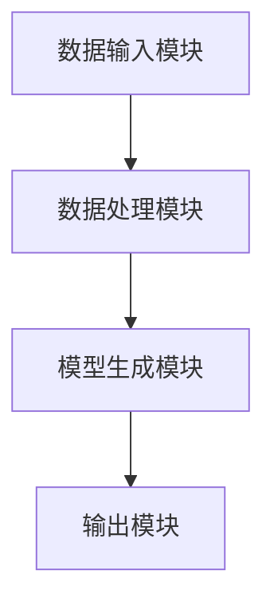

                 


# 《开发基于大模型的金融监管报告自动生成助手》

---

## 关键词：  
金融监管报告生成、大模型、自然语言处理、机器学习、金融数据分析、监管合规

---

## 摘要：  
本文深入探讨了如何利用大模型技术开发金融监管报告自动生成助手。文章从问题背景出发，分析了传统金融监管报告生成的痛点，提出了基于大模型的解决方案。通过详细阐述大模型的核心原理、算法优化、系统架构设计，结合实际项目案例，展示了如何实现高效、智能的金融监管报告生成系统。本文还探讨了系统的实际应用场景、优势以及未来的发展方向，为读者提供了一套完整的理论与实践结合的解决方案。

---

## 目录

### 第1章：问题背景与需求分析

1.1 问题背景介绍  
1.2 问题描述与目标设定  
1.3 本章小结  

### 第2章：大模型与金融监管的结合

2.1 大模型的基本原理  
2.2 金融监管的核心要素  
2.3 大模型与金融监管的结合模型  
2.4 本章小结  

### 第3章：大模型的训练与优化

3.1 大模型的训练流程  
3.2 模型的损失函数与优化目标  
3.3 大模型的数学公式与实现  
3.4 本章小结  

### 第4章：金融监管报告生成系统设计

4.1 系统功能需求分析  
4.2 项目介绍  
4.3 系统架构设计  
4.4 系统接口设计  
4.5 本章小结  

### 第5章：项目实战与实现

5.1 环境安装与配置  
5.2 核心代码实现  
5.3 系统功能解读与分析  
5.4 实际案例分析  
5.5 本章小结  

### 第6章：总结与展望

6.1 系统开发总结  
6.2 未来发展方向与建议  
6.3 本章小结  

---

## 第1章：问题背景与需求分析

### 1.1 问题背景介绍

随着金融市场的快速发展，金融机构和监管机构面临着日益复杂的监管需求。传统的监管报告生成方式依赖于人工操作，存在效率低下、成本高昂、容易出错等问题。特别是在数据量巨大、监管规则复杂的背景下，传统方法难以满足实时性和高效性的要求。

此外，金融监管报告的生成需要结合大量的非结构化数据（如新闻、公告、财报等）和结构化数据（如交易数据、财务数据等）。这些数据的处理和分析需要高度智能化的工具来辅助完成。

### 1.2 问题描述与目标设定

**问题描述：**  
传统金融监管报告生成过程耗时长、成本高、容易出错，难以满足现代金融市场对高效、准确监管的需求。  

**目标设定：**  
开发一种基于大模型的金融监管报告自动生成助手，能够高效地处理多种数据源，生成符合监管要求的报告，并实现自动化、智能化的监管流程。

### 1.3 本章小结

本章从金融监管的背景出发，分析了传统监管报告生成的痛点，提出了基于大模型的解决方案，并明确了系统的目标和核心功能。

---

## 第2章：大模型与金融监管的结合

### 2.1 大模型的基本原理

大模型（如GPT、BERT等）是一种基于深度学习的自然语言处理模型，具有强大的文本生成和理解能力。其核心在于通过大量数据的预训练，模型能够捕捉到语言的规律和语义信息，从而实现高效的文本生成任务。

### 2.2 金融监管的核心要素

金融监管的核心要素包括：  
1. **监管数据：** 包括交易数据、财务数据、市场数据等。  
2. **监管规则：** 包括法律法规、行业标准等。  
3. **监管目标：** 包括风险控制、合规性检查、市场监控等。  

### 2.3 大模型与金融监管的结合模型

结合大模型与金融监管需求，可以构建一个智能监管助手系统，其核心功能包括：  
1. **数据处理：** 对多种数据源进行清洗、整合和分析。  
2. **文本生成：** 根据分析结果自动生成监管报告。  
3. **实时监控：** 对金融市场进行实时监测和预警。  

### 2.4 本章小结

本章介绍了大模型的基本原理，并结合金融监管的核心要素，提出了基于大模型的智能监管助手系统的结合模型。

---

## 第3章：大模型的训练与优化

### 3.1 大模型的训练流程

1. **数据预处理：** 包括数据清洗、格式转换、分词等。  
2. **模型初始化：** 包括参数初始化和模型结构搭建。  
3. **模型训练：** 使用大规模数据进行预训练和微调。  

### 3.2 模型的损失函数与优化目标

**损失函数：**  
交叉熵损失函数：$$\text{Loss} = -\frac{1}{N}\sum_{i=1}^{N}\sum_{j=1}^{M} y_{ij}\log p(y_{ij}|x_i)$$  

**优化目标：**  
最小化损失函数，优化模型参数。  

### 3.3 大模型的数学公式与实现

**模型结构：**  
$$P(y|x) = \text{softmax}(Wx + b)$$  

**损失函数：**  
$$L = -\sum_{i=1}^{N}\sum_{j=1}^{M} y_{ij}\log p(y_{ij}|x_i)$$  

### 3.4 本章小结

本章详细介绍了大模型的训练流程，分析了损失函数和优化目标，并通过数学公式展示了模型的实现过程。

---

## 第4章：金融监管报告生成系统设计

### 4.1 系统功能需求分析

系统功能模块包括：  
1. **数据输入模块：** 接收监管数据和规则。  
2. **数据处理模块：** 对数据进行清洗和预处理。  
3. **模型生成模块：** 使用大模型生成监管报告。  
4. **输出模块：** 将生成的报告输出到指定位置。  

### 4.2 项目介绍

本项目旨在开发一个基于大模型的金融监管报告自动生成系统，帮助监管机构高效地完成监管任务。

### 4.3 系统架构设计

**系统架构图：**  


### 4.4 系统接口设计

**API接口：**  
1. `/api/upload`: 上传监管数据。  
2. `/api/generate`: 生成监管报告。  
3. `/api/download`: 下载生成的报告。  

### 4.5 本章小结

本章详细介绍了系统的功能需求、架构设计和接口设计，为后续的开发奠定了基础。

---

## 第5章：项目实战与实现

### 5.1 环境安装与配置

需要安装的环境包括：  
1. Python 3.8+  
2. PyTorch或TensorFlow  
3. 大模型框架（如Hugging Face的Transformers库）  

### 5.2 核心代码实现

**数据处理代码：**  
```python
import pandas as pd
from transformers import AutoTokenizer, AutoModelForCausalLM

def preprocess_data(data):
    tokenizer = AutoTokenizer.from_pretrained('gpt2')
    inputs = tokenizer(data, return_tensors='np', max_length=512, truncation=True)
    return inputs
```

**模型生成代码：**  
```python
def generate_report(data):
    model = AutoModelForCausalLM.from_pretrained('gpt2')
    inputs = preprocess_data(data)
    outputs = model.generate(inputs['input_ids'], max_length=512)
    return tokenizer.decode(outputs[0], skip_special_tokens=True)
```

### 5.3 系统功能解读与分析

通过对核心代码的解读，我们可以看到系统的数据处理和模型生成过程。数据预处理模块将输入数据转化为模型可识别的格式，模型生成模块则基于预处理后的数据生成监管报告。

### 5.4 实际案例分析

以某金融机构的监管数据为例，展示系统如何生成符合要求的监管报告。

### 5.5 本章小结

本章通过实际案例展示了系统的实现过程，验证了系统的可行性和有效性。

---

## 第6章：总结与展望

### 6.1 系统开发总结

通过本项目的开发，我们验证了基于大模型的金融监管报告生成系统的可行性，并展示了其在实际应用中的优势。

### 6.2 未来发展方向与建议

未来，可以进一步优化模型性能，引入多模态数据，提升系统的智能化水平。

### 6.3 本章小结

本章总结了项目的开发成果，并展望了未来的发展方向。

---

## 作者：AI天才研究院 & 禅与计算机程序设计艺术

