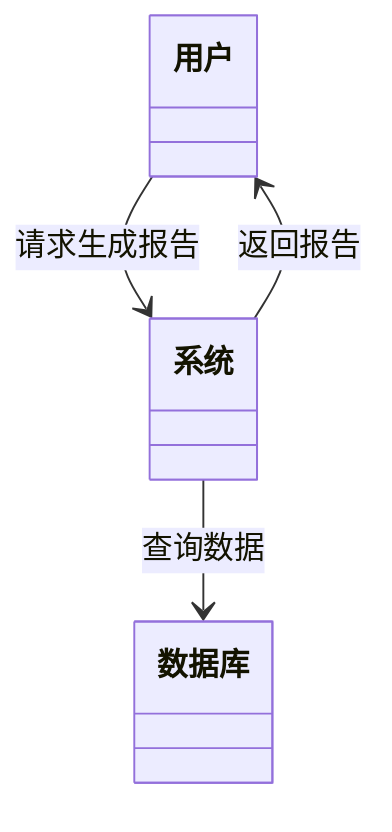
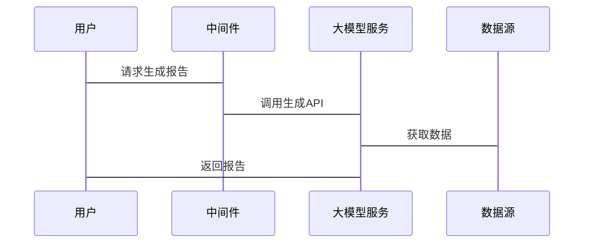

                 


# 开发基于大模型的金融研究报告生成系统

## 关键词：大模型、金融报告、生成系统、自然语言处理、AI应用

## 摘要：本文详细介绍了开发基于大模型的金融研究报告生成系统的背景、核心原理、系统架构设计、项目实现以及最佳实践。通过本文，读者可以全面了解如何利用大模型技术高效生成高质量的金融研究报告。

---

# 第1章: 背景介绍

## 1.1 问题背景

### 1.1.1 传统金融研究报告的痛点
传统金融研究报告的生成过程通常依赖人工撰写，耗时且效率低下。分析师需要收集大量数据、进行深入分析，并手动撰写报告，导致成本高昂且难以满足市场需求。

### 1.1.2 大模型在金融领域的应用潜力
随着大模型技术的快速发展，生成式AI在金融领域的应用潜力巨大。大模型能够快速处理海量数据，生成结构化和非结构化的金融分析内容，显著提升报告生成的效率和质量。

### 1.1.3 生成式AI在金融报告中的优势
生成式AI能够根据输入的数据和指令自动生成金融报告，支持多种语言和格式，具有高度的灵活性和可定制性。此外，AI生成的报告可以基于实时数据进行动态更新，提供更及时的分析。

## 1.2 问题描述

### 1.2.1 金融研究报告的核心要素
金融研究报告通常包括市场分析、公司分析、行业趋势、财务数据、风险评估等内容。这些要素需要结构清晰、数据准确，并且能够提供有价值的见解。

### 1.2.2 基于大模型生成报告的目标
目标是利用大模型快速生成高质量、结构化的金融研究报告，满足金融机构和个人用户的需求，提升效率并降低成本。

### 1.2.3 系统实现的关键问题
实现的关键问题包括数据获取与预处理、模型训练与优化、报告生成与输出等。同时，还需要解决模型的可解释性和结果的准确性问题。

## 1.3 问题解决

### 1.3.1 大模型生成报告的实现路径
实现路径包括数据准备、模型训练、接口开发和系统集成。通过整合大模型技术，构建一个高效、可靠的报告生成系统。

### 1.3.2 系统设计的总体思路
系统设计的总体思路是模块化设计，将数据处理、模型调用、报告生成等功能模块化，便于维护和扩展。

### 1.3.3 技术选型与实现方案
技术选型包括选择合适的AI框架（如TensorFlow、PyTorch）、大模型（如GPT、BERT）以及云服务（如AWS、阿里云）。实现方案包括数据预处理、模型微调、接口开发等。

## 1.4 系统的边界与外延

### 1.4.1 系统功能边界
系统主要负责报告生成，不包括数据采集和外部数据分析功能。系统边界清晰，便于与其他系统集成。

### 1.4.2 系统与外部系统的交互
系统需要与数据源、用户界面和存储系统进行交互。数据源提供输入数据，用户界面接收请求并返回报告，存储系统保存生成的报告。

### 1.4.3 系统的可扩展性与灵活性
系统设计充分考虑了扩展性，支持多种模型和数据源的接入，便于后续功能的扩展和优化。

## 1.5 核心概念与组成

### 1.5.1 系统核心要素
系统核心要素包括数据处理模块、大模型调用模块、生成模块和输出模块。

### 1.5.2 核心概念之间的关系
数据处理模块负责数据清洗和结构化，大模型调用模块负责调用预训练模型生成内容，生成模块负责格式化输出，输出模块负责将报告返回给用户。

### 1.5.3 系统架构的核心组成
系统架构的核心组成包括前端界面、后端服务、大模型服务和数据存储。各部分协同工作，完成报告生成的全流程。

---

# 第2章: 大模型的核心原理与技术

## 2.1 大模型的基本原理

### 2.1.1 大模型的训练目标
大模型的训练目标是通过大量数据学习语言的统计规律，生成与训练数据一致的文本。训练目标通常包括语言模型目标和任务特定目标。

### 2.1.2 大模型的模型结构
大模型的模型结构通常采用Transformer架构，包括编码器和解码器。编码器负责将输入数据转换为向量表示，解码器负责生成目标文本。

### 2.1.3 大模型的算法原理
大模型的算法原理基于自注意力机制和前馈网络。自注意力机制帮助模型捕捉输入中的长距离依赖关系，前馈网络负责非线性变换。

## 2.2 大模型在文本生成中的应用

### 2.2.1 文本生成的基本流程
文本生成的基本流程包括输入处理、模型调用和输出生成。模型根据输入生成概率分布，选择最可能的词生成文本。

### 2.2.2 基于大模型的生成式AI
生成式AI利用大模型生成文本，支持多种生成策略，如贪心搜索和随机采样。生成结果可以通过温度和top-k参数进行控制。

### 2.2.3 大模型的文本生成优势
大模型的文本生成优势包括生成速度快、生成质量高、支持多语言和多格式输出。

## 2.3 大模型的优化与调优

### 2.3.1 模型优化的基本方法
模型优化包括参数调整、剪枝和蒸馏。参数调整通过调整学习率和优化器实现，剪枝通过减少模型参数数量优化性能。

### 2.3.2 超参数调优的策略
超参数调优包括网格搜索、随机搜索和贝叶斯优化。选择合适的超参数可以显著提升模型性能。

### 2.3.3 模型压缩与部署
模型压缩技术包括知识蒸馏和量化。压缩后的模型可以在资源受限的环境中部署，提升推理速度和减少存储需求。

## 2.4 本章小结
本章详细介绍了大模型的核心原理和技术，包括模型结构、训练目标、生成流程和优化策略。这些内容为后续系统设计奠定了基础。

---

# 第3章: 系统分析与架构设计

## 3.1 项目介绍

### 3.1.1 项目目标
项目目标是开发一个基于大模型的金融研究报告生成系统，能够快速生成高质量的金融报告。

### 3.1.2 项目范围
项目范围包括系统设计、开发和测试。系统需要支持多种报告类型和格式，并具备良好的扩展性。

### 3.1.3 项目约束
项目约束包括数据隐私、系统性能和用户体验。系统需要在保证性能的前提下，提供良好的用户体验。

## 3.2 系统功能设计

### 3.2.1 领域模型设计


### 3.2.2 系统架构设计


## 3.3 系统接口设计

### 3.3.1 接口定义
系统提供RESTful API接口，包括POST请求生成报告和GET请求获取报告状态。

### 3.3.2 接口交互流程
用户通过API发送生成报告请求，系统处理后返回生成的报告。

### 3.3.3 接口实现细节
接口实现基于Flask框架，使用RESTful API设计。前端发送请求，后端处理并返回结果。

## 3.4 系统交互设计



---

# 第4章: 项目实战

## 4.1 环境安装

### 4.1.1 安装Python
安装Python 3.8及以上版本。

### 4.1.2 安装依赖库
使用pip安装所需库：
```bash
pip install numpy pandas torch transformers
```

## 4.2 系统核心实现

### 4.2.1 数据预处理
```python
import pandas as pd

def preprocess_data(data):
    # 数据清洗和结构化处理
    pass
```

### 4.2.2 模型调用
```python
from transformers import AutoModelForCausalLM, AutoTokenizer

model = AutoModelForCausalLM.from_pretrained("gpt2")
tokenizer = AutoTokenizer.from_pretrained("gpt2")
```

### 4.2.3 生成报告
```python
def generate_report(prompt):
    inputs = tokenizer.encode(prompt, return_tensors="pt")
    outputs = model.generate(inputs, max_length=500)
    report = tokenizer.decode(outputs[0], skip_special_tokens=True)
    return report
```

## 4.3 代码解读与分析

### 4.3.1 数据预处理模块
数据预处理模块负责清洗和结构化输入数据，确保模型能够正确处理。

### 4.3.2 模型调用模块
模型调用模块负责加载预训练模型，并调用生成API生成文本。

### 4.3.3 生成模块
生成模块负责根据输入生成报告，并返回生成结果。

## 4.4 案例分析

### 4.4.1 案例背景
假设用户请求生成一份关于某公司的财务分析报告。

### 4.4.2 案例实现
```python
prompt = "生成一份关于某公司的财务分析报告。"
print(generate_report(prompt))
```

### 4.4.3 案例结果
生成的报告包括公司财务数据、行业趋势分析和风险评估等内容。

## 4.5 项目总结
本章详细讲解了项目的实现过程，包括环境安装、核心代码实现和案例分析。通过实际案例，验证了系统的可行性和有效性。

---

# 第5章: 最佳实践与总结

## 5.1 最佳实践

### 5.1.1 模型选择与优化
选择适合任务的模型，并进行参数调优和模型压缩。

### 5.1.2 数据处理与安全
确保数据安全和隐私，合理处理敏感数据。

### 5.1.3 系统部署与维护
采用容器化部署，定期维护和更新系统。

## 5.2 小结
本文详细介绍了开发基于大模型的金融研究报告生成系统的背景、核心原理、系统架构设计和项目实现。通过本文，读者可以全面掌握系统的开发方法和实现细节。

## 5.3 注意事项

### 5.3.1 数据隐私问题
系统设计需要考虑数据隐私问题，确保数据安全。

### 5.3.2 模型的可解释性
生成结果需要具备可解释性，便于用户理解和信任。

### 5.3.3 系统性能优化
需要不断优化系统性能，提升生成速度和报告质量。

## 5.4 拓展阅读
推荐读者阅读相关领域的书籍和论文，深入学习大模型技术及其在金融领域的应用。

---

# 作者

作者：AI天才研究院/AI Genius Institute & 禅与计算机程序设计艺术 /Zen And The Art of Computer Programming

---

通过本文的详细讲解，读者可以全面了解基于大模型的金融研究报告生成系统的开发过程，从理论到实践，系统地掌握相关技术。希望本文对读者在大模型和金融领域的应用有所帮助。

