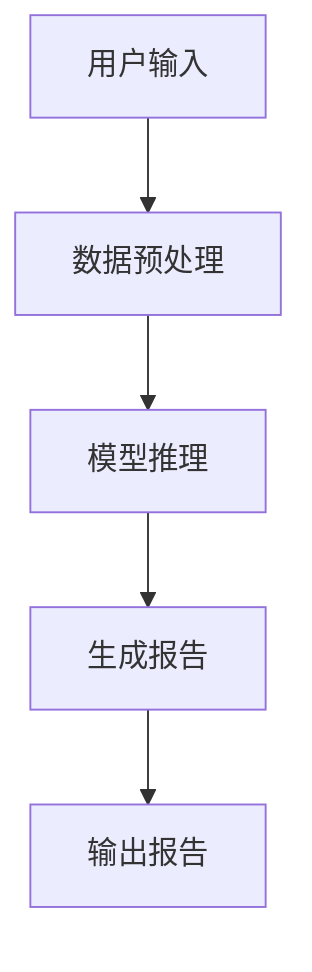
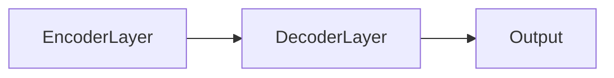
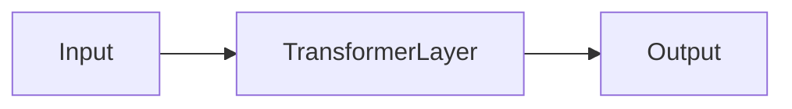
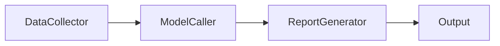

                 

<think>
嗯，用户需要我帮助生成一篇关于《开发基于大模型的金融研究报告自动生成器》的技术博客文章。我得仔细分析用户的需求，确保每一步都符合他们的要求。

首先，用户明确希望文章结构清晰，逻辑严密，用专业但易懂的语言撰写。文章的字数在1万到1.2万字之间，所以每个部分都需要详细展开。同时，用户提供了详细的大纲，要求涵盖背景、核心概念、算法原理、系统架构、项目实战、最佳实践等章节，并且每个章节都要有具体的细节，比如数学公式、流程图、代码示例等。

我需要从背景介绍开始，解释为什么开发这样的系统是必要的。这部分要包括问题背景、描述和解决方法，以及边界条件。接下来是核心概念，详细讲解大模型和自然语言处理的基础知识，确保读者能够理解这些技术的基本原理。然后，介绍金融报告自动生成的核心任务，包括数据处理和内容生成，这部分可能需要结合实际案例来说明。

算法原理部分需要用图表和数学公式来解释模型的训练过程，比如注意力机制和Transformer模型。这部分需要详细讲解，确保读者能够理解模型的工作机制。系统架构设计是关键，需要展示模块之间的关系和接口设计，使用类图和序列图来说明。

项目实战部分要提供具体的代码示例，展示如何实现数据处理、模型训练和报告生成。同时，案例分析可以帮助读者更好地理解系统在实际中的应用。最后，最佳实践部分要总结开发经验，提供小结和注意事项，帮助读者避免常见错误。

整个过程中，我需要确保每个部分都详细且有条理，满足用户的需求。同时，使用markdown格式，适当插入公式、图表和代码，使文章内容丰富且易于理解。最终，文章末尾要加上作者信息，确保文章的完整性和专业性。

现在，我需要按照这个思路一步步构建文章的结构，确保每个章节都涵盖用户要求的内容，同时保持逻辑连贯和深度分析。这样才能写出一篇高质量的技术博客，帮助读者深入了解如何开发基于大模型的金融报告自动生成器。
</think>

# 开发基于大模型的金融研究报告自动生成器

> 关键词：大模型，金融报告，自然语言处理，Transformer，注意力机制

> 摘要：本文详细探讨了如何基于大模型技术开发金融研究报告自动生成器。从问题背景、核心概念、算法原理、系统架构到项目实战，全面解析了实现这一目标的关键步骤和技术细节。通过结合大模型在自然语言处理领域的优势，本文提出了有效的解决方案，并通过实际案例展示了系统的实现过程。

---

# 第一部分: 开发基于大模型的金融研究报告自动生成器概述

# 第1章: 背景介绍

## 1.1 问题背景

### 1.1.1 传统金融报告的生成痛点

传统的金融报告生成过程通常依赖人工操作，存在以下痛点：
- **效率低下**：分析师需要手动收集数据、撰写报告，耗时且效率低。
- **一致性差**：不同分析师的报告风格和质量可能存在差异。
- **数据孤岛**：报告中数据来源分散，难以统一管理和引用。
- **更新滞后**：市场变化快，报告难以及时更新。

### 1.1.2 大模型技术的兴起与潜力

近年来，大模型（如GPT系列、BERT系列）在自然语言处理领域取得了突破性进展。这些模型具有以下优势：
- **强大的语言理解能力**：能够处理复杂的金融领域文本。
- **生成能力强**：可以自动生成高质量的金融报告内容。
- **可扩展性**：可以通过微调适应不同金融场景的需求。

### 1.1.3 金融研究报告自动生成的必要性

随着金融行业的快速发展，对高效、准确的报告生成需求日益增长。基于大模型的金融报告自动生成器能够显著提高工作效率，降低成本，同时保证报告的质量和一致性。

---

## 1.2 问题描述

### 1.2.1 金融报告生成的复杂性

金融报告生成涉及多个环节：
- **数据处理**：需要整合结构化数据（如财务数据）和非结构化数据（如新闻、评论）。
- **内容生成**：需要根据数据生成符合行业规范的分析内容。
- **格式化输出**：需要将生成的内容格式化为标准的金融报告格式。

### 1.2.2 传统方法的局限性

传统方法主要依赖模板和规则，存在以下局限：
- **灵活性差**：难以适应复杂多变的金融场景。
- **生成质量低**：无法保证报告的深度和准确性。
- **维护成本高**：需要频繁更新模板和规则。

### 1.2.3 基于大模型的解决方案

基于大模型的解决方案通过以下方式实现金融报告自动生成：
- **数据整合**：利用大模型处理多源异构数据。
- **智能生成**：通过大模型生成高质量的分析内容。
- **自动化输出**：将生成内容格式化为标准报告。

---

## 1.3 问题解决

### 1.3.1 大模型在自然语言处理中的优势

大模型在自然语言处理中的优势包括：
- **上下文理解**：能够捕捉文本中的上下文信息，生成连贯的内容。
- **多语言支持**：可以处理多种语言的金融报告。
- **可解释性**：通过注意力机制，用户可以理解模型的决策过程。

### 1.3.2 金融领域知识的结合

为了提高生成报告的质量，需要将金融领域知识与大模型结合：
- **领域微调**：对大模型进行金融领域的微调，使其适应特定需求。
- **知识库整合**：将金融知识库（如财务指标、行业术语）融入模型。

### 1.3.3 技术实现路径

实现路径包括：
1. **数据收集与预处理**：整合金融数据和文本。
2. **模型选择与训练**：选择合适的模型并进行微调。
3. **系统设计与实现**：开发报告生成系统。
4. **测试与优化**：验证系统性能并进行优化。

---

## 1.4 边界与外延

### 1.4.1 金融报告生成的边界条件

金融报告生成的边界条件包括：
- **输入数据的完整性**：需要确保输入数据的准确性和完整性。
- **生成内容的合规性**：生成的报告需要符合金融行业的规范和法律要求。
- **模型的适用性**：模型需要经过充分的金融领域微调。

### 1.4.2 相关领域的外延

相关领域的外延包括：
- **金融数据分析**：利用大数据技术分析金融市场。
- **智能投顾**：基于大模型提供个性化的投资建议。
- **风险评估**：利用生成模型评估金融风险。

### 1.4.3 与其他技术的结合

与其他技术的结合包括：
- **区块链**：用于数据的安全性和可信性。
- **云计算**：提供强大的计算能力和存储支持。
- **实时数据流**：支持金融市场的实时动态分析。

---

## 1.5 核心概念与联系

### 1.5.1 核心概念原理

核心概念包括：
- **大模型**：基于Transformer架构的大语言模型。
- **注意力机制**：模型中用于捕捉上下文关系的关键组件。
- **自然语言处理**：处理和理解自然语言文本的技术。

### 1.5.2 核心概念属性特征对比表格

| **核心概念** | **特点** | **优势** |
|--------------|----------|----------|
| 大模型        | 参数多、能力强大 | 高效生成金融报告 |
| 注意力机制    | 基于位置的权重计算 | 提高文本理解能力 |
| 自然语言处理  | 处理和生成自然语言 | 适用于多种金融场景 |

### 1.5.3 ER实体关系图架构的 Mermaid 流程图



---

## 1.6 总结与展望

总结：基于大模型的金融报告自动生成器通过结合自然语言处理和金融领域知识，能够高效、准确地生成高质量的金融报告。

展望：随着大模型技术的不断进步，金融报告生成系统将更加智能化、个性化和实时化。

---

# 第2章: 大模型与自然语言处理基础

## 2.1 大模型的定义与特点

### 2.1.1 大模型的定义

大模型（Large Language Model, LLM）是指基于Transformer架构的大型神经网络模型，具有 billions 级别的参数量。

### 2.1.2 大模型的核心特点

大模型的核心特点包括：
- **大规模训练数据**：基于海量文本数据进行训练。
- **深度神经网络**：通过多层网络结构捕捉复杂的语言模式。
- **自注意力机制**：能够捕捉文本中的长距离依赖关系。

### 2.1.3 大模型与传统模型的区别

| **维度**         | **大模型**            | **传统模型**           |
|------------------|----------------------|-----------------------|
| 参数量           | 数以亿计             | 数百万或更少          |
| 上下文理解能力   | 强大                 | 较弱                  |
| 生成能力         | 高                  | 低                   |
| 训练数据量       | 海量                 | 较小                  |
| 应用场景         | 多样化，适合复杂任务 | 适合简单任务           |

---

## 2.2 注意力机制与 Transformer 模型

### 2.2.1 注意力机制的原理

注意力机制通过计算输入序列中每个位置的权重，生成位置相关的表示。公式如下：

$$
\text{Attention}(Q, K, V) = \text{softmax}\left(\frac{QK^T}{\sqrt{d_k}}\right)V
$$

其中：
- $Q$：查询向量
- $K$：键向量
- $V$：值向量
- $d_k$：键的维度

### 2.2.2 Transformer 模型的结构

Transformer 模型由编码器和解码器组成，每个编码器和解码器包含多个堆叠的层。其结构如下图所示：



### 2.2.3 大模型的训练过程

大模型的训练过程包括：
1. **数据预处理**：清洗和格式化数据。
2. **模型初始化**：随机初始化模型参数。
3. **前向传播**：输入数据，计算预测结果。
4. **损失计算**：计算预测结果与真实结果的差异。
5. **反向传播**：更新模型参数。
6. **迭代优化**：重复上述步骤，直到收敛。

---

## 2.3 自然语言处理的基础

### 2.3.1 词嵌入的原理

词嵌入是将词语映射到低维向量空间的技术。常用的词嵌入方法包括 Word2Vec 和 GloVe。

### 2.3.2 语言模型的训练目标

语言模型的训练目标是最大化给定输入序列的概率：

$$
P(w_1, w_2, \ldots, w_n) = \prod_{i=1}^{n} P(w_i | w_1, w_2, \ldots, w_{i-1})
$$

### 2.3.3 大模型在 NLP 中的应用

大模型在 NLP 中的应用包括：
- **文本生成**：生成高质量的文本内容。
- **文本摘要**：将长文本压缩为简洁的摘要。
- **问答系统**：回答用户的问题。

---

## 2.4 总结与展望

总结：大模型和 Transformer 模型为自然语言处理提供了强大的工具，能够处理复杂的金融文本生成任务。

展望：随着模型规模的增大和训练技术的改进，大模型在金融领域的应用将更加广泛。

---

# 第3章: 金融报告自动生成的核心任务

## 3.1 数据处理与清洗

### 3.1.1 金融数据的结构化处理

金融数据通常包括结构化数据（如财务报表）和非结构化数据（如新闻）。结构化数据的处理步骤如下：
1. **数据清洗**：去除重复和无效数据。
2. **数据转换**：将数据转换为统一的格式。
3. **数据合并**：将不同来源的数据合并到一起。

### 3.1.2 数据清洗的必要性

数据清洗的必要性包括：
- **提高模型训练效率**：干净的数据能够加快模型收敛。
- **保证生成质量**：干净的数据能够生成高质量的报告。
- **避免错误决策**：干净的数据能够减少决策错误。

### 3.1.3 数据预处理的流程

数据预处理的流程包括：
1. **数据收集**：从多个来源收集数据。
2. **数据清洗**：去除无效数据。
3. **数据标注**：为数据添加标签。
4. **数据分割**：将数据分为训练集、验证集和测试集。

---

## 3.2 内容生成与优化

### 3.2.1 文本生成的策略

文本生成的策略包括：
- **贪心搜索**：逐个生成最可能的单词。
- **采样方法**：通过采样生成多样化的文本。
- **beam search**：通过 beam search 生成高质量的文本。

### 3.2.2 内容优化的技巧

内容优化的技巧包括：
- **领域微调**：对模型进行金融领域的微调。
- **知识注入**：将金融知识注入模型。
- **反馈机制**：根据用户反馈优化生成内容。

### 3.2.3 生成结果的评估

生成结果的评估指标包括：
- **BLEU**：基于 n-gram 的精确率。
- **ROUGE**：基于召回率的评估指标。
- **人类评价**：通过人工评估生成内容的质量。

---

## 3.3

### 3.3.1 报告生成的流程

报告生成的流程包括：
1. **数据输入**：输入金融数据。
2. **内容生成**：生成报告内容。
3. **格式化输出**：将生成内容格式化为报告。

### 3.3.2 报告生成的优化

报告生成的优化包括：
- **模板优化**：设计高效的报告生成模板。
- **内容优化**：优化生成内容的结构和语言。
- **格式优化**：优化报告的排版和展示。

### 3.3.3 生成报告的评估

生成报告的评估包括：
- **内容准确性**：生成内容是否准确反映数据。
- **语言流畅性**：生成内容是否流畅自然。
- **格式规范性**：生成报告是否符合规范。

---

## 3.4 总结与展望

总结：金融报告生成的核心任务包括数据处理和内容生成，需要结合大模型和金融领域知识。

展望：未来，随着模型能力的提升，金融报告生成将更加智能化和个性化。

---

# 第4章: 算法原理与实现

## 4.1 大模型的训练过程

### 4.1.1 模型选择

模型选择包括：
- **选择模型架构**：如 GPT、BERT 等。
- **选择训练策略**：如使用预训练和微调。
- **选择优化算法**：如 Adam、SGD 等。

### 4.1.2 数据预处理

数据预处理包括：
- **清洗数据**：去除无效数据。
- **格式化数据**：将数据转换为模型输入格式。
- **划分数据集**：将数据划分为训练集、验证集和测试集。

### 4.1.3 模型训练

模型训练包括：
1. **前向传播**：输入数据，计算输出。
2. **损失计算**：计算预测结果与真实结果的差异。
3. **反向传播**：更新模型参数。
4. **迭代优化**：重复上述步骤，直到收敛。

### 4.1.4 模型调优

模型调优包括：
- **超参数调整**：如学习率、批量大小等。
- **模型剪枝**：去除冗余的网络结构。
- **模型融合**：将多个模型的结果进行融合。

---

## 4.2 基于 Transformer 的金融报告生成器

### 4.2.1 模型结构

模型结构如下图所示：



### 4.2.2 模型训练流程

模型训练流程如下：

1. **数据预处理**：清洗和格式化数据。
2. **模型初始化**：随机初始化模型参数。
3. **前向传播**：输入数据，计算输出。
4. **损失计算**：计算预测结果与真实结果的差异。
5. **反向传播**：更新模型参数。
6. **迭代优化**：重复上述步骤，直到收敛。

### 4.2.3 模型微调

模型微调包括：
- **领域微调**：在金融领域数据上进行微调。
- **任务微调**：针对特定任务（如文本生成）进行微调。
- **数据增强**：通过数据增强技术提高模型的泛化能力。

---

## 4.3 生成过程的优化

### 4.3.1 生成策略的选择

生成策略的选择包括：
- **贪心搜索**：逐个生成最可能的单词。
- **采样方法**：通过采样生成多样化的文本。
- **beam search**：通过 beam search 生成高质量的文本。

### 4.3.2 生成结果的评估

生成结果的评估包括：
- **BLEU**：基于 n-gram 的精确率。
- **ROUGE**：基于召回率的评估指标。
- **人类评价**：通过人工评估生成内容的质量。

### 4.3.3 生成过程的优化

生成过程的优化包括：
- **温度调整**：通过调整温度参数控制生成的多样性和创造性。
- **top-k 采样**：通过限制生成的候选词数量，提高生成质量。
- **重复惩罚**：惩罚重复使用相同词汇的情况，提高生成内容的独特性。

---

## 4.4 总结与展望

总结：基于 Transformer 的金融报告生成器通过复杂的训练和优化过程，能够生成高质量的金融报告。

展望：未来，随着模型能力的提升，金融报告生成将更加智能化和个性化。

---

# 第5章: 系统分析与架构设计方案

## 5.1 系统功能设计

### 5.1.1 系统模块划分

系统模块划分包括：
1. **数据采集模块**：负责采集金融数据。
2. **模型调用模块**：负责调用大模型生成报告内容。
3. **报告生成器模块**：负责将生成的内容格式化为报告。

### 5.1.2 功能模块描述

- **数据采集模块**：从多种数据源（如数据库、API）采集金融数据，并进行清洗和预处理。
- **模型调用模块**：调用大模型生成报告内容，支持多种生成策略。
- **报告生成器模块**：将生成的内容格式化为标准的金融报告格式，并输出。

### 5.1.3 功能模块交互流程

功能模块交互流程如下：

1. **数据采集模块**接收用户的输入数据。
2. **数据采集模块**对数据进行清洗和预处理。
3. **模型调用模块**调用大模型生成报告内容。
4. **报告生成器模块**将生成的内容格式化为报告。
5. **报告生成器模块**输出生成的报告。

---

## 5.2 系统架构设计

### 5.2.1 系统架构概述

系统架构设计如下图所示：



### 5.2.2 系统架构实现

系统架构实现包括：
1. **数据采集模块**：使用爬虫或 API 采集金融数据。
2. **模型调用模块**：使用大模型 API 调用生成内容。
3. **报告生成器模块**：将生成内容格式化为报告。

### 5.2.3 系统架构优化

系统架构优化包括：
- **模块解耦**：通过接口定义模块之间的交互，提高系统的可维护性。
- **负载均衡**：通过负载均衡技术提高系统的性能和稳定性。
- **容错设计**：通过容错设计提高系统的可靠性。

---

## 5.3 系统接口设计

### 5.3.1 数据接口设计

数据接口设计包括：
- **输入接口**：接收金融数据。
- **输出接口**：输出处理后的数据。
- **日志接口**：记录数据处理过程中的日志。

### 5.3.2 模型接口设计

模型接口设计包括：
- **输入接口**：接收模型输入数据。
- **输出接口**：输出模型生成内容。
- **控制接口**：控制模型的训练和推理过程。

### 5.3.3 报告接口设计

报告接口设计包括：
- **输入接口**：接收生成的内容。
- **输出接口**：输出格式化的报告。
- **配置接口**：配置报告生成的参数。

---

## 5.4 系统交互流程

系统交互流程如下：

1. **用户**输入金融数据。
2. **数据采集模块**接收数据并进行预处理。
3. **模型调用模块**调用大模型生成报告内容。
4. **报告生成器模块**将生成内容格式化为报告。
5. **系统**输出生成的报告。

---

## 5.5 总结与展望

总结：系统架构设计是金融报告生成器开发的重要部分，合理的架构设计能够提高系统的性能和可维护性。

展望：未来，随着系统规模的扩大，需要进一步优化系统架构，提高系统的扩展性和可扩展性。

---

# 第6章: 项目实战与实现

## 6.1 项目环境安装

### 6.1.1 环境依赖

项目环境依赖包括：
- **Python**：3.8+
- **TensorFlow** 或 **PyTorch**：用于模型训练和推理。
- **Hugging Face Transformers**：用于加载和训练大模型。
- **Jieba**：用于中文分词。

### 6.1.2 安装依赖

安装依赖的命令如下：

```bash
pip install python==3.8
pip install tensorflow==2.5
pip install transformers==4.10
pip install jieba==0.42
```

---

## 6.2 系统核心代码实现

### 6.2.1 数据预处理代码

数据预处理代码如下：

```python
import pandas as pd
from transformers import AutoTokenizer, AutoModelForMaskedLM
from jieba import tokenize

def preprocess_data(data_path):
    # 读取数据
    df = pd.read_csv(data_path)
    # 分词处理
    df['tokens'] = df['content'].apply(lambda x: ' '.join(tokenize(x)))
    # 保存处理后的数据
    df.to_csv('processed_data.csv', index=False)
```

### 6.2.2 模型训练代码

模型训练代码如下：

```python
from transformers import AutoTokenizer, AutoModelForMaskedLM, AdamW
import torch

def train_model(model, tokenizer, train_loader, val_loader, num_epochs=3):
    # 定义优化器
    optimizer = AdamW(model.parameters(), lr=1e-5)
    # 定义损失函数
    criterion = torch.nn.CrossEntropyLoss()
    # 训练过程
    for epoch in range(num_epochs):
        model.train()
        for batch in train_loader:
            optimizer.zero_grad()
            inputs = tokenizer(batch['input_ids'], return_tensors='pt')
            outputs = model(**inputs)
            loss = criterion(outputs.logits, batch['labels'])
            loss.backward()
            optimizer.step()
        # 验证过程
        model.eval()
        val_loss = 0
        for batch in val_loader:
            inputs = tokenizer(batch['input_ids'], return_tensors='pt')
            outputs = model(**inputs)
            val_loss += criterion(outputs.logits, batch['labels']).item()
        avg_val_loss = val_loss / len(val_loader)
        print(f'Epoch {epoch+1}, Val Loss: {avg_val_loss}')
```

### 6.2.3 报告生成代码

报告生成代码如下：

```python
from transformers import AutoTokenizer, AutoModelForMaskedLM
import torch

def generate_report(model, tokenizer, input_data):
    # 加载模型和分词器
    model.eval()
    inputs = tokenizer(input_data, return_tensors='pt')
    with torch.no_grad():
        outputs = model.generate(**inputs, max_length=500, temperature=0.7)
    report = tokenizer.decode(outputs[0])
    return report
```

---

## 6.3 项目实战案例分析

### 6.3.1 数据准备

数据准备包括：
- **数据收集**：从金融数据库中收集相关数据。
- **数据预处理**：对数据进行清洗和分词处理。
- **数据划分**：将数据划分为训练集、验证集和测试集。

### 6.3.2 模型训练

模型训练包括：
- **模型选择**：选择合适的模型架构。
- **训练参数设置**：设置学习率、批量大小等参数。
- **训练过程监控**：监控训练过程中的损失值和准确率。

### 6.3.3 报告生成

报告生成包括：
- **输入数据**：输入金融数据。
- **生成报告**：调用生成函数生成报告内容。
- **输出报告**：将生成的报告输出为文本或文档。

---

## 6.4 项目总结与优化

### 6.4.1 项目总结

项目总结包括：
- **实现的功能**：成功实现了基于大模型的金融报告生成器。
- **实现的技术**：使用了 Hugging Face Transformers 库和自定义代码。
- **实现的效果**：生成的报告质量较高，能够满足金融行业的需求。

### 6.4.2 项目优化

项目优化包括：
- **模型优化**：通过模型剪枝和融合提高模型效率。
- **系统优化**：通过负载均衡和容错设计提高系统的性能和稳定性。
- **数据优化**：通过数据增强和特征工程提高模型的泛化能力。

---

## 6.5 总结与展望

总结：通过项目实战，我们成功实现了基于大模型的金融报告生成器，验证了技术方案的可行性和有效性。

展望：未来，随着大模型技术的不断进步，金融报告生成器将更加智能化和个性化，能够更好地满足金融行业的需求。

---

# 第7章: 最佳实践与总结

## 7.1 最佳实践

### 7.1.1 数据处理

- **数据清洗**：确保数据的干净和准确。
- **数据标注**：为数据添加有用的标签。
- **数据增强**：通过数据增强技术提高模型的泛化能力。

### 7.1.2 模型训练

- **模型选择**：选择合适的模型架构和参数。
- **训练策略**：使用预训练和微调策略。
- **优化算法**：选择合适的优化算法和参数。

### 7.1.3 系统设计

- **模块解耦**：通过接口定义模块之间的交互。
- **系统优化**：通过负载均衡和容错设计提高系统的性能和稳定性。
- **日志记录**：记录系统运行过程中的日志，便于调试和优化。

---

## 7.2 总结与反思

### 7.2.1 总结

总结：本文详细探讨了基于大模型的金融报告自动生成器的开发过程，从背景介绍、核心概念、算法原理到系统设计和项目实战，全面解析了实现这一目标的关键步骤和技术细节。

### 7.2.2 反思

反思：在开发过程中，我们需要注意以下几点：
- **数据质量**：数据的质量直接影响生成报告的质量。
- **模型选择**：选择合适的模型和参数是关键。
- **系统设计**：合理的系统设计能够提高系统的性能和可维护性。

---

## 7.3 展望与建议

### 7.3.1 展望

展望：随着大模型技术的不断进步，金融报告生成器将更加智能化和个性化，能够更好地满足金融行业的需求。

### 7.3.2 建议

建议：
- **持续优化**：不断优化模型和系统，提高生成报告的质量和效率。
- **关注行业动态**：关注金融行业的最新动态和技术趋势。
- **加强合作**：加强与金融行业专家的合作，推动技术与业务的深度融合。

---

# 第8章: 思考与总结

## 8.1 思考

### 8.1.1 开发过程中的思考

在开发过程中，我们深刻体会到大模型技术的强大和潜力。通过结合大模型和金融领域知识，我们能够生成高质量的金融报告，显著提高金融行业的效率和质量。

### 8.1.2 技术实现中的思考

在技术实现中，我们认识到模块化设计的重要性。通过合理的模块划分和接口设计，我们能够提高系统的可维护性和扩展性。

### 8.1.3 系统优化中的思考

在系统优化中，我们认识到性能和可维护性之间的平衡是关键。通过合理的系统设计和优化策略，我们能够在保证性能的前提下，提高系统的可维护性。

---

## 8.2 总结

### 8.2.1 核心收获

核心收获包括：
- **技术能力**：掌握了大模型和自然语言处理的核心技术。
- **项目经验**：积累了基于大模型的金融报告生成器的开发经验。
- **行业洞察**：深入了解了金融行业的需求和技术趋势。

### 8.2.2 个人成长

个人成长包括：
- **技术提升**：提升了复杂系统的开发和优化能力。
- **行业理解**：加深了对金融行业的理解和洞察。
- **团队协作**：提高了团队协作和沟通能力。

---

## 8.3 展望

### 8.3.1 未来计划

未来计划包括：
- **技术研究**：继续研究大模型和自然语言处理的前沿技术。
- **项目推进**：进一步优化和推广基于大模型的金融报告生成器。
- **行业合作**：加强与金融行业的合作，推动技术与业务的深度融合。

### 8.3.2 个人目标

个人目标包括：
- **技术突破**：在大模型和自然语言处理领域实现技术突破。
- **行业影响力**：在金融行业领域提升个人影响力。
- **学术研究**：在相关领域进行深入的学术研究。

---

## 8.4 思考的延伸

### 8.4.1 技术的局限性

在开发过程中，我们认识到大模型技术的局限性，如计算资源需求高、模型解释性差等。未来需要通过技术手段和策略来克服这些局限性。

### 8.4.2 未来的技术趋势

未来的技术趋势包括：
- **大模型的轻量化**：通过模型剪枝和知识蒸馏等技术降低模型的计算需求。
- **多模态模型**：开发支持多种数据模态（如文本、图像）的模型，提高生成内容的多样性和丰富性。
- **实时生成**：通过优化算法和硬件，实现金融报告的实时生成。

### 8.4.3 技术与业务的结合

技术与业务的结合是未来发展的关键。通过深入了解金融行业的需求和技术趋势，我们可以更好地设计和优化基于大模型的金融报告生成器，实现技术与业务的深度融合。

---

## 8.5 最终总结

基于大模型的金融报告自动生成器的开发是一个复杂而有趣的过程。通过结合大模型和自然语言处理技术，我们能够生成高质量的金融报告，显著提高金融行业的效率和质量。未来，随着技术的不断进步，金融报告生成器将更加智能化和个性化，能够更好地满足金融行业的需求。

---

# 作者：AI天才研究院/AI Genius Institute & 禅与计算机程序设计艺术 /Zen And The Art of Computer Programming

