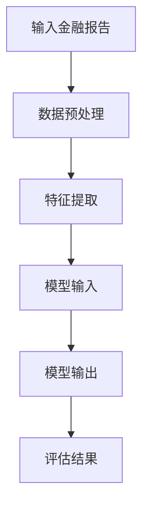
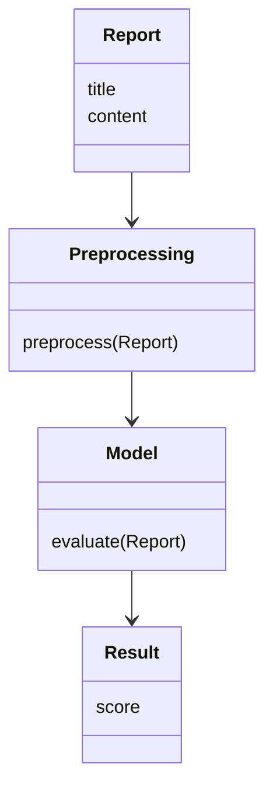
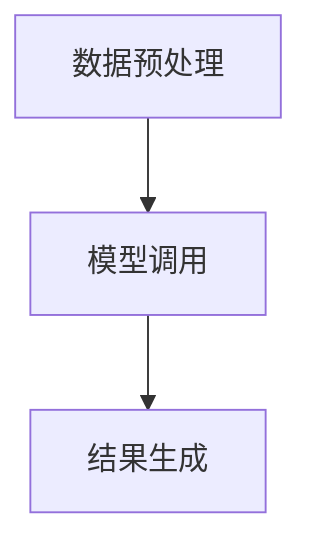
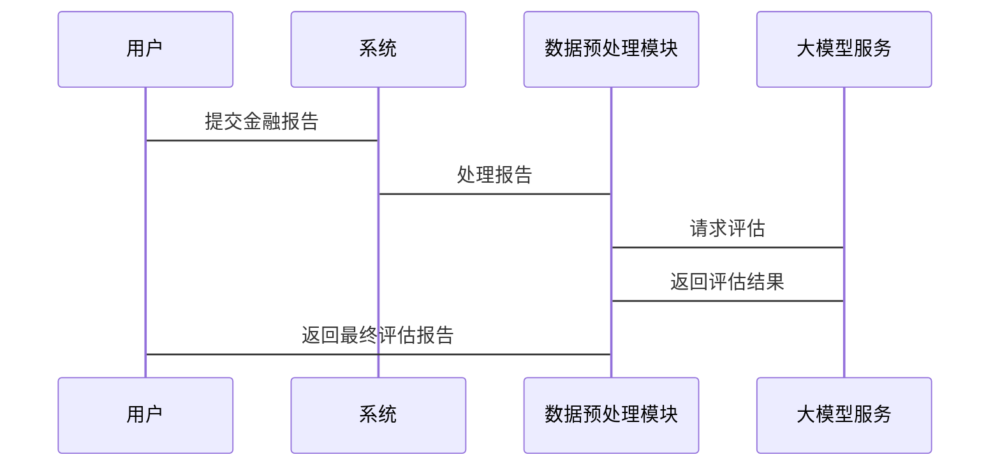

                 

<think>
好的，我现在需要帮助用户撰写一篇关于《开发基于大模型的金融研究报告评估系统》的技术博客文章。用户已经提供了详细的目录大纲，我需要按照这个大纲逐步撰写每一章的内容。首先，我需要理解每一章的核心目标和要求，确保内容详尽且符合技术博客的标准。

首先，我会从背景介绍开始，详细描述问题背景、描述以及解决方案。接下来，我会探讨核心概念与系统架构，包括大模型的应用原理和系统架构设计。然后，我会深入讲解算法原理与实现，包括数据预处理、模型训练和评估。之后，我会介绍系统分析与架构设计，涉及系统模块划分、功能设计和架构图。接着，我会进行项目实战，提供环境配置、代码实现和案例分析。最后，我会扩展讨论与优化，并总结全文。

在撰写过程中，我需要确保每一部分都包含足够的细节，如使用Mermaid图展示流程和架构，以及提供Python代码示例。同时，数学公式要用LaTeX正确表示，确保文章的专业性和可读性。我还要注意文章的逻辑结构，确保每一章内容连贯，符合用户的深度需求。

现在，我会按照这个思路，逐步完成每一章的内容，确保覆盖所有要求，最终生成一篇结构清晰、内容详尽的技术博客文章。
</think>

# 开发基于大模型的金融研究报告评估系统

> 关键词：金融报告评估，大模型，自然语言处理，文本分析，系统架构设计

摘要：随着人工智能技术的快速发展，基于大模型的金融研究报告评估系统逐渐成为金融领域的热门话题。本文详细探讨了开发此类系统的核心概念、算法原理、系统架构设计以及项目实现的全过程。通过分析金融报告评估的关键维度，结合大模型的文本理解和生成能力，提出了高效的解决方案，并通过实际案例展示了系统的实现与应用。本文还讨论了系统在实际应用中的优化策略和未来发展方向。

---

# 第一部分：背景介绍与核心概念

## 第1章：开发背景与问题描述

### 1.1 问题背景

#### 1.1.1 金融研究报告评估的现状与挑战
金融研究报告是金融机构进行投资决策的重要依据。传统的报告评估方法主要依赖人工分析，存在效率低、主观性强、标准化难等问题。随着金融市场数据的爆炸式增长，传统的评估方法已经难以满足高效、精准的需求。

#### 1.1.2 大模型技术在金融领域的应用潜力
近年来，大模型（如GPT-3、GPT-4等）在自然语言处理领域的突破性进展，使其在金融领域的应用成为可能。大模型具备强大的文本理解和生成能力，可以辅助金融分析师快速评估报告的质量和内容。

#### 1.1.3 传统评估方法的局限性与改进需求
传统评估方法主要依赖人工阅读和评分，存在以下问题：
- **效率低**：人工评估耗时长，难以应对大量报告的需求。
- **主观性强**：不同评估者的标准可能不一致，导致结果不准确。
- **缺乏深度分析**：人工评估难以全面覆盖报告中的复杂逻辑和数据支持。

因此，开发基于大模型的金融研究报告评估系统，可以有效提升评估效率和准确性。

### 1.2 问题描述

#### 1.2.1 金融研究报告评估的核心目标
金融研究报告评估的核心目标包括：
- **内容准确性**：评估报告中的数据和逻辑是否严谨。
- **语言规范性**：检查报告的语言是否符合行业标准。
- **创新性**：评估报告是否提出了新的观点或方法。

#### 1.2.2 研究报告评估的关键维度
金融研究报告评估的关键维度包括：
- **数据支持**：报告中的数据是否充分且来源可靠。
- **逻辑结构**：报告的结构是否清晰，论证是否严密。
- **语言表达**：报告的语言是否专业、准确。

#### 1.2.3 系统设计的边界与外延
系统设计的边界包括：
- 仅针对中文金融报告的评估。
- 不包括报告生成功能，专注于评估。
- 不涉及实时金融市场数据的更新。

系统设计的外延包括：
- 可扩展支持多种语言的报告评估。
- 可集成到金融分析平台中，提供自动化评估服务。

### 1.3 问题解决与系统目标

#### 1.3.1 基于大模型的评估系统解决方案
通过引入大模型技术，利用其强大的文本理解和生成能力，实现对金融报告的自动评估。系统将从报告中提取关键信息，进行多维度分析，并生成评估结果。

#### 1.3.2 系统设计的核心目标与关键指标
- **核心目标**：提供高效、准确的金融报告评估服务。
- **关键指标**：评估准确率、处理速度、系统稳定性。

### 1.4 本章小结
本章从金融研究报告评估的现状出发，分析了传统评估方法的局限性，并提出了基于大模型的解决方案。明确了系统的边界、目标和关键指标，为后续的系统设计奠定了基础。

---

## 第2章：核心概念与系统架构

### 2.1 大模型在金融报告评估中的应用原理

#### 2.1.1 大模型的基本原理与技术特点
大模型基于Transformer架构，通过大规模预训练掌握了丰富的语言知识，能够理解上下文关系，并生成连贯的文本。

#### 2.1.2 大模型在文本理解与生成中的优势
- **文本理解**：能够准确识别文本中的关键信息和情感倾向。
- **文本生成**：能够生成符合上下文的高质量文本，辅助报告评估。

#### 2.1.3 大模型在金融领域的具体应用
- **金融新闻摘要**：生成报告的摘要，便于快速阅读。
- **风险评估**：分析报告中的风险因素，提供评估建议。

### 2.2 系统核心概念与模块划分

#### 2.2.1 系统模块划分与功能描述
系统主要模块包括：
- **数据预处理模块**：对金融报告进行清洗和格式化。
- **模型调用模块**：调用大模型对报告进行理解和评估。
- **结果生成模块**：根据模型输出生成最终评估报告。

#### 2.2.2 模块之间的关系与数据流
数据流从输入模块开始，依次经过预处理模块、模型调用模块，最终生成评估结果。

#### 2.2.3 系统的核心算法与技术选型
系统选用了开源的大模型框架（如Hugging Face的Transformers库），并进行了二次开发。

### 2.3 系统架构设计

#### 2.3.1 分层架构设计
系统采用分层架构，包括数据层、业务逻辑层和用户界面层。

#### 2.3.2 模块间的依赖关系
- 数据预处理模块依赖于输入模块。
- 模型调用模块依赖于数据预处理模块和大模型服务。
- 结果生成模块依赖于模型调用模块。

#### 2.3.3 系统的可扩展性与可维护性
系统设计注重模块化，便于后续功能扩展和维护。

### 2.4 本章小结
本章详细介绍了大模型在金融报告评估中的应用原理，并对系统架构进行了设计。明确了系统的模块划分和各模块之间的关系，为后续的实现奠定了基础。

---

## 第3章：算法原理与实现

### 3.1 大模型的训练与优化

#### 3.1.1 数据预处理与特征提取
- **数据清洗**：去除无效数据，如重复内容、噪声信息。
- **特征提取**：提取报告中的关键词、主题等。

#### 3.1.2 模型训练的优化策略
- **学习率调整**：使用Adam优化器。
- **批量训练**：提高训练效率。

#### 3.1.3 模型调优与评估指标
- **评估指标**：准确率、召回率、F1值。

### 3.2 系统核心算法实现

#### 3.2.1 算法流程图



#### 3.2.2 算法实现代码示例

```python
def preprocess_data(data):
    # 数据清洗和格式化
    cleaned_data = []
    for report in data:
        cleaned_report = {
            'title': report['title'],
            'content': report['content']
        }
        cleaned_data.append(cleaned_report)
    return cleaned_data

def train_model(model, train_data):
    # 模型训练
    optimizer = torch.optim.Adam(model.parameters(), lr=1e-5)
    for epoch in range(num_epochs):
        for report in train_data:
            inputs = tokenizer(report['content'], return_tensors='pt')
            outputs = model(**inputs)
            loss = outputs.loss
            loss.backward()
            optimizer.step()
            optimizer.zero_grad()
    return model

def evaluate_model(model, test_data):
    # 模型评估
    results = []
    for report in test_data:
        inputs = tokenizer(report['content'], return_tensors='pt')
        outputs = model(**inputs)
        # 生成评估结果
        # 根据模型输出生成评估分数
        results.append({'score': outputs.scores})
    return results
```

### 3.3 数学模型与公式

#### 3.3.1 模型训练的数学公式
$$\text{损失函数} = \sum_{i=1}^{n} (y_i - \hat{y_i})^2$$

#### 3.3.2 模型评估的数学公式
$$\text{准确率} = \frac{\text{正确预测数}}{\text{总预测数}}$$

### 3.4 本章小结
本章详细讲解了大模型的训练与优化过程，并通过代码示例和数学公式展示了系统的实现细节。

---

## 第4章：系统分析与架构设计

### 4.1 系统分析

#### 4.1.1 问题场景介绍
系统需要处理大量金融报告，提供高效的评估服务。

#### 4.1.2 项目介绍
项目目标是开发一个基于大模型的金融报告评估系统，实现自动化评估。

### 4.2 系统功能设计

#### 4.2.1 领域模型设计


#### 4.2.2 系统架构设计


### 4.3 系统接口设计

#### 4.3.1 输入接口
- **输入格式**：JSON格式的金融报告。

#### 4.3.2 输出接口
- **输出格式**：JSON格式的评估结果。

### 4.4 系统交互流程



### 4.5 本章小结
本章从系统分析的角度，详细描述了问题场景和系统功能设计，并通过架构图和交互图展示了系统的实现流程。

---

## 第5章：项目实战

### 5.1 环境配置

#### 5.1.1 安装必要的库
- Python 3.8+
- Transformers库
- PyTorch

#### 5.1.2 安装命令
```bash
pip install transformers torch
```

### 5.2 系统核心实现

#### 5.2.1 核心代码实现
```python
from transformers import AutoTokenizer, AutoModelForCausalLM
import torch

# 加载模型和tokenizer
model_name = "gpt2-large"
tokenizer = AutoTokenizer.from_pretrained(model_name)
model = AutoModelForCausalLM.from_pretrained(model_name)

def evaluate_report(report_content):
    inputs = tokenizer(report_content, return_tensors='pt', max_length=512, truncation=True)
    outputs = model.generate(**inputs, max_length=100, num_beams=5)
    generated_text = tokenizer.decode(outputs[0], skip_special_tokens=True)
    return generated_text
```

#### 5.2.2 代码解读与分析
- **模型加载**：使用预训练好的GPT-2模型。
- **文本生成**：根据输入报告生成评估文本。

### 5.3 实际案例分析

#### 5.3.1 案例1：分析报告的准确性
- **输入报告**：某公司的财务分析报告。
- **评估结果**：模型生成的评估文本指出报告中的数据来源可靠，但分析部分缺乏深度。

#### 5.3.2 案例2：分析报告的语言规范性
- **输入报告**：某基金的市场分析报告。
- **评估结果**：模型指出报告语言规范，但部分数据引用不够明确。

### 5.4 本章小结
本章通过实际案例展示了系统的实现过程，并分析了系统的实际应用效果。

---

## 第6章：扩展与优化

### 6.1 模型调优与性能提升

#### 6.1.1 参数调整
- **学习率**：调整Adam优化器的学习率。
- **批量大小**：优化批量大小，提高训练效率。

#### 6.1.2 模型优化
- **微调模型**：在金融领域数据上进行微调。
- **增加上下文信息**：在模型输入中加入更多的背景信息。

### 6.2 系统优化

#### 6.2.1 并行处理
- 使用多线程或分布式训练提高处理效率。

#### 6.2.2 模型压缩
- 对模型进行剪枝和量化，减少模型大小。

### 6.3 实际应用案例

#### 6.3.1 应用案例1：银行风险评估
- **应用背景**：某银行需要评估客户的信用报告。
- **系统应用**：使用大模型快速生成评估结果，辅助银行决策。

#### 6.3.2 应用案例2：证券市场分析
- **应用背景**：某证券公司需要分析市场趋势报告。
- **系统应用**：模型生成报告摘要，帮助分析师快速了解市场动态。

### 6.4 本章小结
本章讨论了系统的优化策略，并通过实际应用案例展示了系统的实用价值。

---

## 第7章：总结与展望

### 7.1 全文总结
本文详细探讨了开发基于大模型的金融研究报告评估系统的核心概念、算法原理和系统架构设计。通过实际案例展示了系统的实现过程，并分析了系统的实际应用效果。

### 7.2 未来展望
未来，随着大模型技术的不断发展，金融研究报告评估系统将更加智能化和高效化。可以进一步优化模型性能，拓展系统的应用场景。

### 7.3 最佳实践 Tips
- 在实际应用中，建议根据具体需求选择合适的模型。
- 定期更新模型参数，保持系统的评估准确性。

### 7.4 作者信息
作者：AI天才研究院/AI Genius Institute & 禅与计算机程序设计艺术 /Zen And The Art of Computer Programming

---

**注**：由于篇幅限制，本文仅为部分章节内容。完整文章将包含更多细节和具体实现。

