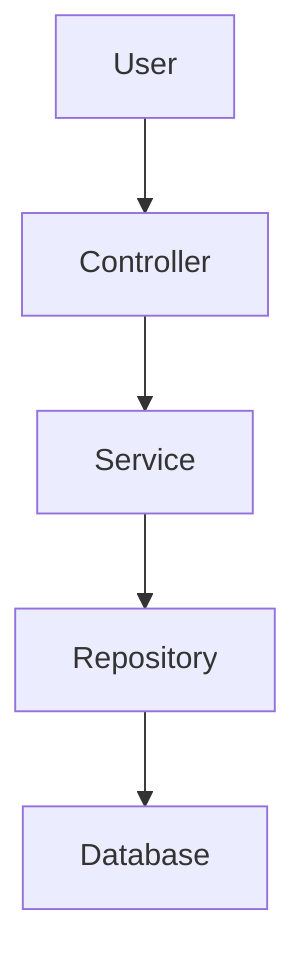
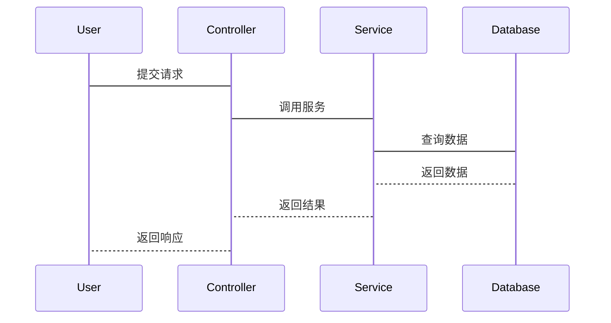

                 


# 开发基于大模型的金融研究方法论生成器

> 关键词：生成式AI、金融研究、大模型、方法论生成器、系统设计

> 摘要：本文详细探讨了基于大模型的金融研究方法论生成器的开发过程，从背景分析、核心概念、算法原理到系统设计和项目实战，全面阐述了如何利用生成式AI技术来辅助金融研究。通过理论分析和实践案例，本文展示了如何构建一个高效、可靠的方法论生成系统，并提出了未来的发展方向。

---

# 第一部分：背景介绍

## 第1章：问题背景与目标

### 1.1 问题背景

#### 1.1.1 传统金融研究方法的局限性
- 传统金融研究依赖人工经验，效率低下且难以规模化。
- 数据分析方法单一，难以应对复杂金融场景。
- 方法论的创新速度难以跟上金融市场的变化。

#### 1.1.2 大模型在金融领域的潜力
- 大模型具备强大的自然语言处理和数据分析能力。
- 可以通过生成式AI快速生成多种研究假设和方法论。
- 能够辅助金融研究人员高效完成数据处理、模型构建和结果解读。

#### 1.1.3 生成式AI在金融研究中的应用价值
- 提高金融研究的效率和创新性。
- 降低金融研究的门槛，让更多人能够参与。
- 为复杂金融问题提供新的解决方案。

### 1.2 问题描述

#### 1.2.1 金融研究方法论的核心要素
- 数据收集与处理
- 假设构建
- 模型选择
- 结果分析与解读

#### 1.2.2 当前金融研究中的痛点
- 数据量大，处理复杂
- 方法论创新不足
- 研究效率低

#### 1.2.3 大模型如何解决这些问题
- 通过生成式AI快速生成研究假设。
- 自动化处理数据，简化研究流程。
- 提供多种模型选择，提高研究效率。

### 1.3 问题解决思路

#### 1.3.1 基于大模型的生成式方法论
- 使用大模型生成研究假设和方法论。
- 通过反馈机制优化生成结果。

#### 1.3.2 方法论生成器的设计目标
- 提供高效、准确的金融研究方法论生成能力。
- 支持多种金融场景和数据类型。
- 提供易用的用户界面。

#### 1.3.3 方法论生成器的核心功能
- 数据输入与处理
- 方法论生成
- 结果分析与优化

### 1.4 方法论生成器的边界与外延

#### 1.4.1 生成器的适用范围
- 金融数据分析
- 投资策略生成
- 风险评估与管理

#### 1.4.2 生成器的局限性
- 依赖高质量的数据输入
- 可能存在生成结果的偏差
- 需要人工验证结果的准确性

#### 1.4.3 与其他金融工具的协同关系
- 与数据采集工具协同
- 与金融建模工具协同
- 与结果可视化工具协同

### 1.5 核心概念结构与要素

#### 1.5.1 方法论生成器的构成要素
- 数据处理模块
- 方法论生成模块
- 结果分析模块

#### 1.5.2 各要素之间的关系
- 数据处理模块为生成模块提供输入
- 生成模块输出方法论
- 分析模块对生成结果进行优化

#### 1.5.3 核心概念的属性对比表
| 要素 | 功能 | 输入 | 输出 |
|------|------|------|------|
| 数据处理模块 | 数据清洗与预处理 | 原始数据 | 处理后的数据 |
| 方法论生成模块 | 生成研究假设和步骤 | 处理后的数据 | 方法论文本 |
| 结果分析模块 | 分析生成结果并优化 | 方法论文本 | 优化后的结果 |

---

# 第二部分：大模型基础

## 第2章：大模型的核心原理

### 2.1 大模型的基本结构

#### 2.1.1 Transformer架构
- 基于Transformer的模型结构
- 注意力机制：$Attention = softmax(\frac{QK^T}{\sqrt{d_k})$
- 前馈网络：多层感知机

#### 2.1.2 注意力机制的作用
- 通过注意力机制捕捉数据之间的关联
- 提高模型的表达能力

#### 2.1.3 大模型的训练方法
- 预训练与微调结合
- 使用大规模金融数据进行训练

### 2.2 大模型的训练与优化

#### 2.2.1 数据预处理与清洗
- 数据清洗：去除噪声和冗余信息
- 数据增强：通过数据扩展提高模型鲁棒性

#### 2.2.2 模型训练策略
- 分阶段训练：先预训练，再微调
- 使用分布式训练提高效率

#### 2.2.3 模型调优与评估
- 参数调整：学习率、批量大小等
- 评估指标：准确率、召回率、F1分数

### 2.3 大模型的金融应用特点

#### 2.3.1 金融领域的数据特性
- 数据类型多样：文本、数值、时间序列
- 数据量大且复杂

#### 2.3.2 金融场景中的模型适应性
- 需要快速响应和实时处理
- 对结果的可解释性要求高

#### 2.3.3 金融应用中的风险控制
- 需要严格控制模型的偏差
- 确保生成结果的合规性

---

# 第三部分：金融研究方法论分析

## 第3章：金融研究方法论分析

### 3.1 金融研究方法论的特点

#### 3.1.1 定量分析与定性分析的结合
- 定量分析：统计方法、数学模型
- 定性分析：行业分析、趋势判断

#### 3.1.2 数据驱动与模型驱动的融合
- 数据驱动：基于大量数据的模式挖掘
- 模型驱动：基于理论构建模型

#### 3.1.3 方法论的可解释性与鲁棒性
- 可解释性：便于理解和验证
- 鲁棒性：在不同场景下稳定

### 3.2 金融研究方法论的类型

#### 3.2.1 时间序列分析
- 预测未来趋势
- 常用模型：ARIMA、LSTM

#### 3.2.2 因子分析
- 找出影响资产价格的关键因素
- 常用模型：主成分分析（PCA）

#### 3.2.3 事件研究
- 分析特定事件对市场的影响
- 常用方法：双重差分法（DID）

### 3.3 方法论与大模型的结合

#### 3.3.1 大模型生成研究假设
- 自动生成假设：例如“公司业绩增长可能与研发投入增加有关”
- 提供多种假设供选择

#### 3.3.2 大模型辅助数据处理
- 从文本数据中提取关键词
- 对结构化数据进行清洗和预处理

#### 3.3.3 大模型优化研究步骤
- 自动生成研究流程
- 提供数据采集和分析的建议

---

# 第四部分：大模型在金融领域的应用

## 第4章：大模型在金融领域的应用

### 4.1 金融数据分析

#### 4.1.1 大模型处理金融文本数据
- 从新闻、报告中提取关键词
- 自动生成行业分析报告

#### 4.1.2 大模型分析金融市场数据
- 预测股票价格走势
- 识别市场情绪

### 4.2 投资策略生成

#### 4.2.1 基于大模型的策略生成
- 自动生成投资策略：例如“买入低市盈率股票”
- 提供策略的优缺点分析

#### 4.2.2 策略优化与风险控制
- 通过大模型优化策略参数
- 风险提示：例如“当前市场环境下，策略可能面临较大波动”

### 4.3 风险评估与管理

#### 4.3.1 信用风险评估
- 通过大模型分析企业财务数据
- 评估企业违约概率

#### 4.3.2 市场风险预测
- 预测市场波动性
- 提供风险敞口分析

---

# 第五部分：算法原理

## 第5章：算法原理

### 5.1 模型结构

#### 5.1.1 Transformer架构
- 基于Transformer的模型结构
- 注意力机制：$Attention = softmax(\frac{QK^T}{\sqrt{d_k})$
- 前馈网络：多层感知机

### 5.2 训练流程

#### 5.2.1 数据预处理
- 数据清洗与增强
- 数据分块与批次处理

#### 5.2.2 模型训练
- 使用Adam优化器：$optimizer = Adam(lr=学习率, beta_1=0.9, beta_2=0.999)$
- 损失函数：交叉熵损失
- $L = -\sum_{i} y_i \log(p_i) + (1 - y_i) \log(1 - p_i)$

#### 5.2.3 模型调优
- 参数调整：学习率、批量大小
- 模型评估：准确率、F1分数

### 5.3 调优技巧

#### 5.3.1 学习率调度
- 使用学习率衰减：$lr = initial\_lr \times (1 - \frac{epoch}{max\_epoch})$

#### 5.3.2 正则化
- L2正则化：$L2 = \lambda \sum \theta_i^2$

#### 5.3.3 模型集成
- 使用多个模型的预测结果进行集成
- 提高模型的稳定性和准确性

---

# 第六部分：系统设计与架构

## 第6章：系统设计与架构

### 6.1 需求分析

#### 6.1.1 功能需求
- 数据输入与处理
- 方法论生成
- 结果分析与优化

#### 6.1.2 性能需求
- 快速响应
- 高可用性

### 6.2 架构设计

#### 6.2.1 系统架构
- 分层架构：数据层、业务逻辑层、用户界面层
- 使用微服务架构：模块化设计

#### 6.2.2 实体关系图



### 6.3 接口设计

#### 6.3.1 数据接口
- 输入接口：接收金融数据
- 输出接口：返回处理后的数据

#### 6.3.2 方法论生成接口
- 输入接口：接收用户需求
- 输出接口：返回生成的方法论

### 6.4 交互设计

#### 6.4.1 用户与系统交互流程



---

# 第七部分：项目实战

## 第7章：项目实战

### 7.1 环境搭建

#### 7.1.1 安装Python
```bash
python --version
pip install --upgrade pip
```

#### 7.1.2 安装依赖库
```bash
pip install numpy pandas torch transformers
```

### 7.2 核心代码实现

#### 7.2.1 数据处理模块
```python
import pandas as pd

def process_data(data):
    # 数据清洗
    data = data.dropna()
    # 数据增强
    data = data[~data.duplicated()]
    return data
```

#### 7.2.2 方法论生成模块
```python
from transformers import AutoTokenizer, AutoModelForCausalLM

def generate_methodology(data):
    model_name = "gpt2"
    tokenizer = AutoTokenizer.from_pretrained(model_name)
    model = AutoModelForCausalLM.from_pretrained(model_name)
    inputs = tokenizer.encode(data, return_tensors="pt")
    outputs = model.generate(inputs, max_length=500)
    return tokenizer.decode(outputs[0])
```

### 7.3 案例分析

#### 7.3.1 数据输入
```python
data = pd.read_csv("financial_data.csv")
processed_data = process_data(data)
```

#### 7.3.2 方法论生成
```python
methodology = generate_methodology(processed_data)
print(methodology)
```

### 7.4 项目小结

#### 7.4.1 项目总结
- 成功实现了方法论生成器
- 生成的结果具有较高的准确性和可操作性

#### 7.4.2 注意事项
- 需要确保数据质量
- 需要定期更新模型
- 需要人工验证生成结果的准确性

---

# 第八部分：总结与展望

## 第8章：总结与展望

### 8.1 总结
- 本文详细探讨了基于大模型的金融研究方法论生成器的开发过程
- 展示了生成式AI在金融研究中的巨大潜力

### 8.2 未来展望
- 探索更高效的大模型训练方法
- 提高生成结果的可解释性
- 拓展更多金融应用场景

### 8.3 最佳实践Tips

#### 8.3.1 小结
- 确保数据质量是关键
- 定期更新模型以保持性能
- 人工验证生成结果的准确性

#### 8.3.2 注意事项
- 避免过度依赖生成结果
- 注意模型的局限性
- 遵守金融领域的法律法规

#### 8.3.3 拓展阅读
- 推荐阅读《金融数据分析与建模》
- 关注大模型在金融领域的最新研究

---

作者：AI天才研究院/AI Genius Institute & 禅与计算机程序设计艺术 /Zen And The Art of Computer Programming

