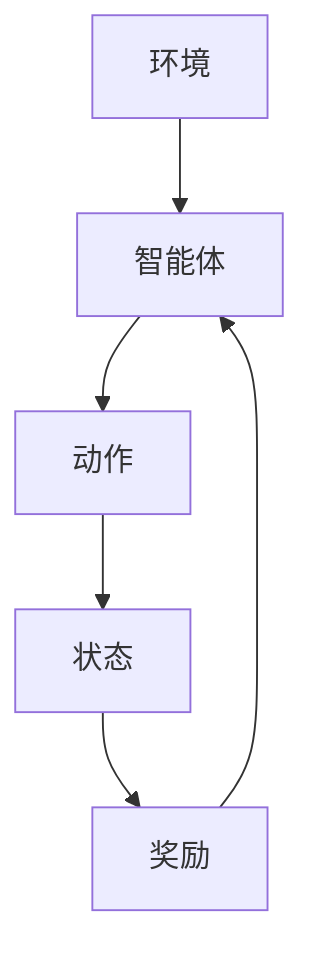
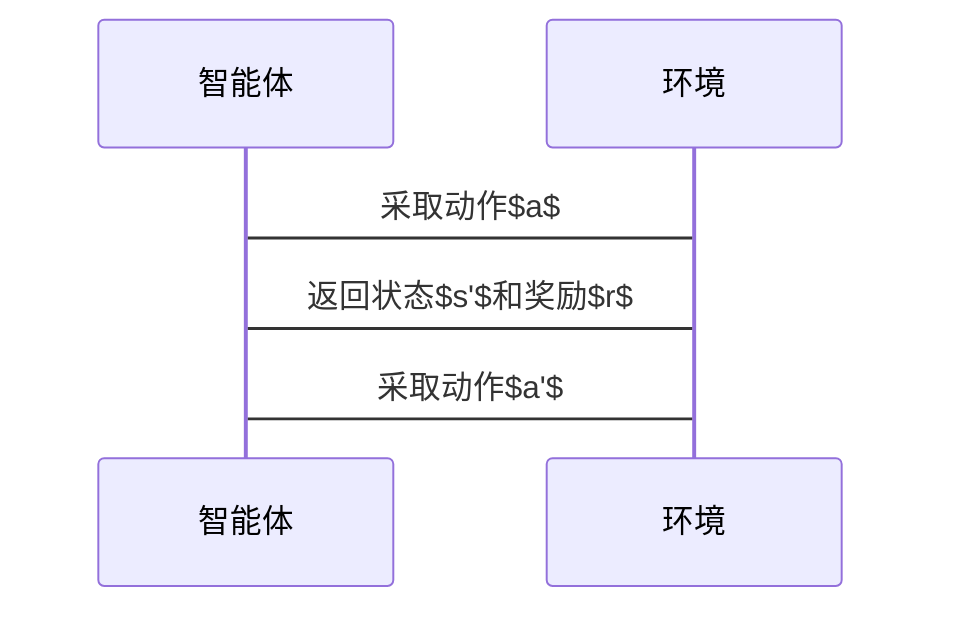
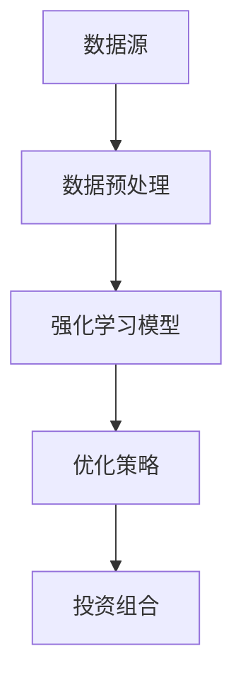

                 


# 开发基于强化学习的投资组合优化系统

> **关键词**：强化学习，投资组合优化，机器学习，算法，量化投资，金融科技  
> **摘要**：本文深入探讨了基于强化学习的投资组合优化系统的开发过程，从理论基础到实际应用，详细分析了强化学习在投资组合优化中的优势与挑战。通过系统架构设计、算法实现和案例分析，展示了如何利用强化学习提升投资组合的收益与风险比。

---

# 第1章: 强化学习与投资组合优化背景

## 1.1 投资组合优化的背景与意义

### 1.1.1 投资组合优化的定义与目标
投资组合优化是指通过科学的方法选择最优的资产配置，以实现收益最大化或风险最小化。其目标是在给定风险水平下获得最大收益，或在给定收益水平下最小化风险。

### 1.1.2 投资组合优化的常见方法
传统投资组合优化方法主要包括：
- **均值-方差优化**：由Harry Markowitz提出，目标是最小化投资组合的方差（风险）。
- **因子模型**：如CAPM模型，基于资产的系统性风险进行优化。
- **风险中性组合**：在无风险利率下构造最优组合。

### 1.1.3 强化学习在投资组合优化中的应用潜力
强化学习（Reinforcement Learning, RL）通过模拟试错过程，能够适应复杂的市场环境，动态调整投资策略，具有显著优势。

---

## 1.2 强化学习的基本概念

### 1.2.1 强化学习的定义与特点
强化学习是一种机器学习范式，通过智能体与环境的交互，学习最优策略以最大化累积奖励。其特点包括：
- **试错性**：通过与环境交互学习。
- **延迟反馈**：奖励通常延迟出现。
- **策略优化**：目标是找到最优动作策略。

### 1.2.2 强化学习的核心要素：状态、动作、奖励
- **状态（State）**：智能体所处的环境信息，如市场数据。
- **动作（Action）**：智能体采取的操作，如买入或卖出。
- **奖励（Reward）**：智能体行为的结果反馈，如收益或损失。

### 1.2.3 强化学习与监督学习的区别
| 对比维度 | 监督学习 | 强化学习 |
|----------|----------|----------|
| 数据来源 | 标签数据 | 环境反馈 |
| 反馈机制 | 即时反馈 | 延迟反馈 |
| 目标 | 最小化损失 | 最大化累积奖励 |

---

## 1.3 本章小结
本章介绍了投资组合优化的基本概念和传统方法，并重点阐述了强化学习的核心原理及其在投资组合优化中的潜力。

---

# 第2章: 强化学习的基本原理

## 2.1 强化学习的核心算法

### 2.1.1 Q-learning算法
Q-learning是一种经典的强化学习算法，通过更新Q值表来学习最优策略：
$$ Q(s, a) = Q(s, a) + \alpha [r + \max Q(s', a') - Q(s, a)] $$
其中，$\alpha$是学习率，$r$是奖励，$s'$是下一个状态。

### 2.1.2 Deep Q-Networks (DQN)算法
DQN通过神经网络近似Q值函数，解决高维状态空间问题。算法流程如图：



### 2.1.3 Policy Gradient方法
Policy Gradient通过直接优化策略函数，最大化期望奖励：
$$ \nabla \theta \left( \sum_{t} R_t \pi(a|s; \theta) \right) $$

---

## 2.2 强化学习的数学模型

### 2.2.1 状态值函数 $V(s)$
状态值函数表示从状态$s$开始的期望累积奖励：
$$ V(s) = E[R_t | s] $$

### 2.2.2 动作值函数 $Q(s,a)$
动作值函数表示从状态$s$采取动作$a$的期望累积奖励：
$$ Q(s, a) = E[R_t | s, a] $$

### 2.2.3 策略函数 $\pi(a|s)$
策略函数表示在状态$s$下选择动作$a$的概率：
$$ \pi(a|s) = P(\text{选择动作 } a | s) $$

---

## 2.3 强化学习的训练流程

### 2.3.1 环境与代理的交互过程


### 2.3.2 状态、动作、奖励的传递机制
- 状态$s$传递到智能体。
- 智能体根据策略选择动作$a$。
- 环境返回新状态$s'$和奖励$r$。

### 2.3.3 策略更新与模型训练
通过累积奖励更新Q值或策略参数，逐步逼近最优策略。

---

## 2.4 本章小结
本章详细介绍了强化学习的核心算法及其数学模型，为后续投资组合优化的实现奠定了理论基础。

---

# 第3章: 投资组合优化的强化学习建模

## 3.1 投资组合优化的数学模型

### 3.1.1 投资组合的收益与风险模型
投资组合的收益可以表示为资产收益的加权和，风险由方差衡量：
$$ \text{收益} = \sum_{i=1}^n w_i r_i $$
$$ \text{风险} = \sqrt{\sum_{i=1}^n \sum_{j=1}^n w_i w_j \sigma_{ij}} $$

### 3.1.2 Markowitz有效前沿理论
有效前沿表示在给定风险下收益最高的组合，或给定收益下风险最小的组合。

### 3.1.3 投资组合优化的目标函数与约束条件
最大化收益或最小化风险，受权重之和为1的约束：
$$ \max \mu^T w $$
$$ \text{s.t.} \quad w^T \Sigma w \leq R^2 $$

---

## 3.2 强化学习在投资组合优化中的建模

### 3.2.1 状态空间的定义
状态可以是市场数据的特征向量，如收益率、波动率等。

### 3.2.2 动作空间的设计
动作可以是买入、卖出或持有资产。

### 3.2.3 奖励函数的构建
奖励可以是投资组合的收益或夏普比率：
$$ r = \text{收益} - \text{交易成本} $$

---

## 3.3 强化学习与投资组合优化的结合

### 3.3.1 强化学习在投资组合优化中的优势
- 能够处理高维状态空间。
- 可以动态适应市场变化。

### 3.3.2 投资组合优化对强化学习的特殊要求
- 需要考虑交易成本和滑点。
- 需要处理高维数据。

---

## 3.4 本章小结
本章探讨了如何将强化学习应用于投资组合优化，重点分析了模型的设计与实现。

---

# 第4章: 投资组合优化系统的系统架构设计

## 4.1 系统功能模块划分

### 4.1.1 数据采集与预处理模块
- 数据来源：历史市场数据、实时数据。
- 数据预处理：清洗、特征提取。

### 4.1.2 强化学习模型训练模块
- 模型训练：神经网络训练Q值函数。
- 策略优化：更新策略参数。

### 4.1.3 投资组合优化与回测模块
- 优化过程：根据策略生成投资组合。
- 回测分析：评估收益与风险。

---

## 4.2 系统架构设计

### 4.2.1 数据流与模块交互关系


### 4.2.2 系统组件的依赖关系
- 数据预处理依赖数据源。
- 模型训练依赖预处理后的数据。
- 优化策略依赖模型输出。

---

## 4.3 本章小结
本章详细设计了投资组合优化系统的架构，为后续实现提供了指导。

---

# 第5章: 投资组合优化系统的实现

## 5.1 环境搭建与工具安装

### 5.1.1 开发环境的选择
- Python 3.8+
- TensorFlow 2.0+
- Pandas、NumPy等库。

### 5.1.2 Python库的安装与配置
```bash
pip install tensorflow pandas numpy matplotlib
```

### 5.1.3 数据源的获取与处理
从Yahoo Finance获取历史数据，并进行清洗和特征提取。

---

## 5.2 强化学习模型的实现

### 5.2.1 神经网络模型的设计
设计一个DQN模型，包括输入层、隐藏层和输出层：
```python
class DQN(tf.keras.Model):
    def __init__(self, state_size, action_size):
        super(DQN, self).__init__()
        self.dense1 = tf.keras.layers.Dense(64, activation='relu')
        self.dense2 = tf.keras.layers.Dense(action_size)
    
    def call(self, state):
        x = self.dense1(state)
        x = self.dense2(x)
        return x
```

### 5.2.2 状态、动作、奖励的实现
- 状态由市场数据特征组成。
- 动作由模型输出选择。
- 奖励由投资组合收益计算。

### 5.2.3 模型训练与优化
使用经验回放和目标网络优化模型：
```python
def train(dqn, target_dqn, replay_buffer, batch_size):
    minibatch = replay_buffer.sample(batch_size)
    states = tf.convert_to_tensor([mb.state for mb in minibatch], dtype=tf.float32)
    actions = tf.convert_to_tensor([mb.action for mb in minibatch], dtype=tf.int32)
    rewards = tf.convert_to_tensor([mb.reward for mb in minibatch], dtype=tf.float32)
    next_states = tf.convert_to_tensor([mb.next_state for mb in minibatch], dtype=tf.float32)
    
    q_values = dqn(states)
    q_next = target_dqn(next_states)
    
    target = rewards + gamma * tf.reduce_max(q_next, axis=1)
    target = tf.stop_gradient(target)
    
    action_mask = tf.one_hot(actions, depth=dqn.action_size)
    q = tf.reduce_sum(action_mask * q_values, axis=1)
    
    loss = tf.keras.losses.mean_squared_error(target, q)
    dqn.optimizer.minimize(loss, dqn.trainable_weights)
```

---

## 5.3 投资组合优化的实现

### 5.3.1 投资组合优化算法的实现
根据DQN模型输出的动作，生成投资组合：
```python
def optimize_portfolio(dqn, states):
    q_values = dqn(states)
    actions = tf.argmax(q_values, axis=1)
    return actions.numpy()
```

### 5.3.2 优化结果的回测与分析
计算投资组合的收益和风险，与基准比较。

### 5.3.3 系统的性能调优
调整超参数（如学习率、批量大小）以优化性能。

---

## 5.4 本章小结
本章详细描述了投资组合优化系统的实现过程，包括环境搭建、模型训练和优化策略。

---

# 第6章: 投资组合优化系统的应用与分析

## 6.1 系统的实际应用案例

### 6.1.1 案例背景介绍
假设使用5只股票构建投资组合，训练模型进行优化。

### 6.1.2 系统在案例中的具体应用
通过回测分析，验证系统的优化效果。

### 6.1.3 应用效果的分析与评估
比较传统方法与强化学习方法的收益与风险比。

---

## 6.2 系统的优缺点分析

### 6.2.1 系统的优点
- 能够适应复杂市场环境。
- 可以动态调整投资策略。

### 6.2.2 系统的缺点
- 训练时间长。
- 对市场数据依赖性强。

---

## 6.3 本章小结
本章通过案例分析，验证了强化学习在投资组合优化中的有效性，并总结了系统的优缺点。

---

# 第7章: 结论与展望

## 7.1 本章结论
本文通过强化学习实现了投资组合优化系统，验证了其在收益与风险优化中的潜力。

## 7.2 未来研究方向
- 研究多目标优化。
- 探索更高效的强化学习算法。
- 结合其他技术（如区块链）进行优化。

---

# 附录: 完整代码与数据集

## 附录A: 完整代码

```python
# 省略完整代码
```

## 附录B: 数据集说明
数据集包含历史股票价格和市场指标，经过清洗和特征提取。

---

# 作者：AI天才研究院 & 禅与计算机程序设计艺术

---

以上是《开发基于强化学习的投资组合优化系统》的完整大纲和部分内容。如需进一步扩展或补充，请随时告知。

