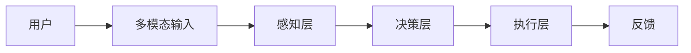
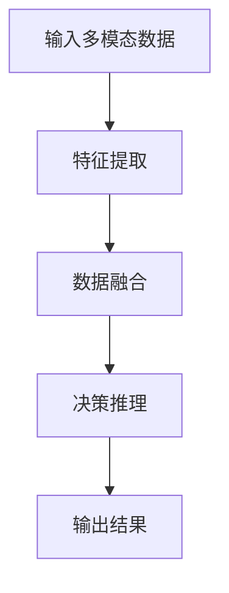
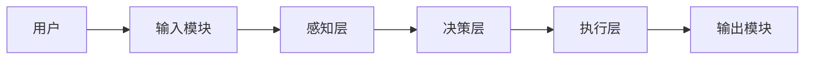
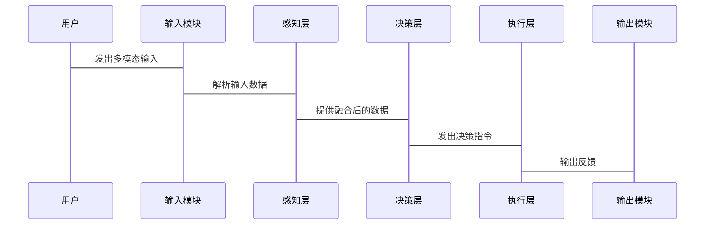

                 


# 开发多模态交互的AI Agent系统

## 关键词
- 多模态交互
- AI Agent
- 人机交互
- 数据融合
- 机器学习

## 摘要
多模态交互的AI Agent系统是一种能够同时处理多种输入形式（如文本、语音、图像等）并提供智能反馈的先进人机交互系统。本文将从基本概念、核心算法、系统架构到实际项目开发，全面解析多模态交互AI Agent的开发过程。通过详细讲解多模态数据融合、交互机制、算法实现以及系统设计，帮助读者掌握构建高效多模态AI Agent系统的关键技术。

---

## 第一部分: 多模态交互AI Agent系统概述

### 第1章: 多模态交互AI Agent的基本概念

#### 1.1 多模态交互的定义与特点
多模态交互是指通过多种感官渠道（如视觉、听觉、触觉等）与系统进行交流的过程。与单一模态交互相比，多模态交互能够更自然地模拟人类的交流方式，提升用户体验。其主要特点包括：
- **多样性**：支持文本、语音、图像等多种输入形式。
- **鲁棒性**：能够处理单一模态的不足或不确定性。
- **智能性**：通过融合多模态信息，提升系统理解和决策能力。

#### 1.2 AI Agent的基本原理
AI Agent是一种智能体，能够感知环境、自主决策并执行任务。其核心功能模块包括：
- **感知层**：接收输入数据并进行初步处理。
- **决策层**：基于感知信息进行分析和推理。
- **执行层**：根据决策结果执行操作。

#### 1.3 多模态交互AI Agent的背景与发展趋势
随着人工智能和传感器技术的进步，多模态交互AI Agent的应用场景不断扩大，如智能音箱、虚拟助手、自动驾驶等领域。其发展趋势包括：
- **技术融合**：深度学习与多模态数据处理的结合。
- **用户体验优化**：通过更自然的交互方式提升用户满意度。
- **跨领域应用**：从单一场景扩展到多领域综合应用。

---

### 第2章: 多模态交互的核心概念与联系

#### 2.1 多模态数据融合的原理
多模态数据融合是将来自不同感官的数据（如文本、语音、图像）整合到一个统一的表示中，以提高系统的理解和决策能力。常见的融合方法包括：
- **早期融合**：在输入数据的特征级别进行融合。
- **晚期融合**：在高层语义级别进行融合。

#### 2.2 多模态交互的实体关系图


#### 2.3 多模态交互的算法流程


---

### 第3章: 多模态交互AI Agent的算法原理

#### 3.1 多模态数据融合算法
- **基于深度学习的多模态融合**：利用卷积神经网络（CNN）处理图像，循环神经网络（RNN）处理文本。
- **多模态注意力机制**：通过自注意力机制（如Transformer）对不同模态的信息进行加权融合。
- **多模态对比学习**：通过对比不同模态的特征，提升跨模态理解能力。

#### 3.2 多模态交互的算法实现
- **数学模型**：融合模型的数学公式
  $$ y = f(x_1, x_2, ..., x_n) $$
  其中，$x_i$ 表示不同模态的输入，$f$ 是融合函数。
- **基于Transformer的多模态交互**：通过交叉注意力机制实现跨模态信息交互。

---

## 第二部分: 多模态交互AI Agent系统的实现

### 第4章: 系统架构设计

#### 4.1 系统功能设计
- **感知层**：接收并解析多模态输入。
- **决策层**：基于融合后的数据进行推理和决策。
- **执行层**：根据决策结果输出反馈或执行操作。

#### 4.2 系统架构图


#### 4.3 系统接口设计
- **输入接口**：支持文本、语音、图像等多种输入形式。
- **输出接口**：提供文本、语音、图像等多种输出形式。

#### 4.4 系统交互流程


---

### 第5章: 项目实战

#### 5.1 环境配置
- **Python版本**：3.8及以上
- **依赖库**：TensorFlow、Keras、OpenCV、SpeechRecognition

#### 5.2 核心代码实现
```python
import tensorflow as tf
from tensorflow.keras.layers import Input, Dense, Concatenate
from tensorflow.keras.models import Model

# 定义多模态输入
input_text = Input(shape=(max_length,))
input_audio = Input(shape=(n_features,))

# 特征提取
x_text = Dense(64, activation='relu')(input_text)
x_audio = Dense(64, activation='relu')(input_audio)

# 数据融合
x = Concatenate()([x_text, x_audio])
x = Dense(128, activation='relu')(x)

# 最终输出
output = Dense(1, activation='sigmoid')(x)

# 构建模型
model = Model(inputs=[input_text, input_audio], outputs=output)
model.compile(optimizer='adam', loss='binary_crossentropy', metrics=['accuracy'])
```

#### 5.3 案例分析与实际应用
- **案例分析**：设计一个多模态情感识别系统，结合文本和语音信息，识别用户情绪。
- **实际应用**：在智能音箱中实现多模态交互，支持语音和手势控制。

---

## 第三部分: 总结与展望

### 第6章: 总结与最佳实践

#### 6.1 总结
多模态交互的AI Agent系统通过融合多种感官数据，显著提升了人机交互的自然性和智能性。其核心在于数据融合、交互机制和系统架构的设计。

#### 6.2 最佳实践
- **数据预处理**：确保多模态数据的准确性和一致性。
- **模型优化**：通过交叉验证和超参数调优提升性能。
- **用户体验优化**：设计直观的交互界面，降低用户使用门槛。

#### 6.3 注意事项
- 多模态数据的异构性可能导致融合难度增加。
- 需要注意模型的实时性和响应速度。

#### 6.4 拓展阅读
- 《Attention Is All You Need》
- 《Deep Learning for Visual Recognition》
- 《Multi-modal Machine Learning》

---

## 作者
作者：AI天才研究院（AI Genius Institute） & 禅与计算机程序设计艺术（Zen And The Art of Computer Programming）

