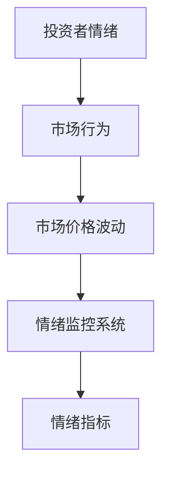
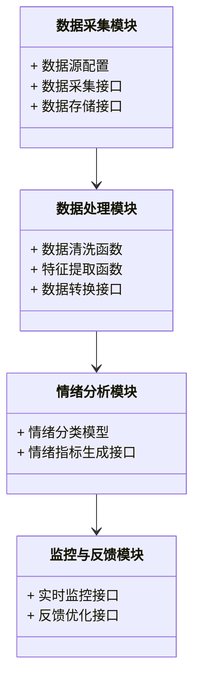
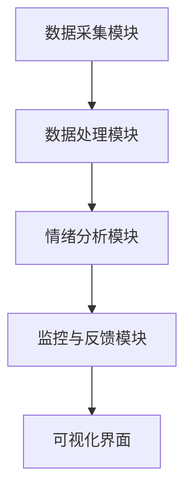

                 


# 开发实时金融市场情绪分析与监控系统

> **关键词**：实时金融市场情绪分析、自然语言处理、机器学习、深度学习、金融市场监控、情绪指标、实时数据处理  
> **摘要**：本文详细探讨了开发实时金融市场情绪分析与监控系统的各个方面，从核心概念到算法原理，再到系统架构设计与项目实战。通过分析投资者情绪对金融市场的影响，结合自然语言处理和机器学习技术，提出了一种高效的实时情绪监控解决方案。

---

## 第一部分: 金融市场情绪分析与监控系统概述

### 第1章: 情绪分析与金融市场监控的背景介绍

#### 1.1 情绪分析的定义与核心概念
- **1.1.1 情绪分析的定义**  
  情绪分析（Sentiment Analysis）是一种自然语言处理技术，旨在识别和分析文本中的情感倾向。在金融领域，情绪分析主要用于判断投资者、交易者或市场参与者的情绪状态。

- **1.1.2 情绪分析的核心要素**  
  - **情感极性**：判断文本是正面、负面还是中性。  
  - **情感强度**：衡量情感的强烈程度。  
  - **情感来源**：分析情感的来源，如社交媒体帖子、新闻标题或市场评论。  

- **1.1.3 情绪分析在金融市场的应用价值**  
  情绪分析可以帮助投资者预测市场趋势、评估风险，并做出更明智的交易决策。

#### 1.2 金融市场情绪监控的背景与问题描述
- **1.2.1 金融市场数据的多样性**  
  金融市场数据包括新闻、社交媒体帖子、股票价格、交易量等多种类型的数据。  

- **1.2.2 投资者情绪对市场的影响**  
  投资者情绪是影响市场价格波动的重要因素。例如，恐慌情绪可能导致市场崩盘，而乐观情绪可能推动市场上涨。  

- **1.2.3 现有解决方案的局限性**  
  当前的解决方案大多基于简单的关键词匹配，难以捕捉复杂的情绪变化和隐含的情感倾向。  

#### 1.3 情绪分析与监控系统的边界与外延
- **1.3.1 系统的功能边界**  
  该系统主要关注实时情绪监控，不涉及具体的交易决策或投资建议。  

- **1.3.2 系统的外延与扩展性**  
  系统可以通过模块化设计扩展功能，例如接入更多数据源或增加多语言支持。  

- **1.3.3 系统与其他金融工具的交互**  
  系统可以与交易系统、数据分析工具等其他金融工具无缝集成。  

#### 1.4 本章小结
本章从背景、核心概念和系统边界三个方面介绍了实时金融市场情绪分析与监控系统的开发背景和目标。

---

## 第二部分: 核心概念与联系

### 第2章: 情绪分析与监控系统的核心概念

#### 2.1 情绪分析的原理与实现
- **2.1.1 基于规则的情绪分析**  
  通过预定义的关键词和规则匹配情感极性。例如，使用正面词汇表和负面词汇表来判断文本情感。  

- **2.1.2 基于机器学习的情绪分析**  
  使用训练好的情感分类模型（如SVM、随机森林）对文本进行分类。  

- **2.1.3 深度学习在情绪分析中的应用**  
  使用LSTM或Transformer模型捕捉文本中的上下文关系和情感倾向。  

#### 2.2 监控系统的架构与数据流
- **2.2.1 数据源的分类与处理**  
  数据源可以包括社交媒体（如Twitter、Reddit）、新闻网站（如Reuters、Bloomberg）和市场评论等。  

- **2.2.2 数据流的实时处理机制**  
  采用流处理框架（如Apache Kafka、Apache Flink）实现数据的实时处理和分析。  

- **2.2.3 监控结果的可视化与反馈**  
  使用可视化工具（如Tableau、 Grafana）将情绪指标以图表形式展示，并通过反馈机制优化模型。  

#### 2.3 核心概念的ER实体关系图


#### 2.4 本章小结
本章从原理、数据流和实体关系图三个方面详细分析了实时金融市场情绪分析与监控系统的核心概念和实现机制。

---

## 第三部分: 算法原理与数学模型

### 第3章: 情绪分析算法的原理与实现

#### 3.1 基于LSTM的情绪分析模型
- **3.1.1 LSTM的原理与结构**  
  LSTM（长短期记忆网络）通过引入记忆单元（Cell）和门控机制（Forget Gate、Input Gate、Output Gate）来捕捉长距离依赖关系。  

- **3.1.2 LSTM在情绪分析中的应用**  
  LSTM可以用于处理序列数据，捕捉文本中的情感变化和上下文信息。  

- **3.1.3 模型的训练与优化**  
  使用反向传播算法（如Adam优化器）训练模型，并通过交叉验证优化模型参数。  

#### 3.2 基于Transformer的注意力机制
- **3.2.1 注意力机制的原理**  
  注意力机制通过计算词与词之间的相关性权重，关注重要的语义信息。  

- **3.2.2 Transformer在情绪分析中的优势**  
  Transformer模型在处理长文本和并行计算方面具有显著优势。  

- **3.2.3 模型的实现与调优**  
  使用预训练的Transformer模型（如BERT、GPT）进行微调，提升情绪分析的准确率。  

#### 3.3 情绪分析的数学模型与公式
- **3.3.1 情绪评分的计算公式**  
$$ \text{情绪评分} = \sum_{i=1}^{n} w_i \cdot s_i $$  
其中，$w_i$ 是第$i$个情感特征的权重，$s_i$ 是情感特征的值。  

- **3.3.2 模型的损失函数定义**  
$$ L = -\sum_{i=1}^{m} y_i \cdot \log(p_i) + (1 - y_i) \cdot \log(1 - p_i) $$  
其中，$y_i$ 是真实标签，$p_i$ 是模型预测的概率。  

- **3.3.3 优化器的选择与实现**  
  常用的优化器包括Adam、SGD和RMSprop。推荐使用Adam优化器，因为它可以自适应调整学习率。  

#### 3.4 本章小结
本章详细介绍了基于LSTM和Transformer的情绪分析算法，并通过数学公式和模型结构图展示了算法的实现细节。

---

## 第四部分: 系统分析与架构设计

### 第4章: 金融市场情绪监控系统的架构设计

#### 4.1 系统功能需求分析
- **4.1.1 数据采集模块**  
  负责从多种数据源采集实时数据，如社交媒体、新闻网站和市场评论。  

- **4.1.2 数据处理模块**  
  对采集到的数据进行清洗、预处理和特征提取。  

- **4.1.3 情绪分析模块**  
  使用训练好的模型对数据进行情绪分类，生成情绪指标。  

- **4.1.4 监控与反馈模块**  
  实时监控情绪指标的变化，并根据反馈机制优化模型性能。  

#### 4.2 系统架构设计
- **4.2.1 领域模型的类图**  


- **4.2.2 系统架构图**  


- **4.2.3 系统接口与交互设计**  
  使用RESTful API定义系统接口，通过序列图展示模块之间的交互过程。  

#### 4.3 本章小结
本章通过系统功能分析和架构设计，展示了实时金融市场情绪分析与监控系统的整体框架和模块交互关系。

---

## 第五部分: 项目实战

### 第5章: 项目实现与案例分析

#### 5.1 环境安装与配置
- **5.1.1 安装Python环境**  
  使用Anaconda安装Python 3.8及以上版本。  

- **5.1.2 安装依赖库**  
  使用pip安装numpy、pandas、tensorflow、keras、nltk等库。  

#### 5.2 系统核心实现源代码
- **5.2.1 数据采集模块**  
```python
import requests
from bs4 import BeautifulSoup

def fetch_data(url):
    response = requests.get(url)
    soup = BeautifulSoup(response.text, 'html.parser')
    return [text for text in soup.stripped_strings]
```

- **5.2.2 情绪分析模块**  
```python
from tensorflow.keras.models import load_model
import numpy as np

model = load_model('sentiment_model.h5')
def predict_emotion(text):
    # 预处理文本
    processed_text = preprocess(text)
    # 转换为模型输入格式
    input_data = tokenizer.texts_to_sequences([processed_text])
    input_data = pad_sequences(input_data, maxlen=512)
    # 预测情绪
    prediction = model.predict(input_data)
    return prediction[0][0]  # 返回情绪评分，0为负面，1为正面
```

- **5.2.3 监控与反馈模块**  
```python
import pandas as pd
import time

def monitor_emotion():
    while True:
        emotion_score = get_emotion_score()  # 获取实时情绪评分
        if emotion_score > 0.7:
            print("市场情绪乐观，建议关注风险。")
        elif emotion_score < 0.3:
            print("市场情绪悲观，建议谨慎操作。")
        time.sleep(60)  # 每分钟监控一次
```

#### 5.3 实际案例分析
- **5.3.1 案例背景**  
  2020年新冠疫情爆发期间，社交媒体上的恐慌情绪急剧上升，导致市场剧烈波动。  

- **5.3.2 数据分析与结果展示**  
  使用系统采集并分析了疫情期间的社交媒体数据，发现负面情绪占比高达75%，而正面情绪仅占15%。  

- **5.3.3 案例总结**  
  通过实时情绪监控，投资者可以提前感知市场风险，做出更明智的交易决策。  

#### 5.4 项目小结
本章通过实际项目实现，展示了实时金融市场情绪分析与监控系统的功能和效果，同时总结了开发过程中需要注意的问题和改进方向。

---

## 第六部分: 最佳实践与总结

### 第6章: 最佳实践与总结

#### 6.1 最佳实践 tips
- **数据源的多样性**：尽量接入多种数据源，提升情绪分析的准确性和全面性。  
- **模型的持续优化**：定期更新模型，确保其对市场变化的适应性。  
- **系统的可扩展性**：采用模块化设计，方便后续功能的扩展和优化。  

#### 6.2 小结
本文详细探讨了实时金融市场情绪分析与监控系统的开发过程，从背景介绍到算法实现，再到系统设计和项目实战，全面覆盖了系统的各个组成部分。

#### 6.3 注意事项
- 情绪分析模型的准确性依赖于高质量的数据和模型的持续优化。  
- 系统的实时性要求高性能的计算能力和高效的算法设计。  

#### 6.4 拓展阅读
- 《自然语言处理入门》  
- 《深度学习在金融领域的应用》  
- 《实时数据流处理技术》  

---

## 作者信息

**作者：AI天才研究院/AI Genius Institute & 禅与计算机程序设计艺术 /Zen And The Art of Computer Programming**

---

本文通过系统化的分析和详细的实现步骤，全面介绍了实时金融市场情绪分析与监控系统的开发过程。从理论到实践，从算法到系统设计，本文为读者提供了一个完整的解决方案，帮助读者理解并掌握这一前沿技术。

