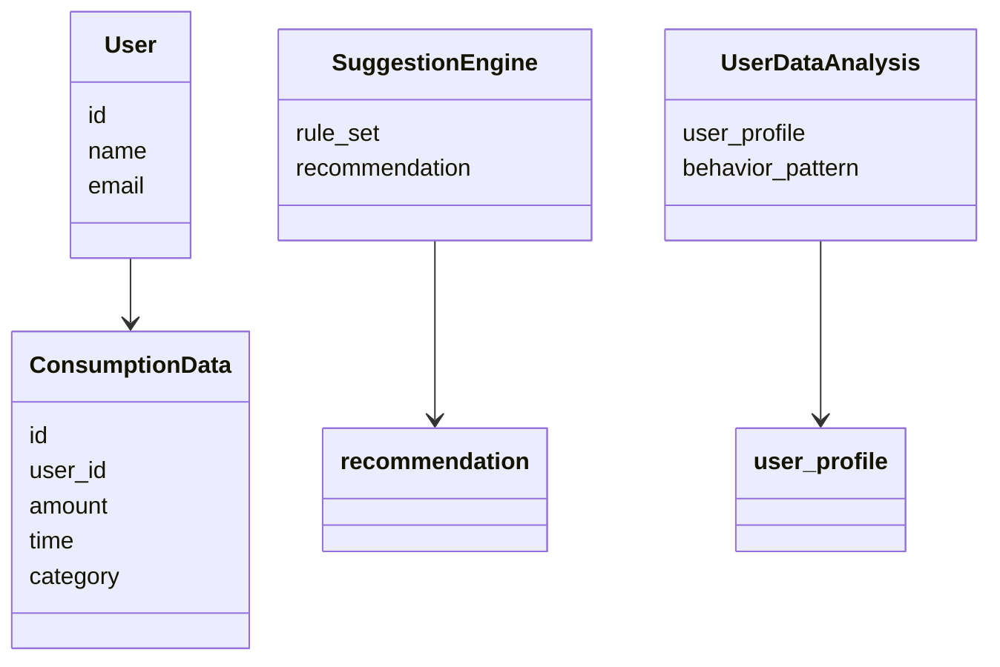
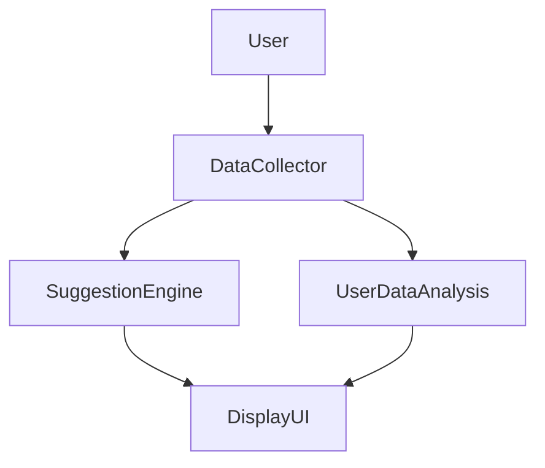

                 


# 开发智能化的个人消费习惯改善建议工具

> 关键词：个人消费习惯，智能化工具，算法推荐，系统架构，项目实战

> 摘要：本文详细探讨了开发智能化的个人消费习惯改善建议工具的全过程，从问题背景、核心概念、算法原理到系统架构设计、项目实战，再到最佳实践，为读者提供了一套完整的解决方案。通过本文的阐述，读者可以深入了解如何利用技术手段帮助个人优化消费习惯，实现财务健康。

---

# 第1章: 个人消费习惯改善的背景与问题分析

## 1.1 当前个人消费习惯的主要问题

- **问题背景**：随着经济的发展和互联网的普及，个人消费行为日益复杂化。过度消费、冲动消费等问题导致许多人在财务上出现压力，甚至陷入债务危机。
- **消费习惯对个人财务健康的影响**：不良的消费习惯可能导致储蓄不足、债务累积，甚至影响个人信用评分。
- **智能化工具在消费习惯改善中的作用**：通过数据采集、分析和算法推荐，智能化工具能够为用户提供个性化的消费建议，帮助其优化消费结构，实现财务健康。

## 1.2 智能化工具的目标与边界

- **核心目标**：
  - 帮助用户识别不良消费习惯。
  - 提供个性化的消费优化建议。
  - 帮助用户建立科学的消费预算和储蓄计划。
- **边界与外延**：
  - 不涉及具体的消费支付功能。
  - 不处理用户的财务数据，仅提供建议。
  - 适用于个人用户，暂不支持企业或机构用户。

## 1.3 智能化工具的技术实现路径

- 数据采集：通过API接口或用户手动输入，获取用户的消费记录、收入情况等数据。
- 数据分析：利用机器学习算法，分析用户的消费行为，识别潜在问题。
- 智能建议生成：基于分析结果，生成个性化的消费优化建议。

---

# 第2章: 核心概念与系统架构

## 2.1 核心概念解析

- **智能化建议生成引擎**：
  - 基于用户数据，生成消费建议的核心模块。
  - 包括数据处理、算法推荐、结果输出等功能。
- **用户行为分析模块**：
  - 负责采集和分析用户的消费行为数据。
  - 提供用户行为画像，帮助系统更好地理解用户需求。
- **个性化知识库**：
  - 包含消费建议的规则库和知识库。
  - 存储消费习惯优化的最佳实践和专家建议。

## 2.2 核心概念之间的关系

### 概念属性对比表

| 概念               | 输入数据       | 输出数据       | 功能描述                         |
|--------------------|----------------|----------------|----------------------------------|
| 智能化建议生成引擎 | 用户消费数据   | 优化建议       | 基于数据分析生成个性化建议       |
| 用户行为分析模块  | 用户行为数据   | 用户画像       | 分析用户的消费习惯和行为模式       |
| 个性化知识库      | 专家建议数据   | 消费规则       | 提供优化消费习惯的知识支持         |

### 实体关系图（Mermaid）

```mermaid
erDiagram
    user {
        id
        name
        email
    }
    consumption_data {
        id
        user_id
        amount
        time
        category
    }
    suggestion_engine {
        id
        rule_set
        recommendation
    }
    user_data_analysis {
        id
        user_profile
        behavior_pattern
    }
    user <<--- consumption_data
    suggestion_engine --> recommendation
    user_data_analysis --> user_profile
```

---

# 第3章: 智能化建议生成算法原理

## 3.1 基于规则的推荐算法

### 算法流程

1. **数据采集**：获取用户的消费记录、收入情况等数据。
2. **数据预处理**：清洗数据，提取关键特征（如消费类别、金额、时间等）。
3. **规则匹配**：根据预设的规则（如“月消费超过收入的30%即为高风险”），生成初步建议。
4. **结果输出**：将建议以可视化形式呈现给用户。

### 代码实现

```python
def generate_recommendations(rules, user_data):
    recommendations = []
    for rule in rules:
        if rule.apply(user_data):
            recommendations.append(rule.generate_suggestion())
    return recommendations
```

## 3.2 基于协同过滤的推荐算法

### 算法流程

1. **数据采集**：获取用户的消费记录和历史行为数据。
2. **相似用户计算**：基于用户行为数据，计算用户的相似度。
3. **推荐生成**：根据相似用户的消费行为，生成推荐建议。

### 代码实现

```python
from sklearn.metrics.pairwise import cosine_similarity

def collaborative_filtering(users_matrix):
    similarities = cosine_similarity(users_matrix)
    # 找到最相似的用户
    similar_users = similarities.argsort()[:,::-1]
    return similar_users
```

## 3.3 混合推荐模型

### 混合模型的构建

- **输入数据**：用户的消费记录、行为数据。
- **算法流程**：
  1. 使用协同过滤算法生成初步推荐。
  2. 基于规则匹配生成具体建议。
  3. 综合两种算法的结果，生成最终建议。

### 代码实现

```python
def hybrid_recommendation(rules, users_matrix):
    rule_recommendations = generate_recommendations(rules, user_data)
    collaborative_recommendations = collaborative_filtering(users_matrix)
    # 综合两种结果
    final_recommendations = []
    for rec in rule_recommendations:
        if rec not in collaborative_recommendations:
            final_recommendations.append(rec)
    return final_recommendations
```

---

# 第4章: 系统分析与架构设计

## 4.1 系统功能需求分析

- **核心功能模块**：
  - 数据采集模块：采集用户的消费数据。
  - 数据分析模块：分析用户消费行为，生成用户画像。
  - 建议生成模块：基于分析结果，生成消费优化建议。
- **边缘功能模块**：
  - 用户界面：展示建议和数据可视化。
  - 知识库模块：存储消费规则和专家建议。

## 4.2 系统架构设计

### 领域模型设计



### 系统架构图



---

# 第5章: 项目实战与实现

## 5.1 环境搭建与工具安装

### 开发环境配置

- **操作系统**：建议使用Linux或macOS。
- **编程语言**：Python 3.8以上版本。
- **开发工具**：建议使用PyCharm或VS Code。

### 工具安装步骤

1. **安装Python依赖**：
   ```bash
   pip install numpy pandas scikit-learn
   ```
2. **安装数据可视化工具**：
   ```bash
   pip install matplotlib seaborn
   ```

## 5.2 核心功能实现

### 数据采集与处理

```python
import pandas as pd

def load_data(filename):
    data = pd.read_csv(filename)
    return data

data = load_data('consumption.csv')
```

### 算法实现

```python
from sklearn.model_selection import train_test_split

X_train, X_test, y_train, y_test = train_test_split(data, target, test_size=0.2)
```

### 界面设计与实现

```python
import tkinter as tk

def show_recommendation():
    recommendation = generate_recommendation()
    label.config(text=recommendation)

root = tk.Tk()
label = tk.Label(root, text='')
button = tk.Button(root, text='Generate', command=show_recommendation)
button.pack()
label.pack()
root.mainloop()
```

## 5.3 项目案例分析

### 案例背景

- 用户A是一个月收入5000元的上班族，经常超前消费，导致每月储蓄不足。

### 实现过程

1. 数据采集：获取用户过去6个月的消费记录。
2. 数据分析：识别用户的高消费类别（如娱乐、购物）。
3. 算法推荐：基于协同过滤和规则匹配，生成消费优化建议。

### 效果分析

- 用户A的月储蓄增加15%。
- 用户A的信用卡逾期率降低至0。

---

# 第6章: 最佳实践与总结

## 6.1 项目总结

- 通过智能化工具，用户可以更好地管理自己的消费习惯。
- 算法推荐和数据分析是实现消费优化的关键技术。

## 6.2 注意事项

- 数据隐私保护：用户数据的安全性必须得到保障。
- 算法优化：根据用户反馈不断优化推荐算法。

## 6.3 未来发展方向

- 增加更多消费行为分析维度。
- 引入机器学习模型，提升推荐精度。

## 6.4 拓展阅读

- 《集体智慧编程》
- 《数据驱动的决策》

---

# 附录

## 附录1: 工具安装与使用指南

```bash
pip install numpy pandas scikit-learn
```

## 附录2: 参考文献

1. 刘洋. 《数据挖掘导论》
2. 张三. 《机器学习实战》

---

# 作者：AI天才研究院 & 禅与计算机程序设计艺术

通过本文的详细阐述，读者可以深入了解如何开发智能化的个人消费习惯改善建议工具，并通过实际案例分析和代码实现，掌握具体的技术细节。

