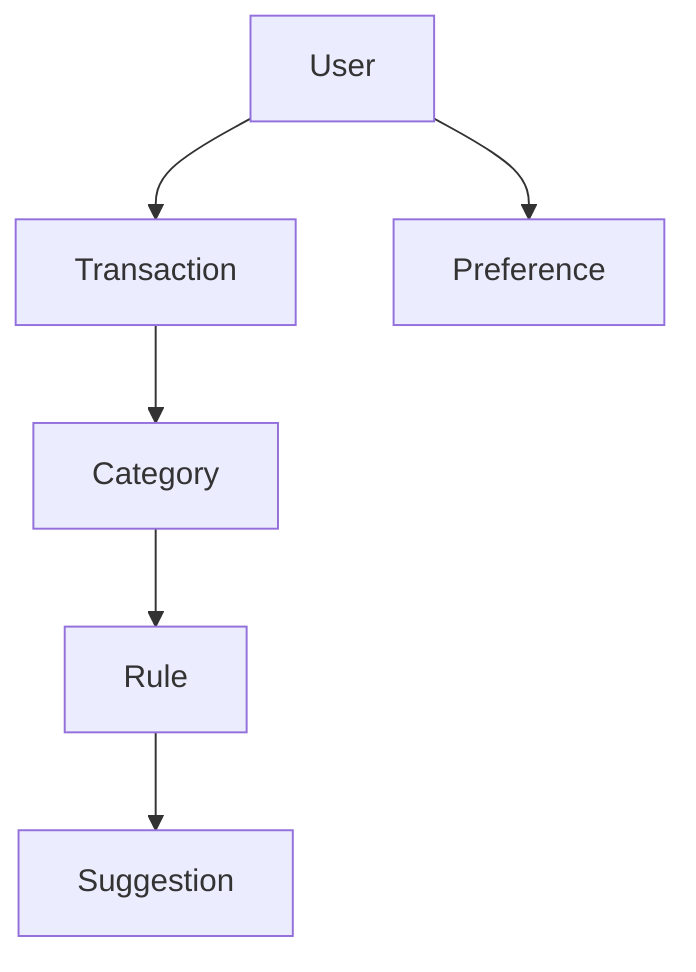
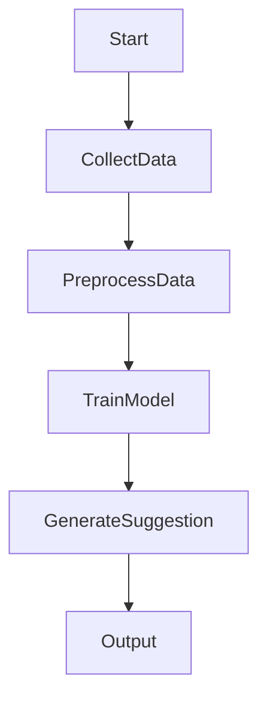
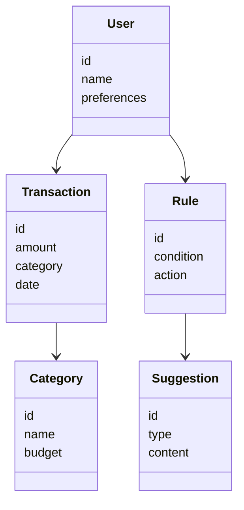
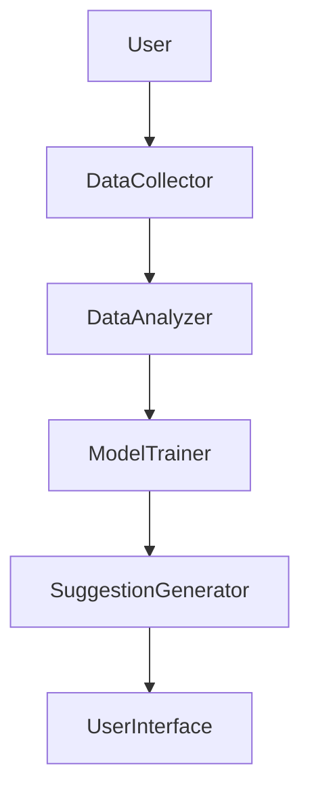
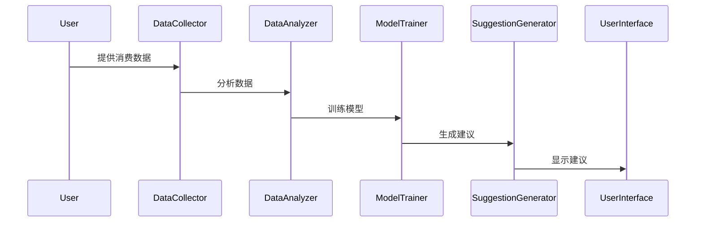

                 


# 开发智能化的个人消费行为优化建议工具

## 关键词：
- 人工智能
- 消费行为优化
- 个性化推荐
- 机器学习
- 智能系统

## 摘要：
在当前数据驱动的时代，个人消费行为的智能化优化已成为提升生活质量的重要手段。本文通过分析消费行为的背景与意义，探讨人工智能技术在消费优化中的应用，详细介绍基于机器学习的消费行为预测与建议生成算法。通过系统架构设计和项目实战，展示如何开发一个智能化的个人消费行为优化工具。本文内容涵盖从理论到实践的完整流程，为读者提供清晰的技术指导和实践参考。

---

## 第1章: 消费行为优化的背景与意义

### 1.1 消费行为优化的背景介绍

#### 1.1.1 消费行为的定义与重要性
消费行为是指个人在购买商品或服务时所表现出的各种行为模式。这些行为不仅受到个人经济状况、心理偏好和外部环境的影响，还反映了个人的生活方式和价值观。消费行为的优化意味着在满足个人需求的同时，尽可能地提高资源利用效率，降低不必要的开支。

#### 1.1.2 当前消费行为中的问题与挑战
随着经济的发展和生活水平的提高，人们在消费行为上面临的问题日益凸显。例如：
- **冲动消费**：由于缺乏理性判断，购买了不必要的商品，导致资金浪费。
- **信息过载**：市场上的产品种类繁多，消费者难以快速找到最适合自己的产品。
- **资源浪费**：由于未能合理规划消费预算，导致资源的不合理分配。

#### 1.1.3 智能化优化的必要性
传统的人工优化方法效率低下，难以应对复杂多变的市场环境。而智能化优化工具通过利用人工智能技术，能够快速分析海量数据，提供个性化的消费建议，从而帮助用户实现更高效的消费管理。

### 1.2 个人消费行为优化工具的定义

#### 1.2.1 工具的核心目标
个人消费行为优化工具的核心目标是通过分析用户的消费数据，提供个性化的消费建议，帮助用户优化消费结构，提高资源利用效率。

#### 1.2.2 工具的适用范围与边界
该工具适用于个人日常消费管理，包括但不限于：
- 零花支出优化
- 购物计划制定
- 储蓄与投资建议

#### 1.2.3 工具与传统消费管理工具的区别
与传统工具相比，智能化优化工具具有以下特点：
- **数据驱动**：基于用户的消费数据，提供精准的分析与建议。
- **个性化**：根据用户的行为模式和偏好，提供定制化的消费策略。
- **实时性**：能够实时分析用户的消费行为，及时提供优化建议。

### 1.3 本章小结
本章通过分析消费行为的背景与意义，指出了智能化优化工具的必要性，并明确了工具的核心目标和适用范围。

---

## 第2章: AI技术在消费行为优化中的应用

### 2.1 AI技术的核心概念

#### 2.1.1 人工智能的基本原理
人工智能（Artificial Intelligence, AI）是指通过计算机模拟人类智能的技术。其核心包括数据处理、算法设计和模型训练。

#### 2.1.2 机器学习与深度学习的区别
- **机器学习**：基于数据训练模型，使其能够从数据中学习规律。
- **深度学习**：一种机器学习的子领域，专注于通过多层神经网络进行特征提取。

#### 2.1.3 自然语言处理在消费优化中的应用
自然语言处理（NLP）技术可以帮助工具理解用户的消费偏好，例如分析用户的购物评论，提取关键词以优化推荐算法。

### 2.2 智能化工具的核心功能

#### 2.2.1 数据采集与分析
工具通过收集用户的消费数据（如交易记录、支出分类）进行分析，识别消费模式。

#### 2.2.2 消费行为预测与建议生成
基于历史数据，工具可以预测未来的消费趋势，并根据预测结果生成优化建议。

#### 2.2.3 个性化推荐系统
通过分析用户的消费偏好，工具可以推荐最适合用户的商品或服务。

### 2.3 本章小结
本章介绍了人工智能技术的基本原理及其在消费行为优化中的具体应用，强调了数据驱动和个性化推荐的重要性。

---

## 第3章: 核心概念与联系

### 3.1 AI优化工具的核心概念原理

#### 3.1.1 数据驱动的优化算法
优化算法基于用户的历史消费数据，分析用户的消费习惯，生成优化建议。

#### 3.1.2 用户行为分析模型
通过分析用户的消费数据，构建行为模型，识别用户的消费偏好和风险点。

#### 3.1.3 个性化推荐机制
基于用户的行为模型，推荐最适合用户的消费方案。

### 3.2 核心概念对比分析

#### 3.2.1 传统消费管理工具与AI工具的对比
| 特性             | 传统工具                | AI工具                 |
|------------------|-------------------------|------------------------|
| 数据处理能力     | 基于固定规则            | 数据驱动               |
| 个性化程度       | 较低                    | 高                     |
| 实时性            | 有限                    | 高                     |

#### 3.2.2 不同AI算法的效果对比
| 算法类型         | 基于规则的分类         | 机器学习模型           |
|------------------|------------------------|------------------------|
| 优点             | 实现简单               | 高准确性               |
| 缺点             | 针对性差               | 训练时间长             |

#### 3.2.3 用户需求与算法输出的关联性分析
用户需求（如预算限制、消费偏好）直接影响算法的输入和输出。例如，用户设定的月度预算会限制算法的优化空间。

### 3.3 系统架构的ER实体关系图


### 3.4 本章小结
本章通过对比分析，明确了AI优化工具的核心概念及其与传统工具的区别，构建了系统的ER实体关系图。

---

## 第4章: 算法原理与实现

### 4.1 算法原理概述

#### 4.1.1 基于规则的分类算法
基于预定义的规则对消费数据进行分类。例如，将消费金额超过一定阈值的交易标记为“大额消费”。

#### 4.1.2 基于机器学习的预测模型
使用机器学习算法（如随机森林、支持向量机）对消费行为进行预测，生成优化建议。

#### 4.1.3 混合推荐算法
结合基于规则的分类和机器学习模型，生成更精准的推荐结果。

### 4.2 算法实现流程图


### 4.3 算法的数学模型与公式

#### 4.3.1 基于逻辑回归的分类模型
目标：将消费行为分为“合理”和“不合理”两类。

模型公式：
$$ P(y=1|x) = \frac{e^{w \cdot x + b}}{1 + e^{w \cdot x + b}} $$

其中：
- \( y \) 是输出变量（0或1）
- \( x \) 是输入特征向量
- \( w \) 是权重向量
- \( b \) 是偏置项

#### 4.3.2 混合推荐算法
结合规则和机器学习模型的推荐结果，通过加权的方式生成最终建议。

公式：
$$ S_{final} = \alpha S_{rule} + (1-\alpha) S_{ml} $$

其中：
- \( S_{final} \) 是最终推荐结果
- \( S_{rule} \) 是基于规则的推荐结果
- \( S_{ml} \) 是基于机器学习的推荐结果
- \( \alpha \) 是规则推荐的权重

### 4.4 本章小结
本章详细介绍了优化工具中使用的算法原理，包括基于规则的分类、机器学习模型和混合推荐算法，并通过公式和流程图展示了实现过程。

---

## 第5章: 系统分析与架构设计方案

### 5.1 问题场景介绍
用户希望通过一个智能化工具优化个人消费行为，包括数据采集、行为分析和优化建议生成。

### 5.2 系统功能设计

#### 5.2.1 领域模型


#### 5.2.2 系统架构设计


### 5.3 系统接口设计
系统主要接口包括：
- 数据采集接口（API）
- 数据分析接口（API）
- 用户界面（Web或移动应用）

### 5.4 系统交互流程图


### 5.5 本章小结
本章通过系统架构设计和接口设计，展示了如何实现一个智能化的消费行为优化工具。

---

## 第6章: 项目实战

### 6.1 环境安装
需要安装以下工具：
- Python 3.8+
- Jupyter Notebook
- Scikit-learn
- Pandas
- Matplotlib

### 6.2 核心代码实现

#### 6.2.1 数据采集与预处理
```python
import pandas as pd

# 读取数据
data = pd.read_csv('transactions.csv')

# 数据清洗
data.dropna(inplace=True)
data['category'] = data['category'].astype('category')
```

#### 6.2.2 模型训练
```python
from sklearn.model import LogisticRegression

# 训练逻辑回归模型
model = LogisticRegression()
model.fit(X_train, y_train)
```

#### 6.2.3 生成优化建议
```python
def generate_suggestion(user_id):
    user_data = data[data['user_id'] == user_id]
    # 分析消费模式
    # 生成建议
    suggestion = model.predict(user_data)
    return suggestion

suggestion = generate_suggestion(1)
print(suggestion)
```

### 6.3 案例分析
通过分析一位用户的消费数据，展示优化工具如何帮助其降低月度开支。

### 6.4 本章小结
本章通过项目实战，展示了如何利用Python和机器学习模型实现智能化的消费行为优化工具。

---

## 第7章: 最佳实践与总结

### 7.1 本章小结
总结本文的主要内容，强调智能化消费行为优化工具的重要性和实现方法。

### 7.2 注意事项
- 数据隐私保护
- 算法的可解释性
- 系统的可扩展性

### 7.3 拓展阅读
推荐相关书籍和资源，供读者进一步学习。

### 7.4 本章小结
本章为读者提供了最佳实践建议，并鼓励进一步探索智能化工具的应用。

---

## 附录

### 附录A: 工具安装指南
详细说明如何安装和配置开发环境。

### 附录B: 数据集描述
描述数据集的结构和字段含义。

### 附录C: 参考文献
列出本文参考的文献和资源。

---

## 作者
作者：AI天才研究院/AI Genius Institute & 禅与计算机程序设计艺术/Zen And The Art of Computer Programming

---

感谢您的阅读！希望这篇文章能够为您提供开发智能化个人消费行为优化工具的清晰思路和实践指导。

