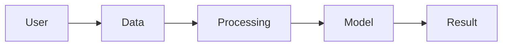
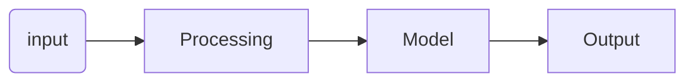

                 

<think>
好的，我现在需要帮助用户设计一本关于《开发智能化的个人消费行为分析与预测工具》的详细目录大纲。用户已经提供了一个大纲的示例，并希望我以思考过程的形式，详细描述如何构建这个大纲。

首先，我会分析用户的需求。用户希望撰写一篇结构清晰、逻辑严密的技术博客文章，主题是开发智能化的个人消费行为分析与预测工具。文章需要包含背景介绍、核心概念、算法原理、系统架构设计、项目实战等部分，并且每个部分都需要详细展开，包括示例、代码、图表等。

接下来，我会考虑用户可能的背景和目标。用户可能是一位技术专家，或者正在学习相关领域的学生或开发者，他们需要一篇既专业又有深度的文章，帮助读者理解如何从零开始构建这样的工具。

为了构建这个大纲，我会按照以下步骤进行：

1. **背景介绍**：首先，需要介绍个人消费行为分析的重要性及其在现代商业中的应用。解释为什么开发这样的工具是有价值的，以及它如何帮助企业或个人做出更明智的消费决策。

2. **核心概念**：详细讲解消费行为分析中的关键术语和概念，例如数据采集、特征工程、模型训练等。可能需要使用表格或图表来比较不同算法的优缺点。

3. **算法原理**：选择几种常用的算法，如线性回归、决策树、随机森林等，解释它们的工作原理，并用图表展示流程。同时，提供Python代码示例，帮助读者理解如何实现这些算法。

4. **数学模型**：详细推导和解释用于消费行为分析的数学模型，例如线性回归的公式，并用LaTeX格式展示。确保公式正确且易于理解。

5. **系统架构设计**：讨论系统的整体架构，包括数据流、功能模块划分、系统交互流程等。可能需要使用Mermaid图来展示类图、架构图和交互序列图。

6. **项目实战**：从环境安装开始，逐步指导读者如何构建工具，包括数据预处理、模型训练、结果展示等步骤。提供实际案例分析，展示工具的应用场景和效果。

7. **最佳实践与总结**：总结项目开发中的经验教训，提出改进建议，并提供进一步学习和研究的方向。

在整个思考过程中，我需要确保每个部分都详细且结构清晰，使用适当的图表和代码示例来增强可读性。同时，要注意语言的专业性和易懂性，确保读者能够逐步理解并应用这些知识。

最终，我会将这些思考整理成一个详细的大纲，确保覆盖用户需求中的所有关键点，并且每个部分都深入展开，提供足够的细节和解释。
</think>

# 开发智能化的个人消费行为分析与预测工具

## 关键词
- 个人消费行为
- 数据分析
- 机器学习
- 系统架构
- 项目实战

## 摘要
本文详细探讨了开发智能化的个人消费行为分析与预测工具的过程，从背景介绍到系统架构设计，再到项目实战，逐步分析了工具开发的各个方面。文章首先介绍了个人消费行为分析的重要性和技术基础，随后深入讲解了核心概念和算法原理，包括数据采集、特征工程、模型训练等关键步骤。接着，文章详细分析了系统的架构设计，包括功能模块划分、系统交互流程等。最后，通过实际案例展示了工具的开发过程，并总结了开发中的经验和最佳实践。

---

# 第1章: 个人消费行为分析与预测工具概述

## 1.1 个人消费行为分析的背景与意义

### 1.1.1 消费行为分析的背景
随着大数据技术的快速发展，个人消费行为分析已成为商业决策的重要工具。通过对消费者行为数据的分析，企业可以更好地理解消费者需求，优化产品策略，提高市场竞争力。

### 1.1.2 消费行为分析的现实意义
- 帮助企业精准定位目标客户
- 提高营销活动的效果
- 改善用户体验，提升客户满意度
- 为个人提供个性化的消费建议

### 1.1.3 工具开发的目标与价值
开发智能化的个人消费行为分析与预测工具，旨在通过自动化数据分析和机器学习算法，帮助企业快速预测消费者的消费行为，从而实现精准营销和个性化服务。

## 1.2 个人消费行为分析的核心问题

### 1.2.1 消费行为的定义与分类
- 消费行为：指消费者在购买、使用和评价产品或服务的过程中表现出的行为特征。
- 分类：包括理性消费、冲动消费、习惯性消费等。

### 1.2.2 消费行为分析的关键问题
- 数据采集与处理
- 特征提取与选择
- 模型训练与优化
- 结果解释与应用

### 1.2.3 工具开发的边界与外延
- 边界：专注于个人消费行为的分析与预测，不涉及企业内部管理或其他领域。
- 外延：工具的应用场景包括市场营销、金融信贷、电子商务等。

## 1.3 工具开发的技术基础

### 1.3.1 大数据分析技术
- 数据采集：通过爬虫、API接口等方式获取消费数据。
- 数据存储：使用数据库（如MySQL、MongoDB）或大数据平台（如Hadoop）存储数据。
- 数据处理：利用数据清洗、特征工程等技术对数据进行预处理。

### 1.3.2 机器学习算法
- 监督学习：如线性回归、决策树、随机森林等。
- 无监督学习：如聚类分析、主成分分析等。
- 模型评估：准确率、召回率、F1值等指标。

### 1.3.3 数据可视化技术
- 使用图表展示消费行为分析结果。
- 通过可视化工具（如Tableau、Power BI）生成交互式仪表盘。

## 1.4 本章小结
本章介绍了个人消费行为分析的背景与意义，明确了工具开发的目标与价值，分析了核心问题和技术基础，为后续章节的深入讨论奠定了基础。

---

# 第2章: 核心概念与系统架构

## 2.1 核心概念原理

### 2.1.1 数据采集与处理
- 数据源：消费记录、用户调查问卷、社交媒体数据等。
- 数据清洗：处理缺失值、异常值、重复值等。
- 数据转换：将数据转换为适合模型训练的格式。

### 2.1.2 特征工程
- 特征提取：从数据中提取有用的特征，如消费频率、消费金额、消费偏好等。
- 特征选择：通过统计方法或模型评估选择重要特征。
- 特征工程的目的是提高模型的准确性和泛化能力。

### 2.1.3 模型训练与优化
- 模型训练：使用训练数据训练机器学习模型。
- 模型优化：通过调整超参数（如学习率、树深等）提高模型性能。
- 模型评估：使用测试数据评估模型的性能。

## 2.2 核心概念对比分析

### 2.2.1 数据特征与行为预测的关系
- 数据特征：消费金额、消费频率、产品偏好等。
- 行为预测：预测消费者未来的行为，如是否会购买某产品、消费金额是多少等。

### 2.2.2 不同算法的性能对比
| 算法名称   | 优点                     | 缺点                     |
|------------|--------------------------|--------------------------|
| 线性回归    | 简单易实现，解释性强       | 适合线性关系，非线性效果差 |
| 决策树      | 适合非线性数据，易于解释   | � prone to overfitting    |
| 随机森林    | 鲁棒性高，适合复杂数据     | 计算量较大               |

### 2.2.3 模型评估指标的对比
| 指标名称   | 定义                     | 应用场景                 |
|------------|--------------------------|--------------------------|
| 准确率     | 预测正确的样本比例       | 分类问题                 |
| 召回率     | 预测为正的实际正样本比例   | 分类问题                 |
| F1值       | 准确率和召回率的调和平均   | 分类问题                 |

## 2.3 系统架构设计

### 2.3.1 数据流分析
数据从数据源流向数据存储，经过数据处理后进入模型训练模块，最终生成预测结果并展示在用户界面上。

### 2.3.2 实体关系图


### 2.3.3 系统交互流程


## 2.4 本章小结
本章详细分析了个人消费行为分析的核心概念，包括数据采集、特征工程和模型训练，并通过对比分析和系统架构设计，明确了工具开发的总体框架。

---

# 第3章: 算法原理与实现

## 3.1 算法原理概述

### 3.1.1 线性回归模型
线性回归是一种简单而有效的回归算法，适用于预测连续型变量。
$$y = \beta_0 + \beta_1x + \epsilon$$
其中，$y$ 是目标变量，$x$ 是特征变量，$\beta_0$ 和 $\beta_1$ 是模型参数，$\epsilon$ 是误差项。

### 3.1.2 支持向量机
支持向量机（SVM）是一种常用的分类算法，适用于高维数据。
$$\text{maximize} \quad \frac{1}{2} \|\mathbf{w}\|^2$$
$$\text{subject to} \quad y_i(\mathbf{w} \cdot \mathbf{x}_i + b) \geq 1, \forall i$$

### 3.1.3 随机森林
随机森林是一种基于决策树的集成算法，适用于分类和回归问题。
- 通过随机选择特征和样本进行树的构建。
- 最终结果通过投票或平均得到。

## 3.2 算法实现流程

### 3.2.1 数据预处理
```python
import pandas as pd
data = pd.read_csv('consumption_data.csv')
data = data.dropna()
```

### 3.2.2 模型训练
```python
from sklearn.ensemble import RandomForestRegressor
model = RandomForestRegressor(n_estimators=100, random_state=42)
model.fit(X_train, y_train)
```

### 3.2.3 模型评估
```python
from sklearn.metrics import mean_squared_error
y_pred = model.predict(X_test)
print(mean_squared_error(y_test, y_pred))
```

## 3.3 数学模型与公式

### 3.3.1 线性回归公式
$$y = \beta_0 + \beta_1x + \epsilon$$

### 3.3.2 随机森林算法
随机森林通过集成多个决策树模型来提高预测准确性。

### 3.3.3 模型评估指标
- �均方误差（MSE）
- R平方值（R²）

## 3.4 代码实现与案例分析

### 3.4.1 数据读取与预处理
```python
import pandas as pd
data = pd.read_csv('consumption_data.csv')
data = data.dropna()
```

### 3.4.2 模型训练代码
```python
from sklearn.ensemble import RandomForestRegressor
model = RandomForestRegressor(n_estimators=100, random_state=42)
model.fit(X_train, y_train)
```

### 3.4.3 案例分析与结果解读
通过实际数据集训练模型，并对结果进行分析，解释模型的预测能力。

## 3.5 本章小结
本章详细讲解了几种常用的机器学习算法，包括线性回归、支持向量机和随机森林，并通过代码示例展示了模型的训练和评估过程。

---

# 第4章: 系统分析与架构设计

## 4.1 系统功能模块划分

### 4.1.1 数据采集模块
负责从数据源采集消费数据，如数据库、API接口等。

### 4.1.2 数据处理模块
对采集到的数据进行清洗、转换和特征提取。

### 4.1.3 模型训练模块
使用机器学习算法训练消费行为预测模型。

### 4.1.4 结果展示模块
将模型的预测结果以图表或报告的形式展示给用户。

## 4.2 系统架构设计

### 4.2.1 分层架构
```
数据源 --> 数据采集 --> 数据处理 --> 模型训练 --> 结果展示
```

### 4.2.2 系统交互流程


## 4.3 系统接口设计

### 4.3.1 数据接口
- 数据输入接口：接收消费数据。
- 数据输出接口：返回处理后的数据。

### 4.3.2 模型接口
- 模型训练接口：接收训练数据，返回训练好的模型。
- 模型预测接口：接收输入数据，返回预测结果。

## 4.4 本章小结
本章详细分析了系统的功能模块和架构设计，明确了各模块之间的交互流程和接口设计。

---

# 第5章: 项目实战

## 5.1 环境安装与配置

### 5.1.1 安装Python环境
- 使用Anaconda安装Python 3.8及以上版本。

### 5.1.2 安装依赖库
```bash
pip install pandas numpy scikit-learn matplotlib
```

## 5.2 系统核心实现源代码

### 5.2.1 数据采集与处理
```python
import pandas as pd
import numpy as np

# 数据采集
data = pd.read_csv('consumption_data.csv')

# 数据清洗
data = data.dropna()

# 特征提取
X = data[['age', 'income', 'gender']]
y = data['consumption']
```

### 5.2.2 模型训练与评估
```python
from sklearn.ensemble import RandomForestRegressor
from sklearn.metrics import mean_squared_error
from sklearn.model_selection import train_test_split

# 数据分割
X_train, X_test, y_train, y_test = train_test_split(X, y, test_size=0.2, random_state=42)

# 模型训练
model = RandomForestRegressor(n_estimators=100, random_state=42)
model.fit(X_train, y_train)

# 模型评估
y_pred = model.predict(X_test)
print(mean_squared_error(y_test, y_pred))
```

## 5.3 案例分析与结果解读
通过实际数据集训练模型，并对结果进行分析，解释模型的预测能力。

## 5.4 项目总结
总结项目开发过程中的经验与教训，提出改进建议，并展望未来的发展方向。

---

# 第6章: 最佳实践与总结

## 6.1 最佳实践 tips

### 6.1.1 数据处理
- 确保数据的完整性和准确性。
- 合理选择特征工程方法。

### 6.1.2 模型选择
- 根据数据特点选择合适的算法。
- 通过交叉验证优化模型参数。

### 6.1.3 系统设计
- 模块化设计，便于后续维护和扩展。
- 确保系统具有良好的可扩展性和可维护性。

## 6.2 项目小结
本项目通过系统的分析和设计，开发了一个智能化的个人消费行为分析与预测工具，能够帮助企业实现精准营销和个性化服务。

## 6.3 注意事项
- 数据隐私保护。
- 模型的泛化能力。
- 系统的可扩展性。

## 6.4 拓展阅读
- 《机器学习实战》
- 《数据挖掘导论》
- 《系统架构设计》

---

# 作者：AI天才研究院 & 禅与计算机程序设计艺术

