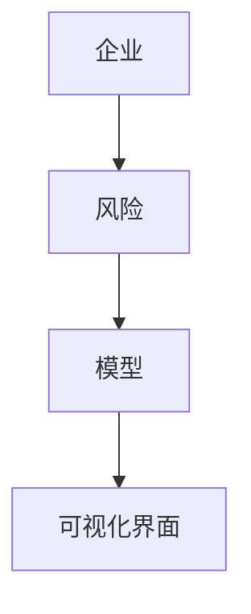
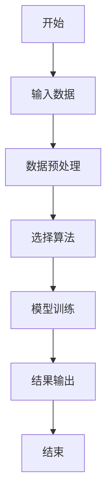
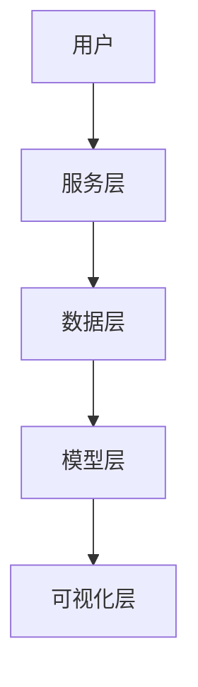
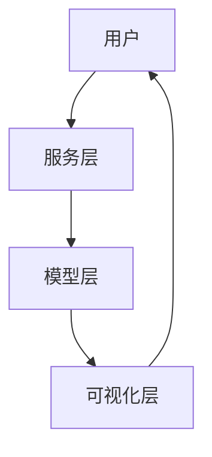

                 


# 开发智能化的企业信用风险传导模拟与可视化系统

> 关键词：企业信用风险，风险传导，智能化模拟，可视化系统，数据建模，机器学习

> 摘要：本文详细探讨了开发智能化的企业信用风险传导模拟与可视化系统的核心概念、算法原理、系统架构设计以及实际应用。通过结合信用风险的基本理论、智能化算法和可视化技术，本文提出了一种高效的企业信用风险评估和管理方案，为企业的风险管理提供了重要的技术支撑。

---

## 第一部分: 企业信用风险传导模拟与可视化系统背景与概念

### 第1章: 信用风险的基本概念

#### 1.1 信用风险的定义与特征
- **1.1.1 信用风险的定义**  
  信用风险是指由于债务人或交易对手无法履行其合同义务，导致债权人或相关方遭受损失的风险。在企业层面，信用风险主要体现在应收账款的回收风险、供应链上下游企业的信用风险传导以及金融市场投资中的信用风险。

- **1.1.2 信用风险的主要特征**  
  信用风险具有隐蔽性、传染性、复杂性和不可预测性。隐蔽性体现在信用风险往往在债务人财务状况恶化时才显现；传染性体现在一家企业的信用风险可能通过供应链传导至整个产业链；复杂性体现在信用风险受宏观经济、行业环境和企业内部管理等多重因素影响；不可预测性体现在信用风险的发生往往具有突发性和不确定性。

- **1.1.3 信用风险的影响因素**  
  信用风险的影响因素包括宏观经济环境（如经济周期、利率水平）、行业竞争状况、企业财务状况、管理水平以及外部市场环境等。

#### 1.2 企业信用风险传导的定义
- **1.2.1 信用风险传导的定义**  
  信用风险传导是指在企业供应链或金融市场上，一家企业的信用风险问题通过直接或间接的方式传递给其他相关企业或金融机构的过程。

- **1.2.2 信用风险传导的机制**  
  信用风险传导的机制主要包括直接传导（如供应商因无法支付货款导致企业资金链断裂）和间接传导（如市场信心下降导致企业融资成本上升）。

- **1.2.3 信用风险传导的路径**  
  信用风险传导的路径主要包括供应链传导、金融市场传导和行业链传导。

#### 1.3 系统开发背景与意义
- **1.3.1 当前企业信用风险管理的现状**  
  当前，企业信用风险管理主要依赖传统的财务分析和经验判断，存在效率低、覆盖面窄、风险传导路径难以捕捉等问题。

- **1.3.2 开发智能化系统的必要性**  
  随着企业规模的扩大和业务的复杂化，传统的信用风险管理方法已无法满足需求。智能化系统可以通过大数据分析和机器学习技术，实现对信用风险的实时监测和精准预测。

- **1.3.3 系统开发的目标与意义**  
  系统开发的目标是构建一个智能化的企业信用风险传导模拟与可视化平台，帮助企业在复杂多变的市场环境中及时识别和应对信用风险。

---

### 第2章: 系统开发的核心概念与联系

#### 2.1 核心概念原理
- **2.1.1 信用风险评估模型**  
  信用风险评估模型主要包括KMV模型、Altman Z值模型和Cox违约概率模型等。

- **2.1.2 系统模拟的基本原理**  
  系统模拟的基本原理是通过构建数学模型，模拟信用风险在企业之间的传导过程，分析其对整体经济或企业财务状况的影响。

- **2.1.3 可视化技术的应用**  
  可视化技术可以通过图表、热力图和网络图等形式，直观展示信用风险的分布、传导路径和影响范围。

#### 2.2 核心概念属性对比
- **2.2.1 信用风险与市场风险的对比**  
  信用风险主要集中在企业层面，而市场风险则影响整个市场。

- **2.2.2 系统模拟与传统分析方法的对比**  
  系统模拟具有实时性和动态性，而传统分析方法通常基于静态数据。

- **2.2.3 可视化技术与其他数据展示方式的对比**  
  可视化技术能够将复杂的数据关系直观展示，而传统的文本报告难以捕捉数据的动态变化。

#### 2.3 ER实体关系图架构


---

## 第二部分: 算法原理与数学模型

### 第3章: 算法原理讲解

#### 3.1 算法原理概述
- **3.1.1 信用风险模拟的基本算法**  
  信用风险模拟的基本算法包括蒙特卡洛模拟和时间序列分析。

- **3.1.2 系统的核心算法选择**  
  系统选择基于机器学习的信用风险评估算法，如随机森林和逻辑回归。

- **3.1.3 算法的优缺点分析**  
  算法的优点包括高精度和实时性，缺点包括对数据质量和数量的依赖。

#### 3.2 算法流程图


#### 3.3 算法实现代码
```python
# 数据预处理
import pandas as pd
data = pd.read_csv('credit_data.csv')
data.dropna(inplace=True)
```

---

## 第三部分: 系统分析与架构设计方案

### 第4章: 问题场景介绍

#### 4.1 问题场景描述
- 问题场景描述：企业信用风险传导的复杂性和不确定性使得传统的风险管理方法难以应对。

---

### 第5章: 项目介绍

#### 5.1 系统功能设计
- 系统功能设计：包括数据采集、风险评估、模拟引擎和可视化界面。

#### 5.2 系统架构设计


#### 5.3 系统接口设计
- 系统接口设计：包括数据接口、模型调用接口和可视化展示接口。

#### 5.4 系统交互设计


---

### 第6章: 项目实战

#### 6.1 环境安装
- 环境安装：安装Python、Jupyter Notebook和相关库（如pandas、numpy、matplotlib）。

#### 6.2 系统核心实现
```python
# 模型训练代码
from sklearn.ensemble import RandomForestClassifier
model = RandomForestClassifier()
model.fit(X_train, y_train)
```

#### 6.3 代码应用解读与分析
- 代码应用解读与分析：通过随机森林模型实现信用风险评估。

#### 6.4 实际案例分析
- 实际案例分析：分析某企业供应链中的信用风险传导路径。

#### 6.5 项目小结
- 项目小结：系统实现了对信用风险的智能化模拟和可视化展示，为企业风险管理提供了有力支持。

---

## 第四部分: 总结与展望

### 第7章: 总结与展望

#### 7.1 总结
- 总结：本文提出了智能化的企业信用风险传导模拟与可视化系统，结合了信用风险理论、机器学习算法和可视化技术。

#### 7.2 展望
- 展望：未来可以进一步优化算法、扩展系统的应用场景，并结合区块链技术实现更高效的信用风险管理。

---

## 作者信息

作者：AI天才研究院/AI Genius Institute & 禅与计算机程序设计艺术 /Zen And The Art of Computer Programming

---

通过以上详细的内容，我们可以看到，智能化的企业信用风险传导模拟与可视化系统的开发不仅需要扎实的理论基础，还需要结合实际应用进行不断的优化和改进。

