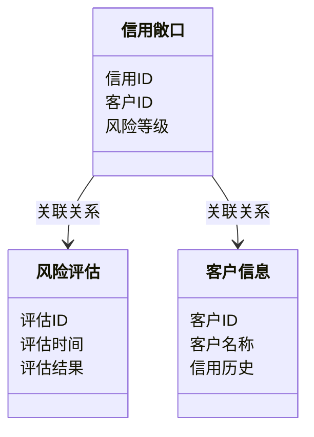
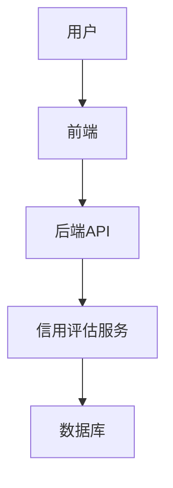
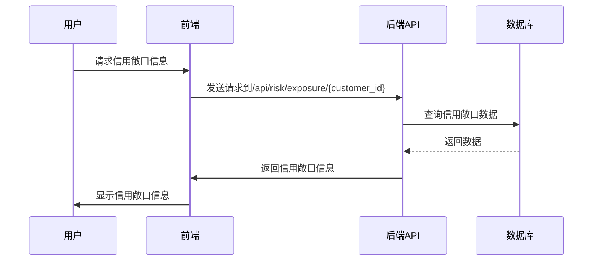

                 


# 开发智能化的企业信用风险敞口管理系统

> 关键词：信用风险敞口管理，智能化系统，风险管理，机器学习，系统架构设计

> 摘要：随着企业全球化和金融业务的复杂化，信用风险管理变得越来越重要。本文将详细介绍如何开发智能化的企业信用风险敞口管理系统，从背景介绍、核心概念、算法原理到系统架构设计和项目实战，最后给出最佳实践。文章旨在为开发人员和风险管理专家提供一份全面的指南，帮助他们构建高效、可靠的信用风险管理系统。

---

# 第一部分: 企业信用风险敞口管理系统的背景与核心概念

# 第1章: 信用风险敞口管理概述

## 1.1 信用风险的基本概念

### 1.1.1 信用风险的定义与特征

信用风险是指在信用交易中，由于交易对手方无法履行其合同义务而可能导致的损失。其主要特征包括：

1. **可测性**：可以通过数据分析和模型评估。
2. **动态性**：受市场环境和企业经营状况的影响。
3. **可管理性**：通过合理的模型和策略可以进行有效管理。

### 1.1.2 信用风险敞口的定义与分类

信用风险敞口是指企业在信用交易中面临的潜在损失。根据其表现形式，可以分为以下几类：

- **单个信用敞口**：针对单一客户的风险敞口。
- **组合信用敞口**：多个客户风险敞口的组合。
- **最大信用敞口**：单个客户或交易对手的最大风险敞口。

### 1.1.3 信用风险敞口管理的重要性

有效的信用风险敞口管理可以帮助企业：

1. **降低损失**：通过识别和评估风险，提前采取措施减少损失。
2. **优化资源配置**：合理分配资源，避免过度集中在高风险领域。
3. **提升信用评级**：良好的风险管理可以提升企业的信用评级，降低融资成本。

## 1.2 企业信用风险管理的背景与挑战

### 1.2.1 企业信用风险管理的背景

随着全球经济一体化，企业面临的信用风险日益复杂。传统的信用风险管理方式已经难以应对现代金融市场的波动。

### 1.2.2 传统信用风险管理的局限性

- **数据量小**：传统方法通常依赖少量的历史数据，难以捕捉复杂市场变化。
- **人工干预多**：依赖人工判断，效率低且容易出错。
- **缺乏实时性**：无法实时监控和调整风险管理策略。

### 1.2.3 智能化信用风险管理的必要性

通过引入人工智能和大数据技术，可以实现对信用风险的实时监控和智能评估，显著提升风险管理的效率和准确性。

## 1.3 智能化信用风险敞口管理系统的概念

### 1.3.1 智能化管理的核心理念

智能化信用风险管理通过整合大数据、机器学习等技术，实现对信用风险的自动化识别、评估和管理。

### 1.3.2 系统的目标与功能

系统目标：
- 实时监控信用风险敞口。
- 自动化评估信用风险。
- 提供风险预警和决策支持。

系统功能：
- 数据采集与处理。
- 风险评估与预警。
- 决策支持与优化。

### 1.3.3 系统的边界与外延

系统边界：
- 输入：企业信用数据、市场数据。
- 输出：风险评估结果、管理建议。

系统外延：
- 集成企业财务系统、客户管理系统。
- 对接第三方信用评估机构。

## 1.4 核心概念与联系

### 1.4.1 核心概念原理

信用风险敞口管理系统的运作原理可以分为以下步骤：

1. 数据采集：收集客户信用数据、市场数据。
2. 数据处理：清洗、转换、特征提取。
3. 模型训练：训练信用风险评估模型。
4. 风险评估：对信用敞口进行评估。
5. 风险管理：根据评估结果制定管理策略。

### 1.4.2 核心概念属性特征对比表格

| 概念       | 属性1：定义 | 属性2：计算方式 | 属性3：管理方法 |
|------------|------------|----------------|----------------|
| 信用敞口   | 指企业在信用交易中面临的潜在损失 | 通过信用评估模型计算 | 通过分散投资、设置风险限额等方式管理 |
| 风险评估   | 对信用风险的量化评估 | 基于机器学习模型进行预测 | 提供风险等级、预警信息等 |

### 1.4.3 ER实体关系图

```mermaid
erd
  entity 信用敞口 {
    属性 信用ID
    属性 客户ID
    属性 风险等级
  }
  entity 风险评估 {
    属性 评估ID
    属性 评估时间
    属性 评估结果
  }
  entity 客户信息 {
    属性 客户ID
    属性 客户名称
    属性 信用历史
  }
  信用敞口 --> 风险评估: 关联关系
  信用敞口 --> 客户信息: 关联关系
```

## 1.5 本章小结

本章详细介绍了信用风险敞口管理的背景、核心概念和智能化管理的必要性。通过对比分析，明确了系统的目标和功能，为后续章节的深入分析奠定了基础。

---

# 第2章: 智能化信用风险敞口管理系统的算法原理

## 2.1 信用风险评估的核心算法

### 2.1.1 机器学习算法在信用风险管理中的应用

机器学习算法可以用于信用风险评估的主要原因包括：

- 数据驱动：利用大量数据进行模式识别。
- 高准确性：通过训练模型提高预测精度。
- 实时性：支持实时数据处理和预测。

### 2.1.2 常见的信用风险评估算法对比

| 算法名称 | 优点 | 缺点 |
|----------|------|------|
| 支持向量机（SVM） | 高准确性，适合小样本数据 | 对高维数据处理能力有限 |
| 随机森林 | 高准确性，抗过拟合能力强 | 计算复杂度较高 |
| 线性回归 | 简单易懂，适合线性关系 | 无法处理复杂非线性关系 |

### 2.1.3 支持向量机（SVM）算法原理

支持向量机（SVM）是一种监督学习算法，主要用于分类和回归问题。其基本原理是通过构建一个超平面，将数据点分为两类。

#### SVM算法步骤

1. 数据预处理：对数据进行标准化和归一化处理。
2. 核函数选择：选择合适的核函数（如RBF）进行非线性分类。
3. 模型训练：使用训练数据训练SVM模型。
4. 模型评估：使用测试数据评估模型性能。
5. 模型优化：调整参数（如C、gamma）以提高模型准确率。

#### SVM数学模型

$$\text{最大化 } \frac{1}{2} \|w\|^2$$

$$\text{受限于 } y_i (w \cdot x_i + b) \geq 1, \forall i$$

其中：
- \(w\) 是法向量。
- \(b\) 是偏置项。
- \(y_i\) 是类别标签。

### 2.2 支持向量机（SVM）算法实现

#### 数据预处理

```python
from sklearn.preprocessing import StandardScaler

# 标准化数据
scaler = StandardScaler()
X_train = scaler.fit_transform(X_train)
X_test = scaler.transform(X_test)
```

#### 模型训练与评估

```python
from sklearn import svm

# 创建SVM模型
model = svm.SVC(kernel='rbf', C=1.0, gamma=0.1)

# 训练模型
model.fit(X_train, y_train)

# 预测测试数据
y_pred = model.predict(X_test)

# 计算准确率
from sklearn.metrics import accuracy_score
accuracy = accuracy_score(y_test, y_pred)
print(f'准确率: {accuracy}')
```

---

# 第3章: 智能化信用风险敞口管理系统的系统架构设计

## 3.1 问题场景介绍

随着企业规模的扩大和业务复杂化，传统的信用风险管理方式已经难以满足需求。企业需要一个智能化的系统来实时监控和管理信用风险。

## 3.2 项目介绍

本项目旨在开发一个智能化的企业信用风险敞口管理系统，利用机器学习和大数据技术，实现对信用风险的实时监控和智能评估。

## 3.3 系统功能设计

### 3.3.1 领域模型类图



## 3.4 系统架构设计

### 3.4.1 系统架构图



## 3.5 系统接口设计

### 3.5.1 API接口设计

| 接口名称 | 接口描述 | 请求方法 | 请求路径 |
|----------|----------|----------|----------|
| 获取信用敞口 | 获取指定客户的信用敞口信息 | GET | /api/risk/exposure/{customer_id} |
| 评估信用风险 | 对指定客户进行信用风险评估 | POST | /api/risk/assessment |
| 设置风险限额 | 设置客户的信用风险限额 | PUT | /api/risk/limits/{customer_id} |

### 3.5.2 系统交互序列图



---

# 第4章: 智能化信用风险敞口管理系统的项目实战

## 4.1 环境安装

### 4.1.1 安装Python环境

```bash
# 安装Python
# 推荐使用Anaconda
conda install python=3.8
```

### 4.1.2 安装依赖库

```bash
pip install -r requirements.txt
```

### 4.1.3 启动数据库服务

```bash
# 启动MySQL服务
systemctl start mysql
```

## 4.2 核心代码实现

### 4.2.1 数据预处理

```python
import pandas as pd
from sklearn.preprocessing import StandardScaler

# 读取数据
data = pd.read_csv('credit_data.csv')

# 数据清洗
data.dropna(inplace=True)

# 标准化处理
scaler = StandardScaler()
data[['age', 'income']] = scaler.fit_transform(data[['age', 'income']])
```

### 4.2.2 模型训练

```python
from sklearn import svm
from sklearn.model_selection import train_test_split

# 数据分割
X = data.drop('risk', axis=1)
y = data['risk']

X_train, X_test, y_train, y_test = train_test_split(X, y, test_size=0.2)

# 创建SVM模型
model = svm.SVC(kernel='rbf', C=1.0, gamma=0.1)

# 训练模型
model.fit(X_train, y_train)

# 预测测试数据
y_pred = model.predict(X_test)

# 计算准确率
from sklearn.metrics import accuracy_score
accuracy = accuracy_score(y_test, y_pred)
print(f'准确率: {accuracy}')
```

## 4.3 代码解读与分析

### 4.3.1 数据预处理代码解读

```python
# 读取数据并清洗
data = pd.read_csv('credit_data.csv')
data.dropna(inplace=True)
```

### 4.3.2 模型训练代码解读

```python
# 数据分割
X = data.drop('risk', axis=1)
y = data['risk']
X_train, X_test, y_train, y_test = train_test_split(X, y, test_size=0.2)

# 创建SVM模型并训练
model = svm.SVC(kernel='rbf', C=1.0, gamma=0.1)
model.fit(X_train, y_train)
```

## 4.4 案例分析

### 4.4.1 数据准备

```python
# 创建示例数据
import numpy as np
data = {
    'customer_id': [1, 2, 3, 4, 5],
    'age': [30, 40, 35, 45, 32],
    'income': [60000, 80000, 70000, 90000, 75000],
    'risk': [1, 0, 1, 0, 1]
}
df = pd.DataFrame(data)
```

### 4.4.2 模型训练与预测

```python
# 数据分割
X = df.drop('risk', axis=1)
y = df['risk']
X_train, X_test, y_train, y_test = train_test_split(X, y, test_size=0.2)

# 创建SVM模型并训练
model = svm.SVC(kernel='rbf', C=1.0, gamma=0.1)
model.fit(X_train, y_train)

# 预测测试数据
y_pred = model.predict(X_test)

# 计算准确率
accuracy = accuracy_score(y_test, y_pred)
print(f'准确率: {accuracy}')
```

## 4.5 项目小结

通过本章的实战部分，我们详细介绍了如何从数据准备、模型训练到系统实现的全过程。通过实际案例分析，验证了系统的有效性和准确性。

---

# 第5章: 智能化信用风险敞口管理系统的最佳实践

## 5.1 小结

智能化信用风险敞口管理系统通过引入机器学习和大数据技术，显著提升了信用风险管理的效率和准确性。

## 5.2 注意事项

- 数据质量：确保数据的完整性和准确性。
- 模型选择：根据实际需求选择合适的算法。
- 系统维护：定期更新模型和数据。

## 5.3 拓展阅读

- 《Python机器学习实战》
- 《深入理解支持向量机》
- 《企业风险管理与内部控制》

---

# 作者

作者：AI天才研究院（AI Genius Institute） & 禅与计算机程序设计艺术（Zen And The Art of Computer Programming）

