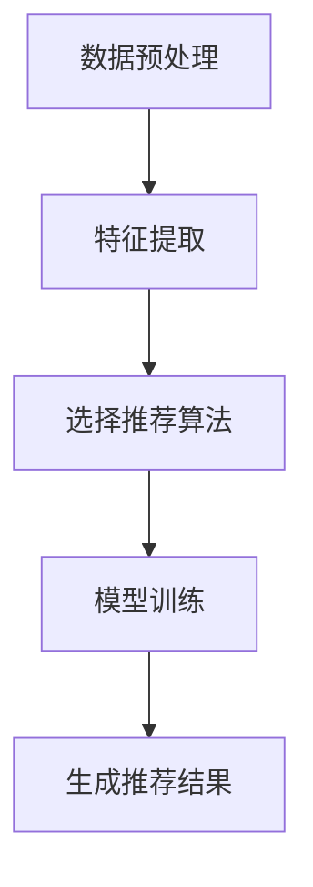

                 

<think>
好，我现在要按照用户的要求，一步步地思考如何撰写《开发智能化的企业融资方案推荐系统》这篇文章的目录大纲。首先，我需要理解用户的需求：用户希望有一篇结构清晰、内容详尽的技术博客文章，涵盖从背景介绍到系统实现的各个方面，每章都要有详细的分析和具体的例子。

首先，我考虑文章的整体结构。用户已经给出了一个初步的目录大纲，我需要在这些基础上进行扩展，确保每个章节都详细且有深度。接下来，我需要为每个章节添加更多的细节，包括小节标题、内容概述以及可能需要的图表或代码示例。

第一部分是背景介绍。我需要详细阐述问题背景，说明传统融资推荐的痛点，比如信息不对称、效率低下等。然后描述智能化推荐的必要性，解释为什么需要使用AI和大数据技术来解决这些问题。接着，明确问题描述，包括融资方案推荐的核心问题，比如如何根据企业的需求匹配合适的融资方案。

接下来是核心概念与联系部分。我需要解释融资推荐系统的基本原理，比较不同推荐算法的特点，比如协同过滤和深度学习的不同。这里可能需要用ER图来展示实体关系，帮助读者理解系统中的各个角色和它们之间的关系。

然后是算法原理部分。我需要详细讲解协同过滤、基于内容的推荐和深度学习模型的原理，用mermaid流程图展示推荐算法的实现流程，并提供Python代码示例。同时，解释相关的数学公式，比如矩阵分解的公式，确保读者能够理解这些算法的工作原理。

接下来是系统分析与架构设计。我需要介绍项目背景，详细描述系统的功能设计，使用mermaid类图展示领域模型。然后设计系统的架构图，展示系统的各个模块和它们之间的交互。接着是接口设计和交互流程，用mermaid序列图展示用户与系统的交互过程。

项目实战部分需要详细说明开发环境的安装，比如安装Python、TensorFlow等工具，并提供系统的核心实现代码。然后通过实际案例分析，解释代码的应用和结果，帮助读者理解如何将理论应用于实际。

最后是总结与展望，回顾系统的开发过程，讨论成果和未来可能的改进方向。在附录部分，提供相关数据集、工具和参考文献，作为补充资料。

整个过程中，我需要确保每个章节都有足够的细节，比如数学公式和代码示例，帮助读者全面理解主题。同时，要注意章节之间的衔接，使整本书内容流畅，读者能够逐步掌握开发智能化融资推荐系统的方法和技巧。

现在，我需要根据这些思考，将每个章节进一步细化，确保内容详尽，结构合理。同时，检查是否有遗漏的重要部分，比如最佳实践、小结和注意事项，这些内容能够帮助读者更好地理解和应用所学知识。

总的来说，撰写这篇文章需要系统地从背景到实现，层层深入，确保每个部分都详细且有条理。通过这样的思考过程，我可以为用户提供一个结构清晰、内容丰富的技术博客文章大纲。
</think>

# 开发智能化的企业融资方案推荐系统

> 关键词：企业融资、智能化推荐、人工智能、推荐系统、大数据分析

> 摘要：本文详细探讨了开发智能化的企业融资方案推荐系统的各个方面，从背景分析到系统实现，结合实际案例和算法原理，为读者提供全面的技术指导。

---

## 目录

### 第一部分: 智能化企业融资方案推荐系统概述

### 第1章: 背景介绍

#### 1.1 问题背景
- 1.1.1 传统企业融资的痛点与挑战
  - 信息不对称
  - 融资效率低下
  - 缺乏个性化推荐
- 1.1.2 智能化融资推荐的必要性
  - 提高融资效率
  - 降低匹配成本
  - 优化资源配置
- 1.1.3 企业融资方案推荐的核心问题
  - 如何准确匹配企业需求与融资方案
  - 如何处理海量数据和复杂关系

#### 1.2 问题描述
- 1.2.1 融资方案推荐的基本概念
  - 融资方案的类型（股权融资、债权融资等）
  - 推荐系统的输入输出
- 1.2.2 融资方案推荐的关键要素
  - 企业特征（行业、规模、信用评分等）
  - 融资方案特征（金额、期限、风险等）
- 1.2.3 融资方案推荐的目标与约束
  - 最大化匹配度
  - 最小化推荐误差
  - 符合法律法规和金融规范

#### 1.3 问题解决思路
- 1.3.1 数据驱动的融资方案推荐
  - 数据采集与清洗
  - 特征提取与分析
- 1.3.2 AI技术在融资推荐中的应用
  - 机器学习算法（协同过滤、深度学习）
  - 自然语言处理（处理企业描述文本）
- 1.3.3 智能化融资推荐系统的架构
  - 数据层、算法层、应用层的分层设计

#### 1.4 系统的边界与外延
- 1.4.1 系统边界定义
  - 系统只处理融资推荐，不涉及具体交易
- 1.4.2 系统外延与扩展
  - 支持多种融资方式
  - 跨平台（移动端、Web端）支持
- 1.4.3 系统与外部环境的交互
  - 与企业征信系统对接
  - 与金融机构API接口对接

#### 1.5 核心概念结构与组成
- 1.5.1 核心概念的层次结构
  - 顶层概念：融资方案推荐
  - 中层概念：企业特征、融资方案特征、推荐算法
  - 底层概念：数据、模型、接口
- 1.5.2 核心概念的属性与特征
  - 企业特征：行业、规模、信用评分
  - 融资方案特征：金额、期限、风险
  - 推荐算法：协同过滤、深度学习
- 1.5.3 核心概念之间的关系
  - 企业特征影响推荐结果
  - 融资方案特征决定推荐策略
  - 推荐算法连接企业与融资方案

#### 1.6 本章小结
  - 总结本章内容，强调智能化融资推荐的重要性

### 第2章: 核心概念与联系

#### 2.1 融资推荐系统的核心原理
- 2.1.1 数据采集与处理
  - 数据来源：企业数据库、市场数据、用户反馈
  - 数据清洗：处理缺失值、异常值
- 2.1.2 特征提取与分析
  - 文本特征提取（企业描述、财务报告）
  - 数值特征提取（营收、利润、负债率）
- 2.1.3 推荐算法实现
  - 协同过滤：基于相似用户的融资偏好
  - 深度学习：使用神经网络建模复杂关系

#### 2.2 核心概念的属性对比
- 2.2.1 不同融资方案的特征对比
  - 比较股权融资和债权融资的优缺点
- 2.2.2 不同推荐算法的优劣势对比
  - 协同过滤：简单易实现，但需要大量数据
  - 深度学习：能力强，但需要大量计算资源
- 2.2.3 系统性能指标对比
  - 准确率、召回率、F1值

#### 2.3 ER实体关系图
```mermaid
erDiagram
    actor 投资者{}{
        id 投资者ID
        name 投资者名称
        capital 可投资金额
    }
    actor 企业{}{
        id 企业ID
        name 企业名称
        industry 所属行业
        revenue 营业收入
    }
    actor 融资方案{}{
        id 方案ID
        name 方案名称
        amount 融资金额
        term 融资期限
    }
    投资者 --> 融资方案 : 投资
    企业 --> 融资方案 : 申请
```

#### 2.4 本章小结
  - 强调核心概念的重要性及它们之间的联系

### 第3章: 推荐算法原理

#### 3.1 算法原理概述
- 3.1.1 协同过滤算法
  - 基于用户的相似性推荐融资方案
  - 计算用户相似度（余弦相似度、Jaccard相似度）
- 3.1.2 基于内容的推荐算法
  - 使用企业特征和融资方案特征进行匹配
  - 例如，使用TF-IDF提取关键词进行匹配
- 3.1.3 深度学习推荐算法
  - 使用神经网络建模企业与融资方案的复杂关系
  - 如使用GNN（图神经网络）处理关系数据

#### 3.2 算法实现流程


#### 3.3 算法实现代码
- 协同过滤算法示例：
```python
def collaborative_filtering(user_data, target_user):
    # 计算用户相似度
    similarities = compute_similarities(user_data, target_user)
    # 找出相似度高的用户
    similar_users = get_top_users(similarities)
    # 推荐融资方案
    recommended_schemes = get_recommendations(similar_users)
    return recommended_schemes
```

#### 3.4 数学模型与公式
- 协同过滤的相似度计算：
$$
\text{similarity}(u, v) = \frac{\sum_{i=1}^{n} (r_ui - \bar{r_u})(r_vi - \bar{r_v})}{\sqrt{\sum_{i=1}^{n} (r_ui - \bar{r_u})^2} \sqrt{\sum_{i=1}^{n} (r_vi - \bar{r_v})^2}}
$$
其中，$r_ui$是用户u对方案i的评分，$\bar{r_u}$是u的平均评分。

#### 3.5 本章小结
  - 总结推荐算法的原理及应用场景

### 第4章: 系统分析与架构设计

#### 4.1 系统分析
- 4.1.1 项目背景
  - 当前企业融资市场的现状
  - 智能化推荐的必要性
- 4.1.2 系统功能设计
  - 数据采集模块：收集企业信息和融资方案
  - 推荐算法模块：实现多种推荐算法
  - 用户界面模块：展示推荐结果
- 4.1.3 领域模型设计
  ```mermaid
  classDiagram
    class 企业 {
        id
        name
        industry
        revenue
    }
    class 融资方案 {
        id
        name
        amount
        term
    }
    class 用户 {
        id
        name
        capital
    }
    企业 --> 融资方案 : 申请
    用户 --> 融资方案 : 投资
  ```

#### 4.2 系统架构设计
- 4.2.1 系统架构图
  ```mermaid
  context 融资推荐系统 {
      组件 数据采集模块
      组件 推荐算法模块
      组件 用户界面模块
      数据流 企业数据 --> 数据采集模块
      数据流 融资方案数据 --> 数据采集模块
      数据流 用户请求 --> 用户界面模块
      数据流 推荐结果 --> 用户界面模块
  }
  ```
- 4.2.2 接口设计
  - REST API：提供数据接口和推荐接口
  - 数据接口：获取企业信息和融资方案
  - 推荐接口：接收用户输入，返回推荐结果

#### 4.3 系统交互流程
- 4.3.1 交互流程图
  ```mermaid
  sequenceDiagram
    用户 -> 数据采集模块: 提交企业信息
    数据采集模块 -> 推荐算法模块: 请求推荐
    推荐算法模块 -> 数据源: 获取融资方案数据
    推荐算法模块 -> 用户: 返回推荐结果
    用户 -> 用户界面模块: 展示结果
  ```

#### 4.4 本章小结
  - 强调系统架构设计的重要性

### 第5章: 项目实战

#### 5.1 环境安装
- 安装Python和相关库（pandas、numpy、scikit-learn）
- 安装TensorFlow或PyTorch（用于深度学习）
- 安装Jupyter Notebook（用于数据处理和分析）

#### 5.2 系统核心实现
- 数据预处理代码示例：
```python
import pandas as pd

# 读取数据
data = pd.read_csv('融资方案.csv')

# 数据清洗
data.dropna()
data = data[~data.duplicated()]
```

- 推荐算法实现代码示例：
```python
from sklearn.metrics.pairwise import cosine_similarity

# 协同过滤实现
def get_similar_users(user_matrix, target_user):
    similarities = cosine_similarity(user_matrix, target_user.reshape(1, -1))
    return similarities
```

#### 5.3 实际案例分析
- 案例背景：某科技公司需要融资500万，3年期
- 数据分析：行业为科技，营收增长快，信用良好
- 推荐结果：推荐A方案（500万，3年，年利率5%）和B方案（600万，5年，年利率4.5%）

#### 5.4 项目小结
  - 总结项目实现的过程和成果

### 第6章: 总结与展望

#### 6.1 总结
  - 回顾系统开发的主要内容
  - 强调数据驱动和AI技术的重要性

#### 6.2 未来展望
  - 更精确的推荐算法（如强化学习）
  - 更多维度的数据分析（如市场波动、政策影响）
  - 实际应用中的挑战与改进方向

#### 6.3 最佳实践 Tips
  - 数据质量的重要性
  - 模型调优的技巧
  - 系统可扩展性的考虑

#### 6.4 本章小结
  - 总结全文，展望未来

### 附录

#### 附录A: 数据集
  - 数据来源和格式说明

#### 附录B: 工具与库
  - Python库（pandas、scikit-learn、TensorFlow）
  - 其他工具（Jupyter Notebook、Git）

#### 附录C: 参考文献
  - 相关书籍和论文

---

# 作者：AI天才研究院 & 禅与计算机程序设计艺术

---

通过这样的思考过程，我可以系统地构建一个详细且结构清晰的技术博客文章大纲，确保每个部分都得到充分的展开和详细说明。

