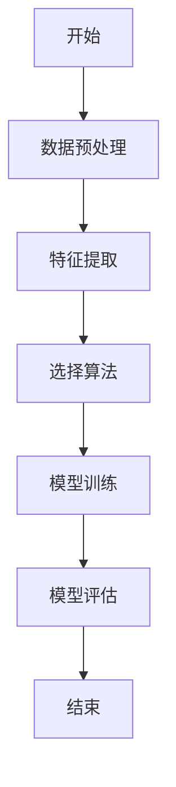
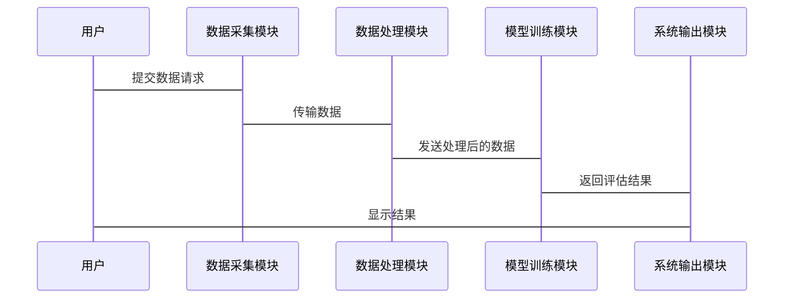

                 


# 开发智能化的供应链金融信用网络分析模型

> 关键词：供应链金融，信用网络分析，人工智能，图论算法，机器学习，深度学习，系统架构

> 摘要：本文详细探讨了开发智能化的供应链金融信用网络分析模型的背景、核心概念、算法原理、系统架构、项目实战以及最佳实践。通过结合图论、机器学习和深度学习等技术，提出了一种高效的信用评估方法，旨在优化供应链金融的风险控制和资源配置。

---

# 第一部分：供应链金融与信用网络分析模型概述

## 第1章：供应链金融与信用网络分析模型背景介绍

### 1.1 供应链金融的定义与特点

#### 1.1.1 供应链金融的定义
供应链金融（Supply Chain Finance, SCF）是指通过整合供应链中的物流、信息流和资金流，为供应链上的企业提供融资支持的一种金融模式。它不仅帮助企业优化现金流，还能提升供应链的整体效率。

#### 1.1.2 供应链金融的核心特点
1. **多方参与**：涉及供应商、制造商、分销商、零售商和金融机构。
2. **资金流优化**：通过应收账款质押、预付款融资等方式，缓解中小企业的资金压力。
3. **数据驱动**：依赖于供应链中的交易数据和信用数据，进行精准的融资决策。

#### 1.1.3 供应链金融在企业中的作用
1. 提高供应链的透明度和信任度。
2. 降低中小企业的融资门槛。
3. 优化企业的现金流管理。

### 1.2 信用网络分析模型的定义与特点

#### 1.2.1 信用网络分析模型的定义
信用网络分析模型（Credit Network Analysis Model）是通过图论方法，将供应链中的企业及其信用关系可视化，进而分析信用风险和传播路径的模型。

#### 1.2.2 信用网络分析模型的核心特点
1. **网络化**：将企业之间的信用关系视为图中的节点和边。
2. **动态性**：能够实时更新企业的信用评分和风险敞口。
3. **预测性**：基于历史数据和当前数据，预测未来的信用风险。

#### 1.2.3 信用网络分析模型与传统信用评估的区别
传统信用评估主要依赖于单个企业的财务数据，而信用网络分析模型则考虑了企业间的相互影响，能够更全面地评估信用风险。

### 1.3 智能化供应链金融信用网络分析模型的必要性

#### 1.3.1 传统供应链金融的局限性
1. 信息孤岛：各参与方之间的数据难以整合，导致融资效率低下。
2. 风险分散：难以准确评估企业间的相互风险。
3. 人工干预多：信用评估过程依赖人工审核，效率低且易出错。

#### 1.3.2 智能化分析模型的优势
1. 数据整合能力强：能够充分利用供应链中的多源数据。
2. 风险评估精准：通过图论和机器学习算法，准确识别和量化信用风险。
3. 实时性高：能够快速响应供应链中的动态变化。

#### 1.3.3 智能化供应链金融信用网络分析模型的应用场景
1. 中小企业的融资支持。
2. 供应链金融产品的设计与优化。
3. 信用风险的实时监控与预警。

### 1.4 本章小结
本章介绍了供应链金融和信用网络分析模型的基本概念、特点及其必要性，为后续模型的开发奠定了基础。

---

## 第2章：供应链金融信用网络分析模型的核心概念与联系

### 2.1 核心概念原理

#### 2.1.1 供应链网络的构建原理
供应链网络的构建基于企业的交易数据和信用数据，通过图论方法将企业间的信用关系可视化。

#### 2.1.2 信用评估的数学模型
信用评估模型通常采用回归分析或分类算法，结合企业内外部特征进行评分。

#### 2.1.3 网络分析算法的基本原理
网络分析算法（如PageRank和社区发现算法）用于识别关键企业节点和风险传播路径。

### 2.2 核心概念属性特征对比表格

| 概念       | 属性特征                       |
|------------|--------------------------------|
| 供应链      | 物流、信息流、资金流           |
| 信用网络    | 企业间信用关系                 |
| 金融信用评估| 评分、风险评估、违约概率       |

### 2.3 ER实体关系图架构

```mermaid
er
actor 供应链金融参与者 {
  participant 企业
  participant 金融机构
  participant 供应商
  participant 客户
}

database 供应链金融数据库 {
  table 企业信息表 {
    企业ID, 企业名称, 企业信用评分
  }
  table 供应链关系表 {
    关系ID, 企业ID1, 企业ID2, 关系类型
  }
  table 信用评估表 {
    评估ID, 企业ID, 信用评分, 评估时间
  }
}
```

### 2.4 本章小结
本章通过对比分析和实体关系图，详细阐述了供应链金融信用网络分析模型的核心概念及其相互关系。

---

## 第3章：供应链金融信用网络分析模型的算法原理

### 3.1 图论基础算法

#### 3.1.1 最短路径算法
最短路径算法（如Dijkstra算法）用于识别供应链中的关键路径和风险传播路径。

#### 3.1.2 最小生成树算法
最小生成树算法（如Kruskal算法）用于构建供应链网络的最小连接树，优化供应链的结构。

#### 3.1.3 网络流算法
网络流算法（如Ford-Fulkerson算法）用于优化供应链的资金流动效率。

### 3.2 机器学习算法

#### 3.2.1 聚类分析
聚类分析（如K-means算法）用于将供应链中的企业分为不同信用等级的群体。

#### 3.2.2 分类算法
分类算法（如随机森林）用于预测企业的信用违约概率。

#### 3.2.3 回归分析
回归分析用于分析企业的信用评分与各项特征变量之间的关系。

### 3.3 深度学习算法

#### 3.3.1 卷积神经网络
卷积神经网络（CNN）用于处理供应链中的图像数据，提取特征进行信用评估。

#### 3.3.2 循环神经网络
循环神经网络（RNN）用于处理时间序列数据，分析企业的信用评分变化趋势。

#### 3.3.3 图神经网络
图神经网络（Graph Neural Network, GNN）用于处理供应链网络中的图结构数据，预测企业的信用风险。

### 3.4 算法流程图



### 3.5 本章小结
本章详细介绍了供应链金融信用网络分析模型中常用的算法及其流程，为后续的模型开发提供了理论基础。

---

## 第4章：供应链金融信用网络分析模型的数学模型与公式

### 4.1 供应链网络模型

#### 4.1.1 供应链网络的构建
供应链网络的构建基于企业的交易数据和信用数据，通过图论方法将企业间的信用关系可视化。

#### 4.1.2 供应链网络的数学表示
供应链网络可以表示为一个无向图，其中节点表示企业，边表示企业间的信用关系，边的权重表示信用关系的强度。

#### 4.1.3 供应链网络的度数分布
度数分布用于衡量企业在网络中的重要性，公式为：
$$ \text{度数}(i) = \sum_{j} a_{ij} $$
其中，$a_{ij}$ 表示企业 $i$ 和企业 $j$ 之间的连接关系。

### 4.2 信用网络分析模型的数学模型

#### 4.2.1 信用评估的回归模型
信用评估的回归模型可以表示为：
$$ \text{信用评分}(i) = \beta_0 + \beta_1 x_1(i) + \beta_2 x_2(i) + \epsilon $$
其中，$x_1(i)$ 和 $x_2(i)$ 表示企业的特征变量，$\beta_0, \beta_1, \beta_2$ 是回归系数，$\epsilon$ 是误差项。

#### 4.2.2 信用网络的风险传播模型
信用网络的风险传播模型可以表示为：
$$ \text{风险敞口}(i) = \sum_{j} w_{ij} \times \text{风险敞口}(j) $$
其中，$w_{ij}$ 表示企业 $i$ 和企业 $j$ 之间的权重，$\text{风险敞口}(j)$ 表示企业 $j$ 的风险敞口。

### 4.3 本章小结
本章通过数学公式详细阐述了供应链金融信用网络分析模型的核心算法和模型，为后续的系统设计和项目实现提供了理论支持。

---

## 第5章：供应链金融信用网络分析模型的系统分析与架构设计

### 5.1 系统功能设计

#### 5.1.1 数据采集模块
数据采集模块负责从供应链中的各个参与方收集交易数据和信用数据。

#### 5.1.2 数据处理模块
数据处理模块对采集到的数据进行清洗、转换和集成，确保数据的准确性和一致性。

#### 5.1.3 模型训练模块
模型训练模块基于处理后的数据，训练信用网络分析模型，生成企业的信用评分和风险敞口。

#### 5.1.4 系统输出模块
系统输出模块将模型的输出结果以可视化的方式呈现给用户，包括企业的信用评分、风险传播路径等。

### 5.2 系统架构设计


### 5.3 系统接口设计

#### 5.3.1 数据接口
数据接口负责与供应链中的各个参与方进行数据交互，采用RESTful API设计。

#### 5.3.2 模型接口
模型接口负责接收用户的请求，调用模型进行信用评估和风险分析，返回结果。

### 5.4 系统交互流程图



### 5.5 本章小结
本章详细设计了供应链金融信用网络分析模型的系统架构和交互流程，为后续的项目实现提供了指导。

---

## 第6章：供应链金融信用网络分析模型的项目实战

### 6.1 环境安装与配置

#### 6.1.1 Python环境安装
安装Python 3.8及以上版本，并配置虚拟环境。

#### 6.1.2 第三方库安装
安装必要的第三方库，如numpy、pandas、scikit-learn、networkx、pytorch等。

### 6.2 系统核心功能实现

#### 6.2.1 数据采集模块实现
编写Python代码，从数据库中采集企业的交易数据和信用数据。

```python
import pandas as pd

# 数据采集模块
def collect_data():
    data = pd.read_sql_query("SELECT * FROM 企业信息表", connection)
    return data

collect_data()
```

#### 6.2.2 数据处理模块实现
编写Python代码，对采集到的数据进行清洗和转换。

```python
import pandas as pd
import numpy as np

# 数据处理模块
def process_data(data):
    data = data.dropna()
    data = pd.get_dummies(data)
    return data

processed_data = process_data(collect_data())
```

#### 6.2.3 模型训练模块实现
编写Python代码，训练信用网络分析模型，生成企业的信用评分。

```python
from sklearn.model

