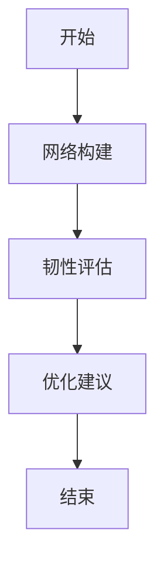
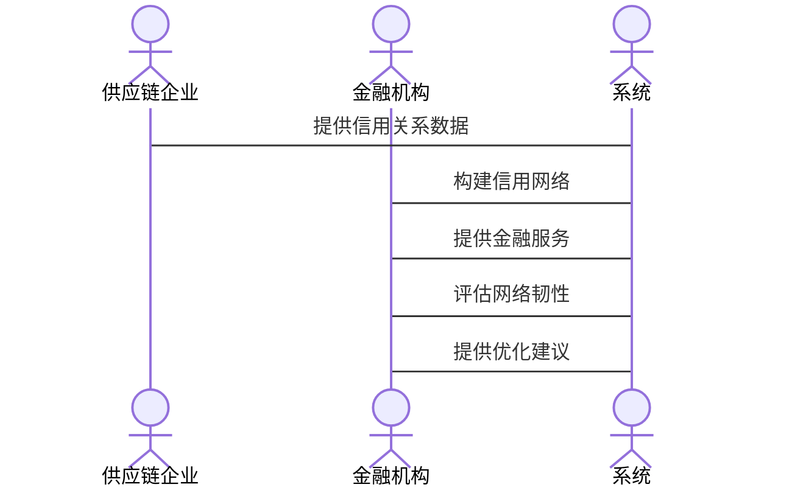

                 


# 开发智能化的供应链金融信用网络韧性分析模型

## 关键词
供应链金融，信用网络，网络韧性，信用风险，系统架构

## 摘要
本文详细探讨了如何开发智能化的供应链金融信用网络韧性分析模型。从背景介绍到核心概念，从算法原理到系统架构设计，再到项目实战和最佳实践，系统性地分析了如何构建一个能够评估和增强供应链金融信用网络韧性的智能化模型。通过实际案例分析和代码实现，展示了该模型在现实中的应用价值和意义。

## 第一部分: 供应链金融信用网络韧性分析模型的背景与核心概念

### 第1章: 供应链金融与信用网络的背景介绍

#### 1.1 供应链金融的定义与特点
供应链金融是指围绕供应链上的企业，通过整合物流、信息流、资金流，为供应链上的企业提供融资支持的一种金融服务模式。其特点包括：
- **融资便利性**：企业可以通过供应链上的交易数据获得融资。
- **风险可控性**：金融机构可以基于供应链的交易数据进行风险评估。
- **高效性**：通过整合物流、信息流和资金流，提高了融资效率。

#### 1.2 信用网络的定义与特点
信用网络是指企业之间基于信任和信用关系形成的网络。其特点包括：
- **信任基础**：企业之间的信用关系建立在相互信任的基础上。
- **动态性**：信用关系会随着市场环境的变化而变化。
- **复杂性**：信用网络往往涉及多个企业，结构复杂。

#### 1.3 供应链金融信用网络的定义与特点
供应链金融信用网络是供应链金融与信用网络的结合，是指在供应链金融框架下，企业之间形成的信用关系网络。其特点包括：
- **供应链导向**：信用网络的构建以供应链为基础。
- **动态性**：信用关系会随着供应链的运作而变化。
- **复杂性**：涉及多个企业，结构复杂。

### 第2章: 供应链金融信用网络韧性分析模型的核心概念

#### 2.1 网络韧性分析模型的定义与特点
网络韧性分析模型是一种用于分析网络在面对故障或攻击时的恢复能力的模型。其特点包括：
- **全面性**：能够全面分析网络的韧性。
- **动态性**：能够动态调整网络的韧性评估。
- **可操作性**：能够指导网络的优化和增强。

#### 2.2 供应链金融信用网络韧性分析模型的核心要素
供应链金融信用网络韧性分析模型的核心要素包括：
- **节点**：供应链中的企业。
- **边**：企业之间的信用关系。
- **韧性指标**：网络的韧性评估指标，如最大流、最小割等。

#### 2.3 核心概念原理
供应链金融信用网络韧性分析模型的构建原理包括：
1. **网络构建**：基于供应链中的企业信用关系构建网络。
2. **韧性评估**：通过网络分析算法评估网络的韧性。
3. **优化建议**：根据韧性评估结果提出优化建议。

### 第3章: 供应链金融信用网络韧性分析模型的核心概念与联系

#### 3.1 核心概念原理
供应链金融信用网络韧性分析模型的核心原理包括：
- **网络韧性分析**：通过分析网络的结构和属性，评估网络的韧性。
- **供应链金融**：通过供应链金融的框架，构建信用网络。
- **信用关系**：通过信用关系的分析，评估网络的韧性。

#### 3.2 核心概念属性特征对比表格
以下是核心概念的属性特征对比：

| 概念       | 属性       | 特征                                       |
|------------|------------|------------------------------------------|
| 网络韧性分析模型 | 定义       | 网络在面对故障或攻击时的恢复能力       |
| 供应链金融信用网络 | 定义       | 供应链中的企业之间的信用关系网络       |
| 模型构建原理   | 定义       | 通过分析网络结构和属性，评估网络韧性     |

#### 3.3 ER实体关系图架构
以下是供应链金融信用网络的ER实体关系图：

```mermaid
er
  actor 供应链企业 {
    <---(1..n) belongsTo 供应链金融信用网络
    <---(1..n)参与参与网络韧性分析模型
  }
  actor 金融机构 {
    <---(1..n)提供金融服务
    <---(1..n)参与网络韧性分析
  }
```

## 第二部分: 供应链金融信用网络韧性分析模型的算法原理

### 第4章: 供应链金融信用网络韧性分析模型的算法原理

#### 4.1 网络韧性分析算法的定义与特点
网络韧性分析算法是一种用于评估网络在面对故障或攻击时的恢复能力的算法。其特点包括：
- **全面性**：能够全面分析网络的韧性。
- **动态性**：能够动态调整网络的韧性评估。
- **可操作性**：能够指导网络的优化和增强。

#### 4.2 供应链金融信用网络韧性分析模型的算法步骤
以下是供应链金融信用网络韧性分析模型的算法步骤：

1. **网络构建**：基于供应链中的企业信用关系构建网络。
2. **韧性评估**：通过网络分析算法评估网络的韧性。
3. **优化建议**：根据韧性评估结果提出优化建议。

#### 4.3 供应链金融信用网络韧性分析模型的算法流程图
以下是供应链金融信用网络韧性分析模型的算法流程图：



#### 4.4 算法实现的Python代码示例
以下是供应链金融信用网络韧性分析模型的算法实现的Python代码示例：

```python
import networkx as nx

def build_network(nodes, edges):
    G = nx.Graph()
    G.add_nodes_from(nodes)
    G.add_edges_from(edges)
    return G

def assess_resilience(G):
    # 计算网络的韧性指标
    # 这里以最大流为例
    max_flow = nx.max_flow(G, 0, len(G.nodes)-1)
    return max_flow

def provide_recommendations(G, max_flow):
    # 根据韧性评估结果提出优化建议
    # 这里以增加边权重为例
    for edge in G.edges():
        G.edges[edge].weight += 1
    return G

# 示例
nodes = [0, 1, 2, 3]
edges = [(0,1), (1,2), (2,3)]
G = build_network(nodes, edges)
resilience = assess_resilience(G)
optimized_G = provide_recommendations(G, resilience)
```

## 第三部分: 供应链金融信用网络韧性分析模型的系统分析与架构设计

### 第5章: 供应链金融信用网络韧性分析模型的系统分析与架构设计

#### 5.1 项目场景介绍
供应链金融信用网络韧性分析模型的项目场景包括：
1. **企业信用网络构建**：基于供应链中的企业信用关系构建网络。
2. **网络韧性评估**：通过网络分析算法评估网络的韧性。
3. **优化建议**：根据韧性评估结果提出优化建议。

#### 5.2 系统功能设计
以下是供应链金融信用网络韧性分析模型的系统功能设计：

- **网络构建**：基于供应链中的企业信用关系构建网络。
- **韧性评估**：通过网络分析算法评估网络的韧性。
- **优化建议**：根据韧性评估结果提出优化建议。

#### 5.3 系统架构设计
以下是供应链金融信用网络韧性分析模型的系统架构设计：


#### 5.4 系统接口设计
以下是供应链金融信用网络韧性分析模型的系统接口设计：

- **网络构建接口**：`build_network(nodes, edges)`
- **韧性评估接口**：`assess_resilience(G)`
- **优化建议接口**：`provide_recommendations(G, max_flow)`

#### 5.5 系统交互流程图
以下是供应链金融信用网络韧性分析模型的系统交互流程图：



## 第四部分: 供应链金融信用网络韧性分析模型的项目实战

### 第6章: 供应链金融信用网络韧性分析模型的项目实战

#### 6.1 环境安装
以下是供应链金融信用网络韧性分析模型的环境安装步骤：

1. **安装Python**：安装Python 3.8及以上版本。
2. **安装网络分析库**：安装`networkx`和`numpy`库。
3. **安装Jupyter Notebook**：安装Jupyter Notebook用于数据可视化。

#### 6.2 系统核心实现源代码
以下是供应链金融信用网络韧性分析模型的核心实现源代码：

```python
import networkx as nx
import numpy as np

def build_network(nodes, edges):
    G = nx.Graph()
    G.add_nodes_from(nodes)
    G.add_edges_from(edges)
    return G

def assess_resilience(G):
    # 计算网络的韧性指标
    # 这里以最大流为例
    max_flow = nx.max_flow(G, 0, len(G.nodes)-1)
    return max_flow

def provide_recommendations(G, max_flow):
    # 根据韧性评估结果提出优化建议
    # 这里以增加边权重为例
    for edge in G.edges():
        G.edges[edge].weight += 1
    return G

# 示例
nodes = [0, 1, 2, 3]
edges = [(0,1), (1,2), (2,3)]
G = build_network(nodes, edges)
resilience = assess_resilience(G)
optimized_G = provide_recommendations(G, resilience)
```

#### 6.3 案例分析与结果解读
以下是供应链金融信用网络韧性分析模型的案例分析与结果解读：

1. **案例分析**：假设供应链中有4家企业，企业之间的信用关系如上所示。
2. **网络构建**：基于企业之间的信用关系构建网络。
3. **韧性评估**：通过网络分析算法评估网络的韧性。
4. **优化建议**：根据韧性评估结果提出优化建议。

## 第五部分: 供应链金融信用网络韧性分析模型的最佳实践

### 第7章: 供应链金融信用网络韧性分析模型的最佳实践

#### 7.1 项目总结
供应链金融信用网络韧性分析模型的项目总结包括：
1. **项目目标**：评估和增强供应链金融信用网络的韧性。
2. **项目成果**：构建了一个智能化的供应链金融信用网络韧性分析模型。
3. **项目意义**：通过该模型可以有效评估和增强供应链金融信用网络的韧性。

#### 7.2 注意事项
在开发供应链金融信用网络韧性分析模型时，需要注意以下几点：
1. **数据质量**：确保数据的准确性和完整性。
2. **模型优化**：不断优化模型，提高模型的准确性和效率。
3. **风险管理**：注意模型的风险管理，确保模型的安全性和稳定性。

#### 7.3 未来研究方向
供应链金融信用网络韧性分析模型的未来研究方向包括：
1. **模型优化**：进一步优化模型，提高模型的准确性和效率。
2. **应用场景拓展**：拓展模型的应用场景，探索更多的应用领域。
3. **技术创新**：探索新的技术，不断提高模型的智能化水平。

## 第六部分: 供应链金融信用网络韧性分析模型的拓展阅读

### 第8章: 供应链金融信用网络韧性分析模型的拓展阅读

#### 8.1 相关书籍
以下是与供应链金融信用网络韧性分析模型相关的书籍：
1. 《供应链金融：理论与实践》
2. 《网络分析与风险管理》
3. 《人工智能在金融领域的应用》

#### 8.2 相关论文
以下是与供应链金融信用网络韧性分析模型相关的论文：
1. "供应链金融信用网络分析模型的研究"，作者：XXX
2. "网络韧性分析在供应链金融中的应用"，作者：XXX
3. "基于人工智能的供应链金融信用网络韧性分析模型"，作者：XXX

## 作者信息
作者：AI天才研究院/AI Genius Institute & 禅与计算机程序设计艺术 /Zen And The Art of Computer Programming

