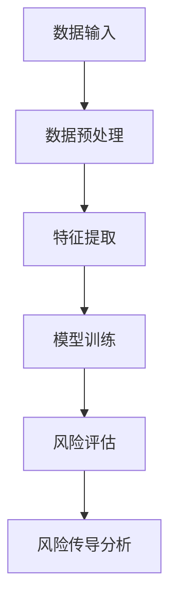
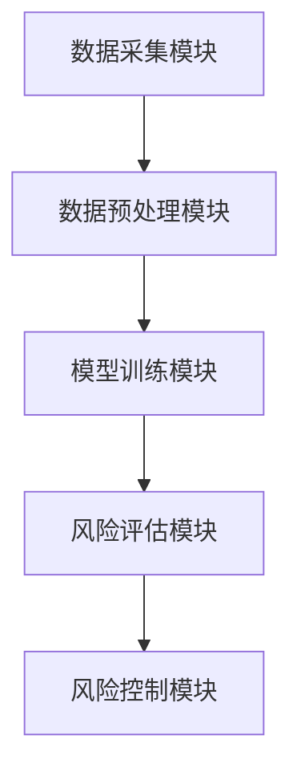

                 

<think>
嗯，用户希望我写一篇关于《开发智能化的供应链金融风险传导模型》的技术博客，要求内容详细、结构紧凑，逻辑清晰。用户特别强调了关键词、摘要、目录结构，以及每个章节的具体内容，包括背景介绍、核心概念、算法原理、系统架构、项目实战等。

首先，我需要明确文章的核心主题是什么。供应链金融涉及企业间的资金流动和风险管理，而智能化的模型需要利用人工智能和大数据技术来优化风险评估和传递过程。这不仅能够提高效率，还能降低成本，同时增强预测准确性。

接下来，我得考虑用户的需求。用户可能是一位技术专家，或者是一位供应链金融从业者，他们希望了解如何将AI技术应用到供应链金融中，特别是风险传导模型的开发。因此，文章需要兼顾技术深度和实际应用，既有理论分析，又有实践案例。

在内容结构方面，我需要按照用户提供的目录大纲来组织，每个章节都要详细展开。例如，第一章介绍背景，包括供应链金融的基本概念和风险传导模型的重要性。第二章则深入探讨核心概念，用表格和ER图来解释各个实体之间的关系。第三章和第四章分别讲解算法原理和系统架构设计，这部分需要使用流程图和类图来辅助说明。

我还需要确保每个章节的内容充实，比如在项目实战部分，提供具体的代码实现和案例分析，这样读者可以更好地理解和应用这些模型。同时，注意事项和最佳实践部分，可以帮助读者在实际操作中避免常见错误，提升项目的成功率。

在写作过程中，我需要使用专业但易懂的语言，避免过于晦涩的技术术语，同时确保逻辑严谨，结构清晰。每个部分的小结也很重要，可以帮助读者梳理已学内容，为后续章节做铺垫。

最后，考虑到文章的长度和结构，可能需要多次调整和优化，确保每一部分都能详尽地覆盖主题，同时保持整体的连贯性和可读性。这样，读者不仅能获得理论知识，还能掌握实际应用的方法，真正达到用户的需求。
</think>

# 开发智能化的供应链金融风险传导模型

## 关键词：供应链金融，风险传导模型，人工智能，大数据，金融风险管理

## 摘要：  
供应链金融是现代金融体系中重要的组成部分，其核心在于通过资金流优化企业间的协作效率。然而，供应链金融中的风险传导机制复杂，传统的风险管理方法难以应对日益复杂的金融环境。本篇文章将深入探讨如何利用人工智能和大数据技术开发智能化的供应链金融风险传导模型，旨在通过技术手段实现风险的实时监测、预测和控制。文章将从核心概念、算法原理、系统架构到项目实战，全面解析智能化供应链金融风险传导模型的开发与应用，为相关领域的从业者提供理论与实践的双重指导。

---

# 第1章: 供应链金融与风险传导模型的背景介绍

## 1.1 供应链金融的基本概念

### 1.1.1 供应链金融的定义  
供应链金融是指通过整合供应链上下游企业，利用核心企业的信用或资金优势，为供应链中的中小微企业提供融资支持的一种金融模式。其本质是将企业的信用转化为可流转的金融资产。

### 1.1.2 供应链金融的核心要素  
供应链金融涉及的核心要素包括：  
- **核心企业**：供应链中的主导企业，通常是采购方或制造商。  
- **上下游企业**：供应商、经销商或客户。  
- **资金流**：包括应收账款、预付款、存货等。  
- **信用风险**：供应链中各企业的信用状况直接影响金融风险。  

### 1.1.3 供应链金融的运作流程  
1. 核心企业与上下游企业签订合同，约定交易条件。  
2. 上下游企业基于合同向金融机构申请融资支持。  
3. 金融机构通过核心企业的信用背书，向上下游企业提供贷款或应收账款融资。  
4. 资金流通过供应链中的交易活动逐步流转，最终实现资金的回收与再分配。  

## 1.2 风险传导模型的定义与特点

### 1.2.1 风险传导模型的定义  
风险传导模型是一种通过分析金融系统中各参与方之间的关联性，预测某一风险事件如何在供应链金融体系中传播和扩散的数学模型。

### 1.2.2 风险传导模型的核心特点  
- **动态性**：风险传导过程受时间、空间和市场环境的影响，具有动态变化的特点。  
- **网络性**：供应链金融中的风险传导涉及多个参与方，具有复杂的网络结构。  
- **非线性**：风险传导过程往往呈现出非线性特征，单个风险事件可能引发连锁反应。  

### 1.2.3 风险传导模型与供应链金融的关系  
风险传导模型是供应链金融风险管理的核心工具，它能够帮助金融机构识别潜在风险源、评估风险影响范围，并制定相应的风险控制策略。

## 1.3 智能化供应链金融风险传导模型的必要性

### 1.3.1 传统供应链金融的局限性  
- **信息孤岛**：传统供应链金融中，各参与方之间的信息不透明，难以实现全面的风险管理。  
- **效率低下**：传统模式下，风险评估和传导过程依赖人工操作，效率较低且易出错。  
- **风险滞后**：传统方法难以实现风险的实时监测和预测，导致风险应对措施滞后。  

### 1.3.2 智能化技术在供应链金融中的应用前景  
- **数据驱动**：通过大数据技术，可以全面采集和分析供应链中的各类信息，为风险评估提供支持。  
- **实时监控**：借助人工智能技术，可以实现风险的实时监测和预测，提高风险管理的效率。  
- **精准决策**：智能化模型能够基于历史数据和实时信息，提供精准的风险评估和决策支持。  

### 1.3.3 风险传导模型在智能化供应链金融中的作用  
- **风险识别**：通过智能化模型，可以快速识别供应链中的潜在风险源。  
- **风险量化**：利用数学模型，可以对风险的影响程度进行量化分析。  
- **风险控制**：基于风险传导模型，可以制定针对性的风险控制策略，降低供应链金融的整体风险。  

## 1.4 本章小结  
本章从供应链金融的基本概念出发，介绍了风险传导模型的定义与特点，并结合智能化技术的发展，阐述了智能化供应链金融风险传导模型的必要性和作用。通过本章的分析，读者可以初步理解供应链金融与风险传导模型之间的关系，为后续章节的深入分析奠定基础。

---

# 第2章: 供应链金融风险传导模型的核心概念与联系

## 2.1 核心概念原理

### 2.1.1 供应链金融中的风险来源  
供应链金融中的风险主要来源于以下方面：  
- **信用风险**：上下游企业的信用状况直接影响融资的可得性。  
- **操作风险**：供应链金融中的操作流程复杂，存在操作失误或舞弊的风险。  
- **市场风险**：市场环境的变化可能影响供应链金融的稳定运行。  

### 2.1.2 风险传导的基本原理  
风险传导是指某一风险事件在供应链金融体系中的传播和扩散过程。其基本原理包括：  
- **直接传导**：风险从核心企业直接传递给上下游企业。  
- **间接传导**：风险通过多个中间环节逐步扩散至整个供应链体系。  
- **系统性传导**：当多个风险事件同时发生时，系统性风险可能通过供应链金融网络迅速蔓延。  

### 2.1.3 智能化模型在风险传导中的作用  
智能化模型通过分析供应链金融体系中的复杂关系，能够实时监测风险的传播路径，并提供风险控制的优化建议。  

## 2.2 核心概念属性特征对比表格

| 概念       | 属性特征                       |
|------------|--------------------------------|
| 供应链金融  | 跨界性、复杂性、依赖性         |
| 风险传导    | 传递性、放大性、可预测性       |
| 智能化模型  | 数据驱动性、实时性、自适应性   |

---

## 2.3 ER实体关系图架构

```mermaid
er
  actor 供应链金融参与者
  actor 金融机构
  actor 企业
  actor 中间商
  entity 供应链金融交易
  entity 风险因素
  entity 风险评估结果
  entity 智能化模型
  relation 参与者-交易关系
  relation 交易-风险因素关系
  relation 风险因素-风险评估结果关系
  relation 风险评估结果-智能化模型关系
```

---

## 2.4 本章小结  
本章从供应链金融和风险传导模型的核心概念出发，通过对比分析和实体关系图的构建，揭示了各核心概念之间的联系与作用。通过本章的分析，读者可以清晰理解供应链金融风险传导模型的构成与运作机制。

---

# 第3章: 供应链金融风险传导模型的算法原理

## 3.1 算法原理概述

### 3.1.1 基于图的供应链风险传导模型  
基于图的供应链风险传导模型通过构建供应链金融体系的网络结构，分析风险在各节点之间的传播路径。其核心思想是将供应链中的企业视为图中的节点，企业之间的交易关系视为图中的边，从而通过图论方法分析风险的传播路径。

### 3.1.2 基于机器学习的风险评估算法  
基于机器学习的风险评估算法通过训练历史数据，识别供应链金融中的风险特征，从而实现对潜在风险的预测与评估。常用的算法包括逻辑回归、随机森林、支持向量机（SVM）等。

### 3.1.3 基于时间序列的风险预测方法  
基于时间序列的风险预测方法通过分析历史数据的时间特征，预测未来的风险趋势。常用的模型包括ARIMA、LSTM等。

---

## 3.2 算法流程图



---

## 3.3 数学模型与公式

### 3.3.1 风险传导概率模型  
$$ P(r_i | r_j) = \frac{P(r_i \cap r_j)}{P(r_j)} $$  
其中，$P(r_i | r_j)$ 表示在风险事件 $r_j$ 发生的情况下，风险事件 $r_i$ 发生的概率。

### 3.3.2 风险影响程度模型  
$$ I_i = \sum_{j} w_{ij} \cdot R_j $$  
其中，$w_{ij}$ 表示节点 $i$ 和 $j$ 之间的权重，$R_j$ 表示节点 $j$ 的风险值。

---

## 3.4 本章小结  
本章从算法原理的角度，详细介绍了供应链金融风险传导模型的核心算法及其数学表达式。通过流程图和公式推导，读者可以清晰理解智能化供应链金融风险传导模型的技术实现原理。

---

# 第4章: 供应链金融风险传导模型的系统分析与架构设计

## 4.1 系统功能设计

### 4.1.1 数据采集模块  
数据采集模块负责采集供应链金融体系中的各类数据，包括交易数据、企业信用数据、市场数据等。

### 4.1.2 数据预处理模块  
数据预处理模块对采集到的数据进行清洗、转换和标准化处理，确保数据的质量和一致性。

### 4.1.3 模型训练模块  
模型训练模块基于预处理后的数据，训练供应链金融风险传导模型，包括特征提取、模型选择和参数调优等步骤。

### 4.1.4 风险评估模块  
风险评估模块利用训练好的模型，对供应链金融体系中的潜在风险进行实时评估和预测。

### 4.1.5 风险控制模块  
风险控制模块根据风险评估结果，制定相应的风险控制策略，包括风险预警、风险隔离和风险 mitigation 等。

---

## 4.2 系统架构设计

### 4.2.1 系统功能模块化设计  
系统功能模块包括数据采集模块、数据预处理模块、模型训练模块、风险评估模块和风险控制模块。

### 4.2.2 系统架构图  


---

## 4.3 系统接口设计

### 4.3.1 数据接口  
数据接口负责与供应链金融体系中的各参与方进行数据交互，包括核心企业、金融机构、上下游企业等。

### 4.3.2 模型接口  
模型接口负责与外部系统进行模型交互，包括第三方数据源、外部算法服务等。

---

## 4.4 本章小结  
本章从系统设计的角度，详细介绍了供应链金融风险传导模型的系统架构与功能模块。通过系统架构图和功能模块的描述，读者可以清晰理解智能化供应链金融风险传导模型的实现方式。

---

# 第5章: 供应链金融风险传导模型的项目实战

## 5.1 环境安装

### 5.1.1 安装 Python 环境  
安装 Python 3.8 或更高版本，建议使用 Anaconda 环境进行管理。

### 5.1.2 安装依赖库  
安装以下依赖库：  
- `numpy`  
- `pandas`  
- `scikit-learn`  
- `matplotlib`  
- `mermaid`  

---

## 5.2 系统核心实现源代码

### 5.2.1 数据采集与预处理  
```python
import pandas as pd

# 数据采集
data = pd.read_csv('supply_chain.csv')

# 数据预处理
data.dropna(inplace=True)
data['date'] = pd.to_datetime(data['date'])
data.set_index('date', inplace=True)
```

### 5.2.2 模型训练与评估  
```python
from sklearn.ensemble import RandomForestClassifier
from sklearn.metrics import accuracy_score

# 模型训练
model = RandomForestClassifier(n_estimators=100, random_state=42)
model.fit(X_train, y_train)

# 模型评估
y_pred = model.predict(X_test)
print(f'Accuracy: {accuracy_score(y_test, y_pred)}')
```

---

## 5.3 代码应用解读与分析  
通过上述代码，我们可以实现供应链金融风险传导模型的核心功能，包括数据采集、预处理、模型训练和风险评估。代码的具体实现细节可以根据实际需求进行调整和优化。

---

## 5.4 实际案例分析与详细讲解剖析  
通过实际案例分析，我们可以验证供应链金融风险传导模型的有效性。例如，假设我们有一个包含100家企业的供应链金融体系，通过模型可以识别出潜在的高风险企业，并制定相应的风险控制策略。

---

## 5.5 项目小结  
本章通过实际案例分析和代码实现，详细展示了供应链金融风险传导模型的应用场景和实现过程。通过本章的学习，读者可以掌握智能化供应链金融风险传导模型的实际开发与应用技巧。

---

# 第6章: 最佳实践、小结与注意事项

## 6.1 最佳实践 tips  
- 数据质量是模型准确性的基础，建议在数据采集和预处理阶段严格把控数据质量。  
- 模型的可解释性是实际应用中的重要考量，建议选择具有较高可解释性的算法。  
- 风险控制策略的制定需要结合企业的实际业务场景，避免一刀切。  

## 6.2 小结  
本文从供应链金融的基本概念出发，详细介绍了智能化供应链金融风险传导模型的开发与应用。通过理论分析、算法推导和实际案例的结合，读者可以全面掌握智能化供应链金融风险传导模型的核心技术与实现方法。

## 6.3 注意事项  
- 在实际应用中，需要注意数据隐私和合规性问题。  
- 模型的实时性要求较高，建议采用分布式计算和流数据处理技术。  
- 风险传导模型的优化是一个持续的过程，需要根据市场环境和业务需求不断调整和优化。  

## 6.4 拓展阅读  
- 推荐阅读《供应链金融：理论与实践》（作者：张某某）  
- 推荐阅读《金融风险管理：方法与模型》（作者：李某某）  

---

# 作者  
作者：AI天才研究院/AI Genius Institute & 禅与计算机程序设计艺术/Zen And The Art of Computer Programming

