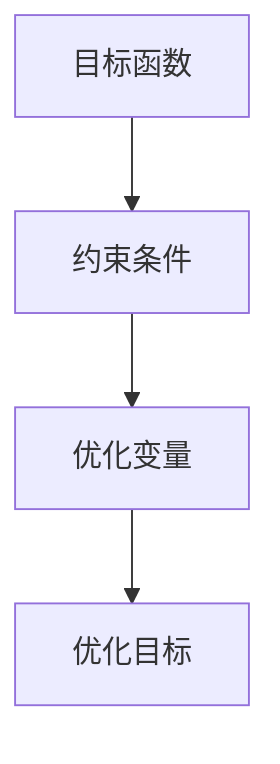
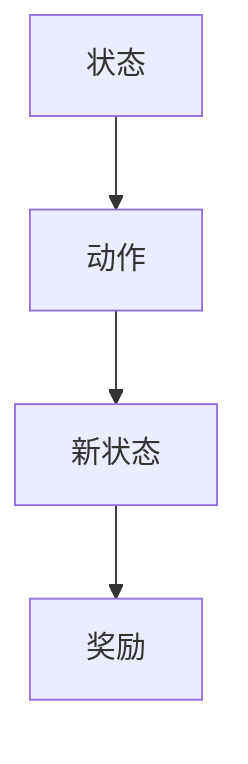
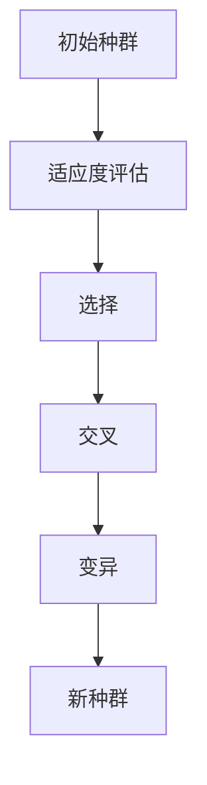
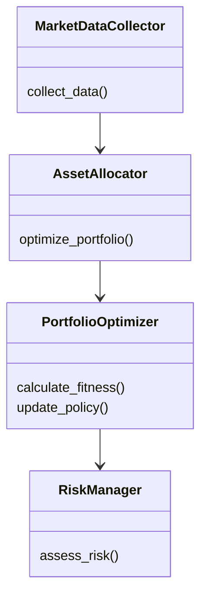
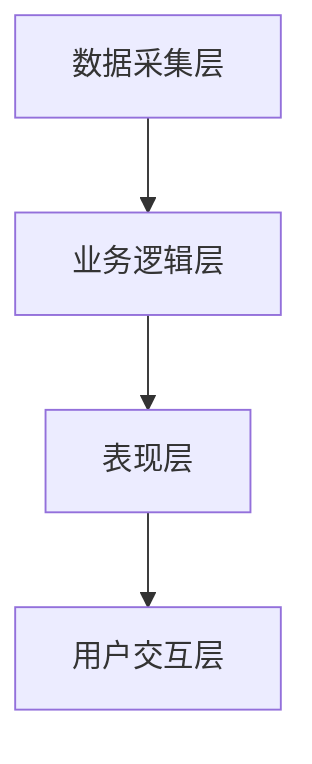
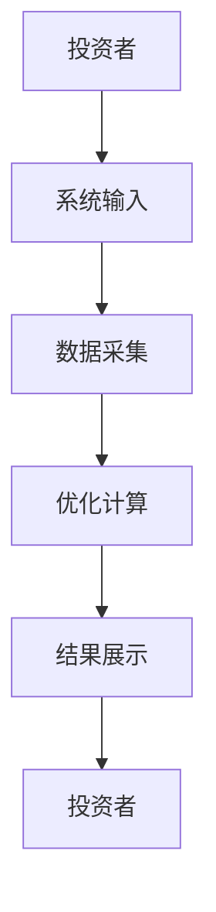

                 


# 开发智能化的资产配置优化模型

## 关键词：资产配置、人工智能、优化模型、投资组合、金融技术

## 摘要：  
资产配置是金融投资中的核心问题之一，其目标是通过科学的方法在不同资产类别中分配资金，以实现收益与风险的最佳平衡。随着人工智能技术的快速发展，智能化资产配置优化模型逐渐成为金融领域的研究热点。本文将从资产配置优化模型的背景、核心概念、算法原理、系统设计、项目实战等多个方面展开分析，深入探讨如何利用人工智能技术开发高效的资产配置优化模型。通过本文的学习，读者将能够理解智能化资产配置的核心思想，并掌握相关模型的实现方法。

---

## 第一部分: 资产配置优化模型的背景与核心概念

### 第1章: 资产配置优化模型的背景介绍

#### 1.1 问题背景
##### 1.1.1 投资者面临的资产配置挑战  
在金融市场上，投资者需要在不同资产类别（如股票、债券、基金等）之间分配资金，以实现投资目标。然而，市场的不确定性和投资者的多样化需求使得资产配置成为一个复杂的优化问题。传统的资产配置方法往往依赖于经验和主观判断，难以应对市场的快速变化和复杂性。

##### 1.1.2 传统资产配置方法的局限性  
传统资产配置方法通常基于历史数据和统计分析，例如均值-方差模型（Modern Portfolio Theory，MPT）。然而，这种方法存在以下问题：
- 无法有效应对市场波动和突发事件。
- 依赖于历史数据的假设，可能无法准确预测未来市场趋势。
- 无法处理多目标优化问题（如在风险和收益之间进行权衡）。

##### 1.1.3 智能化资产配置的必要性  
随着人工智能技术的发展，智能化资产配置优化模型能够通过大数据分析和机器学习算法，实时捕捉市场信号并动态调整资产配置策略。这种方法能够有效应对市场的不确定性，并为投资者提供更加科学和个性化的投资建议。

---

#### 1.2 资产配置优化模型的定义
##### 1.2.1 资产配置的基本概念  
资产配置是指将投资组合分配到不同资产类别（如股票、债券、房地产等）中的过程。合理的资产配置能够降低投资风险，同时最大化投资收益。

##### 1.2.2 优化模型的核心目标  
资产配置优化模型的目标是找到一个最优的投资组合，使得在给定风险水平下，投资收益最大化；或者在给定收益水平下，风险最小化。

##### 1.2.3 模型的边界与外延  
- **边界条件**：市场环境、投资者风险承受能力、投资期限等。
- **外延**：模型不仅适用于个人投资者，还可以应用于机构投资、基金管理和风险管理等领域。

---

#### 1.3 智能化资产配置的现状与趋势
##### 1.3.1 人工智能在金融领域的应用现状  
人工智能技术（如机器学习、深度学习）已经在金融领域的多个方面得到广泛应用，包括股票预测、风险评估、交易策略等。

##### 1.3.2 资产配置优化的智能化发展趋势  
智能化资产配置优化模型的核心是利用大数据和机器学习算法，实时分析市场数据并动态调整投资组合。

##### 1.3.3 当前市场中的主要技术挑战  
- 数据质量问题：市场数据的噪声和缺失可能影响模型的准确性。
- 模型的可解释性：复杂的机器学习模型可能难以解释其决策过程。
- 计算效率问题：大规模数据处理和实时优化需要高效的计算能力。

---

#### 1.4 智能化资产配置的解决思路
##### 1.4.1 数据驱动的优化方法  
通过收集和分析市场数据，利用统计学习和机器学习算法构建预测模型，指导资产配置决策。

##### 1.4.2 模型驱动的优化策略  
基于金融理论（如MPT）构建数学模型，结合优化算法（如遗传算法、强化学习）求解最优投资组合。

##### 1.4.3 结合数据与模型的混合方法  
将数据驱动和模型驱动的方法结合起来，利用数据驱动方法捕捉市场动态，同时利用模型驱动方法进行长期规划。

---

#### 1.5 本章小结  
本章主要介绍了资产配置优化模型的背景、定义和智能化发展的必要性。通过分析传统方法的局限性和人工智能技术的优势，我们明确了开发智能化资产配置优化模型的必要性和目标。

---

### 第2章: 资产配置优化模型的核心概念

#### 2.1 核心概念与属性对比
##### 2.1.1 目标函数的属性特征  
目标函数是优化模型的核心，通常表示为收益最大化或风险最小化。  
- **收益函数**：常用夏普比率或年化收益表示。
- **风险函数**：常用方差、VaR（Value at Risk）或最大回撤表示。

##### 2.1.2 约束条件的属性特征  
约束条件用于限制优化模型的可行解空间，例如：
- 资金分配比例限制（如每种资产的投资比例不能超过20%）。
- 投资组合的流动性要求。
- 风险承受能力限制。

##### 2.1.3 优化算法的属性特征  
优化算法用于求解目标函数在约束条件下的最优解，例如：
- 确定性算法：如梯度下降、拉格朗日乘数法。
- 随机化算法：如遗传算法、模拟退火。

#### 2.2 核心概念的ER实体关系图  
以下是一个简单的ER实体关系图，展示了目标函数、约束条件和优化变量之间的关系：  


#### 2.3 核心概念的联系与区别
##### 2.3.1 目标函数与约束条件的联系  
目标函数和约束条件共同定义了优化问题的解空间。目标函数决定了优化的方向，而约束条件限定了优化的范围。

##### 2.3.2 约束条件与优化变量的关系  
优化变量是目标函数和约束条件的输入变量，约束条件通过限制优化变量的取值范围，影响目标函数的优化结果。

##### 2.3.3 优化算法与目标函数的结合方式  
不同的优化算法适用于不同类型的目标函数和约束条件。例如，强化学习适用于动态优化问题，而遗传算法适用于离散优化问题。

---

#### 2.4 本章小结  
本章通过对比分析目标函数、约束条件和优化算法的核心属性，揭示了它们在资产配置优化模型中的作用和相互关系。

---

## 第二部分: 资产配置优化模型的算法原理

### 第3章: 资产配置优化模型的算法原理

#### 3.1 强化学习算法
##### 3.1.1 强化学习的基本原理  
强化学习是一种基于奖励机制的机器学习方法，通过智能体与环境的交互，逐步学习最优策略。  
- **智能体**：在资产配置中，智能体可以表示为一个投资组合优化器。
- **环境**：表示金融市场，智能体会根据当前状态（市场数据）采取动作（调整投资组合）。
- **奖励机制**：根据投资组合的收益和风险表现，给予奖励或惩罚。

##### 3.1.2 在资产配置中的应用  
强化学习可以用于动态资产配置问题，例如根据市场波动实时调整投资比例。

##### 3.1.3 算法流程图  
以下是一个强化学习算法的流程图：  


##### 3.1.4 代码实现  
以下是一个简单的强化学习算法框架：  
```python
class Agent:
    def __init__(self, state_space, action_space):
        self.state_space = state_space
        self.action_space = action_space
        # 初始化策略网络
        self.policy = PolicyNetwork(state_space, action_space)
    
    def take_action(self, state):
        # 根据当前状态选择动作
        action = self.policy.predict(state)
        return action
    
    def update_policy(self, rewards):
        # 根据奖励更新策略
        self.policy.update(rewards)
```

#### 3.2 遗传算法
##### 3.2.1 遗传算法的基本原理  
遗传算法是一种模拟生物进化过程的优化算法，通过选择、交叉和变异操作生成新的解。

##### 3.2.2 在资产配置中的应用  
遗传算法可以用于静态资产配置问题，例如在给定时间段内优化投资组合。

##### 3.2.3 算法流程图  
以下是一个遗传算法的流程图：  


##### 3.2.4 代码实现  
以下是一个简单的遗传算法框架：  
```python
def genetic_algorithm(population_size, generations):
    population = initialize_population(population_size)
    for _ in range(generations):
        fitness = evaluate_fitness(population)
        selected = select_parents(population, fitness)
        offspring = crossover(selected)
        mutate(offspring)
        population = offspring
    return best_candidate(population)
```

#### 3.3 算法的数学模型与公式
##### 3.3.1 强化学习的数学模型  
强化学习的目标是通过最大化累积奖励来学习最优策略。数学表示如下：  
$$ R = \sum_{t=1}^{T} r_t $$  
其中，$r_t$ 是第 $t$ 步的奖励，$T$ 是时间步数。

##### 3.3.2 遗传算法的数学模型  
遗传算法的核心是通过交叉和变异操作生成新的解。数学表示如下：  
$$ x_{new} = x_{parent1} \cdot crossover\_rate + x_{parent2} \cdot (1 - crossover\_rate) $$  
其中，$x_{parent1}$ 和 $x_{parent2}$ 是父代解，$crossover\_rate$ 是交叉概率。

---

#### 3.4 本章小结  
本章详细介绍了强化学习和遗传算法在资产配置优化中的应用，并通过数学模型和代码实现展示了这些算法的具体实现方式。

---

## 第三部分: 资产配置优化模型的系统设计

### 第4章: 资产配置优化系统的系统分析与架构设计

#### 4.1 问题场景介绍
##### 4.1.1 投资者需求分析  
投资者希望通过资产配置优化模型实现以下目标：
- 最大化投资收益。
- 最小化投资风险。
- 动态调整投资组合以应对市场变化。

##### 4.1.2 问题描述  
本文将设计一个智能化的资产配置优化系统，能够根据市场数据和投资者需求，实时优化投资组合。

---

#### 4.2 系统功能设计
##### 4.2.1 系统功能模块  
系统功能模块包括：
- 数据采集模块：收集市场数据（如股票价格、债券收益率）。
- 模型计算模块：运行资产配置优化算法。
- 结果展示模块：将优化结果以可视化形式呈现。

##### 4.2.2 领域模型（mermaid类图）  
以下是一个系统的领域模型：  


#### 4.3 系统架构设计
##### 4.3.1 系统架构图  
以下是一个系统的分层架构图：  


##### 4.3.2 接口设计  
系统需要以下接口：
- 数据接口：与数据源（如金融数据库）对接。
- 用户接口：与投资者进行交互，获取投资需求。
- 输出接口：将优化结果输出给投资者或上层系统。

##### 4.3.3 交互流程图  
以下是一个系统的交互流程图：  


---

#### 4.4 本章小结  
本章通过对系统需求的分析，设计了一个智能化的资产配置优化系统，并通过领域模型和架构图展示了系统的整体结构。

---

## 第四部分: 资产配置优化模型的项目实战

### 第5章: 资产配置优化模型的实现

#### 5.1 环境安装与配置
##### 5.1.1 环境要求  
- 操作系统：Linux/Windows/MacOS
- Python版本：3.6+
- 需要的库：numpy、pandas、matplotlib、scikit-learn、tensorflow

##### 5.1.2 安装步骤  
```bash
pip install numpy pandas matplotlib scikit-learn tensorflow
```

---

#### 5.2 核心代码实现
##### 5.2.1 数据预处理  
以下是一个数据预处理的代码示例：  
```python
import pandas as pd
import numpy as np

# 加载数据
data = pd.read_csv('market_data.csv')

# 数据清洗
data = data.dropna()
data = pd.get_dummies(data)
```

##### 5.2.2 模型训练  
以下是一个强化学习模型的训练代码：  
```python
import tensorflow as tf
from tensorflow.keras import layers

# 定义策略网络
def build_policy_network(state_size, action_size):
    model = tf.keras.Sequential()
    model.add(layers.Dense(64, activation='relu', input_dim=state_size))
    model.add(layers.Dense(action_size, activation='softmax'))
    return model

# 初始化模型
policy = build_policy_network(state_size, action_size)
```

##### 5.2.3 结果分析  
以下是一个优化结果的可视化代码：  
```python
import matplotlib.pyplot as plt

# 绘制优化曲线
plt.plot(history.history['reward'], label='Reward')
plt.xlabel('Epoch')
plt.ylabel('Reward')
plt.legend()
plt.show()
```

---

#### 5.3 项目实战：案例分析
##### 5.3.1 案例背景  
假设我们有一个包含股票、债券和房地产的投资组合，需要在风险可控的前提下实现收益最大化。

##### 5.3.2 数据分析  
以下是一个案例的数据分析结果：  
- 股票的预期年化收益为8%，波动率为15%。
- 债券的预期年化收益为5%，波动率为5%。
- 房地产的预期年化收益为7%，波动率为10%。

##### 5.3.3 模型优化  
优化结果：投资组合中股票占60%，债券占20%，房地产占20%。  
优化结果的夏普比率为2.5，风险调整后的收益较高。

##### 5.3.4 案例小结  
通过智能化资产配置优化模型，我们成功找到了一个风险可控、收益较高的投资组合。

---

#### 5.4 本章小结  
本章通过具体的项目实战，展示了资产配置优化模型的实现过程，并通过案例分析验证了模型的有效性。

---

## 第五部分: 最佳实践与总结

### 第6章: 最佳实践与总结

#### 6.1 最佳实践
##### 6.1.1 数据预处理的重要性  
- 数据清洗：去除缺失值和异常值。
- 数据标准化：对不同资产的收益率进行标准化处理。

##### 6.1.2 模型调优的技巧  
- 超参数优化：使用网格搜索或随机搜索优化模型参数。
- 模型组合：将多个模型的结果进行组合，提高整体性能。

##### 6.1.3 结果验证的方法  
- 回测：在历史数据上验证模型的性能。
- 稳健性测试：测试模型在不同市场环境下的表现。

---

#### 6.2 本章小结  
本文通过详细分析资产配置优化模型的背景、核心概念、算法原理、系统设计和项目实战，为读者提供了一个全面的开发指南。通过本文的学习，读者可以掌握智能化资产配置的核心思想，并能够实际应用这些模型进行投资决策。

---

## 作者：AI天才研究院/AI Genius Institute & 禅与计算机程序设计艺术/Zen And The Art of Computer Programming

