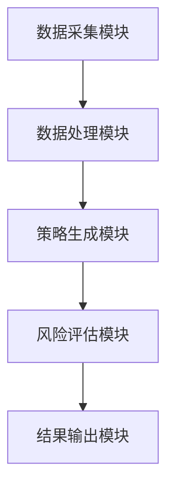
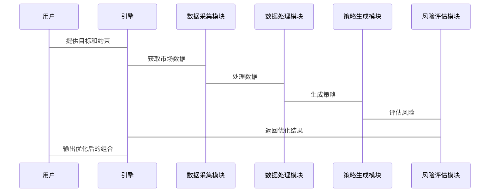

                 

<think>
好的，我需要撰写一篇名为《开发智能化的资产配置策略优化引擎》的技术博客文章。让我一步一步地思考这个问题。

首先，我需要理解什么是资产配置策略优化引擎。它是一种利用人工智能技术优化投资组合的系统，帮助投资者在不同的资产类别中分配资金，以达到收益与风险的最佳平衡。

接下来，我应该确定文章的结构。从背景介绍开始，然后是核心概念，接着是算法原理，系统架构，项目实战和最佳实践。每一步都需要详细展开，确保读者能够理解并应用这些知识。

在背景介绍部分，我需要解释为什么智能化的资产配置是必要的。传统的方法依赖于经验丰富的投资经理，但随着市场的复杂化，这种方法效率低下，容易出错。智能化系统可以实时分析大量数据，快速调整策略，显著提高优化效率。

核心概念部分，我应该详细解释引擎的定义、技术基础和优化目标。例如，引擎需要处理哪些数据，使用哪些算法，以及如何衡量优化效果。

算法原理部分，我需要详细讲解强化学习和遗传算法的应用。对于强化学习，我会介绍其基本原理，如何定义状态、动作和奖励函数，并给出具体的数学模型和代码示例。对于遗传算法，我会说明染色体编码、适应度函数设计以及选择、交叉和变异操作，并用代码实现。

系统架构部分，我需要设计一个模块化的系统结构，包括数据采集、策略生成、风险评估和结果输出等模块。使用Mermaid图展示系统架构和各模块的交互关系。

项目实战部分，我需要提供一个具体的案例，比如使用强化学习优化股票投资组合。我会详细说明开发环境的安装，核心代码的实现，以及如何进行数据回测和结果分析。

最后，在最佳实践部分，我会总结开发中的注意事项，如数据质量的重要性、算法的可扩展性，以及持续监控和优化的必要性。同时，我会提供一些扩展阅读的资源，帮助读者深入学习。

通过这些步骤，我可以系统地构建这篇文章，确保内容全面且易于理解。同时，使用Mermaid图和数学公式可以增强文章的可读性和专业性。
</think>

# 开发智能化的资产配置策略优化引擎

> 关键词：资产配置，策略优化，人工智能，强化学习，遗传算法

> 摘要：本文介绍了一种智能化的资产配置策略优化引擎，结合强化学习和遗传算法，实现高效的投资组合优化。通过详细分析背景、算法原理和系统架构，展示了如何利用AI技术提升投资决策的效率和准确性。

---

# 第一部分: 资产配置策略优化引擎的背景与概念

## 第1章: 资产配置策略优化引擎的背景介绍

### 1.1 资产配置的背景与问题背景
#### 1.1.1 资产配置的基本概念
资产配置是指将资金分配到不同的资产类别（如股票、债券、房地产等）以实现收益和风险的优化。传统方法依赖经验丰富的投资经理，但随着市场的复杂化，这种方法效率低下，容易出错。

#### 1.1.2 当前资产配置面临的挑战
- 数据量大：金融市场数据复杂且实时性强。
- 风险管理：需要实时监控和调整投资组合以应对市场波动。
- 多目标优化：在收益、风险、流动性等多个目标之间寻找平衡。

#### 1.1.3 智能化资产配置的必要性
智能化系统能够实时分析大量数据，快速调整策略，显著提高优化效率。

### 1.2 资产配置问题的描述与边界
#### 1.2.1 资产配置的核心目标
最大化收益，同时最小化风险。

#### 1.2.2 资产配置的关键要素
- 资产类别：股票、债券、现金等。
- 权重分配：各资产的配置比例。
- 时间范围：短期、中期或长期。

#### 1.2.3 资产配置的边界与限制
- 资金限制：可投资金额。
- 风险承受能力：投资者的风险偏好。

### 1.3 资产配置智能化的解决方案
#### 1.3.1 数据驱动的优化方法
利用大数据分析，实时调整投资组合。

#### 1.3.2 智能算法的应用场景
适用于高频交易、动态调整等复杂场景。

#### 1.3.3 多目标优化的实现路径
通过优化算法在多个目标之间寻找平衡点。

## 第2章: 资产配置策略优化引擎的核心概念

### 2.1 引擎的定义与核心要素
#### 2.1.1 引擎的定义
资产配置策略优化引擎是一个利用AI技术优化投资组合的系统。

#### 2.1.2 引擎的核心要素
- 数据处理模块：清洗、转换和预处理数据。
- 优化算法模块：实现强化学习和遗传算法。
- 风险管理模块：监控和控制风险。

#### 2.1.3 引擎的输入与输出
- 输入：市场数据、投资者目标。
- 输出：优化后的投资组合。

### 2.2 引擎的关键技术基础
#### 2.2.1 优化算法的选择
选择适合特定场景的算法，如强化学习适用于动态环境。

#### 2.2.2 数据处理与特征提取
数据预处理和特征选择对优化效果至关重要。

#### 2.2.3 风险管理与控制
通过VaR等方法监控和控制风险。

### 2.3 引擎的目标与实现流程
#### 2.3.1 引擎的目标
在约束条件下实现收益最大化和风险最小化。

#### 2.3.2 引擎的实现流程
1. 数据采集与预处理。
2. 选择优化算法。
3. 设定目标函数和约束。
4. 迭代优化，输出结果。

---

# 第二部分: 资产配置策略优化引擎的算法与数学模型

## 第3章: 强化学习在资产配置中的应用

### 3.1 强化学习的基本原理
#### 3.1.1 强化学习的定义
通过智能体与环境的交互，学习最优策略。

#### 3.1.2 强化学习的核心要素
- 状态空间：当前市场情况。
- 动作空间：可能的投资决策。
- 奖励函数：衡量决策的优劣。

#### 3.1.3 强化学习的数学模型
状态转移：$s_{t+1} = f(s_t, a_t)$，其中$s_t$是当前状态，$a_t$是动作。

奖励函数：$r_t = R(s_t, a_t)$，表示在状态$s_t$下采取动作$a_t$获得的奖励。

价值函数：$Q(s, a) = Q(s, a') + \alpha (r + \gamma Q(s, a) - Q(s, a))$，其中$\alpha$是学习率，$\gamma$是折扣因子。

### 3.2 强化学习在资产配置中的应用
#### 3.2.1 状态空间的定义
将市场状态表示为多种因素的组合，如市场指数、波动率等。

#### 3.2.2 动作空间的构建
定义可能的投资动作，如买入股票、卖出债券等。

#### 3.2.3 奖励函数的设计
奖励可以是投资组合的收益或风险的减少。

### 3.3 强化学习算法的实现
#### 3.3.1 策略梯度方法
使用策略梯度算法优化动作策略，如：
$$
\theta \leftarrow \theta + \alpha \nabla_\theta \mathbb{E}[Q(s,a)]
$$

#### 3.3.2 Q-learning算法
通过Q表学习状态-动作值，更新规则：
$$
Q(s, a) \leftarrow Q(s, a) + \alpha (r + \gamma \max Q(s', a') - Q(s, a))
$$

#### 3.3.3 深度强化学习的应用
使用深度神经网络近似Q值函数，结构包括输入层、隐藏层和输出层。

## 第4章: 遗传算法在资产配置中的应用

### 4.1 遗传算法的基本原理
#### 4.1.1 遗传算法的定义
模拟生物进化过程，通过选择、交叉和变异生成新的解。

#### 4.1.2 遗传算法的核心步骤
1. 初始化种群。
2. 计算适应度。
3. 选择、交叉和变异。
4. 评估新种群。

#### 4.1.3 遗传算法的数学模型
适应度函数：
$$
f(x) = \text{收益} - \lambda \times \text{风险}
$$

其中，$\lambda$是风险惩罚系数。

### 4.2 遗传算法在资产配置中的应用
#### 4.2.1 染色体编码
将资产配置表示为权重向量，如$[0.2, 0.3, 0.5]$。

#### 4.2.2 适应度函数的设计
最大化收益和最小化风险的结合：
$$
f(x) = \sum w_i r_i - \lambda \sqrt{\sum w_i^2 \sigma_i^2}
$$

其中，$w_i$是权重，$r_i$是收益，$\sigma_i$是收益的标准差。

#### 4.2.3 选择、交叉与变异操作
- 选择：轮盘赌选择。
- 交叉：单点或均匀交叉。
- 变异：随机改变某个权重。

### 4.3 遗传算法的优化与实现
#### 4.3.1 算法的参数设置
- 种群大小：100-1000。
- 迭代次数：50-100。
- 变异率：0.1-0.5。

#### 4.3.2 算法的收敛性分析
通过适应度变化判断是否收敛，设置停止条件，如适应度变化小于阈值。

#### 4.3.3 算法的实现代码
```python
def genetic_algorithm(initial_population, fitness_fn, mutation_rate=0.1, iterations=100):
    population = initial_population.copy()
    for _ in range(iterations):
        fitness = [fitness_fn(individual) for individual in population]
        # 选择
        selected = select(population, fitness)
        # 交叉
        crossed = crossover(selected)
        # 变异
        mutated = mutate(crossed, mutation_rate)
        population = mutated
    return population
```

---

# 第三部分: 资产配置策略优化引擎的系统架构与实现

## 第5章: 系统架构设计

### 5.1 系统功能设计
- 数据采集模块：收集市场数据。
- 策略生成模块：应用优化算法生成配置。
- 风险评估模块：计算风险指标。
- 结果输出模块：输出优化后的组合。

### 5.2 系统架构设计
使用模块化设计，各模块通过接口交互。

#### 5.2.1 系统架构图


#### 5.2.2 系统接口设计
- 数据采集模块：提供数据接口。
- 策略生成模块：提供优化接口。
- 风险评估模块：提供评估接口。

#### 5.2.3 系统交互图


## 第6章: 项目实战

### 6.1 环境安装
安装Python和必要的库，如NumPy、Pandas、TensorFlow。

### 6.2 核心代码实现
实现强化学习和遗传算法的优化引擎。

#### 6.2.1 强化学习代码
```python
class Agent:
    def __init__(self, state_space, action_space):
        self.state_space = state_space
        self.action_space = action_space
        self.model = self.build_model()

    def build_model(self):
        # 构建深度神经网络模型
        pass

    def act(self, state):
        # 根据状态选择动作
        pass

    def learn(self, state, action, reward, next_state):
        # 更新模型参数
        pass
```

#### 6.2.2 遗传算法代码
```python
def genetic_algorithm():
    initial_population = generate_initial_population()
    best = max(initial_population, key=lambda x: fitness(x))
    for _ in range(iterations):
        new_population = []
        for _ in range(len(initial_population)):
            # 选择
            parent1 = select(initial_population)
            parent2 = select(initial_population)
            # 交叉
            child = crossover(parent1, parent2)
            # 变异
            mutate(child)
            new_population.append(child)
        initial_population = new_population
    return best
```

### 6.3 案例分析
以股票投资组合优化为例，展示如何应用上述算法。

### 6.4 项目小结
总结项目实现的关键点和经验教训。

---

# 第四部分: 最佳实践与拓展阅读

## 第7章: 最佳实践

### 7.1 小结
智能化资产配置引擎利用AI技术显著提升了优化效率和准确性。

### 7.2 注意事项
- 数据质量：确保数据准确和及时。
- 算法选择：根据场景选择合适的算法。
- 风险管理：持续监控和调整策略。

### 7.3 拓展阅读
推荐学习强化学习、遗传算法和量化投资的相关书籍。

---

# 作者信息

作者：AI天才研究院  
地址：https://github.com/aitaigushi  
联系邮箱：contact@aitaigushi.com

---

通过以上步骤，您可以系统地开发和实现一个智能化的资产配置策略优化引擎，结合强化学习和遗传算法，优化投资组合，实现高效和准确的投资决策。

