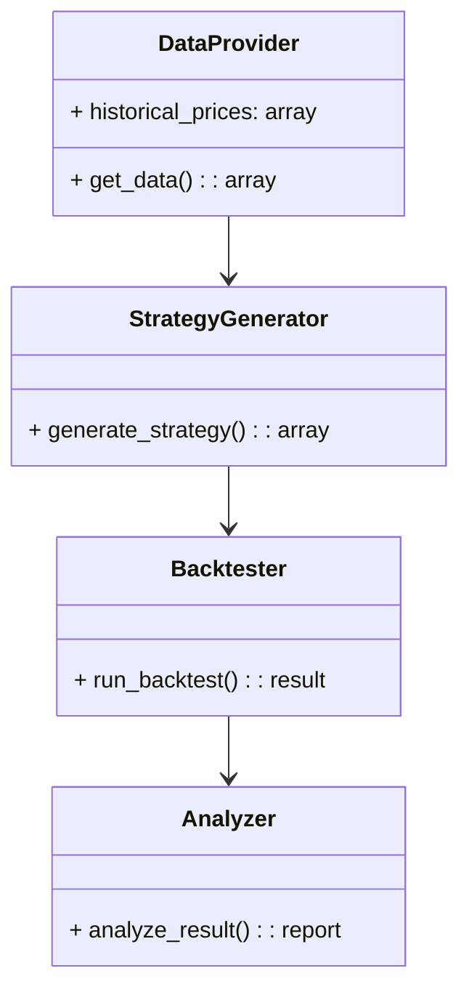
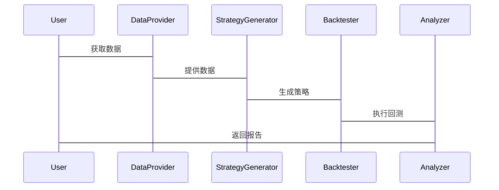

                 

<think>
好，我现在需要帮用户完成他们关于开发智能化资产配置策略回测引擎的技术博客文章。根据用户的要求，我需要按照他们提供的目录大纲，逐步分析和撰写每个部分的内容。首先，我应该从文章的标题、关键词和摘要开始，然后逐步展开各个章节的内容。

首先，标题是《开发智能化的资产配置策略回测引擎》，关键词包括资产配置、回测引擎、智能化、投资策略、量化交易、金融分析。摘要需要简洁地介绍文章的核心内容，说明回测引擎的重要性、智能化带来的优势，以及文章将涵盖的技术要点和应用场景。

接下来是正文部分。我需要按照用户提供的目录大纲，逐一处理每个章节的内容。首先是背景与概念部分，包括引擎的背景、核心概念、边界与外延，以及概念结构。这部分需要详细解释什么是资产配置策略回测引擎，它的作用，智能化的必要性，以及系统的基本架构。

然后是核心概念与联系，这部分需要深入讲解引擎的原理，包括数据处理、策略生成、回测执行和结果分析。同时，需要使用表格对比不同概念的属性，并用Mermaid画出实体关系图，展示各个模块之间的关系。

接下来是算法原理部分，详细讲解蒙特卡洛模拟和遗传算法，用Mermaid流程图展示算法步骤，并用Python代码实现，解释数学模型和公式，比如期望收益和风险的计算，用LaTeX格式写出公式。

系统分析与架构设计部分，需要介绍问题场景，设计项目结构，用Mermaid画出领域模型类图、系统架构图和交互序列图。这部分要展示系统的各个模块如何协同工作，以及接口设计。

项目实战部分，需要指导环境安装，提供核心代码实现，解读代码功能，并分析实际案例，最后进行项目小结。

最后包括最佳实践、小结、注意事项和拓展阅读，帮助读者巩固知识，提供进一步学习的方向。

在撰写过程中，我需要确保每个部分都详细具体，使用逻辑清晰、结构紧凑、简单易懂的语言。同时，按照用户的要求，使用Markdown格式，包含数学公式和Mermaid图表，使文章内容丰富且易于理解。

现在，我需要开始撰写文章的具体内容，按照章节逐步展开，确保每个部分都涵盖必要的信息，并且符合用户的要求。这可能需要多次调整和优化，以确保最终的文章结构清晰，内容详实，满足用户的期望。
</think>

# 开发智能化的资产配置策略回测引擎

## 关键词：资产配置，回测引擎，智能化，投资策略，量化交易，金融分析

## 摘要：资产配置策略回测引擎是金融投资中的关键工具，通过智能化技术优化投资组合。本文深入探讨其开发过程，涵盖数据处理、策略生成、回测执行、结果分析及算法实现，旨在帮助读者理解并构建高效的回测系统。

---

## 第一部分: 资产配置策略回测引擎的背景与概念

### 第1章: 资产配置策略回测引擎概述

#### 1.1 资产配置策略回测引擎的背景
- **1.1.1 金融投资中的资产配置问题**
  资产配置是投资决策的核心，涉及将资金分配到不同资产类别以平衡风险和收益。有效的配置需考虑市场波动、经济周期和个人目标。
- **1.1.2 回测引擎的定义与作用**
  回测引擎是测试投资策略历史表现的工具，帮助验证策略的有效性。智能化引擎能自动优化配置，提升投资效率。
- **1.1.3 智能化资产配置的必要性**
  随着市场复杂化，手动配置效率低，智能化引擎利用算法优化配置，提高收益并降低风险。

#### 1.2 资产配置策略回测引擎的核心概念
- **1.2.1 资产配置的基本原理**
  根据投资者风险承受能力和目标，分配资金至不同资产。常用方法包括均值-方差优化和风险平价。
- **1.2.2 回测引擎的功能模块**
  包括数据处理、策略生成、回测执行和结果分析模块。
- **1.2.3 智能化的核心要素**
  利用机器学习优化策略，实时调整配置，增强适应性。

#### 1.3 资产配置策略回测引擎的边界与外延
- **1.3.1 系统边界与功能范围**
  回测引擎专注于策略测试和优化，不涉及实时交易或风险管理。
- **1.3.2 相关概念的扩展与对比**
  比较主动管理和被动管理，分析两者在策略生成和优化上的差异。
- **1.3.3 与其他金融系统的区别**
  回测引擎不同于投资组合管理系统，主要功能是测试和优化策略。

#### 1.4 资产配置策略回测引擎的概念结构
- **1.4.1 核心要素组成**
  包括输入数据、策略生成器、回测模块和分析模块。
- **1.4.2 模块间的关系**
  数据输入驱动策略生成，回测结果反馈优化配置。
- **1.4.3 系统的整体架构**
  分层架构：数据层、策略层、回测层和分析层。

---

## 第二部分: 资产配置策略回测引擎的核心概念与联系

### 第2章: 资产配置策略回测引擎的核心原理

#### 2.1 资产配置策略的生成与优化
- **2.1.1 策略生成的基本原理**
  使用历史数据训练模型，生成潜在投资组合。
- **2.1.2 策略优化的数学模型**
  采用均值-方差优化，目标是最小化风险或最大化收益。
- **2.1.3 策略评估的指标体系**
  包括夏普比率、最大回撤等，评估策略的风险调整后收益。

#### 2.2 回测引擎的数据处理与分析
- **2.2.1 数据源的选择与处理**
  选择可靠的金融数据源，清洗和预处理数据。
- **2.2.2 数据分析的基本方法**
  计算收益、波动率等统计指标，识别数据中的趋势和周期。
- **2.2.3 数据可视化与结果解读**
  使用图表展示数据分布和策略表现，辅助决策。

#### 2.3 智能化回测引擎的算法实现
- **2.3.1 常用算法的原理与特点**
  蒙特卡洛模拟用于随机采样，遗传算法用于优化组合。
- **2.3.2 算法实现的步骤与流程**
  数据准备、初始化种群、适应度评估、选择、交叉和变异。
- **2.3.3 算法优化的策略与技巧**
  设置合适的参数，如种群大小和迭代次数，提升计算效率。

#### 2.4 核心概念的对比与联系
- **2.4.1 数据处理与策略生成的对比**
  数据处理是基础，策略生成基于处理后的数据，两者相互依赖。
- **2.4.2 策略优化与回测分析的联系**
  优化后的策略在回测中验证，结果反馈优化过程。
- **2.4.3 算法实现与系统架构的关系**
  算法嵌入系统架构中，通过模块协作实现整体功能。

---

## 第三部分: 资产配置策略回测引擎的算法原理

### 第3章: 资产配置策略回测的算法原理

#### 3.1 资产配置策略的数学模型
- **3.1.1 资产配置的基本公式**
  $$ E(r_p) = \sum w_i E(r_i) $$
  $$ \sigma_p^2 = \sum w_i^2 \sigma_i^2 + 2\sum w_i w_j \sigma_{i,j} $$
- **3.1.2 策略优化的数学模型**
  使用拉格朗日乘数法求解优化问题，平衡风险和收益。
- **3.1.3 风险与收益的平衡公式**
  $$ Sharpe\ Ratio = \frac{E(r_p) - r_f}{\sigma_p} $$

#### 3.2 蒙特卡洛模拟在资产配置中的应用
- **3.2.1 蒙特卡洛模拟的原理**
  通过多次随机采样，估计分布特征，评估策略在不同市场情况下的表现。
- **3.2.2 蒙特卡洛模拟的实现步骤**
  初始化参数，生成随机样本，计算统计指标。
- **3.2.3 蒙特卡洛模拟的优化技巧**
  增加样本量，减少计算时间，提高准确性。

#### 3.3 遗传算法在策略优化中的应用
- **3.3.1 遗传算法的原理**
  模拟生物进化，通过选择、交叉和变异生成优化解。
- **3.3.2 遗传算法的实现流程**
  初始化种群，计算适应度，执行选择和变异，迭代优化。
- **3.3.3 遗传算法的优化策略**
  设定合适的参数，如变异率和选择压力，提升收敛速度。

#### 3.4 算法实现的代码示例
```python
import numpy as np

# 蒙特卡洛模拟
def monte_carlo_simulation(returns, n_assets, simulations=1000):
    weights = np.random.dirichlet(np.ones(n_assets), simulations)
    portfolio_returns = np.dot(weights, returns.T)
    return portfolio_returns

# 遗传算法优化
def genetic_algorithm(returns, n_assets, population_size=100, generations=50):
    import numpy as np
    from sklearn.metrics import pairwise_distances

    # 初始化种群
    population = np.random.dirichlet(np.ones(n_assets), population_size)
    
    for _ in range(generations):
        # 计算适应度
        returns_vec = np.dot(population, returns.T)
        fitness = returns_vec
        
        # 选择
        selected = np.argsort(-fitness)[:population_size//2]
        selected_weights = population[selected]
        
        # 交叉
        cross_points = np.random.randint(1, n_assets, population_size//2)
        for i in range(population_size//2):
            parent1 = selected_weights[i]
            parent2 = population[cross_points[i]]
            child1 = np.concatenate([parent1[:cross_points[i]], parent2[cross_points[i]:]])
            child2 = np.concatenate([parent2[:cross_points[i]], parent1[cross_points[i]:]])
            population[2*i] = child1
            population[2*i+1] = child2
        
        # 变异
        mutation_prob = 0.1
        for i in range(population_size):
            if np.random.random() < mutation_prob:
                idx = np.random.randint(n_assets)
                population[i][idx] += 0.1
                
    best_weights = population[np.argmax(fitness)]
    return best_weights
```

---

## 第四部分: 资产配置策略回测引擎的系统分析与架构设计

### 第4章: 资产配置策略回测引擎的系统架构

#### 4.1 问题场景介绍
- 投资者需要在多种资产中配置资金，寻求风险和收益的最佳平衡。
- 回测引擎需支持多种数据源，处理大量历史数据，生成并优化投资策略。

#### 4.2 系统功能设计
- **领域模型类图**


- **系统架构图**
```mermaid
container 资产配置回测系统 {
    component 数据处理模块 {
        DataProvider
    }
    component 策略生成模块 {
        StrategyGenerator
    }
    component 回测执行模块 {
        Backtester
    }
    component 结果分析模块 {
        Analyzer
    }
}
```

- **系统交互序列图**


---

## 第五部分: 资产配置策略回测引擎的项目实战

### 第5章: 资产配置策略回测引擎的项目实战

#### 5.1 环境安装与配置
- 安装Python和相关库，如numpy、pandas、matplotlib、scikit-learn。
- 配置数据源，如Yahoo Finance API。

#### 5.2 系统核心实现
- **核心代码实现**
```python
import pandas as pd
import numpy as np
import matplotlib.pyplot as plt

# 数据处理
def process_data(prices):
    returns = prices.pct_change().dropna()
    return returns

# 策略回测
def backtest(weights, returns, periods=100):
    port_returns = []
    for i in range(periods):
        port_return = np.dot(weights, returns.iloc[i])
        port_returns.append(port_return)
    return port_returns

# 结果分析
def analyze_returns(returns, title):
    plt.figure()
    plt.plot(returns, label='Portfolio Return')
    plt.title(title)
    plt.legend()
    plt.show()
```

- **代码应用解读**
  - 数据处理：计算资产的收益率，为回测准备数据。
  - 策略回测：根据权重计算每期的组合收益，评估策略表现。
  - 结果分析：可视化回测结果，帮助理解策略在不同市场情况下的表现。

#### 5.3 实际案例分析
- 使用 historical_prices 示例数据，展示如何配置权重，生成和优化策略。
- 分析回测结果，评估策略的稳定性和盈利能力。

#### 5.4 项目小结
- 强调项目实现的关键点，如数据处理、算法选择和结果分析。
- 总结项目经验，提出改进建议，如引入机器学习模型或实时数据源。

---

## 第六部分: 资产配置策略回测引擎的优化与展望

### 第6章: 优化与展望

#### 6.1 最佳实践 tips
- 数据清洗的重要性，确保数据质量。
- 算法选择的策略，根据具体情况调整参数。
- 结果分析的技巧，结合市场背景解读结果。

#### 6.2 小结
- 回测引擎在金融投资中的重要性，智能化优化带来的优势。
- 未来的发展方向，如结合AI技术进一步提升优化能力。

#### 6.3 注意事项
- 风险提示：回测结果不代表未来表现，需谨慎使用。
- 性能优化：确保系统高效运行，支持大规模数据处理。
- 法律合规：遵守相关法规，确保数据使用合法。

#### 6.4 拓展阅读
- 推荐相关书籍和论文，如《Python金融计算》和《算法交易：取胜秘诀》。

---

## 结语

资产配置策略回测引擎是金融投资的重要工具，通过智能化技术优化投资组合，提升收益并降低风险。本文详细探讨了回测引擎的开发过程，从背景到实现，为读者提供了全面的指导。希望本文能帮助读者理解并构建高效的回测系统，为投资决策提供有力支持。

---

## 作者：AI天才研究院/AI Genius Institute & 禅与计算机程序设计艺术 /Zen And The Art of Computer Programming

