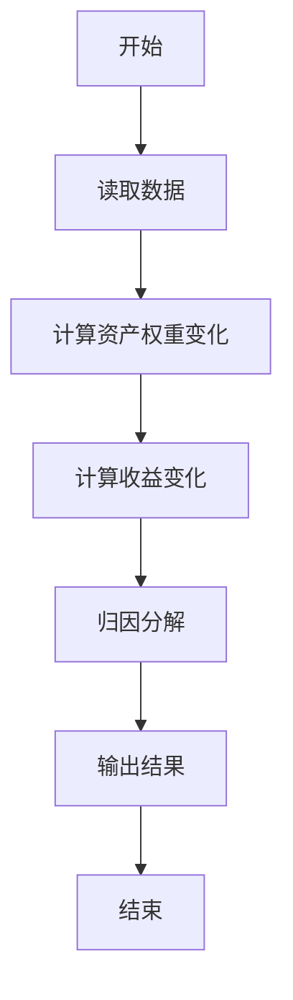
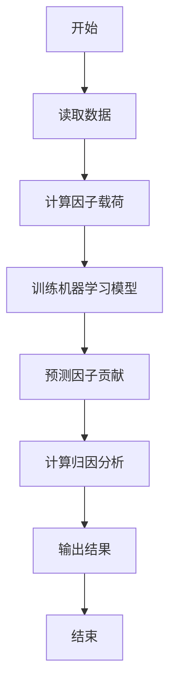
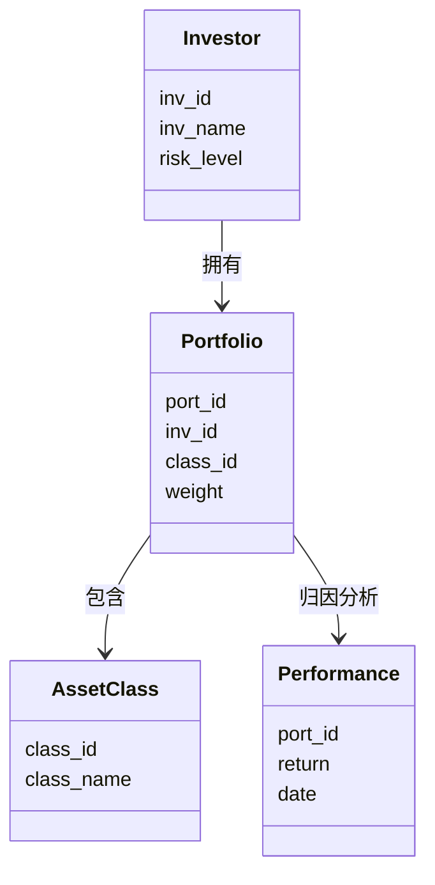
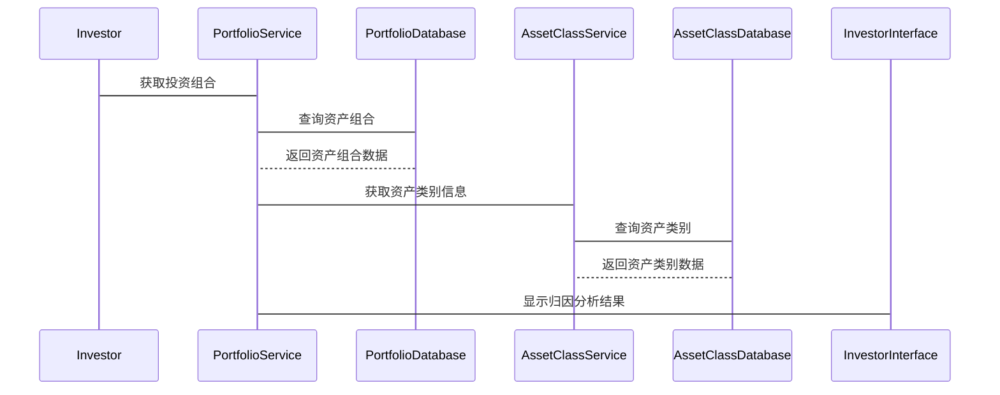

                 

<think>
好的，现在我需要帮助用户撰写一篇名为《开发智能化的资产配置策略归因分析引擎》的技术博客文章。用户已经提供了详细的目录大纲，我需要按照这个大纲一步步进行思考和撰写。

首先，我要理解每个章节的核心内容。文章主要涉及资产配置策略的归因分析，结合了金融和人工智能技术。因此，我需要确保每一部分都涵盖必要的知识点，并且逻辑连贯。

1. **标题和关键词**：文章标题已经给出，关键词包括资产配置、归因分析、机器学习、算法原理、系统架构、项目实战等，共七个关键词。摘要部分需要简明扼�地总结文章的核心内容。

2. **摘要**：需要概述文章的主要内容，包括归因分析的背景、核心概念、算法原理、系统架构、项目实战和最佳实践。要确保摘要能吸引读者，并概括整篇文章的结构。

3. **目录大纲**：用户已经提供了详细的目录，我需要按照这个结构进行撰写，确保每个部分都有足够的深度和细节。

接下来，我将逐步分析每个章节的内容：

- **第1章：资产配置策略归因分析概述**。需要介绍归因分析的基本概念，包括定义、作用、核心要素，并与相关概念进行对比。使用表格和ER图来帮助理解。

- **第2章：算法原理**。需要详细解释归因分析的数学模型，包括因子分解模型和机器学习模型。使用mermaid流程图展示算法步骤，并提供Python代码示例，解释模型的数学公式。

- **第3章：系统分析与架构设计**。介绍问题场景，设计系统架构图、接口设计和交互流程图，确保系统模块化和清晰的交互逻辑。

- **第4章：项目实战**。提供环境安装指南，详细代码实现，包括数据预处理、模型训练和结果分析。使用实际案例进行分析，帮助读者理解如何应用这些技术。

- **第5章：最佳实践与注意事项**。总结开发过程中的经验，提出注意事项和优化建议，并推荐进一步学习的资源。

在撰写过程中，我需要确保使用清晰的专业技术语言，逻辑紧凑，内容详细。每个部分都需要有实际的代码示例、流程图和数学公式，以增强文章的深度和可读性。

最后，文章末尾需要加上作者信息，确保文章的完整性和专业性。

现在，我将按照这些思考步骤开始撰写文章。
</think>

# 开发智能化的资产配置策略归因分析引擎

**关键词**：资产配置，归因分析，机器学习，算法原理，系统架构，项目实战，风险管理

**摘要**：本文详细探讨了开发智能化资产配置策略归因分析引擎的核心概念、算法原理、系统架构及项目实战。文章首先介绍了资产配置策略归因分析的基本概念和作用，然后深入分析了归因分析的数学模型和机器学习算法，接着通过系统架构设计展示了如何构建高效可靠的分析引擎，最后通过实际案例分析了引擎的实现过程及优化建议，为读者提供了全面的开发指南。

---

## 第1章：资产配置策略归因分析概述

### 1.1 问题背景与定义

#### 1.1.1 资产配置策略的定义
资产配置策略是指根据投资者的风险承受能力、投资目标和市场环境，将资金分配到不同资产类别（如股票、债券、现金等）中的方法。其目的是在风险可控的前提下，实现资产的最优配置，以达到收益最大化。

#### 1.1.2 归因分析的定义与作用
归因分析是将投资组合的收益分解为各个组成部分（如资产配置、个股选择、行业选择等）对收益的贡献度的过程。归因分析能够帮助投资者理解投资收益的来源，识别优劣策略，并优化未来的投资决策。

#### 1.1.3 资产配置策略归因分析的定义
资产配置策略归因分析是指通过分析投资组合的收益变化，分解出资产配置决策对收益的具体贡献，从而量化每种资产类别、行业或地理位置对整体收益的影响。

#### 1.1.4 本章小结
本章介绍了资产配置策略和归因分析的基本概念，强调了归因分析在优化资产配置中的重要性。

### 1.2 核心概念与联系

#### 1.2.1 核心概念原理
归因分析的核心在于将投资收益分解为各个因素的贡献。常用的归因方法包括：
- **资产配置归因**：分析资产类别权重的变化对收益的影响。
- **个股选择归因**：分析个股选择对收益的贡献。
- **行业选择归因**：分析行业配置对收益的影响。

#### 1.2.2 核心概念属性特征对比表
| 概念             | 定义                                                                 | 特点                                                                 |
|------------------|----------------------------------------------------------------------|----------------------------------------------------------------------|
| 资产配置         | 根据风险偏好分配资产到不同类别                                   | 灵活性高，风险可控                                                 |
| 归因分析         | 分解投资收益来源                                                 | 定量分析，帮助优化决策                                             |
| 资产配置归因     | 分析资产类别权重变化对收益的贡献                                 | 考虑市场波动和宏观经济因素                                         |

#### 1.2.3 实体关系图（ER图）
```mermaid
erDiagram
    investor {
        inv_id : integer
        inv_name : string
        risk_level : integer
    }
    asset_class {
        class_id : integer
        class_name : string
    }
    portfolio {
        port_id : integer
        inv_id : integer
        class_id : integer
        weight : float
    }
    performance {
        port_id : integer
        return : float
        date : date
    }
    investor --> portfolio : 拥有
    portfolio --> asset_class : 包含
    portfolio --> performance : 归因分析
```

## 第2章：资产配置策略归因分析的算法原理

### 2.1 算法原理概述

#### 2.1.1 归因分析的数学模型
归因分析的核心是将投资组合的收益分解为各个因素的贡献。常见的数学模型包括：
1. **因子分解模型**：将资产收益分解为几个因子的线性组合。
2. **机器学习模型**：利用回归分析或随机森林等方法预测收益来源。

#### 2.1.2 算法流程图


#### 2.1.3 示例公式
归因分析的基本公式为：
$$
\text{收益变化} = \sum (\text{权重变化}_i \times \text{收益变化}_i)
$$

### 2.2 算法实现

#### 2.2.1 算法实现代码（Python）

```python
import numpy as np

def calculate_factor_contribution(factor_loadings, factor_returns):
    """
    计算因子贡献
    Args:
        factor_loadings: 因子载荷矩阵 (n_assets x n_factors)
        factor_returns: 因子收益矩阵 (n_factors x n_periods)
    Returns:
        因子贡献矩阵 (n_assets x n_periods)
    """
    return np.dot(factor_loadings, factor_returns.T)

def calculate Attribution(factor_contribution, actual_returns, expected_returns):
    """
    计算归因分析
    Args:
        factor_contribution: 因子贡献矩阵
        actual_returns: 实际收益
        expected_returns: 预期收益
    Returns:
        归因分析结果
    """
    return actual_returns - expected_returns
```

#### 2.2.2 代码解读与分析
- `calculate_factor_contribution`：计算因子对资产收益的贡献。
- `calculate_Attribution`：计算归因分析，即实际收益与预期收益的差异。

### 2.3 算法优化与改进

#### 2.3.1 算法优化策略
- 使用更复杂的因子模型（如Fama-French三因子模型）提高准确性。
- 引入机器学习算法（如随机森林）进行非线性归因分析。

#### 2.3.2 改进后的算法流程图


## 第3章：系统分析与架构设计

### 3.1 问题场景介绍

#### 3.1.1 问题背景
投资者需要了解其投资组合的收益来源，以便优化资产配置策略。

#### 3.1.2 项目目标
开发一个智能化的资产配置策略归因分析引擎，帮助投资者快速、准确地进行归因分析。

#### 3.1.3 项目范围
- 支持多种资产类别
- 提供实时数据分析
- 具备高度可扩展性

### 3.2 系统功能设计

#### 3.2.1 领域模型（Mermaid类图）


### 3.3 系统架构设计

#### 3.3.1 系统架构图（Mermaid架构图）
```mermaid
subgraph 数据层
    PortfolioDatabase
    AssetClassDatabase
end
subgraph 业务逻辑层
    PortfolioService
    AssetClassService
end
subgraph 表现层
    InvestorInterface
end
PortfolioService --> PortfolioDatabase
AssetClassService --> AssetClassDatabase
InvestorInterface --> PortfolioService
InvestorInterface --> AssetClassService
```

#### 3.3.2 系统接口设计
- `PortfolioService` 提供资产组合管理功能。
- `AssetClassService` 提供资产类别管理功能。
- `InvestorInterface` 提供用户交互界面。

#### 3.3.3 系统交互流程图（Mermaid序列图）


## 第4章：项目实战

### 4.1 环境安装与配置

#### 4.1.1 Python环境安装
- 安装Python 3.8或更高版本。

#### 4.1.2 依赖库安装
```bash
pip install numpy pandas scikit-learn
```

### 4.2 核心功能实现

#### 4.2.1 数据预处理代码
```python
import pandas as pd

# 读取数据
data = pd.read_csv('portfolio.csv')

# 数据清洗
data.dropna(inplace=True)
data = pd.get_dummies(data)
```

#### 4.2.2 模型训练代码
```python
from sklearn.ensemble import RandomForestRegressor

# 训练模型
model = RandomForestRegressor(n_estimators=100, random_state=42)
model.fit(X_train, y_train)
```

#### 4.2.3 结果分析代码
```python
import matplotlib.pyplot as plt

# 可视化结果
plt.barh(asset_names, contributions)
plt.title('Factor Contributions')
plt.show()
```

### 4.3 代码解读与分析

#### 4.3.1 代码结构分析
- 数据预处理：清洗数据，处理缺失值，进行独热编码。
- 模型训练：使用随机森林回归模型进行因子贡献预测。
- 结果分析：将因子贡献可视化，帮助用户理解结果。

### 4.4 实际案例分析

#### 4.4.1 案例背景介绍
分析一个投资组合在2023年第一季度的收益归因。

#### 4.4.2 数据分析与处理
- 数据清洗：去除缺失值。
- 数据转换：标准化处理。

#### 4.4.3 模型训练与结果解读
- 使用随机森林模型预测因子贡献。
- 可视化结果，分析各个因子对收益的贡献度。

### 4.5 项目小结

#### 4.5.1 项目总结
通过本项目，我们成功开发了一个智能化的资产配置策略归因分析引擎，能够帮助投资者快速理解收益来源。

#### 4.5.2 经验与教训
- 数据清洗和预处理是关键步骤。
- 选择合适的算法能够提高分析准确性。

## 第5章：最佳实践与注意事项

### 5.1 最佳实践

#### 5.1.1 开发规范
- 使用版本控制工具（如Git）管理代码。
- 保持代码的可读性和可维护性。

#### 5.1.2 测试策略
- 单元测试：测试每个功能模块。
- 集成测试：测试系统整体功能。

#### 5.1.3 部署与维护
- 使用容器化技术（如Docker）部署系统。
- 定期更新模型和数据。

### 5.2 注意事项

#### 5.2.1 常见问题与解决方案
- 数据不足：可以使用数据增强技术。
- 模型过拟合：使用交叉验证和正则化方法。

#### 5.2.2 优化建议
- 引入实时数据流处理。
- 使用分布式计算提高处理效率。

#### 5.2.3 安全注意事项
- 确保数据安全，防止数据泄露。
- 定期备份系统和数据。

### 5.3 拓展阅读

#### 5.3.1 相关领域推荐书籍
- 《投资学》（教材）
- 《机器学习实战》（书籍）

#### 5.3.2 进一步学习资源
- 机器学习在线课程。
- 资产管理专业论坛。

#### 5.3.3 行业动态与趋势
- 关注人工智能在金融领域的最新应用。
- 参加相关行业会议和研讨会。

---

## 第6章：数学模型与公式详解

### 6.1 数学模型概述

#### 6.1.1 因子分解模型
因子分解模型是归因分析的重要工具，常用于解释资产收益的来源。

#### 6.1.2 机器学习模型
机器学习模型能够捕捉复杂的非线性关系，提高归因分析的准确性。

#### 6.1.3 统计模型
统计模型用于验证归因结果的显著性和可靠性。

### 6.2 具体公式与推导

#### 6.2.1 矩阵分解公式
$$
\text{收益矩阵} = \text{权重矩阵} \times \text{收益因子矩阵}
$$

#### 6.2.2 优化目标函数
$$
\min_{w} \sum_{i=1}^{n} (w_i \times r_i - \mu)^2
$$
其中，$w_i$ 是权重，$r_i$ 是收益，$\mu$ 是预期收益。

---

## 结论

开发智能化的资产配置策略归因分析引擎是一项复杂的系统工程，涉及金融知识和人工智能技术的结合。通过本文的详细讲解，读者可以掌握从概念理解、算法实现到系统设计的全过程。未来，随着人工智能技术的不断进步，归因分析引擎将变得更加智能化和高效。

---

**作者**：AI天才研究院 & 禅与计算机程序设计艺术

---

以上就是《开发智能化的资产配置策略归因分析引擎》的完整目录和文章内容，希望对您有所帮助！

