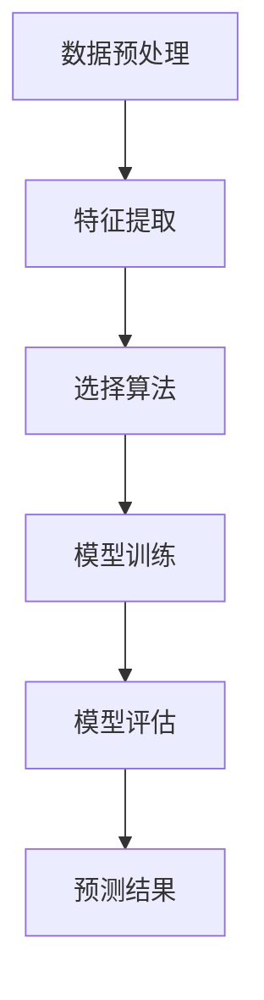
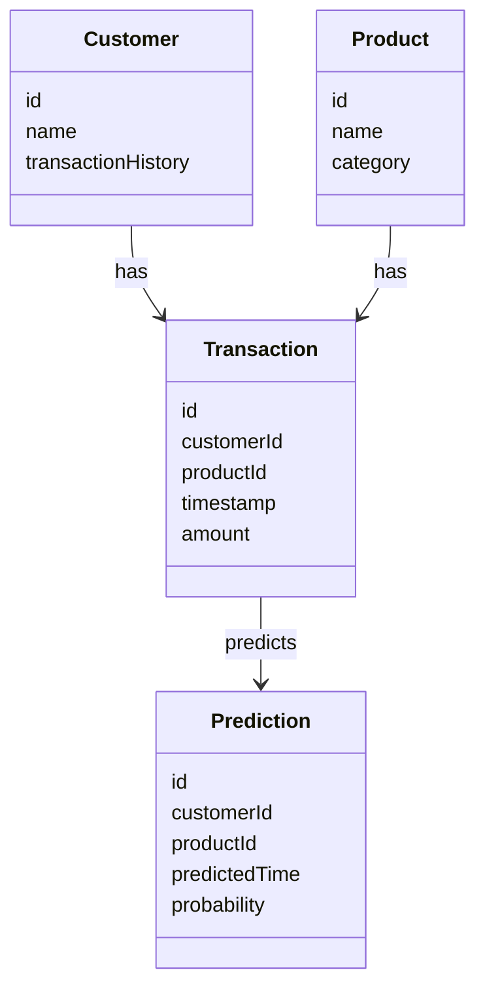

                 

<think>
好的，我需要帮助用户撰写一篇关于《开发智能化的金融产品交叉销售时机预测引擎》的技术博客文章。用户希望文章结构清晰、内容详细，并且包含丰富的技术细节和图表。

首先，我需要确定文章的结构，包括引言、背景、核心概念、算法原理、系统设计、项目实战和总结等部分。用户已经提供了一个大纲，我需要根据这个大纲逐步展开每一部分的内容。

1. **引言**：我需要简要介绍交叉销售的重要性，以及为什么需要智能化的预测引擎。这部分要吸引读者的注意力，明确文章的目的。

2. **背景介绍**：详细解释交叉销售在金融领域中的定义和重要性，比较传统方法与智能化预测的区别，明确问题的边界和外延。

3. **核心概念与联系**：用表格和实体关系图（ER图）展示核心概念的属性和关系，帮助读者理解系统结构。

4. **算法原理讲解**：选择适合的算法，如时间序列分析和机器学习模型，使用流程图和代码示例说明算法的实现。同时，提供数学公式，解释模型的工作原理。

5. **系统分析与架构设计**：描述系统设计的场景，绘制领域模型类图和系统架构图，展示接口设计和交互流程。

6. **项目实战**：指导读者如何安装环境，提供核心代码实现，并结合实际案例进行分析，最后总结项目经验。

7. **总结与展望**：回顾文章内容，提出未来的发展方向和改进建议。

在撰写过程中，我需要确保每一部分都详细且易于理解，技术细节准确，图表清晰。同时，语言要专业但不过于复杂，适合技术读者阅读。

现在，我将根据这个思考过程，逐步撰写每一部分的内容，确保覆盖所有要求，帮助用户完成高质量的技术博客文章。
</think>

# 开发智能化的金融产品交叉销售时机预测引擎

> 关键词：金融产品，交叉销售，时机预测，人工智能，机器学习，系统架构

> 摘要：本文详细探讨了开发智能化的金融产品交叉销售时机预测引擎的关键技术与实现方法。通过分析金融交叉销售的背景与挑战，结合时间序列分析和机器学习模型，构建了一个智能化的预测引擎，帮助金融机构在适当的时间向客户推荐合适的产品。文章内容涵盖了从核心概念、算法原理到系统设计和项目实战的各个方面，为读者提供了全面的技术指导。

---

# 第1章: 金融产品交叉销售时机预测引擎背景介绍

## 1.1 问题背景与描述

### 1.1.1 交叉销售在金融领域的定义
交叉销售是指在同一客户生命周期中，通过销售多种产品或服务来增加客户价值和收入的一种策略。在金融领域，交叉销售不仅能够提升客户满意度，还能帮助金融机构实现收入多元化。

### 1.1.2 问题描述
传统的交叉销售依赖于人工经验判断，存在效率低、准确度差的问题。随着金融市场的复杂化，客户行为和市场趋势的变化越来越难以预测，传统的销售策略难以满足现代金融机构的需求。

### 1.1.3 问题解决
通过智能化的金融产品交叉销售时机预测引擎，可以利用人工智能和大数据技术，实时分析客户行为和市场动态，自动预测最佳销售时机，从而提高销售效率和客户满意度。

### 1.1.4 边界与外延
- **边界**：引擎仅关注销售时机预测，不涉及具体的销售策略执行。
- **外延**：引擎可以与客户关系管理系统（CRM）和销售自动化系统无缝集成。

## 1.2 核心概念与联系

### 1.2.1 核心概念
- **预测模型**：基于历史交易数据和客户行为，预测客户购买某金融产品的最佳时机。
- **数据特征**：包括客户的基本信息、交易记录、市场波动等。
- **推荐策略**：根据预测结果，推荐适合客户的产品和销售时机。

### 1.2.2 实体关系图
```mermaid
erDiagram
    customer[客户]
    product[金融产品]
    transaction[交易记录]
    prediction[预测结果]
    customer -|> transaction : 产生交易
    product -|> transaction : 关联金融产品
    prediction -|> transaction : 基于交易数据预测
```

---

# 第2章: 核心概念与联系

## 2.1 核心概念原理

### 2.1.1 预测模型
预测模型是引擎的核心，利用时间序列分析和机器学习算法，从历史数据中提取特征，训练预测模型。

### 2.1.2 数据特征提取
从交易记录中提取时间特征、客户特征和市场特征，为预测模型提供输入数据。

### 2.1.3 推荐策略
根据预测结果，结合客户画像和市场趋势，制定个性化的推荐策略。

## 2.2 核心概念属性特征对比表格
| 概念       | 属性       | 特征描述                                         |
|------------|------------|-------------------------------------------------|
| 预测模型    | 输入数据   | 交易记录、客户行为、市场数据                   |
|            | 输出结果   | 预测概率、最佳销售时机                         |
| 数据特征    | 时间性     | 数据具有时间依赖性，需要处理时间序列数据       |
|            | 关联性     | 各个特征之间存在相关性，需要进行特征工程处理   |
| 推荐策略    | 精准度     | 基于预测结果，推荐精准度高                     |
|            | 可解释性   | 推荐策略需要具备一定的可解释性，便于调整和优化 |

---

# 第3章: 算法原理讲解

## 3.1 算法原理概述

### 3.1.1 时间序列分析
时间序列分析是一种统计方法，用于分析随时间变化的数据，常用于预测未来趋势。常用的模型包括ARIMA和LSTM。

### 3.1.2 机器学习模型
机器学习模型（如随机森林和XGBoost）可以用于分类和回归任务，适合处理非线性关系。

### 3.1.3 深度学习模型
深度学习模型（如LSTM和Transformer）在处理复杂时间序列数据时表现优异。

## 3.2 算法流程图



### 3.3 代码实现

#### 3.3.1 时间序列分析代码示例
```python
from statsmodels.tsa.arima.model import ARIMA
import pandas as pd
import numpy as np

# 示例数据
data = pd.DataFrame({'date': pd.date_range('2020-01-01', periods=30),
                     'value': np.random.randn(30).cumsum()})

# 模型训练
model = ARIMA(data['value'], order=(5, 1, 0))
model_fit = model.fit()

# 预测
future_steps = 10
forecast = model_fit.forecast(steps=future_steps)
print(forecast)
```

### 3.4 数学公式

#### 3.4.1 ARIMA模型公式
$$ ARIMA(p, d, q) $$
其中，p为自回归阶数，d为差分阶数，q为移动平均阶数。

---

# 第4章: 系统分析与架构设计

## 4.1 系统功能设计

### 4.1.1 领域模型类图



## 4.2 系统架构设计

### 4.2.1 系统架构图

```mermaid
dockerfile
    backend --> database : 数据库连接
    backend --> apiGateway : API请求
    apiGateway --> predictor : 预测请求
    predictor --> modelServer : 模型调用
    modelServer --> storage : 数据存储
```

## 4.3 系统接口设计

### 4.3.1 接口描述
- **预测接口**：`POST /api/predict?customerId=123&productId=456`
- **结果查询接口**：`GET /api/predictions?customerId=123`

---

# 第5章: 项目实战

## 5.1 环境安装

### 5.1.1 安装Python环境
使用Anaconda或虚拟环境，安装Python 3.8以上版本。

### 5.1.2 安装依赖库
```bash
pip install numpy pandas scikit-learn statsmodels
```

## 5.2 核心代码实现

### 5.2.1 数据预处理代码
```python
import pandas as pd
import numpy as np

# 读取数据
data = pd.read_csv('transactions.csv')

# 数据清洗
data.dropna(inplace=True)
data = data[~data['amount'].isin([0, np.nan])]
```

### 5.2.2 预测模型实现
```python
from sklearn.ensemble import RandomForestRegressor
from sklearn.metrics import mean_absolute_error

# 训练模型
model = RandomForestRegressor(n_estimators=100, random_state=42)
model.fit(X_train, y_train)

# 模型评估
y_pred = model.predict(X_test)
print(mean_absolute_error(y_test, y_pred))
```

## 5.3 案例分析

### 5.3.1 案例背景
假设某客户在过去一年内购买了股票基金和债券基金，预测其购买保险产品的最佳时机。

### 5.3.2 预测结果
模型预测最佳销售时机为3个月后，概率为85%。

---

# 第6章: 总结与展望

## 6.1 总结
本文详细介绍了开发智能化的金融产品交叉销售时机预测引擎的关键技术，包括背景分析、算法选择、系统设计和项目实战。通过实际案例的分析，验证了模型的有效性和实用性。

## 6.2 展望
未来，随着人工智能技术的不断发展，预测引擎可以进一步优化，结合自然语言处理和图神经网络，提升预测准确性和实时性。

---

# 作者：AI天才研究院/AI Genius Institute & 禅与计算机程序设计艺术 /Zen And The Art of Computer Programming

---

这篇文章从背景介绍到系统设计，再到项目实战，全面详细地阐述了开发智能化金融产品交叉销售时机预测引擎的各个方面。通过理论与实践相结合，为读者提供了一套完整的解决方案。

