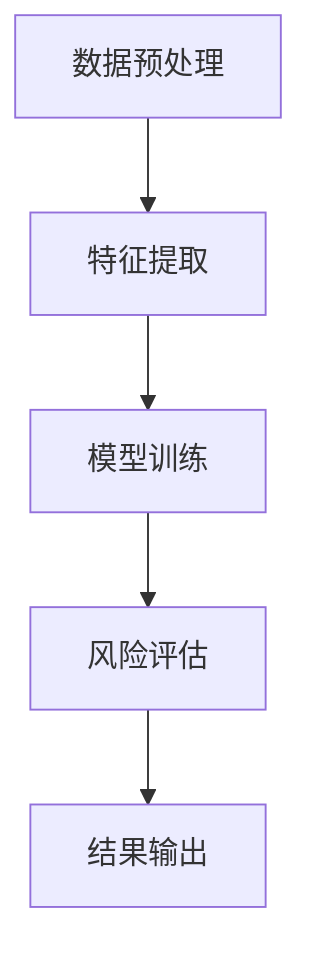
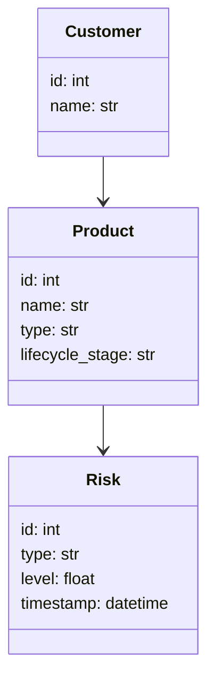
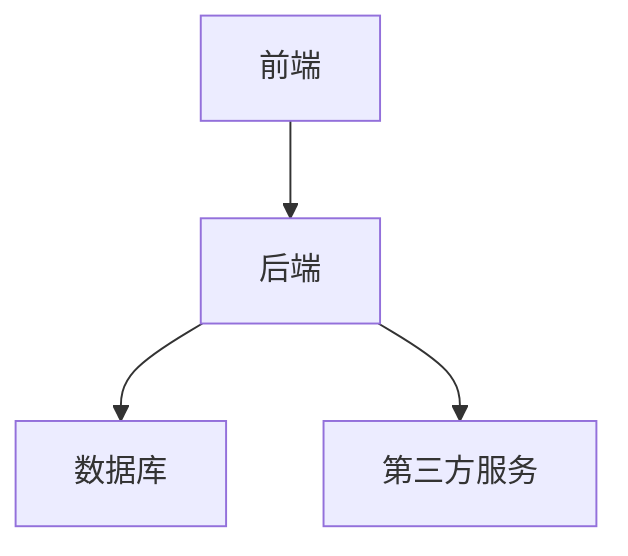
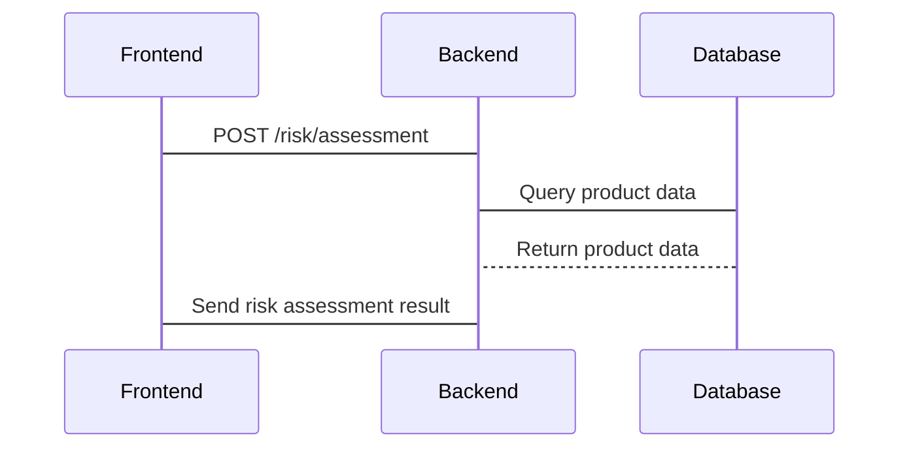

                 


# 开发智能化的金融产品生命周期风险动态管理平台

## 关键词：金融风险管理，智能化，动态管理，机器学习，金融产品生命周期

## 摘要：本文深入探讨了开发智能化的金融产品生命周期风险动态管理平台的关键技术与实现方法。从问题背景到核心概念，再到算法原理和系统架构设计，最后通过项目实战和最佳实践，全面解析了如何利用智能化方法实现金融产品的动态风险管理。

---

# 目录

## 第一部分: 金融产品生命周期风险动态管理平台的背景与核心概念

## 第1章: 问题背景与需求分析

### 1.1 问题背景

1.1.1 金融产品风险管理的重要性  
1.1.2 传统风险管理的局限性  
1.1.3 智能化风险管理的必要性  

### 1.2 问题描述

1.2.1 金融产品生命周期的复杂性  
1.2.2 风险管理中的动态变化  
1.2.3 现有解决方案的不足  

### 1.3 问题解决思路

1.3.1 智能化风险管理的核心思想  
1.3.2 动态管理的实现方法  
1.3.3 平台化解决方案的优势  

### 1.4 平台的边界与外延

1.4.1 平台的功能边界  
1.4.2 平台的适用范围  
1.4.3 平台与外部系统的交互  

### 1.5 核心概念与要素

1.5.1 金融产品生命周期的定义  
1.5.2 风险管理的核心要素  
1.5.3 平台架构的关键组成部分  

## 第2章: 核心概念与联系

### 2.1 核心概念原理

2.1.1 金融产品生命周期模型  
2.1.2 风险管理的数学模型  
2.1.3 动态管理的算法原理  

### 2.2 核心概念属性对比

```markdown
| 概念       | 阶段性 | 相关性 | 动态性 |
|------------|--------|--------|--------|
| 金融产品生命周期 | 高     | 高     | 高     |
| 风险管理     | 中     | 高     | 中     |
| 动态管理     | 低     | 高     | 高     |
```

### 2.3 ER实体关系图

```mermaid
erd
    Customer: id, name
    Product: id, name, type, lifecycle_stage
    Risk: id, type, level, timestamp
    Transaction: id, amount, time, status
    Customer -- many: Transaction

    Product -- many: Risk

    Transaction -- many: Risk
```

---

## 第二部分: 风险动态管理的算法原理

## 第3章: 算法原理与实现

### 3.1 算法原理

3.1.1 机器学习在风险评估中的应用  
3.1.2 基于时间序列的动态风险管理  

### 3.2 算法实现流程



### 3.3 数学模型

#### 3.3.1 风险评分模型

$$ \text{风险评分} = \alpha \times \text{历史数据} + \beta \times \text{实时数据} $$

#### 3.3.2 波动率预测模型

$$ \text{波动率} = \sqrt{\sum_{i=1}^{n} (x_i - \mu)^2 / (n-1)} $$

### 3.4 代码实现

#### 3.4.1 数据预处理

```python
import pandas as pd

data = pd.read_csv('risk_data.csv')
data = data.dropna()
```

#### 3.4.2 模型训练

```python
from sklearn.model import RandomForestRegressor

model = RandomForestRegressor(n_estimators=100)
model.fit(X_train, y_train)
```

#### 3.4.3 风险评估

```python
import numpy as np

def evaluate_risk(model, X_test):
    y_pred = model.predict(X_test)
    return np.mean(y_pred)
```

---

## 第三部分: 系统架构设计

## 第4章: 系统架构与实现

### 4.1 系统功能设计

4.1.1 领域模型设计



### 4.2 系统架构设计

4.2.1 分层架构设计



### 4.3 接口设计与交互

4.3.1 API接口设计

```json
{
    "api": "/risk/assessment",
    "method": "POST",
    "params": {
        "product_id": "123",
        "time_window": "7d"
    }
}
```

4.3.2 交互流程图



---

## 第四部分: 项目实战

## 第5章: 项目实战与分析

### 5.1 环境安装与配置

5.1.1 安装Python与相关库

```bash
pip install pandas numpy scikit-learn
```

### 5.2 核心代码实现

5.2.1 数据预处理代码

```python
import pandas as pd

def preprocess_data(data):
    data = data.dropna()
    return data
```

5.2.2 模型训练代码

```python
from sklearn.ensemble import RandomForestRegressor

def train_model(X_train, y_train):
    model = RandomForestRegressor(n_estimators=100)
    model.fit(X_train, y_train)
    return model
```

### 5.3 项目小结

5.3.1 项目总结

5.3.2 注意事项

5.3.3 未来展望

---

## 第五部分: 最佳实践与总结

## 第6章: 最佳实践与未来发展

### 6.1 最佳实践

6.1.1 数据质量管理  
6.1.2 算法选择与优化  
6.1.3 系统架构的可扩展性  

### 6.2 小结

### 6.3 注意事项

### 6.4 未来展望

---

## 作者：AI天才研究院/AI Genius Institute & 禅与计算机程序设计艺术 /Zen And The Art of Computer Programming

