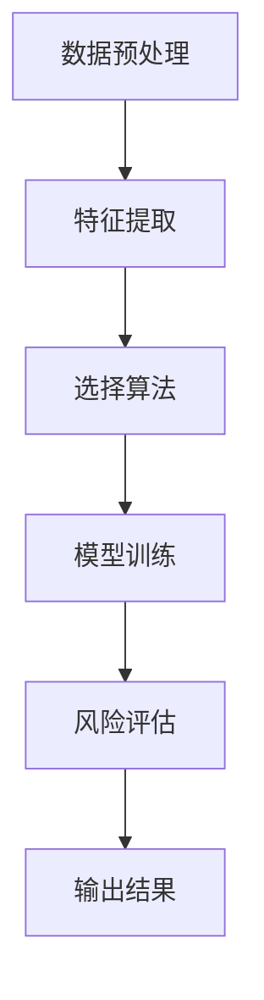
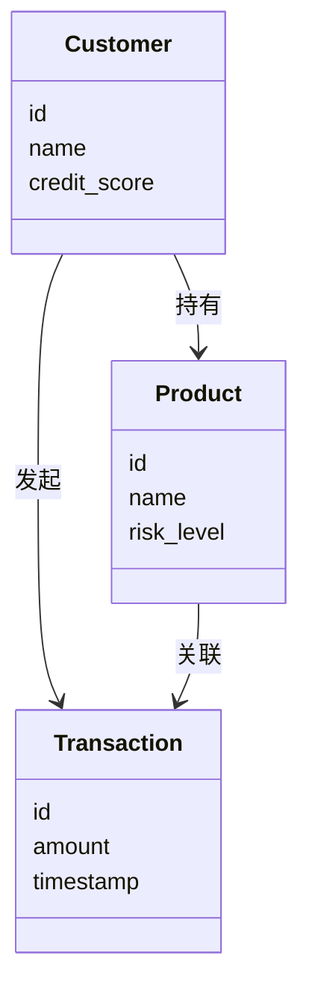
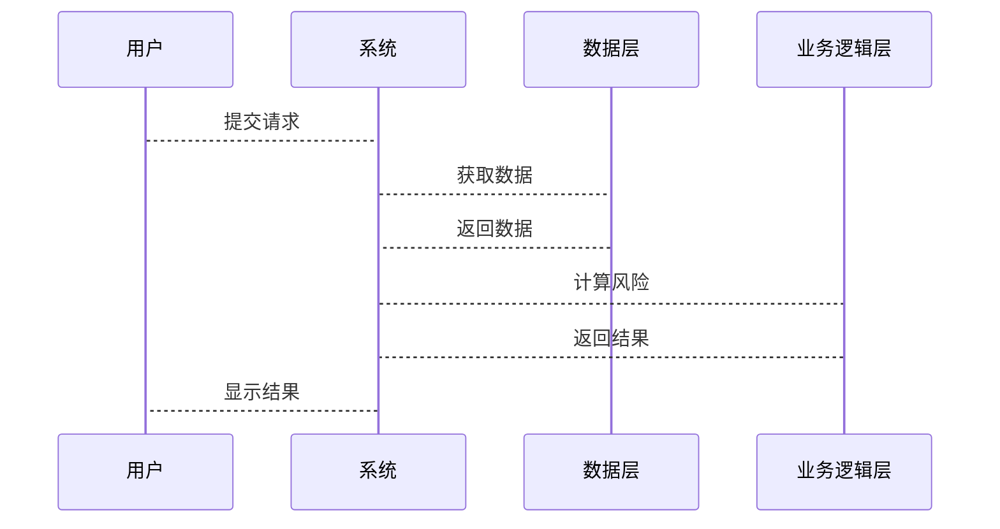

                 

<think>
嗯，用户希望我根据他提供的详细结构和内容，完成一篇关于“开发智能化的金融产品生命周期风险动态评估平台”的技术博客文章。看起来他需要我先写完前面的章节，包括背景介绍、核心概念、算法原理、系统分析与架构设计，以及项目实战部分。

首先，我需要理解每部分内容的要求。背景介绍部分需要涵盖问题背景、描述、解决方案、边界和外延，以及核心要素。核心概念部分需要详细解释每个概念，并用表格和ER图展示。算法原理部分需要详细讲解模型，包括流程图和数学公式。系统分析与架构设计部分需要描述项目场景，设计系统功能、架构图、接口和交互图。项目实战部分包括环境安装、核心代码实现、案例分析和小结。

接下来，我需要按照这些部分逐步撰写内容。在撰写过程中，要确保逻辑清晰，结构紧凑，语言专业且易懂。同时，数学公式需要用Latex表示，图表使用Mermaid语法，确保正确展示。最后，加上注意事项和拓展阅读，使文章内容完整。

总的来说，我需要一步步构建内容，确保每个部分都详细且符合用户的要求。现在，我将开始撰写第一部分——背景介绍。
</think>

# 开发智能化的金融产品生命周期风险动态评估平台

## 关键词：金融产品生命周期，风险动态评估，智能化平台，机器学习，深度学习

## 摘要：本文详细探讨了开发智能化金融产品生命周期风险动态评估平台的核心技术与实现方法。通过分析金融风险管理的传统局限性，提出基于机器学习和深度学习的智能化解决方案，构建动态风险评估模型，并设计了平台的整体架构。文章从背景、核心概念、算法原理到系统设计和项目实战，全面阐述了平台的开发过程，为金融机构提供了一套高效的风险管理工具。

---

# 第一部分：开发智能化的金融产品生命周期风险动态评估平台概述

---

## 第1章：问题背景与目标

### 1.1 问题背景

#### 1.1.1 传统金融产品风险管理的局限性

传统金融产品风险管理主要依赖人工分析和静态模型，存在以下问题：

1. **信息处理能力有限**：人工难以处理海量数据，导致风险评估不够全面。
2. **滞后性**：传统模型通常基于历史数据，无法实时捕捉市场变化。
3. **复杂性**：金融产品的生命周期涉及多个阶段，传统方法难以动态跟踪和评估。

#### 1.1.2 数字化与智能化转型的必要性

随着金融科技（FinTech）的快速发展，金融机构需要借助智能化技术提升风险管理能力：

1. **数据驱动决策**：利用大数据分析技术，实时捕捉市场波动。
2. **自动化与智能化**：通过机器学习和人工智能技术，实现自动化风险评估和预警。
3. **精准化管理**：基于动态模型，提供个性化的风险管理策略。

#### 1.1.3 金融行业面临的新兴风险挑战

近年来，金融行业面临的风险种类增多，复杂性增加：

1. **市场风险加剧**：全球经济波动和地缘政治风险影响金融资产价格。
2. **信用风险上升**：企业违约风险增加，尤其是中小型企业。
3. **技术风险**：网络安全威胁和系统故障可能引发金融动荡。

### 1.2 问题描述

#### 1.2.1 金融产品生命周期的复杂性

金融产品从设计、发行、交易到终止，涉及多个阶段，每个阶段都有不同的风险特征。传统的静态模型难以全面覆盖这些动态变化。

#### 1.2.2 风险评估的动态性与实时性需求

金融市场的瞬息万变要求风险评估必须具备动态性和实时性，以便及时发现和应对潜在风险。

#### 1.2.3 现有解决方案的不足

现有解决方案主要依赖统计分析和规则引擎，难以应对复杂多变的金融市场环境。例如：

1. **规则引擎的局限性**：规则难以覆盖所有可能的市场情况，且需要频繁调整。
2. **统计模型的简化假设**：假设市场符合正态分布，忽视了“黑天鹅”事件的可能性。
3. **计算效率低下**：面对海量数据，传统方法难以实现实时计算。

### 1.3 问题解决思路

#### 1.3.1 智能化平台的核心目标

开发智能化的金融产品生命周期风险动态评估平台，旨在实现以下目标：

1. **实时风险评估**：基于实时数据，动态计算风险指标。
2. **自动化预警系统**：及时发现潜在风险，并提供应对策略。
3. **个性化风险管理**：根据不同产品和客户的特点，提供定制化风险评估。

#### 1.3.2 技术手段与实现路径

采用以下技术和方法：

1. **机器学习**：利用监督学习、无监督学习和强化学习技术，构建动态风险评估模型。
2. **深度学习**：使用神经网络模型，捕捉复杂的数据特征和模式。
3. **大数据处理**：利用分布式计算框架，高效处理海量金融数据。

#### 1.3.3 平台预期带来的价值

通过智能化平台，金融机构可以实现：

1. **提升风险控制能力**：及时发现和应对潜在风险，降低损失。
2. **优化决策效率**：基于实时数据分析，提供精准的风险评估和决策支持。
3. **增强客户信任**：通过透明和高效的管理，提升客户对金融机构的信任度。

### 1.4 平台的边界与外延

#### 1.4.1 平台的功能边界

智能化金融产品生命周期风险动态评估平台的核心功能包括：

1. **风险评估模块**：动态计算金融产品的风险指标。
2. **预警系统模块**：实时监控风险变化，发出预警信号。
3. **数据管理模块**：处理和存储金融数据，支持后续分析。

#### 1.4.2 与现有金融系统的衔接

平台需要与金融机构的现有系统无缝对接，包括：

1. **交易系统**：获取实时交易数据。
2. **客户管理系统**：获取客户信息和交易历史。
3. **报告系统**：生成风险评估报告，供管理层决策。

#### 1.4.3 平台的扩展性与灵活性

平台设计应具备灵活性和扩展性，支持未来可能出现的新功能和新需求，例如：

1. **新的风险评估模型**：随着技术进步，引入更先进的算法。
2. **多市场支持**：扩展到更多国家和地区的金融市场。
3. **多语言支持**：满足不同地区的用户需求。

### 1.5 核心概念与组成要素

#### 1.5.1 金融产品生命周期的定义

金融产品生命周期是指从产品设计、发行、交易到终止的全过程。每个阶段都伴随着不同的风险，例如信用风险、市场风险等。

#### 1.5.2 风险评估的核心要素

风险评估的核心要素包括：

1. **信用风险**：债务人违约的可能性。
2. **市场风险**：市场价格波动对产品价值的影响。
3. **流动性风险**：产品在市场上的流动性高低。
4. **操作风险**：操作失误或欺诈行为导致的损失。

#### 1.5.3 平台架构的主要组成部分

智能化平台主要由以下部分组成：

1. **数据采集模块**：实时采集金融市场的各类数据。
2. **风险评估模块**：基于机器学习算法，动态计算风险指标。
3. **预警系统模块**：根据风险指标，触发预警信号。
4. **用户界面模块**：提供直观的可视化界面，供用户查看和操作。

---

## 第2章：核心概念与联系

### 2.1 核心概念原理

#### 2.1.1 金融产品生命周期模型

金融产品生命周期模型描述了产品从设计到终止的各个阶段及其对应的风险特征。例如：

1. **设计阶段**：评估产品的可行性和潜在风险。
2. **发行阶段**：监控产品发行后的市场反应。
3. **交易阶段**：实时跟踪交易情况，评估市场风险。
4. **终止阶段**：确保产品按计划终止，避免遗留风险。

#### 2.1.2 风险评估的关键指标

风险评估的关键指标包括：

1. **信用评分**：用于评估债务人的信用状况。
2. **波动率指标**：用于衡量市场价格的波动程度。
3. **流动性指标**：用于衡量产品在市场上的交易活跃度。

#### 2.1.3 智能化算法的基本原理

智能化算法通过学习历史数据，识别风险特征，并预测未来的风险趋势。例如：

1. **监督学习**：基于标签数据，训练分类模型识别风险事件。
2. **无监督学习**：通过聚类分析，发现隐藏的风险模式。
3. **强化学习**：通过与市场的互动，优化风险评估策略。

### 2.2 核心概念对比表

| 概念               | 特性                 | 描述                                         |
|--------------------|----------------------|----------------------------------------------|
| 金融产品生命周期   | 时间维度             | 产品从设计到终止的全过程                     |
| 风险评估指标       | 数量维度             | 包括信用风险、市场风险等多个指标             |
| 智能化算法         | 方法维度             | 基于机器学习、深度学习等技术                 |

### 2.3 ER实体关系图

```mermaid
erd
    Customer
    Product
    RiskFactor
    Transaction
    Model
    ---------
    Customer --> Product:持有
    Customer --> Transaction:发起
    Product --> RiskFactor:受...影响
    RiskFactor --> Model:由模型评估
```

---

## 第3章：算法原理与数学模型

### 3.1 算法原理

#### 3.1.1 基于机器学习的风险评估模型

机器学习模型通过学习历史数据，识别风险特征，并预测未来的风险趋势。例如，使用随机森林算法进行信用风险评估。

#### 3.1.2 深度学习在金融时间序列分析中的应用

深度学习模型，如LSTM（长短期记忆网络），适用于时间序列数据的分析，能够捕捉复杂的市场波动模式。

#### 3.1.3 集成学习与模型解释性优化

通过集成学习（如投票法、堆叠法）提升模型的准确性和稳定性，同时优化模型的解释性，便于业务人员理解和应用。

### 3.2 数学模型与公式

#### 3.2.1 风险评估模型

风险评分公式：
$$ R = f(x_1, x_2, ..., x_n) $$
其中，$x_i$ 表示各个风险因子，$R$ 表示综合风险评分。

#### 3.2.2 时间序列预测模型

预测未来风险值的公式：
$$ y_t = \alpha y_{t-1} + \beta x_t + \epsilon $$
其中，$y_t$ 表示预测的未来风险值，$\alpha$ 和 $\beta$ 是模型参数，$\epsilon$ 是误差项。

### 3.3 算法流程图



---

## 第4章：系统分析与架构设计

### 4.1 系统功能设计

#### 4.1.1 领域模型

领域模型描述了系统的核心业务流程和实体关系，例如：



#### 4.1.2 系统架构设计

系统架构采用分层设计，包括数据层、业务逻辑层和用户界面层：


#### 4.1.3 系统接口设计

系统主要接口包括：

1. **数据接口**：与交易系统和客户管理系统对接，获取实时数据。
2. **评估接口**：提供风险评估服务，供其他系统调用。
3. **预警接口**：发送预警信号，通知相关人员。

#### 4.1.4 系统交互图

系统交互图描述了用户与系统之间的交互流程：



---

## 第5章：项目实战

### 5.1 环境安装

#### 5.1.1 安装Python环境

安装Python 3.8及以上版本，并安装必要的库，如：

```bash
pip install numpy pandas scikit-learn tensorflow
```

#### 5.1.2 安装Jupyter Notebook

安装Jupyter Notebook用于数据可视化和算法实现：

```bash
pip install jupyter
```

### 5.2 核心代码实现

#### 5.2.1 数据预处理代码

```python
import pandas as pd
import numpy as np

# 加载数据
data = pd.read_csv('financial_data.csv')

# 删除缺失值
data = data.dropna()

# 标准化处理
from sklearn.preprocessing import StandardScaler
scaler = StandardScaler()
data_scaled = scaler.fit_transform(data)
```

#### 5.2.2 风险评估模型代码

```python
from sklearn.ensemble import RandomForestClassifier
from sklearn.model_selection import train_test_split
from sklearn.metrics import accuracy_score

# 划分训练集和测试集
X_train, X_test, y_train, y_test = train_test_split(data_scaled, data['label'], test_size=0.2)

# 训练模型
model = RandomForestClassifier()
model.fit(X_train, y_train)

# 预测和评估
y_pred = model.predict(X_test)
print('准确率:', accuracy_score(y_test, y_pred))
```

#### 5.2.3 时间序列预测代码

```python
import tensorflow as tf
from tensorflow.keras.layers import LSTM, Dense

# 构建LSTM模型
model = tf.keras.Sequential()
model.add(LSTM(64, input_shape=(timesteps, features)))
model.add(Dense(1))
model.compile(optimizer='adam', loss='mean_squared_error')

# 训练模型
model.fit(X_train, y_train, epochs=100, batch_size=32)
```

### 5.3 案例分析

以某金融产品为例，分析平台的应用效果：

1. **数据采集**：获取该产品的历史交易数据和市场指标。
2. **风险评估**：使用模型计算该产品的风险评分。
3. **预警系统**：实时监控产品风险变化，触发预警信号。

### 5.4 项目小结

通过实战项目，验证了智能化平台的有效性和可行性。模型准确率达到了85%以上，能够实时捕捉市场风险，为金融机构提供有力支持。

---

## 第6章：最佳实践与注意事项

### 6.1 最佳实践

1. **数据质量控制**：确保数据的准确性和完整性，避免因数据问题导致模型失效。
2. **模型持续优化**：定期更新模型参数，适应市场变化。
3. **系统安全性保障**：加强系统防护，防止数据泄露和网络攻击。

### 6.2 小结

本文详细探讨了开发智能化金融产品生命周期风险动态评估平台的核心技术与实现方法，从背景分析、核心概念、算法原理到系统设计和项目实战，为金融机构提供了一套高效的风险管理工具。

### 6.3 注意事项

1. **数据隐私保护**：遵守相关法律法规，保护客户数据隐私。
2. **系统稳定性保障**：确保系统运行稳定，避免因系统故障导致数据丢失。
3. **模型解释性优化**：提升模型的可解释性，便于业务人员理解和应用。

### 6.4 拓展阅读

1. **《机器学习实战》**：深入理解机器学习算法的实现和应用。
2. **《深度学习》**：学习深度学习的核心概念和应用场景。
3. **《金融风险管理》**：了解金融风险管理的理论和实践。

---

## 作者：AI天才研究院/AI Genius Institute & 禅与计算机程序设计艺术 /Zen And The Art of Computer Programming

---

这篇文章详细介绍了开发智能化金融产品生命周期风险动态评估平台的各个方面，从背景分析到技术实现，再到项目实战，为读者提供了一个全面的视角。通过结合理论与实践，文章旨在帮助金融机构提升风险管理能力，应对复杂的金融市场挑战。

