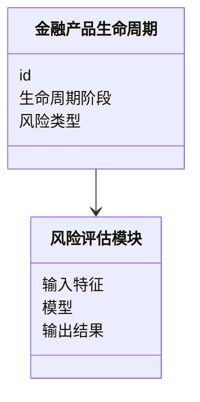
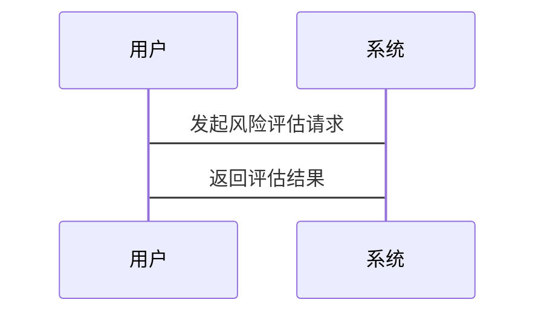

                 


```markdown
# 开发智能化的金融产品生命周期风险评估平台

> 关键词：金融产品生命周期，风险评估，人工智能，机器学习，系统架构设计

> 摘要：本文详细介绍了开发智能化的金融产品生命周期风险评估平台的核心概念、算法原理、系统架构设计以及项目实战。通过结合金融风险管理的实际需求，探讨如何利用人工智能技术提升风险评估的准确性和效率，最终实现智能化的风险管理。

---

# 第一部分: 金融产品生命周期风险评估平台背景与核心概念

## 第1章: 金融产品生命周期风险评估平台概述

### 1.1 问题背景与目标
#### 1.1.1 传统金融风险管理的局限性
传统金融风险管理主要依赖人工分析和简单的统计模型，存在效率低、覆盖范围有限、难以应对复杂金融市场变化等问题。随着金融市场的日益复杂化和数字化，传统的风险管理方法已无法满足现代金融业务的需求。

#### 1.1.2 智能化风险管理的需求与目标
智能化风险管理通过引入人工智能、大数据分析等技术，能够实时监控金融市场动态，快速识别潜在风险，并提供精准的风险评估和预警。其目标是提升风险管理的效率、准确性和前瞻性。

#### 1.1.3 平台的核心价值与意义
智能化金融产品生命周期风险评估平台的核心价值在于通过自动化、智能化的方式，对金融产品的全生命周期进行实时风险评估，帮助金融机构有效降低风险敞口，提升决策效率和准确性。

---

## 第2章: 核心概念与系统联系

### 2.1 核心概念原理
#### 2.1.1 金融产品生命周期的定义
金融产品生命周期包括产品设计、发行、交易、到期退出等阶段。每个阶段都伴随着不同的风险类型，如信用风险、市场风险、流动性风险等。

#### 2.1.2 风险评估的关键要素
风险评估的关键要素包括产品本身的特性（如杠杆率、期限）、市场环境（如利率、汇率）、参与者行为（如投资者情绪）等。

#### 2.1.3 平台的智能化机制
智能化机制包括数据采集、特征提取、模型训练、风险预测、实时监控等功能模块，通过自动化流程实现对金融产品的全生命周期风险管理。

### 2.2 核心概念对比与ER图
#### 2.2.1 风险类型与评估指标对比
| 风险类型   | 评估指标               |
|------------|------------------------|
| 信用风险   | 债务人违约概率         |
| 市场风险   | 资产价格波动幅度       |
| 流动性风险 | 市场深度与交易活跃度   |

#### 2.2.2 金融产品与风险因素的ER图
```mermaid
er
    entity 金融产品生命周期 (核心概念) {
        id: string
        阶段: string
        风险类型: string
        关联关系: string
    }
```

---

## 第3章: 算法原理与数学模型

### 3.1 算法原理概述
#### 3.1.1 机器学习在风险评估中的应用
机器学习算法（如随机森林、XGBoost）用于特征提取和风险分类。

#### 3.1.2 深度学习与强化学习的对比
深度学习适合处理非结构化数据，强化学习适合动态环境下的决策优化。

#### 3.1.3 算法选择的依据与原则
根据数据类型、业务需求和计算资源选择合适的算法。

### 3.2 算法流程与实现
#### 3.2.1 数据预处理与特征提取
- 数据清洗：处理缺失值、异常值。
- 特征提取：从金融产品生命周期中提取关键特征。

#### 3.2.2 模型训练与优化
- 使用训练数据训练模型。
- 通过交叉验证优化模型参数。

#### 3.2.3 模型评估与部署
- 使用测试数据评估模型性能。
- 部署模型到生产环境。

### 3.3 数学模型与公式
#### 3.3.1 风险评估的线性回归模型
$$y = \beta_0 + \beta_1x_1 + \beta_2x_2 + ... + \beta_nx_n$$

#### 3.3.2 基于决策树的分类模型
决策树通过特征分裂进行分类，适用于高维数据。

#### 3.3.3 深度学习模型的数学基础
如神经网络的激活函数、损失函数等。

### 3.4 实例分析与解释
#### 3.4.1 风险评估案例分析
通过具体案例展示模型的应用和效果。

#### 3.4.2 模型训练与结果解读
解释模型输出结果的意义和实际应用。

#### 3.4.3 模型优化与调参技巧
通过网格搜索、随机搜索等方法优化模型性能。

---

## 第4章: 系统分析与架构设计

### 4.1 问题场景分析
#### 4.1.1 金融产品生命周期的风险场景
识别金融产品生命周期中的关键风险点。

#### 4.1.2 平台用户与功能需求
用户包括金融机构、监管机构等，需求包括风险评估、实时监控等功能。

#### 4.1.3 系统性能与安全性要求
确保系统高可用性、高安全性，符合金融行业标准。

### 4.2 系统功能设计
#### 4.2.1 领域模型设计


#### 4.2.2 系统架构设计


#### 4.2.3 系统接口设计
- API接口定义：如RESTful API。
- 接口文档：详细说明接口的功能、输入输出格式。

#### 4.2.4 系统交互设计


---

## 第5章: 项目实战

### 5.1 环境安装与配置
#### 5.1.1 安装Python
```bash
python --version
pip install --upgrade pip
```

#### 5.1.2 安装依赖库
```bash
pip install numpy pandas scikit-learn tensorflow
```

### 5.2 核心代码实现
#### 5.2.1 数据预处理
```python
import pandas as pd
data = pd.read_csv('financial_products.csv')
data.dropna(inplace=True)
```

#### 5.2.2 模型训练
```python
from sklearn.ensemble import RandomForestClassifier
model = RandomForestClassifier()
model.fit(X_train, y_train)
```

#### 5.2.3 模型评估
```python
from sklearn.metrics import accuracy_score
print(accuracy_score(y_test, model.predict(X_test)))
```

### 5.3 实际案例分析
#### 5.3.1 案例背景
分析某金融产品的生命周期，预测其违约风险。

#### 5.3.2 数据分析与建模
使用训练好的模型对数据进行预测，并解释结果。

#### 5.3.3 结果解读与优化
根据模型输出结果优化风险评估策略。

---

## 第6章: 最佳实践与总结

### 6.1 最佳实践 tips
- 数据清洗的重要性
- 模型调优的技巧
- 系统安全与合规性

### 6.2 小结
总结本文的主要内容和关键点。

### 6.3 注意事项
提醒读者在实际应用中需要注意的问题。

### 6.4 拓展阅读
推荐相关领域的书籍和资源。

---

# 作者：AI天才研究院 & 禅与计算机程序设计艺术
```

