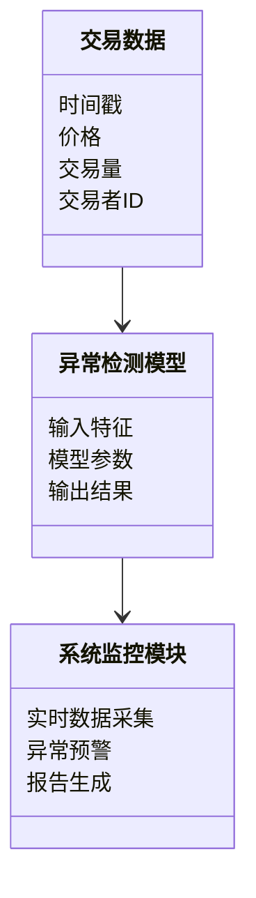
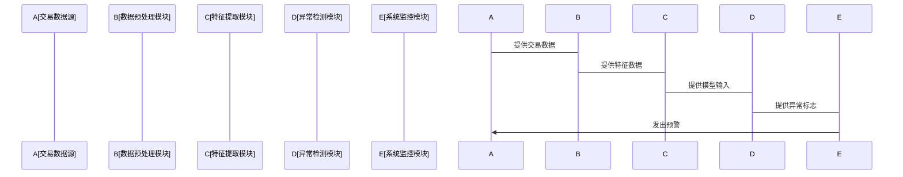

                 

<think>
嗯，用户让我帮他写一篇关于开发智能化的金融市场异常交易检测模型的技术博客。我得先仔细看看他的要求。他希望文章结构清晰，章节吸引人，内容专业且有深度。关键词需要5-7个，摘要要概括核心内容。

首先，我需要确定文章的标题和关键词。标题已经给出，关键词可能包括金融市场、异常交易、机器学习、深度学习、AI检测等。摘要部分要简明扼要，说明文章的核心内容，比如从数据特征到模型构建，再到系统设计，结合算法原理和项目实战。

接下来是目录结构。用户已经给出了一个大纲，包括背景介绍、核心概念、算法原理、系统分析、项目实战和小结。我需要确保每章都有足够的细节，比如在算法部分，使用mermaid图展示流程，并给出Python代码示例。同时，数学公式要用latex表示，独立段落用$$，段落内用$。

在编写每一章时，我需要详细讲解，比如第一章介绍背景，包括金融市场现状、异常交易的定义和挑战。第二章详细讨论核心概念，对比传统方法和AI方法，分析数据特征。第三章讲解算法，用图表和代码示例说明。第四章深入数学模型，给出公式和例子。第五章系统设计，用类图和序列图展示架构。第六章项目实战，环境搭建、代码实现、案例分析。最后总结注意事项和扩展阅读。

我还要注意文章的结构是否符合逻辑，每章之间是否有连贯性。确保每一部分都符合用户的要求，比如使用吸引人的章节标题，内容详细且有深度，语言专业但易懂。

最后，检查字数是否在10000到12000字之间，确保每个小节内容丰富，符合完整性要求。确保作者信息正确，格式符合要求，没有使用任何markdown格式，但内容要详细且结构清晰。

总的来说，我需要一步步按照用户的要求，从背景到概念，再到算法、系统设计和实战，确保每一步都详细且专业，最终写出一篇高质量的技术博客。
</think>

# 开发智能化的金融市场异常交易检测模型

**关键词**：金融市场，异常交易，机器学习，深度学习，AI检测，算法原理，系统设计

**摘要**：  
本文详细探讨了开发智能化的金融市场异常交易检测模型的全过程，从问题背景到算法原理，从系统架构到项目实战，结合实际案例和数学模型，深入剖析了如何利用人工智能技术实现高效的异常交易检测。文章内容涵盖金融市场现状、异常交易的定义与分类、常见异常检测算法及其数学模型、系统架构设计以及项目实战等内容，旨在为读者提供一个全面且系统的技术指导。

---

## 第1章: 异常交易检测的背景与问题定义

### 1.1 金融市场的现状与挑战
#### 1.1.1 金融市场的基本结构
金融市场的核心是资金流动和价值交换，参与者包括投资者、金融机构、监管机构等。随着金融市场的全球化和电子化，交易行为日益复杂，异常交易现象频发。

#### 1.1.2 金融市场中的异常交易现象
异常交易包括操纵市场、 insider trading、洗盘等行为，这些行为严重破坏市场公平性，损害投资者利益。

#### 1.1.3 异常交易检测的必要性
及时发现和处理异常交易行为，是维护金融市场秩序、保护投资者权益的重要手段。

### 1.2 异常交易的定义与分类
#### 1.2.1 异常交易的定义
异常交易是指偏离正常市场规律的交易行为，通常表现出非正常的价格波动、交易量突增等特征。

#### 1.2.2 异常交易的分类
- **市场操纵**：通过虚假交易制造市场假象。
- **内幕交易**：利用未公开信息进行交易。
- **高频交易异常**：高频交易算法出现错误或恶意操作。

#### 1.2.3 异常交易的特征分析
- 交易量突增或骤减。
- 价格波动异常。
- 交易时间集中或分散。

### 1.3 异常交易检测的核心问题
#### 1.3.1 问题背景
随着金融市场的复杂化，传统的基于规则的异常交易检测方法已难以应对日益复杂的异常交易行为。

#### 1.3.2 问题描述
如何利用人工智能技术，从海量交易数据中发现异常交易行为，实现高效、准确的检测。

#### 1.3.3 问题解决的思路
结合统计分析、机器学习和深度学习技术，构建智能化的异常交易检测模型。

### 1.4 异常交易检测的边界与外延
#### 1.4.1 异常交易的边界
明确异常交易的法律定义和监管边界，确保检测模型的合法性和合规性。

#### 1.4.2 异常交易的外延
探讨异常交易与其他交易行为的区分，例如高频交易与正常交易的边界。

#### 1.4.3 异常交易与其他交易行为的区分
通过特征工程和模型训练，建立异常交易与其他交易行为的区分标准。

### 1.5 本章小结
本章从金融市场现状出发，详细阐述了异常交易的定义、分类及其检测的必要性，为后续模型构建奠定了基础。

---

## 第2章: 异常交易检测的核心概念与联系

### 2.1 异常交易检测的核心概念
#### 2.1.1 数据特征
- **时间序列特征**：交易时间、交易频率。
- **价格特征**：价格波动、成交量变化。
- **行为特征**：交易者的交易习惯、交易模式。

#### 2.1.2 模型特征
- **输入特征**：交易时间、价格、成交量等。
- **输出特征**：异常标志（正常/异常）。
- **模型性能**：检测准确率、召回率、F1值。

#### 2.1.3 交易行为特征
- **交易频率**：高频交易 vs. 长期投资。
- **交易金额**：大额交易 vs. 小额交易。
- **交易时间**：集中交易 vs. 分散交易。

### 2.2 异常交易检测的核心原理
#### 2.2.1 统计分析方法
- **Z-score方法**：通过标准化数据检测异常值。
- **箱线图方法**：基于四分位数检测异常值。

#### 2.2.2 机器学习方法
- **监督学习**：基于标注数据训练分类器。
- **无监督学习**：基于聚类算法发现异常簇。

#### 2.2.3 深度学习方法
- **神经网络**：通过非线性特征提取发现异常。
- **LSTM网络**：捕捉时间序列中的异常模式。

### 2.3 异常交易检测的核心要素
#### 2.3.1 数据来源
- **实时交易数据**：高频交易数据。
- **历史交易数据**：用于模型训练。
- **市场信息**：如新闻、事件等。

#### 2.3.2 检测模型
- **特征提取模型**：如PCA、t-SNE。
- **异常检测模型**：如Isolation Forest、Autoencoder。
- **模型优化**：超参数调优、模型融合。

#### 2.3.3 评价指标
- **准确率**：正常交易的正确识别率。
- **召回率**：异常交易的正确识别率。
- **F1值**：综合准确率和召回率的指标。

### 2.4 本章小结
本章从核心概念出发，分析了异常交易检测的关键要素和原理，为后续算法选择和模型构建提供了理论支持。

---

## 第3章: 异常交易检测的算法原理

### 3.1 异常检测算法概述
#### 3.1.1 基于统计的异常检测
- **Z-score方法**：$z = \frac{x - \mu}{\sigma}$，其中$\mu$为均值，$\sigma$为标准差。
- **箱线图方法**：基于四分位数，识别超出上下界的异常值。

#### 3.1.2 基于机器学习的异常检测
- **孤立森林（Isolation Forest）**：一种无监督学习算法，通过构建随机树分割数据，孤立异常点。
- **K近邻（KNN）**：通过计算数据点的最近邻居密度，识别异常点。

#### 3.1.3 基于深度学习的异常检测
- **自编码器（Autoencoder）**：通过重建损失发现异常。
  $$\text{重建损失} = \frac{1}{2}\|x - \hat{x}\|^2$$
- **LSTM网络**：通过时间序列建模捕捉异常模式。

### 3.2 常见异常检测算法
#### 3.2.1 Isolation Forest算法
- **优点**：计算效率高，适合大数据集。
- **缺点**：对异常点的识别可能存在偏差。
- **流程图**（使用mermaid）：
  ```mermaid
  graph TD
      A[输入数据] --> B[构建随机树]
      B --> C[计算异常分数]
      C --> D[输出异常标志]
  ```

#### 3.2.2 Autoencoder算法
- **优点**：能够捕捉数据的高维特征。
- **缺点**：对异常点的重建误差可能不够明显。
- **流程图**：
  ```mermaid
  graph TD
      A[输入数据] --> B[编码器]
      B --> C[解码器]
      C --> D[计算重建损失]
      D --> E[输出异常标志]
  ```

#### 3.2.3 LSTM网络
- **优点**：适合时间序列数据。
- **缺点**：训练复杂度较高。
- **流程图**：
  ```mermaid
  graph TD
      A[输入序列] --> B[编码器]
      B --> C[解码器]
      C --> D[计算异常概率]
      D --> E[输出异常标志]
  ```

### 3.3 算法原理详细讲解
#### 3.3.1 Isolation Forest算法的数学模型
- 异常分数计算公式：
  $$\text{异常分数} = \frac{1}{\text{路径长度}}$$
- 路径长度是指数据点在随机树中的深度。

#### 3.3.2 Autoencoder算法的数学模型
- 编码器部分：
  $$h = \sigma(Wx + b)$$
- 解码器部分：
  $$\hat{x} = \sigma(W'h + b')$$
- 重建损失：
  $$\text{损失} = \frac{1}{2}\|x - \hat{x}\|^2$$

#### 3.3.3 LSTM网络的数学模型
- 输入门：
  $$i_t = \sigma(W_i x_t + U_i h_{t-1} + b_i)$$
- 遗忘门：
  $$f_t = \sigma(W_f x_t + U_f h_{t-1} + b_f)$$
- 输出门：
  $$o_t = \sigma(W_o x_t + U_o h_{t-1} + b_o)$$
- 隐态：
  $$h_t = i_t \cdot \cosh(W_c x_t + U_c h_{t-1} + b_c)$$

### 3.4 本章小结
本章详细介绍了异常检测算法的原理和实现，结合具体公式和流程图，为后续模型构建提供了理论基础。

---

## 第4章: 异常交易检测的系统分析与架构设计

### 4.1 问题场景介绍
异常交易检测系统需要实时处理海量交易数据，快速识别异常交易行为，并发出预警。

### 4.2 项目介绍
#### 4.2.1 项目目标
开发一个智能化的异常交易检测系统，实现对金融市场交易行为的实时监控。

#### 4.2.2 项目范围
涵盖股票、期货、外汇等多种金融产品。

### 4.3 系统功能设计
#### 4.3.1 领域模型


#### 4.3.2 系统架构设计


#### 4.3.3 接口设计
- 数据输入接口：实时交易数据。
- 模型调用接口：特征提取和模型预测。
- 预警输出接口：异常交易预警信息。

#### 4.3.4 交互设计


### 4.4 本章小结
本章从系统架构角度，详细设计了异常交易检测系统的功能模块和交互流程，为后续实现奠定了基础。

---

## 第5章: 异常交易检测的项目实战

### 5.1 环境安装
- Python 3.8+
- 机器学习库：scikit-learn、Keras、TensorFlow
- 数据处理库：Pandas、NumPy
- 可视化库：Matplotlib、Seaborn

### 5.2 系统核心实现
#### 5.2.1 数据预处理
- 数据清洗：去除缺失值、异常值。
- 特征工程：提取时间、价格、交易量等特征。

#### 5.2.2 模型实现
- 使用Isolation Forest算法实现异常检测：
  ```python
  from sklearn.ensemble import IsolationForest
  model = IsolationForest(n_estimators=100, random_state=42)
  model.fit(X_train)
  y_pred = model.predict(X_test)
  ```

- 使用Autoencoder算法实现异常检测：
  ```python
  from tensorflow.keras.models import Model
  from tensorflow.keras.layers import Dense, RepeatVector, LSTM, Input

  input_shape = (timesteps, features)
  inputs = Input(shape=(timesteps, features))
  lstm, _ = LSTM(50, return_sequences=True)(inputs)
  lstm, _ = LSTM(50, return_sequences=True)(lstm)
  decoder = Dense(features)(lstm)
  model = Model(inputs=inputs, outputs=decoder)
  model.compile(loss='mse', optimizer='adam')
  ```

### 5.3 代码实现与分析
#### 5.3.1 数据加载与预处理
```python
import pandas as pd
import numpy as np

data = pd.read_csv('交易数据.csv')
data = data.dropna()
X = data.drop(columns=['label'])
y = data['label']
```

#### 5.3.2 模型训练与评估
```python
from sklearn.metrics import confusion_matrix, classification_report

y_pred = model.predict(X)
print(classification_report(y_true=y, y_pred=y_pred))
```

### 5.4 实际案例分析
- 案例1：检测市场操纵行为。
- 案例2：检测高频交易异常。

### 5.5 本章小结
本章通过实际项目实战，详细讲解了异常交易检测系统的实现过程，包括环境搭建、代码实现和案例分析。

---

## 第6章: 异常交易检测的最佳实践与小结

### 6.1 最佳实践
#### 6.1.1 数据处理
- 数据清洗：去除噪声数据。
- 特征选择：提取关键特征。

#### 6.1.2 模型选择
- 根据数据特点选择合适的算法。
- 结合多种算法进行模型融合。

#### 6.1.3 系统优化
- 优化模型性能。
- 实现高效的实时检测。

### 6.2 注意事项
- 确保模型的可解释性。
- 定期更新模型，适应市场变化。

### 6.3 拓展阅读
- 《异常检测：理论与实践》
- 《深度学习在金融领域的应用》

### 6.4 本章小结
本章总结了异常交易检测的最佳实践，强调了数据处理、模型选择和系统优化的重要性。

---

## 作者信息

**作者：AI天才研究院/AI Genius Institute & 禅与计算机程序设计艺术 /Zen And The Art of Computer Programming**

---

**文章总结**：  
本文从金融市场异常交易检测的背景出发，详细讲解了异常交易的定义、分类及其检测的核心概念，结合常见异常检测算法的原理和实现，最后通过项目实战和系统设计，为读者提供了一个全面的技术指导。文章内容丰富，逻辑清晰，适合金融从业者、数据科学家和人工智能工程师阅读参考。

