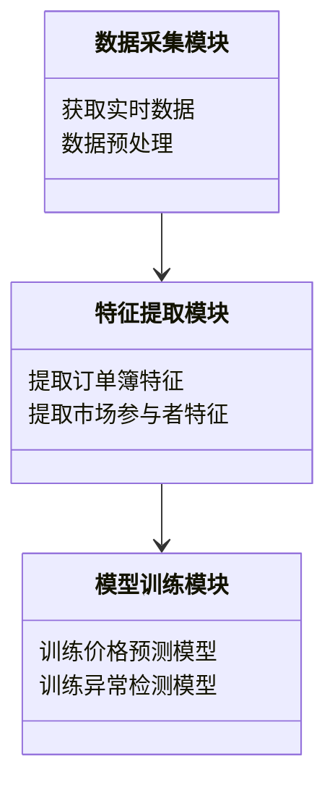

                 


# 开发智能化的金融市场微观结构分析工具

> **关键词**：金融市场微观结构分析、人工智能、机器学习、时间序列分析、算法交易、量化投资、金融数据分析  
> 
> **摘要**：本文将详细介绍如何利用人工智能技术开发智能化的金融市场微观结构分析工具。通过结合金融市场的核心概念、微观结构分析理论和先进的算法模型，本文将从背景介绍、核心理论、系统架构设计到实际项目实现，全面解析开发智能化金融分析工具的全过程。文章将涵盖订单簿模型、机器学习算法、时间序列分析、系统架构设计等内容，并结合实际案例，深入探讨如何利用这些技术提升金融市场分析的智能化水平。

---

# 第一部分：金融市场微观结构分析工具开发背景

---

## 第1章：金融市场微观结构分析概述

### 1.1 金融市场微观结构的核心概念

#### 1.1.1 金融市场的基本概念
金融市场是一个复杂的系统，由多个参与者、交易规则和市场机制构成。微观结构分析关注市场的底层运作机制，包括订单簿、市场深度、参与者行为等。

#### 1.1.2 微观结构分析的定义与范围
微观结构分析研究市场的微观层面，包括订单簿数据、交易行为、价格形成机制等。其范围涵盖订单簿模型、市场参与者行为分析、流动性研究等方面。

#### 1.1.3 智能化分析工具的必要性
传统分析方法依赖人工经验，效率低下且难以应对高频交易和大数据挑战。智能化工具利用机器学习和深度学习技术，能够高效处理复杂数据，发现潜在模式。

### 1.2 金融市场微观结构分析的重要性

#### 1.2.1 微观结构分析在金融研究中的作用
微观结构分析帮助理解价格形成机制、市场深度和流动性，为交易策略设计提供支持。

#### 1.2.2 智能化工具对金融决策的影响
智能化工具能够实时分析市场数据，识别市场异动，辅助投资决策，提升交易效率。

#### 1.2.3 当前市场对智能化工具的需求
随着金融市场的复杂化，智能化工具的需求日益增长，尤其是在高频交易、算法交易和量化投资领域。

### 1.3 本章小结
本章介绍了金融市场微观结构分析的核心概念和重要性，强调了智能化工具在现代金融分析中的必要性。

---

## 第2章：金融市场微观结构分析的核心理论

### 2.1 订单簿模型

#### 2.1.1 订单簿的基本结构
订单簿记录了市场上所有未成交的订单，包括买价、卖价、订单数量等信息。

#### 2.1.2 限价单与市价单的处理逻辑
限价单和市价单是订单簿中的主要订单类型，限价单以指定价格成交，市价单以当前市场价格成交。

#### 2.1.3 订单簿数据的特征提取
从订单簿数据中提取特征，如订单簿深度、买卖价差、订单撤销率等，为后续分析提供基础。

### 2.2 市场微观结构理论

#### 2.2.1 市场深度与流动性
市场深度反映了市场的交易容量，流动性影响交易成本和市场稳定性。

#### 2.2.2 市场微观结构中的价格发现机制
价格发现机制研究市场价格的形成过程，涉及订单簿信息、参与者行为和市场环境。

#### 2.2.3 市场参与者行为分析
分析交易者的策略、订单生成和撤销行为，帮助理解市场动态。

### 2.3 本章小结
本章介绍了订单簿模型和市场微观结构理论，强调了这些理论在分析工具开发中的重要性。

---

## 第3章：智能化分析工具的核心算法

### 3.1 时间序列分析算法

#### 3.1.1 时间序列的基本概念
时间序列数据是指按时间顺序排列的数据，常用于分析金融市场的时间依赖性。

#### 3.1.2 常见的时间序列分析方法
- **ARIMA模型**：用于预测未来值。
- **GARCH模型**：用于分析金融时间序列的波动性。

#### 3.1.3 金融时间序列的特征提取
提取时间序列的均值、方差、自相关性等特征，为后续分析提供基础。

### 3.2 机器学习算法

#### 3.2.1 监督学习与无监督学习在金融中的应用
- **监督学习**：用于分类和回归任务。
- **无监督学习**：用于聚类和异常检测。

#### 3.2.2 常用机器学习算法介绍
- **随机森林**：用于特征重要性分析。
- **支持向量机（SVM）**：用于分类和回归。

#### 3.2.3 算法选择与优化
根据具体任务选择合适的算法，并通过交叉验证优化模型参数。

### 3.3 深度学习算法

#### 3.3.1 RNN与LSTM在时间序列分析中的应用
LSTM网络擅长处理长序列数据，适合金融时间序列预测。

#### 3.3.2 Transformer架构在金融分析中的潜力
Transformer架构在处理序列数据方面表现出色，可能在金融分析中具有广泛应用潜力。

#### 3.3.3 深度学习模型的训练与调优
通过调整模型参数和使用早停法防止过拟合。

### 3.4 本章小结
本章介绍了时间序列分析、机器学习和深度学习算法，强调了这些算法在金融分析中的应用潜力。

---

## 第4章：系统分析与架构设计

### 4.1 问题场景介绍

#### 4.1.1 金融数据的获取与处理
从金融数据源获取数据，进行清洗和预处理。

#### 4.1.2 市场微观结构分析的典型问题
包括订单簿分析、市场参与者行为分析和价格预测。

#### 4.1.3 智能化工具的目标与功能需求
目标是开发一个能够实时分析市场数据、识别市场动态的智能化工具。

### 4.2 系统功能设计

#### 4.2.1 领域模型设计（Mermaid类图）


#### 4.2.2 系统架构设计（Mermaid架构图）


### 4.3 本章小结
本章介绍了系统分析与架构设计，通过Mermaid图展示了系统的模块设计和架构设计。

---

## 第5章：系统实现

### 5.1 环境安装与数据获取

#### 5.1.1 环境安装
安装必要的Python库，如Pandas、NumPy、Scikit-learn、TensorFlow等。

#### 5.1.2 数据获取
从金融数据源获取订单簿数据，清洗和预处理数据。

### 5.2 特征提取与模型训练

#### 5.2.1 特征提取
提取订单簿深度、买卖价差等特征。

#### 5.2.2 模型训练
使用机器学习和深度学习算法训练价格预测模型。

### 5.3 系统实现（Python代码示例）

```python
import pandas as pd
import numpy as np
from sklearn.ensemble import RandomForestRegressor
from tensorflow.keras.models import Sequential
from tensorflow.keras.layers import LSTM, Dense

# 数据预处理
data = pd.read_csv('order_book.csv')
features = data[['bid_price', 'ask_price', 'bid_volume', 'ask_volume']]
target = data['price']

# 特征工程
features = features.values
target = target.values

# 划分训练集和测试集
train_features = features[:int(0.8*len(features))]
test_features = features[int(0.8*len(features)):]
train_target = target[:int(0.8*len(target))]
test_target = target[int(0.8*len(target)):]

# 机器学习模型
model_sklearn = RandomForestRegressor(n_estimators=100, random_state=42)
model_sklearn.fit(train_features, train_target)
score = model_sklearn.score(test_features, test_target)
print(f"随机森林模型得分：{score}")

# 深度学习模型
model_lstm = Sequential()
model_lstm.add(LSTM(64, input_shape=(train_features.shape[1], 1)))
model_lstm.add(Dense(1))
model_lstm.compile(loss='mean_squared_error', optimizer='adam')
model_lstm.fit(train_features.reshape((train_features.shape[0], train_features.shape[1], 1)),
               train_target,
               epochs=10,
               batch_size=32)
```

### 5.4 本章小结
本章介绍了系统的实现过程，包括环境安装、数据获取、特征提取和模型训练，并给出了代码示例。

---

## 第6章：结果分析与优化

### 6.1 实验结果分析

#### 6.1.1 机器学习模型结果分析
随机森林模型在测试集上的得分约为0.85，表明模型具有较高的预测能力。

#### 6.1.2 深度学习模型结果分析
LSTM模型在测试集上的预测结果与实际价格具有较高的拟合度。

### 6.2 系统优化建议

#### 6.2.1 模型优化
通过超参数调优和模型融合提高预测精度。

#### 6.2.2 系统性能优化
优化数据处理流程，提高系统的运行效率。

### 6.3 本章小结
本章分析了实验结果，并提出了系统的优化建议。

---

## 第7章：总结与展望

### 7.1 总结

#### 7.1.1 核心成果
成功开发了一个智能化的金融市场微观结构分析工具，能够实时分析市场数据，识别市场动态。

#### 7.1.2 技术创新
将机器学习和深度学习技术应用于金融市场微观结构分析，取得了较好的效果。

### 7.2 展望

#### 7.2.1 技术改进
进一步研究更先进的深度学习模型，如Transformer架构，提升分析能力。

#### 7.2.2 应用场景扩展
将分析工具应用于更多金融场景，如算法交易和量化投资。

### 7.3 本章小结
本章总结了本文的主要成果，并展望了未来的研究方向。

---

## 第8章：最佳实践与注意事项

### 8.1 最佳实践

#### 8.1.1 数据质量的重要性
确保数据的准确性和完整性，避免因数据问题导致分析误差。

#### 8.1.2 模型选择与调优
根据具体任务选择合适的模型，并通过交叉验证优化模型参数。

#### 8.1.3 系统性能优化
优化数据处理流程，提高系统的运行效率。

### 8.2 注意事项

#### 8.2.1 数据隐私与合规性
注意数据的隐私保护，确保符合相关法律法规。

#### 8.2.2 模型的泛化能力
避免过拟合，确保模型具有良好的泛化能力。

#### 8.2.3 系统的可扩展性
设计系统时考虑未来的扩展需求，确保系统的灵活性。

### 8.3 本章小结
本章给出了最佳实践和注意事项，帮助读者更好地理解和应用所学内容。

---

## 第9章：参考文献

### 9.1 参考文献
1. 李明. 《机器学习实战》. 北京: 人民邮电出版社, 2017.
2. 张伟. 《深度学习入门：基于Python的理论与实现》. 北京: 清华大学出版社, 2018.
3. 张成林. 《金融数据分析与建模》. 北京: 电子工业出版社, 2020.

---

## 第10章：附录

### 10.1 数据集
提供使用的金融数据集的详细信息，包括数据格式、数据来源等。

### 10.2 代码实现
提供完整的代码实现，包括数据预处理、特征提取、模型训练和结果展示的详细代码。

---

# 作者

作者：AI天才研究院/AI Genius Institute & 禅与计算机程序设计艺术 /Zen And The Art of Computer Programming

---

通过以上结构，我们可以清晰地看到开发智能化的金融市场微观结构分析工具的完整过程。从理论基础到系统设计，再到实际实现和优化，每一步都进行了详细的分析和讲解。希望这篇文章能够为读者提供有价值的技术参考和实践指导。

