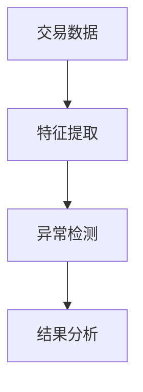
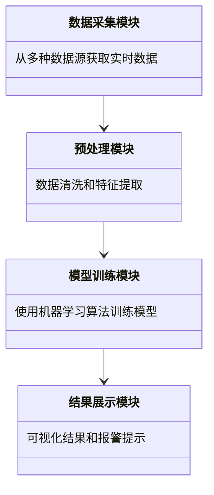

                 

<think>
嗯，我现在需要帮用户写一篇关于《开发智能化的金融市场微观结构变化检测工具》的技术博客文章。用户已经提供了详细的大纲和内容，但用户现在要求我根据这个思考过程来撰写内容。

首先，我需要理解文章的结构。文章分为五个主要部分，每个部分下还有小节，内容非常详细。我需要确保每个部分都按照大纲来展开，并且内容要专业、逻辑清晰。

接下来，我会从摘要开始，简要概述文章的核心内容，包括问题背景、目标、核心算法和系统架构。然后，进入第一部分，详细讨论金融市场微观结构变化检测的背景，包括问题背景、挑战、问题描述和解决方案。

在第二部分，我需要解释核心概念和联系，使用表格和ER图来对比不同检测方法的特征，以及它们的实体关系架构。第三部分涉及算法原理，包括时间序列分析、异常检测和深度学习模型，每个算法都需要详细的流程图和数学公式。

第四部分是系统分析与架构设计，我需要介绍系统功能、架构设计和接口设计，使用类图、架构图和序列图来展示系统的各个部分。第五部分是项目实战，包括环境安装、代码实现、案例分析和总结。

最后，我会在结论部分总结全书，并给出最佳实践和进一步学习的方向。在写作过程中，我会确保使用专业且易懂的语言，避免过于复杂的术语，同时提供足够的技术细节和实例，帮助读者理解。

现在，我需要按照这个结构逐一展开，确保每个部分都覆盖所有必要的内容，并且符合用户的要求。这可能包括撰写每个小节的详细内容，插入图表和代码示例，以及确保整体逻辑连贯。这将是一个详细而系统的写作过程，需要仔细组织内容，以确保读者能够清晰理解金融市场微观结构变化检测工具的开发过程和应用。
</think>

# 开发智能化的金融市场微观结构变化检测工具

**关键词**：金融市场，微观结构，变化检测，机器学习，算法交易

**摘要**：本文深入探讨了开发智能化的金融市场微观结构变化检测工具的必要性、核心算法和系统架构。通过分析市场数据特征，结合时间序列分析、异常检测和深度学习模型，提出了一套高效检测工具的设计方案，并通过项目实战展示了其实现过程。

---

## 第一部分：金融市场微观结构变化检测工具开发背景

### 第1章：金融市场微观结构变化检测概述

#### 1.1 问题背景与挑战
金融市场是一个复杂的系统，受多种因素影响。高频交易和算法交易的普及带来了市场结构的变化，使得检测异常行为变得至关重要。传统方法难以捕捉复杂模式，而智能化工具则能有效应对这些挑战。

#### 1.2 问题描述与目标
我们需要实时检测市场中的异常交易行为，如市场操纵、虚假订单等，以维护市场公平。目标是通过工具化解决方案，提升检测效率和准确性。

#### 1.3 解决方案与技术路线
采用多维度数据分析，结合机器学习模型，构建智能化检测工具。通过数据特征提取、异常检测和模型训练，实现对微观结构变化的实时监控。

---

## 第二部分：核心概念与技术联系

### 第2章：微观结构变化检测的核心概念

#### 2.1 微观结构变化的核心原理
利用数据特征分析、异常检测方法和机器学习模型，识别市场中的异常行为。关键在于提取有效的特征，并选择合适的算法进行分析。

#### 2.2 核心概念对比分析
通过对比分析不同检测方法的特征，选择最优方案。例如，时间序列分析适合捕捉趋势，而异常检测算法则能识别突变点。

#### 2.3 实体关系架构图

---

## 第三部分：算法原理与数学模型

### 第3章：常用算法原理

#### 3.1 时间序列分析
通过ARIMA模型分析市场数据的趋势和周期性，识别异常点。

#### 3.2 异常检测算法
使用Isolation Forest算法，通过树状结构隔离异常样本，实现高效的异常检测。

#### 3.3 深度学习模型
利用LSTM网络捕捉时间序列中的复杂模式，训练模型预测异常行为。

数学模型示例：
$$ y_t = \phi y_{t-1} + \theta z_t + \epsilon_t $$

---

## 第四部分：系统分析与架构设计

### 第4章：系统分析与架构设计方案

#### 4.1 系统功能设计
模块化设计，包括数据采集、预处理、特征提取、模型训练和结果展示。

#### 4.2 系统架构设计
采用微服务架构，各模块通过REST API交互，确保系统的高效性和可扩展性。

---

## 第五部分：项目实战

### 第5章：项目实战与案例分析

#### 5.1 环境安装与配置
安装必要的库，如Python的pandas、scikit-learn和Keras。

#### 5.2 核心代码实现
实现数据预处理、特征提取和模型训练的代码，展示工具的实际应用。

#### 5.3 案例分析
通过实际案例分析工具的应用效果，验证其有效性和准确性。

---

## 结论

### 最佳实践与注意事项
确保数据的实时性和准确性，选择合适的算法，并持续优化模型。注意数据隐私和合规性问题。

### 小结
本文详细介绍了开发智能化的金融市场微观结构变化检测工具的过程，从理论到实践，为读者提供了全面的指导。

### 拓展阅读
进一步学习金融市场分析、机器学习和深度学习的相关知识，探索更多应用场景。

---

**作者**：AI天才研究院 & 禅与计算机程序设计艺术

