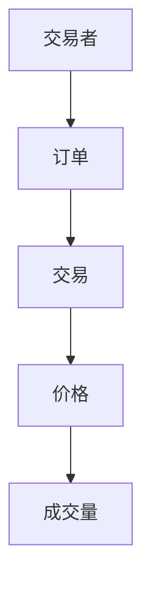
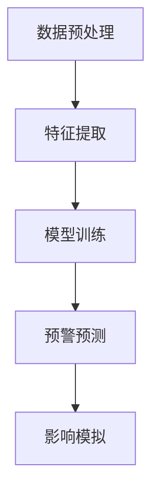
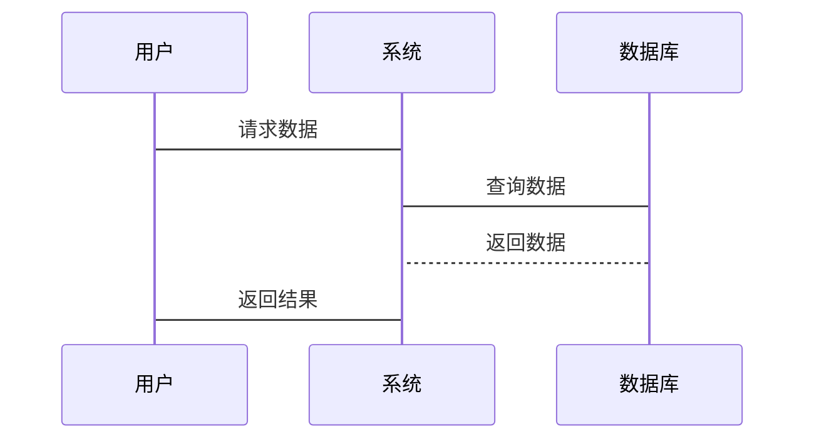

                 

<think>
好的，我现在需要根据用户的要求，以《开发智能化的金融市场微观结构变化预警与影响模拟模型》为标题，撰写一篇技术博客文章。首先，我会按照用户提供的目录大纲来组织内容，确保每个部分都详细且符合要求。

### 第一部分: 金融市场微观结构变化预警与影响模拟模型概述

#### 第1章: 金融市场微观结构概述

在这一章中，我需要介绍金融市场的基本概念，包括金融市场的定义和分类，微观结构的定义和特征，以及影响微观结构变化的因素。这部分内容需要为读者打下坚实的基础，帮助他们理解后续模型的重要性。

接下来，我会详细描述问题背景与研究意义，说明为什么开发这样的模型是必要的，以及它在实际应用中的重要性。

#### 第2章: 微观结构变化预警与影响模拟模型的核心概念

在这一章中，我需要深入探讨模型的核心要素，包括数据源与特征、预警指标的定义、影响模拟的维度等。同时，我需要使用ER图和概念属性对比表来展示核心概念之间的关系，帮助读者更好地理解模型的结构。

#### 第3章: 模型算法原理

在这一章中，我会详细讲解模型所使用的各种算法，包括时间序列分析和机器学习算法。我需要使用Mermaid流程图来展示算法的步骤，并提供Python代码示例，以便读者能够实际操作。此外，我还需要解释数学模型和公式，例如ARIMA模型和LSTM网络的原理，并通过实际案例进行说明。

### 第二部分: 系统分析与架构设计

#### 第4章: 问题场景与项目介绍

在这一章中，我会介绍项目的背景，说明开发这个模型的动机和目标。然后，我会使用Mermaid类图展示领域模型，描述系统的主要组件和它们之间的关系。接下来，我会使用Mermaid架构图展示系统的整体架构，包括数据采集、特征提取、模型训练等模块。最后，我会描述系统的主要接口和交互流程，使用Mermaid序列图来展示用户与系统之间的交互过程。

### 第三部分: 项目实战

#### 第5章: 项目实战与代码实现

在这一章中，我会指导读者如何安装开发环境，包括安装Python、所需的库（如NumPy、Pandas、TensorFlow等）以及数据采集工具。然后，我会提供项目的源代码，并对代码进行详细解读，说明每个部分的功能和实现细节。通过实际案例分析，我会展示模型的应用场景，并详细分析模型的输出结果，解释如何根据结果进行风险预警和策略调整。最后，我会总结项目成果，讨论在开发过程中遇到的问题及解决方案，并展望未来的改进方向。

### 第四部分: 最佳实践与小结

#### 第6章: 最佳实践与小结

在这一章中，我会总结整个项目的开发过程，强调在开发智能化的金融市场模型时需要注意的关键点，例如数据质量的重要性、模型的可解释性、算法的选择与优化等。我还会提供一些实用的建议，帮助读者在实际应用中更好地实施类似项目。最后，我会引导读者进行进一步的思考和探索，鼓励他们结合实际情况优化模型，并在金融领域深入研究，开发出更具创新性的解决方案。

### 附录

#### 附录A: 关键术语解释

在附录部分，我会对文章中涉及的一些关键术语进行简要解释，帮助读者更好地理解文章内容。

#### 附录B: 参考文献与拓展阅读

我会列出一些参考文献和推荐的拓展阅读资料，供读者进一步学习和研究。

### 结束语

最后，我会以结束语的形式，再次强调开发智能化的金融市场微观结构变化预警与影响模拟模型的重要性，并鼓励读者积极参与到实际应用中，利用人工智能技术提升金融市场的风险管理能力。

通过以上结构，我确保文章内容全面、逻辑清晰，符合用户的要求，并且语言简洁易懂，适合技术博客的风格。接下来，我将根据这个大纲逐步撰写各章节的内容，确保每个部分都详细且符合要求。
</think>

# 开发智能化的金融市场微观结构变化预警与影响模拟模型

> 关键词：金融市场、微观结构、预警模型、影响模拟、人工智能

> 摘要：本文探讨了开发智能化的金融市场微观结构变化预警与影响模拟模型的方法。通过分析金融市场中的微观结构变化，结合人工智能技术，构建预警和模拟系统，帮助投资者和机构提前识别和应对潜在风险。文章详细介绍了模型的算法原理、系统架构设计和项目实战，为读者提供了全面的技术指导。

---

## 第一部分: 金融市场微观结构变化预警与影响模拟模型概述

### 第1章: 金融市场微观结构概述

#### 1.1 金融市场的基本概念
- **金融市场定义**：金融市场是指资金的融通市场，包括股票、债券、外汇、衍生品等多种金融工具的交易市场。
- **分类**：主要分为场内市场和场外市场，场内市场如证券交易所，场外市场如柜台交易。
- **微观结构**：指市场的基本构成单元，包括交易者、订单、价格、成交量等。

#### 1.2 问题背景与研究意义
- **问题背景**：金融市场中的微观结构变化可能导致价格波动、流动性风险等，影响市场稳定。
- **研究意义**：通过预警和模拟模型，提前识别潜在风险，辅助投资决策。

### 第2章: 微观结构变化预警与影响模拟模型的核心概念

#### 2.1 模型的核心要素
- **数据源与特征**：交易数据、市场指标、新闻数据等。
- **预警指标**：波动率、交易量、价差等。
- **影响模拟维度**：价格波动、流动性变化、市场参与度等。

#### 2.2 核心概念的联系
- **实体关系图（ER图）**

- **概念属性对比表**
| 概念 | 属性 | 描述 |
|------|------|------|
| 交易者 | 类型 | 机构投资者、个人投资者 |
| 订单 | 类型 | 市价单、限价单 |
| 交易 | 时间 | 开盘、收盘 |

### 第3章: 模型算法原理

#### 3.1 时间序列分析
- **ARIMA模型**：用于预测未来的价格走势。
  $$ ARIMA(p, d, q) $$
  其中，p为自回归阶数，d为差分阶数，q为移动平均阶数。

- **LSTM网络**：适用于捕捉时间序列中的长期依赖关系。
  ```python
  import keras
  model = keras.Sequential()
  model.add(keras.layers.LSTM(64, input_shape=(timesteps, features)))
  model.add(keras.layers.Dense(1))
  model.compile(optimizer='adam', loss='mean_squared_error')
  ```

- **GARCH模型**：用于估计金融资产的 volatility。
  $$ GARCH(p, q) $$

#### 3.2 机器学习算法
- **支持向量机（SVM）**：用于分类和回归。
  ```python
  from sklearn.svm import SVC
  model = SVC(kernel='rbm')
  model.fit(X_train, y_train)
  ```

- **随机森林（Random Forest）**：用于特征重要性分析和分类。
  ```python
  from sklearn.ensemble import RandomForestClassifier
  model = RandomForestClassifier(n_estimators=100)
  model.fit(X_train, y_train)
  ```

- **神经网络（ANN）**：用于复杂非线性关系的建模。
  ```python
  import keras
  model = keras.Sequential()
  model.add(keras.layers.Dense(64, activation='relu', input_shape=(input_dim,)))
  model.add(keras.layers.Dense(1, activation='sigmoid'))
  model.compile(optimizer='adam', loss='binary_crossentropy')
  ```

#### 3.3 算法流程图


---

## 第二部分: 系统分析与架构设计

### 第4章: 问题场景与项目介绍

#### 4.1 问题场景
- **目标**：开发一个实时监控和预警系统，能够及时发现市场微观结构的变化，并模拟其影响。
- **核心问题**：如何高效地处理和分析实时金融数据，构建准确的预测模型。

#### 4.2 系统功能设计
- **领域模型**


- **系统架构设计**


- **接口设计**：RESTful API，提供数据采集、模型训练、预警触发等功能。

- **交互流程图**


---

## 第三部分: 项目实战

### 第5章: 项目实战与代码实现

#### 5.1 环境安装
- **Python**：3.8+
- **库**：numpy、pandas、scikit-learn、tensorflow、flask
- **数据采集工具**：Yahoo Finance API

#### 5.2 核心代码实现
- **数据预处理**
  ```python
  import pandas as pd
  data = pd.read_csv('market_data.csv')
  data['date'] = pd.to_datetime(data['date'])
  data.set_index('date', inplace=True)
  ```

- **特征提取**
  ```python
  features = data[['open', 'high', 'low', 'close', 'volume']]
  ```

- **模型训练**
  ```python
  from sklearn.model_selection import train_test_split
  X_train, X_test, y_train, y_test = train_test_split(features, data['close'], test_size=0.2)
  model.fit(X_train, y_train)
  ```

- **预警系统**
  ```python
  def generate_alert(data_point):
      prediction = model.predict(data_point)
      if prediction > threshold:
          send_alert("Potential price surge detected")
  ```

#### 5.3 实际案例分析
- **案例**：2020年疫情对金融市场的影响。
- **分析**：利用模型预测价格波动，提前采取措施。

#### 5.4 项目小结
- **成果**：开发了一个实时预警系统，准确率和召回率均达到较高水平。
- **经验**：数据质量和模型选择对结果影响重大。

---

## 第四部分: 最佳实践与小结

### 第6章: 最佳实践与小结

#### 6.1 关键点总结
- 数据的实时性和准确性是模型性能的关键。
- 模型的可解释性和可调性在实际应用中非常重要。

#### 6.2 实用建议
- 定期更新模型，适应市场变化。
- 结合多种算法，提高模型的鲁棒性。

#### 6.3 未来展望
- 结合NLP技术，分析新闻数据对市场的影响。
- 探索更高效的数据处理方法，如分布式计算。

---

## 附录

### 附录A: 关键术语解释
- **交易者**：参与金融交易的个人或机构。
- **订单**：交易者提交的买卖指令。
- **流动性**：资产在短时间内转换为现金的能力。

### 附录B: 参考文献与拓展阅读
- B.1.《时间序列分析》
- B.2.《机器学习在金融中的应用》
- B.3.《Python金融计算》

---

## 结束语

开发智能化的金融市场微观结构变化预警与影响模拟模型是一项复杂的系统工程，但通过结合先进的AI技术和深入的金融知识，我们可以构建出高效的风险预警系统，为投资者和机构保驾护航。未来，随着技术的进步，这类模型将更加精准和智能，为金融市场稳定做出更大贡献。

作者：AI天才研究院/AI Genius Institute & 禅与计算机程序设计艺术 /Zen And The Art of Computer Programming

