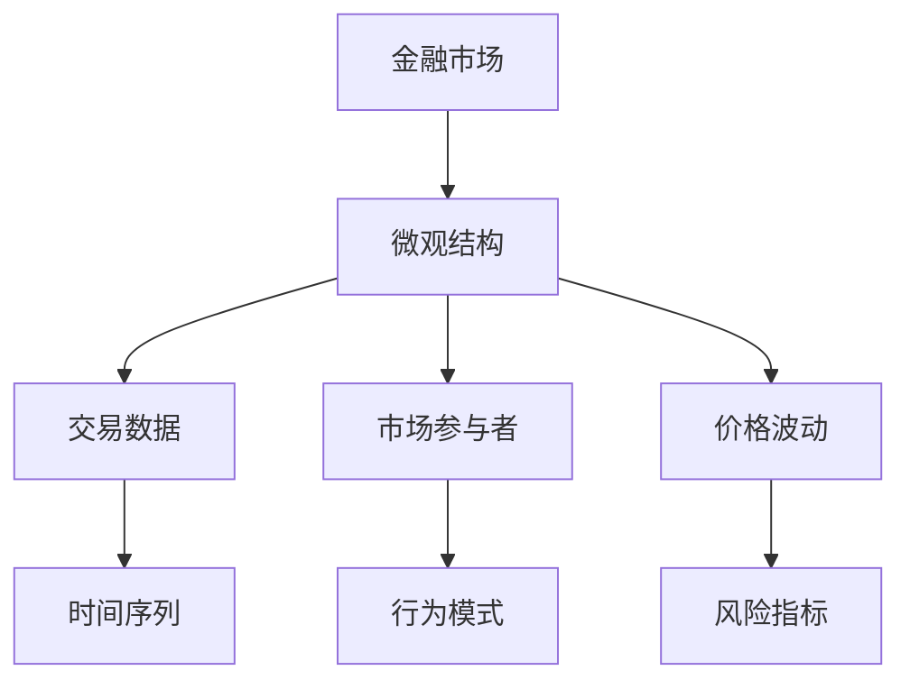
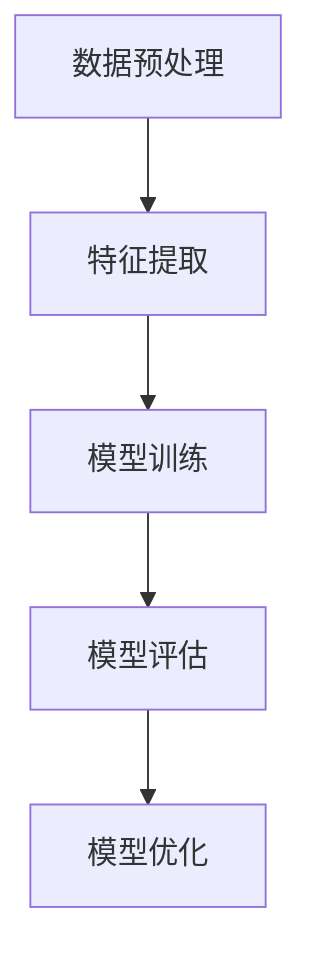
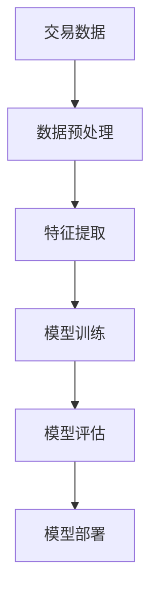

                 

<think>
好的，我现在需要帮助用户撰写一篇关于《开发智能化的金融市场微观结构变化预警模型》的技术博客文章。首先，我需要理解用户的需求。用户希望文章结构清晰，内容专业，涵盖从背景到系统设计、项目实战等多个方面，同时使用技术术语，但保持易懂。

我将按照用户提供的目录大纲来展开，确保每个部分都详细且符合要求。首先，我会从摘要开始，概述文章的核心内容，然后逐步进入各个章节，确保每个章节都有足够的细节和实例支持。

在撰写过程中，我会注意使用适当的关键词，如金融市场、微观结构、机器学习、预警模型等，以确保文章的SEO优化。同时，我会在适当的地方插入图表和代码示例，帮助读者更好地理解内容。

接下来，我需要确保每个章节的内容逻辑连贯，例如在背景介绍部分，我会先解释什么是金融市场微观结构，再说明为什么需要预警模型。在算法部分，我会详细讲解时间序列分析和机器学习模型，并提供代码示例和流程图。

此外，我还需要考虑读者的理解水平，避免过于复杂的数学公式，同时确保解释清晰。在系统架构设计中，我会使用Mermaid图来展示类图、架构图和交互流程，使内容更直观。

最后，我会总结最佳实践，给出一些实用的建议，并在结尾添加参考文献和索引，以便读者进一步阅读。整个过程中，我需要保持语言的专业性和技术深度，同时确保文章结构紧凑，吸引读者继续阅读。
</think>

# 开发智能化的金融市场微观结构变化预警模型

---

## 关键词：金融市场，微观结构，机器学习，预警模型，时间序列分析，系统架构

---

## 摘要：  
本文旨在探讨如何开发一个智能化的金融市场微观结构变化预警模型。通过结合金融市场的基本原理、机器学习算法、时间序列分析以及系统架构设计，本文详细介绍了如何利用技术手段实现对金融市场微观结构变化的早期预警。文章从背景介绍、核心概念、算法原理、系统设计、项目实战到最佳实践，层层深入，为读者提供了一个全面的技术解决方案。

---

# 第一部分：金融市场微观结构变化预警模型的背景与核心概念

## 第1章：问题背景与目标

### 1.1 金融市场微观结构概述

#### 1.1.1 金融市场的基本概念  
金融市场是资金流动和资产交易的场所，参与者包括投资者、金融机构、企业和政府等。金融市场的微观结构关注市场参与者的交易行为、价格形成机制以及市场的流动性等。

#### 1.1.2 微观结构变化的定义与特征  
微观结构变化指的是市场参与者的行为、交易模式或市场环境的变化，这些变化可能导致市场价格波动、流动性风险或市场操纵等问题。其特征包括复杂性、动态性和不确定性。

#### 1.1.3 微观结构变化对金融市场的影响  
微观结构变化直接影响市场的稳定性，可能导致系统性风险。例如，高频交易可能导致市场波动加剧，而市场操纵可能破坏价格发现机制。

### 1.2 问题描述与目标

#### 1.2.1 金融市场风险预警的必要性  
金融市场风险预警是防范系统性风险的重要手段。通过对微观结构变化的预警，可以提前采取措施，降低潜在风险。

#### 1.2.2 微观结构变化预警模型的目标  
该模型旨在通过分析交易数据和市场行为，识别潜在的异常交易行为或市场操纵，提前预警可能引发的市场风险。

#### 1.2.3 模型的边界与外延  
模型的边界包括交易数据、参与者行为和价格波动，外延则涉及宏观经济指标和外部事件的影响。

### 1.3 问题解决思路

#### 1.3.1 数据驱动的预警方法  
利用历史交易数据，通过统计分析和机器学习，识别潜在风险。

#### 1.3.2 机器学习在金融预警中的应用  
机器学习可以识别非线性关系和复杂模式，适用于金融市场风险预警。

#### 1.3.3 多模态数据融合的预警策略  
结合市场数据、新闻数据和宏观经济指标，构建多维度的预警系统。

---

## 第2章：核心概念与联系

### 2.1 核心概念原理

#### 2.1.1 微观结构变化的核心要素  
- **交易量**：异常交易量可能暗示市场操纵。  
- **价格波动**：剧烈波动可能引发系统性风险。  
- **参与者行为**：高频交易者的行为可能影响市场稳定性。

#### 2.1.2 预警模型的关键特征  
- **实时性**：需要快速响应。  
- **准确性**：减少误报和漏报。  
- **可解释性**：便于分析和调整。

#### 2.1.3 模型的输入输出关系  
输入包括交易数据、市场指标，输出包括风险等级和预警信号。

### 2.2 概念属性特征对比

| 概念 | 特征 | 描述 |
|------|------|------|
| 交易数据 | 时间序列 | 记录了价格和成交量的变化。 |
| 市场参与者 | 行为模式 | 高频交易者的行为特征。 |
| 价格波动 | 波动幅度 | 异常波动可能引发风险。 |

### 2.3 ER实体关系图



---

# 第二部分：基于机器学习的预警模型算法原理

## 第3章：算法原理与流程

### 3.1 时间序列分析

#### 3.1.1 时间序列的基本特征  
时间序列数据具有趋势性、周期性和随机性。

#### 3.1.2 常见的时间序列模型  
- **ARIMA**：适用于线性时间序列预测。  
- **LSTM**：适合捕捉长期依赖关系。

#### 3.1.3 LSTM在时间序列预测中的应用  
LSTM通过记忆单元捕获长期依赖，适合处理金融市场数据的复杂性。

### 3.2 机器学习模型

#### 3.2.1 支持向量机（SVM）的原理  
SVM通过构建超平面实现分类，适用于金融数据的非线性关系。

#### 3.2.2 随机森林（Random Forest）的优势  
随机森林通过集成学习减少过拟合，适合处理高维金融数据。

#### 3.2.3 神经网络模型的构建  
深度学习模型（如CNN和RNN）在处理复杂金融数据时表现优异。

### 3.3 算法流程图



### 3.4 数学模型与公式

#### 3.4.1 损失函数的定义  
$$L = \frac{1}{n}\sum_{i=1}^{n}(y_i - \hat{y_i})^2$$

#### 3.4.2 优化器的选择  
$$\theta_{new} = \theta_{old} - \eta \cdot \nabla L$$

---

## 第4章：算法实现与代码示例

### 4.1 数据预处理

#### 4.1.1 数据清洗  
处理缺失值和异常值。

#### 4.1.2 特征工程  
提取交易量、价格波动率等特征。

### 4.2 模型训练

#### 4.2.1 LSTM模型实现

```python
import keras
from keras.layers import LSTM, Dense
from keras.models import Sequential

model = Sequential()
model.add(LSTM(64, input_shape=(timesteps, features)))
model.add(Dense(1))
model.compile(loss='mean_squared_error', optimizer='adam')
```

---

# 第三部分：系统架构设计与实现

## 第5章：系统架构设计

### 5.1 系统功能设计

#### 5.1.1 领域模型设计  


### 5.2 系统架构设计



---

## 第6章：项目实战

### 6.1 环境安装

```bash
pip install numpy pandas scikit-learn tensorflow
```

### 6.2 核心代码实现

```python
import pandas as pd
import numpy as np
from sklearn.ensemble import RandomForestClassifier
from sklearn.metrics import accuracy_score

# 加载数据
data = pd.read_csv('market_data.csv')

# 特征工程
features = data[['volume', 'high', 'low', 'close']]
labels = data['risk_flag']

# 模型训练
model = RandomForestClassifier(n_estimators=100)
model.fit(features, labels)

# 模型评估
预测 = model.predict(features)
准确率 = accuracy_score(预测, labels)
print(准确率)
```

### 6.3 实际案例分析

#### 6.3.1 数据预处理  
处理缺失值和异常值。

#### 6.3.2 模型训练  
使用随机森林模型进行分类。

#### 6.3.3 模型评估  
计算准确率和召回率。

---

## 第7章：最佳实践与小结

### 7.1 最佳实践 tips

- 数据预处理是关键。  
- 选择合适的模型和参数。  
- 避免过拟合，使用交叉验证。

### 7.2 小结  
本文详细介绍了开发金融市场微观结构变化预警模型的全过程，从理论到实践，为读者提供了一个完整的解决方案。

---

## 参考文献  
1. 《时间序列分析》  
2. 《机器学习实战》  
3. 《金融风险管理》  

---

## 索引  
（根据需要添加相关术语和概念的索引）

---

## 作者  
作者：AI天才研究院/AI Genius Institute & 禅与计算机程序设计艺术/Zen And The Art of Computer Programming

