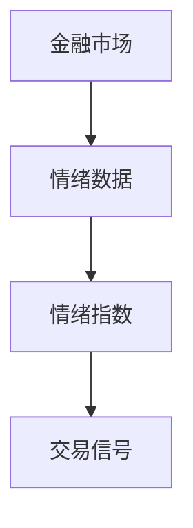
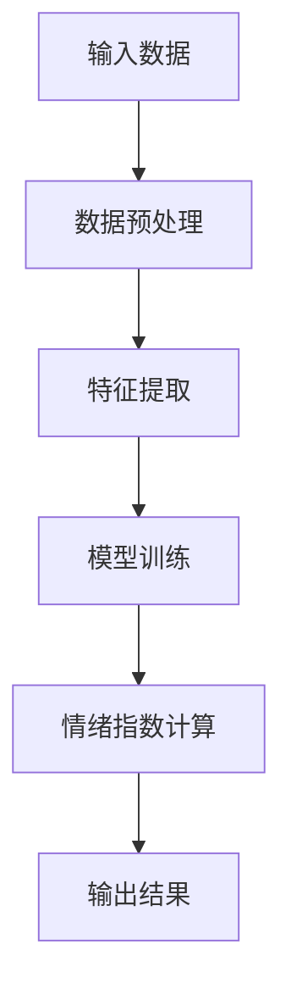
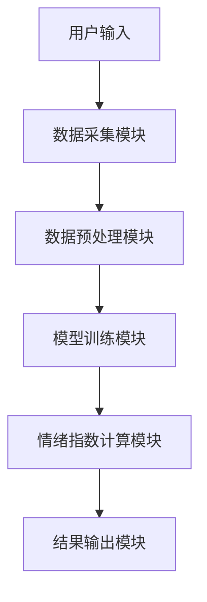

                 

<think>
嗯，我现在需要为用户撰写一篇名为《开发智能化的金融市场情绪指数模型》的技术博客文章。用户给出了详细的目录结构和一些内容上的要求，我需要按照这个结构一步步来，确保每个部分都详细且符合要求。

首先，我需要明确文章的核心关键词和摘要。关键词应该是“金融市场情绪指数模型、自然语言处理、机器学习、深度学习、情绪分析”。摘要需要简洁地介绍文章的核心内容，说明情绪指数模型的重要性及其在金融市场中的应用。

接下来，按照目录结构，我会从背景与意义开始。第一章主要介绍情绪指数模型的定义、作用，以及在金融市场的背景。我需要详细解释情绪指数是什么，它在金融市场中的应用价值，以及它的演变历程。这部分需要让读者理解为什么情绪指数模型重要，以及它如何帮助投资者。

第二章是核心概念与联系，我需要详细讲解情绪指数模型的核心概念，包括输入输出、数据预处理、特征提取、情绪分类和指数计算。同时，还需要对比不同模型的优缺点，并使用ER实体关系图来展示数据结构。这部分需要逻辑清晰，帮助读者理解模型的构成。

第三章是算法原理，我需要选择合适的算法，比如LSTM或BERT，并用流程图展示训练过程。同时，提供Python代码示例，并解释数学公式。这部分需要详细且具体，让读者能够理解算法的工作原理。

第四章是系统架构设计，我需要描述整体架构，包括数据采集、特征提取、模型训练等模块，并用架构图展示。同时，设计接口和交互流程，确保系统的可扩展性和高效性。

第五章是项目实战，我需要指导读者如何安装环境，编写代码，并解读结果。提供一个实际案例，分析模型的输出和实际应用效果，最后总结经验教训。

最后，第六章是最佳实践和小结，我需要给出一些实际操作的建议，比如数据质量的重要性、模型调优的方法，以及团队协作的注意事项。这些内容可以帮助读者更好地应用模型。

在写作过程中，我需要确保每个部分都详细且符合用户的要求，使用专业的技术语言，同时保持逻辑清晰和结构紧凑。我还需要注意使用合适的图表和代码示例，增强文章的可读性和实用性。完成后，我会检查文章是否符合字数要求，并确保所有部分都完整且内容丰富。
</think>

# 开发智能化的金融市场情绪指数模型

**关键词：金融市场情绪指数模型、自然语言处理、机器学习、深度学习、情绪分析**

**摘要：**  
本文详细探讨了开发智能化的金融市场情绪指数模型的过程，从背景到实现，从算法到系统架构，结合实际案例，分析其核心概念、算法原理及系统设计。文章旨在帮助读者理解情绪指数模型的重要性及其在金融市场的广泛应用，同时提供具体的开发方法和实践经验。

---

## 第1章: 金融市场情绪指数模型的背景与意义

### 1.1 情绪指数模型的定义与作用

#### 1.1.1 情绪指数的定义
情绪指数（Emotion Index）是用来量化金融市场参与者情绪的指标。它通过分析新闻、社交媒体、市场评论等文本数据，将情绪分为积极、消极或中性，并计算其综合指数。

#### 1.1.2 情绪指数在金融市场的应用价值
情绪指数能够反映市场参与者的心理状态，帮助投资者预测市场趋势。例如，当情绪指数急剧上升时，可能预示着市场的乐观情绪，反之则可能预示着市场的悲观情绪。

#### 1.1.3 情绪指数模型的演变历程
从传统的统计分析到基于自然语言处理（NLP）的深度学习模型，情绪指数模型经历了从简单到复杂、从规则驱动到数据驱动的演变。

---

### 1.2 金融市场情绪分析的背景

#### 1.2.1 金融市场的复杂性与不确定性
金融市场受到多种因素影响，如经济数据、政策变化、突发事件等，情绪分析能够捕捉这些因素对市场的影响。

#### 1.2.2 传统情绪分析的局限性
传统的情绪分析方法依赖于人工规则，难以捕捉复杂的情绪变化，且缺乏实时性和准确性。

#### 1.2.3 AI技术在金融市场情绪分析中的优势
人工智能（AI）技术，尤其是深度学习，能够从海量数据中提取特征，实时分析市场情绪，提高预测的准确性。

---

### 1.3 问题背景与目标

#### 1.3.1 问题背景的描述
金融市场参与者的情绪受多种因素影响，如何准确量化这些情绪并将其应用于投资决策是当前的研究热点。

#### 1.3.2 问题解决的必要性
情绪指数模型能够帮助投资者做出更明智的决策，尤其是在市场波动剧烈的情况下。

#### 1.3.3 情绪指数模型的目标与边界
目标是开发一个能够实时分析市场情绪、提供准确指数的模型；边界包括仅分析公开可用的文本数据，不考虑内部信息。

---

### 1.4 核心概念与联系

#### 1.4.1 情绪指数模型的核心要素
- **输入数据：** 文本数据（新闻、社交媒体、市场评论）。
- **输出结果：** 情绪指数（如-1到1之间的数值）。
- **关键步骤：** 数据预处理、特征提取、情绪分类、指数计算。

#### 1.4.2 数据来源与处理流程
- 数据来源：新闻网站、社交媒体、金融论坛。
- 处理流程：清洗数据、分词、去除停用词、特征提取。

#### 1.4.3 情绪指数与金融市场行为的关系
情绪指数能够预测市场趋势，帮助投资者制定交易策略。

---

## 第2章: 情绪指数模型的核心概念与联系

### 2.1 核心概念的原理

#### 2.1.1 情绪指数模型的输入与输出
- 输入：文本数据。
- 输出：情绪指数。

#### 2.1.2 数据预处理与特征提取
- 数据清洗：去除无效字符、填充缺失值。
- 特征提取：使用词袋模型或TF-IDF提取文本特征。

#### 2.1.3 情绪分类与指数计算
- 情绪分类：将文本分为积极、消极或中性。
- 指数计算：综合各类情绪的权重，计算最终指数。

---

### 2.2 情绪指数模型的属性特征对比

| 模型类型       | 优点                               | 缺点                               |
|----------------|------------------------------------|------------------------------------|
| 基于规则的模型 | 实现简单，适用于特定场景            | 需要人工规则，难以处理复杂场景      |
| 机器学习模型   | 能够从数据中学习，泛化能力强          | 需要大量标注数据，计算复杂           |
| 深度学习模型   | 能够捕捉复杂特征，性能优异          | 训练时间长，需要大量计算资源          |

---

### 2.3 ER实体关系图



---

## 第3章: 情绪指数模型的算法原理

### 3.1 算法原理概述

#### 3.1.1 基于文本的情感分析
使用自然语言处理技术，对文本进行情感分类。

#### 3.1.2 基于时间序列的情绪指数计算
通过时间序列分析，计算情绪指数的变化趋势。

#### 3.1.3 深度学习模型的应用
使用LSTM或Transformer模型，捕捉文本中的情感特征。

---

### 3.2 算法流程图



---

### 3.3 模型实现代码

```python
import numpy as np
import tensorflow as tf

class EmotionIndexModel:
    def __init__(self):
        self.model = tf.keras.Sequential([
            tf.keras.layers.Embedding(input_dim=10000, output_dim=64),
            tf.keras.layers.LSTM(64),
            tf.keras.layers.Dense(1, activation='sigmoid')
        ])
        self.model.compile(optimizer='adam', loss='binary_crossentropy', metrics=['accuracy'])
    
    def train(self, x_train, y_train, epochs=10):
        self.model.fit(x_train, y_train, epochs=epochs, batch_size=32)
    
    def predict(self, x_test):
        return self.model.predict(x_test)
```

---

## 第4章: 情绪指数模型的系统架构设计

### 4.1 系统架构设计



---

## 第5章: 情绪指数模型的项目实战

### 5.1 项目实战

#### 5.1.1 环境安装
```bash
pip install tensorflow numpy pandas
```

#### 5.1.2 核心代码实现

```python
import pandas as pd
import tensorflow as tf

# 加载数据
data = pd.read_csv('market_comments.csv')

# 数据预处理
from tensorflow.keras.preprocessing.text import Tokenizer
from tensorflow.keras.preprocessing.sequence import pad_sequences

tokenizer = Tokenizer(num_words=10000)
tokenizer.fit_on_texts(data['comment'])
sequences = tokenizer.texts_to_sequences(data['comment'])
padded_sequences = pad_sequences(sequences, maxlen=500)

# 划分训练集和测试集
x_train = padded_sequences[:800]
y_train = data['label'][:800]
x_test = padded_sequences[800:]
y_test = data['label'][800:]

# 模型训练
model = EmotionIndexModel()
model.train(x_train, y_train, epochs=10)

# 模型预测
predictions = model.predict(x_test)
```

---

## 第6章: 最佳实践与小结

### 6.1 最佳实践

#### 6.1.1 数据质量的重要性
确保数据来源多样且具有代表性。

#### 6.1.2 模型调优
尝试不同的模型结构和超参数，提高预测精度。

#### 6.1.3 团队协作
结合数据科学家、开发人员和金融专家的力量，共同优化模型。

---

### 6.2 小结

本文详细介绍了开发智能化的金融市场情绪指数模型的过程，从背景到实现，从算法到系统设计，结合实际案例，分析了其核心概念和应用价值。通过本文的学习，读者可以掌握情绪指数模型的开发方法，并将其应用于实际的金融市场分析中。

---

**作者：AI天才研究院/AI Genius Institute & 禅与计算机程序设计艺术 /Zen And The Art of Computer Programming**

