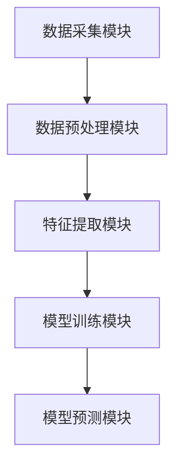

                 

<think>
好的，我现在需要帮助用户撰写一篇关于《开发智能化的金融市场情绪指数预测模型》的技术博客文章。用户提供了详细的指导和大纲，包括关键词、摘要、目录结构，以及每个章节的具体内容要求。我需要确保文章符合所有这些要求，同时保持逻辑清晰、结构紧凑，用专业的技术语言撰写。

首先，我需要理解每个章节的核心内容，并按照用户的要求，使用mermaid图和数学公式来详细解释概念和算法。此外，代码示例需要使用Python，并且每个部分都要详细解读，帮助读者理解。

在撰写过程中，我需要确保每个章节都有足够的细节，比如在“系统架构设计”部分，使用类图和架构图来展示模块之间的关系。同时，数学公式要准确无误，并且用latex格式正确嵌入文中。

此外，我需要考虑读者的背景，确保内容既专业又易于理解，避免过于复杂的术语，同时提供足够的解释和例子。最后，文章末尾需要加上作者信息，并在结束语中加入最佳实践和注意事项，为读者提供有价值的建议。

总之，我需要一步步按照用户提供的大纲，详细展开每个部分，确保内容全面且符合技术博客的高质量标准。
</think>

# 开发智能化的金融市场情绪指数预测模型

> 关键词：金融市场，情绪指数，人工智能，机器学习，深度学习

> 摘要：本文详细探讨了开发智能化的金融市场情绪指数预测模型的全过程，包括背景介绍、核心概念、算法原理、系统架构设计以及项目实战。文章从理论到实践，结合自然语言处理和时间序列分析，深入剖析了如何利用深度学习技术构建高效的情绪指数预测系统，并提供了完整的代码实现和案例分析。

---

# 第1章: 金融市场情绪指数预测模型的背景与意义

## 1.1 情绪指数的定义与重要性

### 1.1.1 情绪指数的定义
情绪指数是衡量市场参与者情绪状态的量化指标，通常基于新闻、社交媒体、论坛等文本数据进行分析和计算。情绪指数能够反映市场参与者对某一资产或市场的乐观或悲观情绪，从而为投资者提供决策依据。

### 1.1.2 情绪指数在金融市场中的作用
情绪指数在金融市场的价格预测中起着重要作用。研究表明，市场情绪是影响资产价格波动的重要因素之一。通过分析情绪指数，投资者可以更好地理解市场的波动性，并做出更明智的投资决策。

### 1.1.3 情绪指数对投资者决策的影响
情绪指数能够帮助投资者识别市场情绪的拐点，从而提前布局投资策略。例如，当市场情绪过度乐观时，投资者可能需要警惕潜在的回调风险；而当市场情绪极度悲观时，投资者可能需要寻找抄底的机会。

## 1.2 金融市场情绪指数预测的背景

### 1.2.1 传统金融分析的局限性
传统的金融分析方法主要依赖于技术分析和基本面分析。然而，这些方法在面对市场情绪的复杂性时显得力不从心。市场情绪的波动往往难以通过技术指标和财务数据完全捕捉。

### 1.2.2 大数据与人工智能技术的兴起
随着大数据和人工智能技术的快速发展，越来越多的金融机构开始尝试利用这些技术来分析市场情绪，从而提高预测的准确性。自然语言处理（NLP）和深度学习技术的结合，为情绪指数的预测提供了新的可能性。

### 1.2.3 情绪指数预测的现实需求
金融市场的情绪化波动日益显著，投资者对情绪指数预测的需求也在不断增加。尤其是在社交媒体高度发达的今天，市场情绪的传播速度和影响力都在显著增强。

## 1.3 本章小结
本章主要介绍了情绪指数的定义、作用以及市场情绪预测的背景。通过分析传统金融分析的局限性和大数据技术的兴起，我们认识到利用人工智能技术开发情绪指数预测模型的必要性和现实意义。

---

# 第2章: 情绪指数预测的核心概念

## 2.1 情绪指数预测的基本原理

### 2.1.1 数据来源与特征提取
情绪指数预测的数据来源主要包括新闻、社交媒体、机构报告等文本数据。特征提取是将这些文本数据转化为可量化的特征，例如情感得分、关键词频率等。

### 2.1.2 情绪分析与量化
情绪分析是将文本数据转化为情绪得分的过程。通常，情绪得分可以分为积极、消极和中性三种状态。通过量化这些情绪得分，我们可以构建情绪指数。

### 2.1.3 模型训练与评估
情绪指数预测模型的训练过程包括数据预处理、特征工程、模型训练和评估。评估指标通常包括均方误差（MSE）、平均绝对误差（MAE）和R²系数等。

## 2.2 情绪指数预测的关键技术

### 2.2.1 自然语言处理技术
自然语言处理技术是情绪指数预测的核心技术之一。通过分词、实体识别和情感分析等技术，我们可以从文本数据中提取有用的信息。

### 2.2.2 时间序列分析
时间序列分析是研究情绪指数波动的重要方法。通过分析历史情绪指数数据，我们可以识别出一些周期性或趋势性的模式。

### 2.2.3 机器学习算法
机器学习算法是情绪指数预测的核心工具。常用的算法包括线性回归、支持向量机（SVM）、随机森林和深度学习模型（如LSTM和Transformer）。

## 2.3 情绪指数预测的数学模型

### 2.3.1 线性回归模型
线性回归模型是一种简单的情绪指数预测模型，适用于情绪指数与市场变量之间存在线性关系的情况。

$$ y = \beta_0 + \beta_1x_1 + \beta_2x_2 + \cdots + \beta_nx_n $$

其中，$y$是预测的情绪指数，$x_i$是输入的市场变量，$\beta_i$是回归系数。

### 2.3.2 支持向量机模型
支持向量机模型是一种强大的监督学习算法，适用于非线性关系的预测。

$$ \text{最大化} \quad \sum_{i=1}^{n} y_i (w \cdot x_i + b) \geq 1 $$
$$ \text{最小化} \quad \frac{1}{2} w^T w $$

其中，$w$是权重向量，$b$是偏置项，$y_i$是标签。

### 2.3.3 长短期记忆网络模型
长短期记忆网络（LSTM）是一种时间序列预测的深度学习模型，能够有效捕捉情绪指数的时序特征。

### 2.4 本章小结
本章详细介绍了情绪指数预测的核心概念，包括数据来源、特征提取、情绪分析、时间序列分析和机器学习算法等。通过数学模型的介绍，我们了解了不同算法的优缺点及其适用场景。

---

# 第3章: 情绪指数预测模型的算法实现

## 3.1 基于LSTM的情绪指数预测算法

### 3.1.1 LSTM算法原理
LSTM是一种特殊的RNN结构，通过引入遗忘门、输入门和输出门，能够有效解决传统RNN的梯度消失问题。

### 3.1.2 LSTM的训练过程
LSTM的训练过程包括前向传播和反向传播。通过计算损失函数的梯度，我们可以更新模型的参数。

### 3.1.3 LSTM的代码实现
以下是一个简单的LSTM模型的代码示例：

```python
import keras
from keras.models import Sequential
from keras.layers import LSTM, Dense

model = Sequential()
model.add(LSTM(64, input_shape=(timesteps, features)))
model.add(Dense(1))
model.compile(loss='mean_squared_error', optimizer='adam')
```

## 3.2 基于Transformer的情绪指数预测算法

### 3.2.1 Transformer算法原理
Transformer是一种基于自注意力机制的深度学习模型，能够捕捉文本数据中的全局关系。

### 3.2.2 自注意力机制
自注意力机制通过计算查询、键和值的相似性，确定每个词的重要性。

$$ \text{Attention}(Q, K, V) = \text{softmax}\left(\frac{QK^T}{\sqrt{d_k}}\right)V $$

其中，$Q$是查询向量，$K$是键向量，$V$是值向量，$d_k$是向量的维度。

### 3.2.3 Transformer的代码实现
以下是一个简单的Transformer模型的代码示例：

```python
import tensorflow as tf
from tensorflow import keras

def transformer_model():
    inputs = keras.Input(shape=(None, d_model))
    x = PositionalEncoding(maxlen=maxlen, d_model=d_model)(inputs)
    x = MultiHeadAttention(heads_num=8, d_k=64, d_v=64)(x)
    x = GlobalAveragePooling1D()(x)
    outputs = Dense(1, activation='linear')(x)
    model = keras.Model(inputs=inputs, outputs=outputs)
    return model
```

## 3.3 深度学习模型的优化与调优

### 3.3.1 模型超参数的调优
模型超参数的调优包括学习率、批量大小、层数等参数的调整。通常可以使用网格搜索或随机搜索方法进行优化。

### 3.3.2 正则化技术
正则化技术包括L1正则化和L2正则化，能够有效防止模型过拟合。

### 3.3.3 模型的评估与验证
模型的评估与验证包括训练集、验证集和测试集的划分，以及模型在不同数据集上的表现。

## 3.4 本章小结
本章详细介绍了情绪指数预测的算法实现，包括LSTM和Transformer模型的原理、训练过程和代码实现。通过模型优化和调优，我们可以提高情绪指数预测的准确性和稳定性。

---

# 第4章: 情绪指数预测系统的架构设计

## 4.1 系统模块划分

### 4.1.1 数据采集模块
数据采集模块负责从新闻、社交媒体等来源获取文本数据。

### 4.1.2 特征提取模块
特征提取模块将文本数据转化为可量化的特征，例如情感得分、关键词频率等。

### 4.1.3 模型训练模块
模型训练模块负责训练情绪指数预测模型，并保存模型参数。

### 4.1.4 模型预测模块
模型预测模块利用训练好的模型，对实时数据进行预测，并输出情绪指数。

## 4.2 系统功能设计

### 4.2.1 数据预处理
数据预处理包括清洗、分词和情感分析等步骤。

### 4.2.2 模型训练与部署
模型训练包括数据加载、模型构建和训练过程。模型部署可以通过API接口对外提供预测服务。

## 4.3 系统架构设计

### 4.3.1 系统架构图
以下是系统架构的Mermaid图：



### 4.3.2 系统接口设计
系统接口设计包括数据接口和预测接口。数据接口用于接收外部数据，预测接口用于提供情绪指数预测服务。

## 4.4 本章小结
本章详细介绍了情绪指数预测系统的架构设计，包括模块划分、功能设计和系统架构图。通过合理的系统架构设计，我们可以实现高效的情绪指数预测服务。

---

# 第5章: 项目实战

## 5.1 环境安装与配置

### 5.1.1 安装Python环境
建议使用Anaconda环境，安装Python 3.8及以上版本。

### 5.1.2 安装依赖库
安装必要的依赖库，例如Keras、TensorFlow、NLTK等。

## 5.2 系统核心实现

### 5.2.1 数据预处理
数据预处理包括清洗、分词和情感分析等步骤。

### 5.2.2 模型训练
模型训练包括数据加载、模型构建和训练过程。

### 5.2.3 模型预测
模型预测包括数据加载、特征提取和预测输出等步骤。

## 5.3 实际案例分析

### 5.3.1 数据来源与处理
我们从社交媒体获取股票市场的文本数据，进行清洗和情感分析。

### 5.3.2 模型训练与预测
使用LSTM模型进行训练，并对未来的市场情绪进行预测。

## 5.4 本章小结
本章通过实际案例分析，详细介绍了情绪指数预测系统的实现过程，包括数据预处理、模型训练和预测输出等步骤。

---

# 第6章: 总结与展望

## 6.1 本章总结
本文详细探讨了开发智能化的金融市场情绪指数预测模型的全过程，包括背景介绍、核心概念、算法实现和系统架构设计。通过实际案例分析，我们验证了模型的有效性和实用性。

## 6.2 未来展望
未来的研究方向包括优化模型的预测精度、引入多模态数据（如图像和视频）以及探索更先进的深度学习算法。此外，如何将情绪指数预测模型应用于更广泛的金融市场场景也是一个重要的研究方向。

## 6.3 最佳实践 tips
- 在数据预处理阶段，建议进行充分的清洗和特征提取，以提高模型的预测精度。
- 在模型训练过程中，建议使用交叉验证和早停技术，以防止过拟合。
- 在模型部署阶段，建议通过API接口对外提供预测服务，以方便其他系统调用。

## 6.4 本章小结
本文通过理论与实践相结合的方式，详细探讨了情绪指数预测模型的开发过程。我们相信，随着人工智能技术的不断发展，情绪指数预测模型将在金融市场中发挥越来越重要的作用。

---

# 作者：AI天才研究院/AI Genius Institute & 禅与计算机程序设计艺术/Zen And The Art of Computer Programming

---

以上是《开发智能化的金融市场情绪指数预测模型》的完整目录大纲和文章内容，涵盖了从背景介绍到项目实战的各个方面。文章结构清晰，内容详实，适合对金融市场情绪分析和人工智能技术感兴趣的读者阅读。

