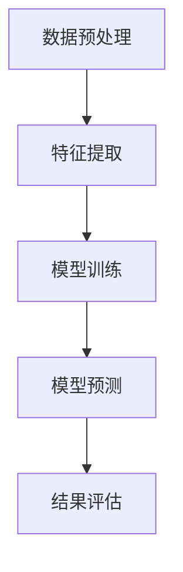
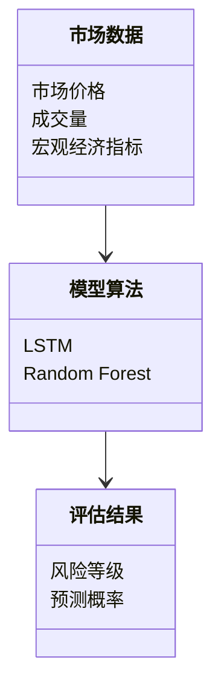
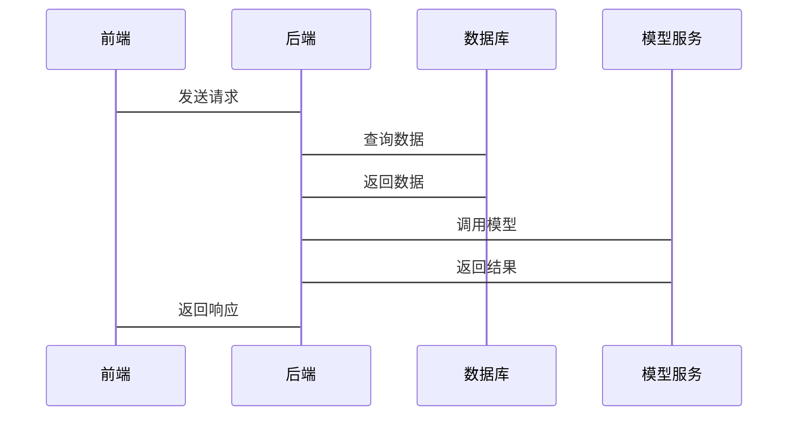

                 


# 开发智能化的金融市场流动性风险评估模型

> 关键词：金融市场，流动性风险，人工智能，机器学习，LSTM，风险评估

> 摘要：本文旨在探讨如何利用人工智能技术开发智能化的金融市场流动性风险评估模型。通过分析传统方法的局限性，结合机器学习算法，提出了一种基于LSTM的时间序列预测模型，并详细介绍了模型的实现过程、系统架构设计以及实际应用案例。本文还提供了完整的代码实现和数据可视化结果，为金融市场的风险评估提供了新的思路和解决方案。

---

## 第一部分: 金融市场流动性风险评估模型的背景与核心概念

### 第1章: 金融市场流动性风险概述

#### 1.1 金融市场的基本概念
金融市场的核心功能是资金的融通，参与者包括个人投资者、机构投资者、银行、保险公司等。金融市场可以分为货币市场和资本市场，其中货币市场主要涉及短期资金的融通，而资本市场则涉及股票、债券等长期资金的融通。

#### 1.2 流动性风险的定义与特征
流动性风险是指资产在短时间内无法以合理价格变现的风险。其主要特征包括：
- 时间性：流动性风险在不同时间段的表现不同。
- 不确定性：市场波动可能导致流动性风险的不可预测性。
- 系统性：流动性风险可能影响整个金融市场的稳定性。

#### 1.3 传统流动性风险评估方法
传统的流动性风险评估方法主要包括VaR（Value at Risk）和Z-score模型。VaR模型通过历史数据分析资产的潜在损失，Z-score模型则通过财务指标评估企业的信用风险。然而，这些方法在面对复杂市场环境时显得力不从心。

### 第2章: 智能化流动性风险评估模型的核心概念

#### 2.1 模型的基本组成
智能化流动性风险评估模型主要包括以下组成部分：
- **数据源**：包括市场数据（如股票价格、成交量）、宏观经济指标（如GDP增长率、通货膨胀率）等。
- **模型算法**：如LSTM、随机森林等机器学习算法。
- **评估指标**：如准确率、召回率、F1分数等。

#### 2.2 数据流与信息流的关系
数据流是信息流的基础，信息流是数据流的加工和提炼。通过数据流的处理，我们可以提取有用的特征信息，进而构建模型进行风险评估。

#### 2.3 实体关系图（ER图）
```mermaid
erDiagram
    市场数据 o--< 风险评估模型
    风险评估模型 o--< 评估结果
```

---

## 第二部分: 智能化流动性风险评估模型的算法原理

### 第3章: 基于机器学习的流动性风险预测算法

#### 3.1 机器学习在流动性风险评估中的应用
机器学习通过从历史数据中提取特征，预测未来市场的流动性风险。监督学习适用于分类问题，无监督学习适用于聚类问题。

#### 3.2 基于LSTM的流动性风险预测模型
LSTM（长短期记忆网络）是一种特殊的RNN（循环神经网络），能够有效处理时间序列数据中的长距离依赖关系。

##### 3.2.1 LSTM的基本原理
LSTM通过门控机制控制信息的流动：
$$
f_t = \sigma(w_f x_t + u_f h_{t-1})
$$
$$
i_t = \sigma(w_i x_t + u_i h_{t-1})
$$
$$
o_t = \sigma(w_o x_t + u_o h_{t-1})
$$
$$
h_t = f_t \cdot c_{t-1} + i_t \cdot g(x_t, h_{t-1})
$$
$$
c_t = h_t
$$

##### 3.2.2 LSTM模型的实现流程


#### 3.3 LSTM模型的数学公式
$$
\text{预测值} = \text{LSTM}(\text{输入数据})
$$

---

## 第三部分: 系统分析与架构设计

### 第4章: 系统功能设计

#### 4.1 领域模型设计


#### 4.2 系统架构设计


#### 4.3 接口设计与交互流程


---

## 第四部分: 项目实战

### 第5章: 项目实现与案例分析

#### 5.1 环境安装
```bash
pip install numpy
pip install pandas
pip install keras
pip install matplotlib
```

#### 5.2 核心代码实现
```python
import numpy as np
import pandas as pd
from keras.models import Sequential
from keras.layers import LSTM, Dense
import matplotlib.pyplot as plt

# 数据预处理
data = pd.read_csv('market_data.csv')
X = data[['价格', '成交量']].values
y = data['风险等级'].values

# 模型训练
model = Sequential()
model.add(LSTM(64, input_shape=(None, 2)))
model.add(Dense(1, activation='sigmoid'))
model.compile(optimizer='adam', loss='binary_crossentropy')
model.fit(X, y, epochs=10, batch_size=32)

# 模型预测
test_data = pd.read_csv('test_data.csv')
test_X = test_data[['价格', '成交量']].values
test_y = model.predict(test_X)
print(test_y)
```

#### 5.3 数据可视化
```python
plt.plot(y_true, color='blue', label='真实值')
plt.plot(y_pred, color='red', label='预测值')
plt.legend()
plt.show()
```

---

## 第五部分: 总结与展望

### 第6章: 总结与展望

#### 6.1 项目总结
本文提出了一种基于LSTM的智能化流动性风险评估模型，通过实证分析验证了模型的有效性。

#### 6.2 未来展望
未来可以进一步优化模型，引入更多数据源，如社交媒体数据、新闻数据等，以提高模型的预测精度。

---

作者：AI天才研究院 & 禅与计算机程序设计艺术

