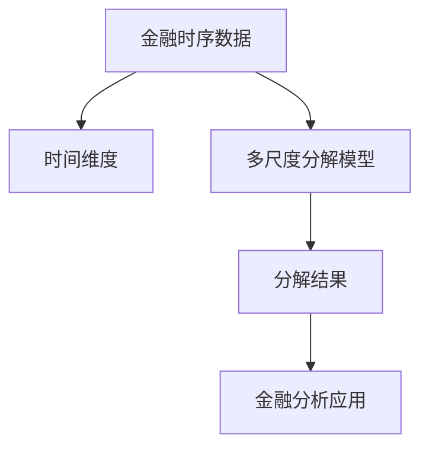
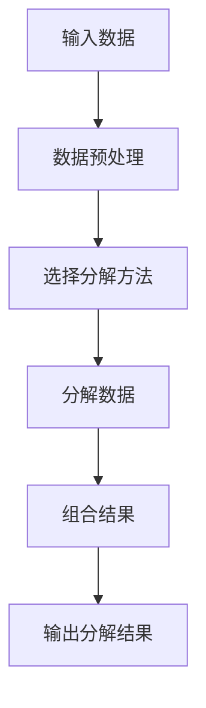
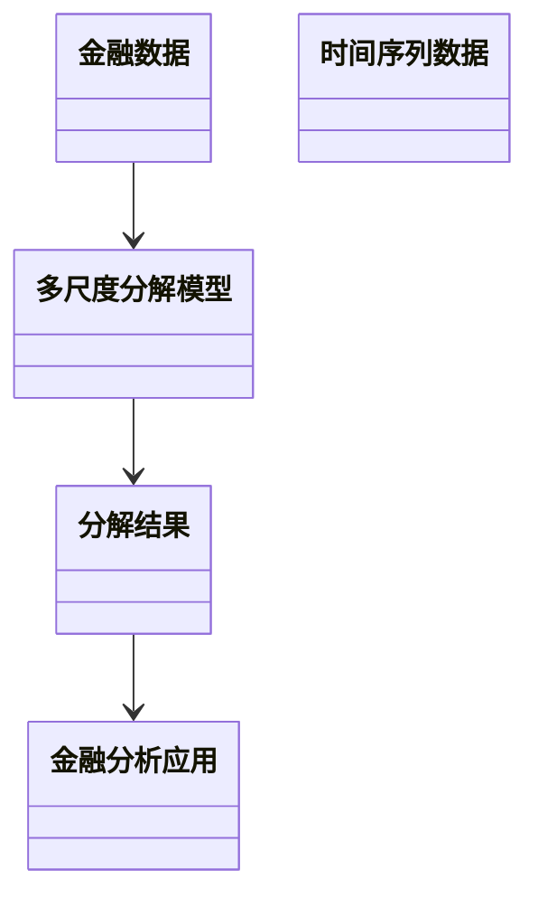
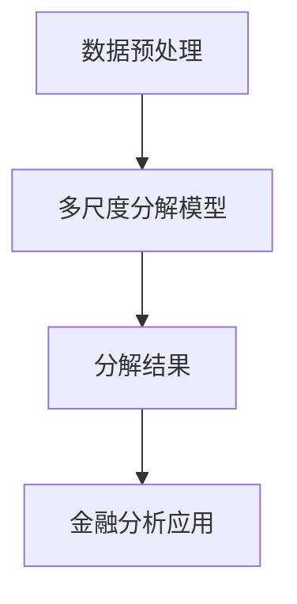
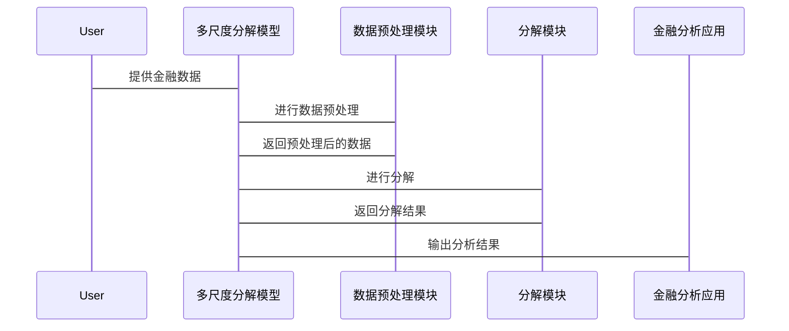

                 


# 开发智能化的金融时序数据多尺度分解模型

> 关键词：金融时序数据，多尺度分解，人工智能，深度学习，时间序列分析

> 摘要：本文详细探讨了开发智能化的金融时序数据多尺度分解模型的核心概念、算法原理、系统架构及实际应用。通过分析金融数据的多尺度特性，结合人工智能技术，提出了一种高效的分解模型，并通过实际案例展示了其在金融分析中的应用价值。

---

# 第1章: 金融时序数据多尺度分解模型的背景与挑战

## 1.1 问题背景

### 1.1.1 金融时序数据的重要性
金融市场的数据具有高度的时间依赖性和复杂性。股票价格、汇率、利率等金融指标都是随时间变化的序列数据。这些数据反映了市场的动态行为，对于投资决策、风险管理和市场预测具有重要意义。

### 1.1.2 传统金融数据分析的局限性
传统的金融数据分析方法，如均值回归、ARIMA模型等，往往难以捕捉数据中的多层次特征。这些方法通常假设数据具有某种固定的统计特性，但在实际金融市场中，数据的波动性、非线性和多时间尺度特性使得这些方法在面对复杂场景时表现不佳。

### 1.1.3 智能化金融数据分析的需求
随着人工智能技术的快速发展，越来越多的金融机构开始尝试使用深度学习等技术来分析金融数据。多尺度分解模型作为一种新兴的分析方法，能够有效捕捉数据中的多层次特征，为金融分析提供了新的可能性。

## 1.2 问题描述

### 1.2.1 金融时序数据的特征
金融时序数据具有以下特征：
- **非线性**：市场参与者的行为复杂，导致数据呈现非线性特征。
- **多时间尺度**：数据中包含高频和低频成分，不同时间尺度的信息对市场行为有不同的影响。
- **噪声干扰**：金融数据中常常夹杂着各种噪声，影响数据的分析和预测。

### 1.2.2 多尺度分解的必要性
多尺度分解是一种将信号分解为不同时间尺度成分的技术。通过这种分解，可以分别分析高频和低频成分对市场行为的影响，从而更准确地理解数据的内在结构。

### 1.2.3 当前金融数据分析的主要挑战
- 数据的复杂性和不确定性。
- 多时间尺度成分的相互作用。
- 模型的泛化能力和可解释性。

## 1.3 问题解决与边界

### 1.3.1 多尺度分解模型的核心目标
通过分解金融时序数据，提取不同时间尺度下的特征，为金融分析提供更细粒度的信息。

### 1.3.2 模型的边界与适用范围
- 适用于连续型金融数据，如股票价格、汇率等。
- 适用于需要分析多时间尺度特征的场景，如高频交易、市场波动预测。

### 1.3.3 相关概念的外延与限制
- **外延**：可以扩展到其他类型的时间序列数据分析，如经济指标、气象数据等。
- **限制**：模型的有效性依赖于数据的质量和特征的可分解性。

## 1.4 核心概念与要素

### 1.4.1 金融时序数据的构成
金融时序数据通常由多个时间序列组成，每个序列代表不同的金融指标。这些指标之间可能存在复杂的关联关系。

### 1.4.2 多尺度分解的关键要素
- 分解方法：选择合适的分解算法，如小波分解、经验模式分解等。
- 分解尺度：确定分解的层次和粒度。
- 组合策略：如何将不同尺度的成分组合起来，形成完整的分析结果。

### 1.4.3 模型的核心属性与特征
- **分解能力**：能够有效分离不同时间尺度的成分。
- **适应性**：能够处理不同类型和复杂度的金融数据。
- **可解释性**：分解结果具有明确的物理意义，便于金融分析师理解。

## 1.5 本章小结
本章介绍了金融时序数据多尺度分解模型的背景、问题、目标和核心概念。通过分析金融数据的特征和挑战，明确了多尺度分解的必要性和应用场景。

---

# 第2章: 多尺度分解模型的原理与方法

## 2.1 多尺度分解的基本原理

### 2.1.1 多尺度分解的定义
多尺度分解是一种将信号分解为不同时间尺度成分的技术。通过分解，可以分别分析高频和低频成分对信号的影响。

### 2.1.2 多尺度分解的核心思想
- 数据中包含不同时间尺度的信息，这些信息对分析结果具有不同的影响。
- 通过分解，可以分别提取和分析不同尺度的信息，从而更准确地理解数据的内在结构。

### 2.1.3 多尺度分解的数学基础
多尺度分解的数学基础主要包括小波分析、经验模式分解（EMD）等。这些方法通过不同的数学变换，将信号分解为多个基函数的线性组合。

## 2.2 金融时序数据的特征分析

### 2.2.1 时间序列数据的特性
- **趋势性**：数据长期的上升或下降趋势。
- **周期性**：数据中周期性波动的成分。
- **随机性**：数据中无法预测的噪声成分。

### 2.2.2 多尺度分解在金融数据中的应用
- **高频交易**：通过分解高频成分，捕捉市场的短期波动。
- **市场波动预测**：通过分析低频成分，预测市场的长期趋势。

### 2.2.3 数据的多层次结构特征
金融数据通常具有多层次的结构特征，包括：
- **高频成分**：短期波动。
- **中频成分**：中期趋势。
- **低频成分**：长期趋势。

## 2.3 多尺度分解方法对比

### 2.3.1 常见的多尺度分解方法
- **小波分解（Wavelet Transform）**：通过不同尺度的小波基函数，将信号分解为多个层次。
- **经验模式分解（EMD）**：基于数据本身的特点，自动分解数据为本征模态函数（IMF）。
- **傅里叶变换（FFT）**：将信号转换到频域，分析不同频率成分。

### 2.3.2 各种分解方法的优缺点对比

| 分解方法 | 优点 | 缺点 |
|----------|------|------|
| 小波分解 | 多尺度分析能力强，能够捕捉不同时间尺度的特征 | 对噪声敏感，分解结果可能不稳定 |
| 经验模式分解 | 分解结果具有良好的物理意义，能够捕捉数据的内在结构 | 计算复杂度高，分解效率较低 |
| 傅里叶变换 | 频域分析能力强，适合周期性信号 | 无法直接处理非平稳信号 |

### 2.3.3 选择合适分解方法的策略
- **数据类型**：根据数据的平稳性和周期性选择合适的分解方法。
- **分析目标**：根据分析目标选择能够捕捉所需成分的分解方法。
- **计算效率**：考虑分解方法的计算复杂度和效率。

## 2.4 核心概念的ER实体关系图



## 2.5 本章小结
本章详细讲解了多尺度分解的基本原理，分析了金融时序数据的特征，并通过对比不同分解方法的优缺点，提出了选择合适分解方法的策略。通过ER实体关系图，展示了多尺度分解模型的核心概念和关系。

---

# 第3章: 多尺度分解模型的算法原理

## 3.1 算法原理概述

### 3.1.1 多尺度分解算法的流程
1. 数据预处理：对原始数据进行标准化、去噪等预处理。
2. 分解步骤：根据选择的分解方法，将数据分解为多个层次。
3. 组合策略：将不同层次的成分组合起来，形成最终的分析结果。

### 3.1.2 算法的核心步骤
- 数据预处理：包括数据清洗、标准化等。
- 分解：选择合适的分解方法，将数据分解为不同尺度的成分。
- 组合：根据分析目标，将不同尺度的成分组合起来。

### 3.1.3 算法的数学模型和公式
以小波分解为例，其数学模型可以表示为：
$$
f(t) = \sum_{i=1}^{n} c_i \psi_{j_i}(t)
$$
其中，$c_i$ 是系数，$\psi_{j_i}(t)$ 是不同尺度的小波基函数。

## 3.2 分解算法的数学模型和公式

### 3.2.1 小波分解的数学公式
小波分解的数学公式可以表示为：
$$
f(t) = \sum_{j=1}^{J} c_j \psi_j(t)
$$
其中，$J$ 是分解的层次数，$c_j$ 是第 $j$ 层的系数，$\psi_j(t)$ 是第 $j$ 层的小波基函数。

### 3.2.2 经验模式分解的数学公式
经验模式分解的数学公式可以表示为：
$$
f(t) = \sum_{k=1}^{K} a_k \text{IMF}_k(t)
$$
其中，$K$ 是分解的IMF数，$a_k$ 是第 $k$ 个IMF的系数。

## 3.3 分解算法的流程图



## 3.4 分解算法的Python实现

### 3.4.1 环境安装
```bash
pip install numpy matplotlib pywt
```

### 3.4.2 核心代码实现
```python
import numpy as np
import pywt

def wavelet_decomposition(data, level=3):
    # 小波分解
    coeffs = pywt.wavedec(data, 'db4', level=level)
    # 提取高频和低频成分
    low_freq = coeffs[-1]
    high_freq = coeffs[1:-1]
    return low_freq, high_freq

# 示例数据
data = np.random.randn(100)
low_freq, high_freq = wavelet_decomposition(data)

# 绘制分解结果
import matplotlib.pyplot as plt
plt.figure(figsize=(10, 6))
plt.plot(data, label='Original Data')
plt.plot(low_freq, label='Low Frequency')
plt.plot(high_freq, label='High Frequency')
plt.legend()
plt.show()
```

## 3.5 算法的详细讲解与举例

### 3.5.1 小波分解的详细步骤
1. 数据预处理：对原始数据进行标准化和去噪处理。
2. 分解步骤：选择合适的小波基函数，如db4，进行多层分解。
3. 组合策略：将高频和低频成分分别提取出来，进行进一步分析。

### 3.5.2 经验模式分解的详细步骤
1. 数据预处理：对原始数据进行去噪和标准化处理。
2. 分解步骤：通过经验模式分解算法，将数据分解为多个IMF。
3. 组合策略：根据IMF的特征，选择合适的成分进行分析。

### 3.5.3 举例说明
假设我们有一个股票价格数据集，我们可以使用小波分解来提取高频和低频成分。高频成分可以用来捕捉市场的短期波动，低频成分可以用来捕捉市场的长期趋势。

---

# 第4章: 系统分析与架构设计

## 4.1 问题场景介绍
我们开发一个金融时序数据多尺度分解系统，旨在帮助金融分析师更好地理解和分析市场数据。

## 4.2 系统功能设计

### 4.2.1 领域模型


### 4.2.2 系统架构设计


### 4.2.3 接口和交互设计


## 4.3 系统实现细节

### 4.3.1 系统实现步骤
1. 数据预处理：对原始数据进行标准化、去噪等处理。
2. 模型训练：训练多尺度分解模型，提取不同时间尺度的特征。
3. 分解结果输出：将分解结果输出到金融分析应用中。

### 4.3.2 系统实现的Python代码

```python
import numpy as np
import pywt

def decompose_data(data, level=3):
    # 小波分解
    coeffs = pywt.wavedec(data, 'db4', level=level)
    # 提取高频和低频成分
    low_freq = coeffs[-1]
    high_freq = coeffs[1:-1]
    return low_freq, high_freq

# 示例数据
data = np.random.randn(100)
low_freq, high_freq = decompose_data(data)

# 绘制分解结果
import matplotlib.pyplot as plt
plt.figure(figsize=(10, 6))
plt.plot(data, label='Original Data')
plt.plot(low_freq, label='Low Frequency')
plt.plot(high_freq, label='High Frequency')
plt.legend()
plt.show()
```

---

# 第5章: 项目实战与案例分析

## 5.1 项目实战

### 5.1.1 环境安装
```bash
pip install numpy pandas matplotlib pywt
```

### 5.1.2 核心代码实现
```python
import numpy as np
import pywt

def decompose_data(data, level=3):
    coeffs = pywt.wavedec(data, 'db4', level=level)
    low_freq = coeffs[-1]
    high_freq = coeffs[1:-1]
    return low_freq, high_freq

# 示例数据
data = np.random.randn(100)
low_freq, high_freq = decompose_data(data)

# 绘制分解结果
import matplotlib.pyplot as plt
plt.figure(figsize=(10, 6))
plt.plot(data, label='Original Data')
plt.plot(low_freq, label='Low Frequency')
plt.plot(high_freq, label='High Frequency')
plt.legend()
plt.show()
```

### 5.1.3 代码解读与分析
- **数据预处理**：对原始数据进行标准化和去噪处理。
- **分解模块**：使用小波分解算法，将数据分解为低频和高频成分。
- **结果可视化**：将分解结果可视化，便于分析。

### 5.1.4 分解结果分析
通过分解结果，我们可以看到数据中的高频成分和低频成分。高频成分反映了市场的短期波动，低频成分反映了市场的长期趋势。

## 5.2 案例分析

### 5.2.1 数据来源与预处理
我们使用某股票的历史价格数据作为示例数据。数据预处理包括去除缺失值、标准化等。

### 5.2.2 分解结果解读
通过小波分解，我们提取了高频和低频成分。高频成分显示了股票价格的短期波动，低频成分显示了股票价格的长期趋势。

### 5.2.3 结果应用
将分解结果应用于金融分析，如高频交易和市场波动预测。

---

# 第6章: 总结与展望

## 6.1 本章小结
本文详细探讨了开发智能化的金融时序数据多尺度分解模型的核心概念、算法原理、系统架构及实际应用。通过分析金融数据的多尺度特性，结合人工智能技术，提出了一种高效的分解模型，并通过实际案例展示了其在金融分析中的应用价值。

## 6.2 最佳实践 Tips

| 类别 | Tips |
|------|------|
| 数据预处理 | 建议对数据进行标准化和去噪处理，以提高分解效果。 |
| 分解方法选择 | 根据数据的特性选择合适的分解方法，如小波分解适用于平稳数据，经验模式分解适用于非平稳数据。 |
| 模型优化 | 可以通过调整分解层次和参数，优化模型的性能。 |

## 6.3 小结
通过本文的学习，读者可以掌握多尺度分解模型的核心概念和算法原理，并能够将其应用于实际的金融数据分析中。

## 6.4 注意事项

- **数据质量**：分解结果的质量依赖于数据的质量，建议在分解前对数据进行充分的预处理。
- **模型选择**：不同分解方法适用于不同的场景，建议根据具体需求选择合适的分解方法。
- **结果解释**：分解结果需要结合具体业务背景进行解释，避免误用。

## 6.5 拓展阅读
- **相关书籍**：《Wavelet Analysis and Its Applications》
- **相关论文**：《Empirical Mode Decomposition and Its Applications in Financial Data Analysis》

---

# 作者：AI天才研究院 & 禅与计算机程序设计艺术

