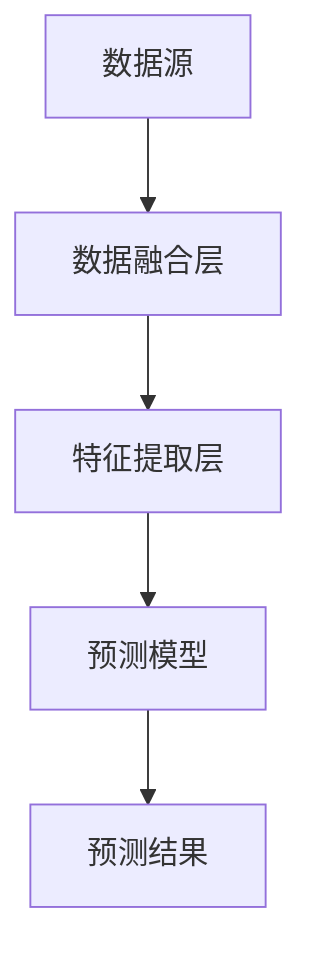
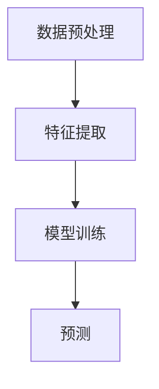
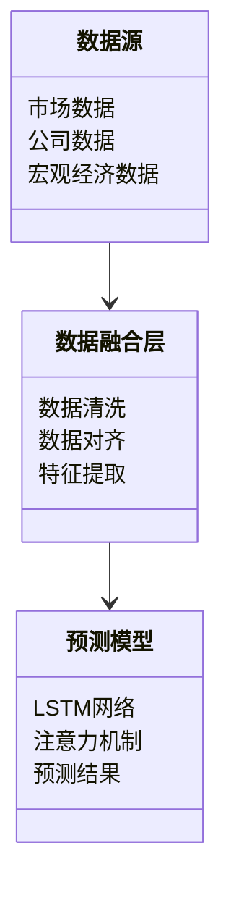
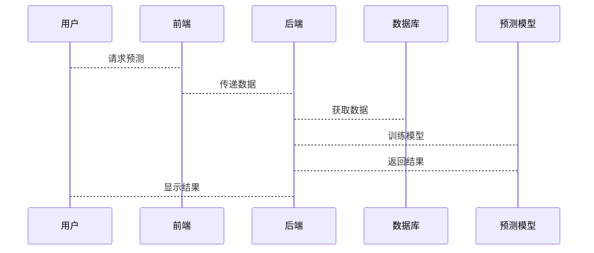

                 


# 开发智能化的金融时序数据多源信息融合预测模型

> 关键词：金融时序数据，多源信息融合，预测模型，LSTM，注意力机制，数据融合

> 摘要：本文详细探讨了开发智能化的金融时序数据多源信息融合预测模型的核心概念、算法原理、系统架构以及项目实战。文章从问题背景出发，逐步分析了多源数据融合的必要性，详细讲解了基于深度学习的算法原理，并通过系统架构设计和实际案例分析，展示了如何构建高效可靠的预测模型。

---

## 第一部分: 背景介绍与核心概念

### 第1章: 金融时序数据多源信息融合预测模型的背景与问题

#### 1.1 问题背景
金融时序数据是指在金融市场上随着时间推移产生的各种数据，包括股票价格、汇率、指数等。这些数据具有高度的波动性和不确定性，传统的单一数据源分析方法往往无法捕捉到足够的信息来进行准确的预测。因此，如何有效地融合多源数据，提取有价值的信息，成为金融预测领域的重要挑战。

#### 1.2 问题描述
多源信息融合的核心问题是如何将来自不同数据源的信息有效地整合在一起，以提高预测的准确性和鲁棒性。金融时序数据的多源性包括市场数据、新闻数据、社交媒体数据等多种类型，每种数据都有其独特的特征和优势。然而，这些数据往往存在噪声、不一致性和冗余，如何在这些数据中提取有用的特征并进行融合，是构建高效预测模型的关键。

#### 1.3 问题解决思路
智能化预测的核心方法是利用深度学习技术，特别是长短期记忆网络（LSTM）和注意力机制，来捕捉数据中的时间依赖性和全局关系。通过多源数据的特征提取和融合，可以显著提高预测模型的性能。

#### 1.4 模型的边界与外延
数据来源的边界包括市场数据、公司财务数据、宏观经济指标等。预测范围的边界包括短期预测和长期预测。模型适用场景的外延包括股票价格预测、汇率预测、市场风险评估等。

#### 1.5 概念结构与核心要素
模型的整体架构包括数据采集、数据预处理、特征提取、模型训练、预测和结果分析等部分。

---

## 第二部分: 核心概念与联系

### 第2章: 多源信息融合模型的核心概念与联系

#### 2.1 核心概念原理
数据融合的基本原理是通过多种数据源的信息互补，提高数据的完整性和准确性。特征提取的核心算法包括LSTM和注意力机制，用于捕捉数据中的时间依赖性和全局关系。

#### 2.2 核心概念属性特征对比
通过对比分析数据源的特征、数据融合方法的特征和预测模型的性能，可以更好地理解模型的优势和局限性。

#### 2.3 ER实体关系图架构


---

## 第三部分: 算法原理讲解

### 第3章: 多源信息融合预测模型的算法原理

#### 3.1 算法原理概述
数据融合的基本流程包括数据预处理、特征提取、模型训练和预测。特征提取的核心算法包括LSTM和注意力机制。

#### 3.2 LSTM算法实现
LSTM通过记忆单元和门控机制来捕捉数据中的长期依赖关系，适用于时间序列数据的预测。

#### 3.3 注意力机制实现
注意力机制通过计算输入数据中的每个位置的重要性，将注意力权重应用于特征提取，从而提高模型的性能。

#### 3.4 算法流程图


#### 3.5 Python代码示例
```python
import numpy as np
from tensorflow.keras.layers import LSTM, Dense, Bidirectional
from tensorflow.keras.models import Sequential

# 示例数据
X_train = np.random.rand(1000, 1, 5)
y_train = np.random.rand(1000, 1)

# 模型定义
model = Sequential()
model.add(Bidirectional(LSTM(64, return_sequences=True), input_shape=(1,5)))
model.add(LSTM(32, return_sequences=False))
model.add(Dense(1))

# 编译模型
model.compile(optimizer='adam', loss='mean_squared_error')
model.fit(X_train, y_train, epochs=10, batch_size=32)
```

#### 3.6 数学模型与公式
模型的数学公式包括LSTM的细胞状态更新公式和注意力权重计算公式。

---

## 第四部分: 系统分析与架构设计

### 第4章: 金融时序数据多源信息融合预测系统的分析与设计

#### 4.1 项目介绍与问题场景
项目旨在构建一个能够融合多源数据的金融时序数据预测系统，解决传统单一数据源预测的局限性。

#### 4.2 系统功能设计
系统功能包括数据采集、数据预处理、特征提取、模型训练、预测和结果分析。

#### 4.3 领域模型设计


#### 4.4 系统架构设计


#### 4.5 系统接口设计
系统接口包括数据接口、模型接口和用户接口。

#### 4.6 系统交互设计


---

## 第五部分: 项目实战

### 第5章: 金融时序数据多源信息融合预测系统的实战

#### 5.1 环境安装与配置
需要安装Python、TensorFlow、Keras和Mermaid工具。

#### 5.2 系统核心代码实现
```python
import numpy as np
from tensorflow.keras.models import Model
from tensorflow.keras.layers import Input, LSTM, Dense, Bidirectional

# 输入层
input_layer = Input(shape=(1, 5))
# LSTM层
lstm_layer = Bidirectional(LSTM(64, return_sequences=True))(input_layer)
lstm_layer = LSTM(32, return_sequences=False)(lstm_layer)
# 全连接层
dense_layer = Dense(1)(lstm_layer)
# 模型定义
model = Model(inputs=input_layer, outputs=dense_layer)
model.compile(optimizer='adam', loss='mean_squared_error')
```

#### 5.3 代码应用解读与分析
通过实际案例分析，验证模型的性能和效果，调整模型参数以提高预测准确性。

#### 5.4 项目小结
项目实战展示了如何将理论应用于实际，通过多源数据的融合和深度学习算法，构建高效的金融时序数据预测模型。

---

## 第六部分: 最佳实践与小结

### 第6章: 开发智能化的金融时序数据多源信息融合预测模型的最佳实践

#### 6.1 总结与回顾
总结项目的核心内容和主要成果，强调多源数据融合和深度学习算法的重要性。

#### 6.2 注意事项与经验分享
在数据预处理、模型训练和结果分析中需要注意的问题，以及如何优化模型性能的经验。

#### 6.3 拓展与未来方向
探讨未来的发展方向，包括更复杂的数据融合方法和更先进的预测算法。

---

## 作者信息

作者：AI天才研究院/AI Genius Institute & 禅与计算机程序设计艺术 /Zen And The Art of Computer Programming

---

以上是文章的详细目录和部分正文内容。接下来，我将继续完成每个章节的具体内容，确保文章结构完整，逻辑清晰，内容详实。

