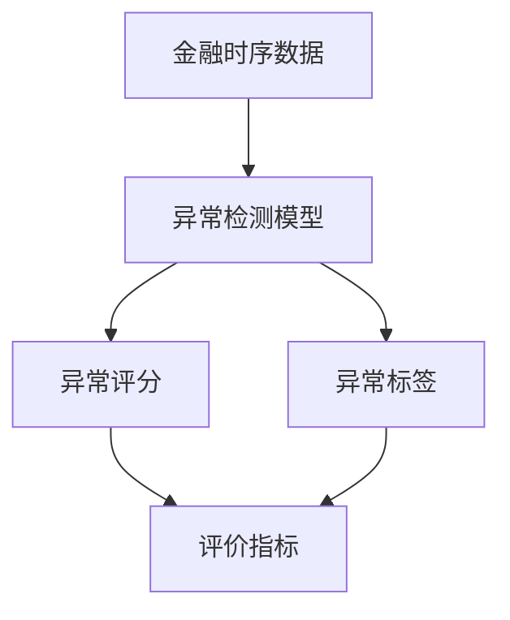
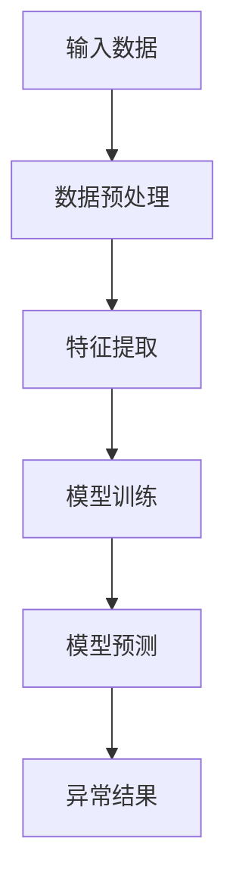
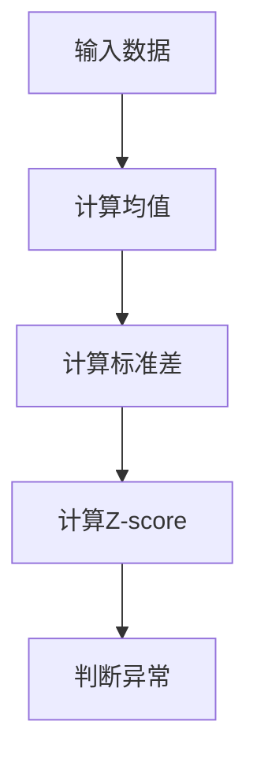
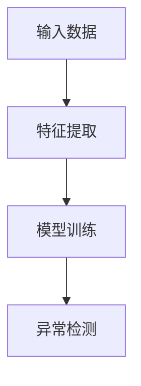
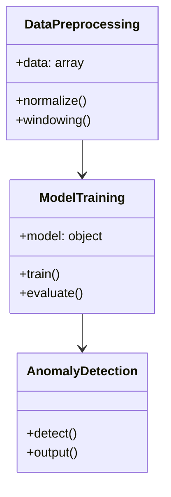
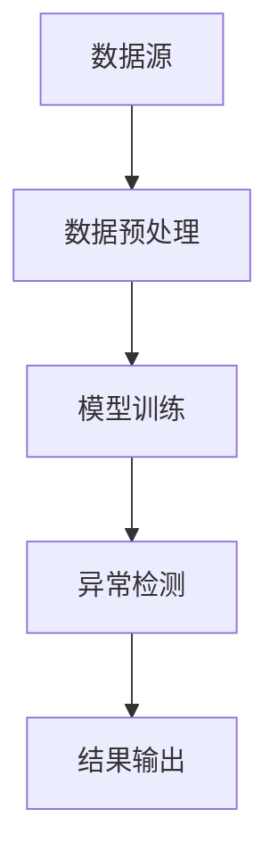
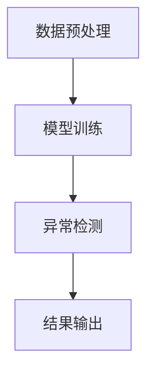
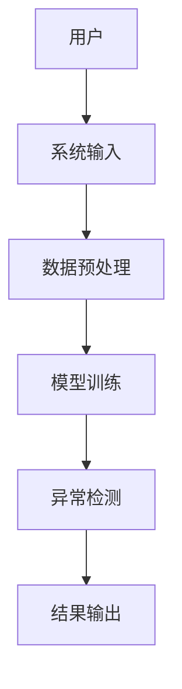
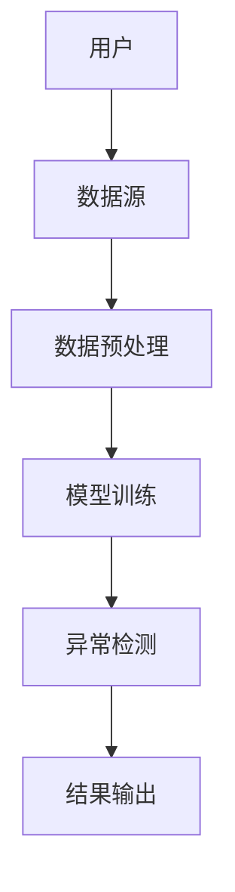

                 


# 开发智能化的金融时序数据异常检测模型

## 关键词：
- 金融时序数据
- 异常检测
- 智能化模型
- 深度学习
- 机器学习

## 摘要：
本文详细探讨了开发智能化的金融时序数据异常检测模型的全过程。从背景介绍、核心概念分析、算法原理讲解、数学模型与公式推导、系统分析与架构设计、项目实战到总结与展望，文章全面覆盖了该领域的关键技术点。通过对比多种算法，结合实际案例，本文深入剖析了如何构建高效、准确的金融时序数据异常检测模型，并提供了详细的代码实现和系统设计思路。

---

# 第一部分: 开发智能化的金融时序数据异常检测模型概述

# 第1章: 背景介绍

## 1.1 金融数据分析的现状

### 1.1.1 金融数据分析的重要性
金融数据分析是金融领域中的核心任务之一，它帮助金融机构识别市场趋势、评估风险、优化投资策略。时序数据（Time Series Data）作为金融数据分析的重要组成部分，涵盖了股票价格、汇率、经济指标等多种时间序列数据。

### 1.1.2 时序数据在金融分析中的应用
时序数据在金融领域的应用非常广泛，包括：
- 股票价格预测
- 市场风险评估
- 异常交易检测
- 经济周期分析

### 1.1.3 异常检测在金融中的挑战
金融数据的时序特性使得异常检测面临以下挑战：
- 数据的非线性特征
- 异常事件的稀疏性
- 噪声干扰
- 数据分布的动态变化

## 1.2 时序数据异常检测的背景

### 1.2.1 什么是时序数据
时序数据是指按照时间顺序排列的数据，通常具有以下特征：
- 趋势性（Trend）
- 季节性（Seasonality）
- 周期性（Cyclicality）
- 随机性（Randomness）

### 1.2.2 时序数据异常的定义与分类
异常检测（Anomaly Detection）是指识别出与正常数据模式不一致的观测值。在时序数据中，异常可以分为以下几类：
- 点异常（Point Anomaly）
- 区间异常（Segment Anomaly）
- 整体异常（Contextual Anomaly）

### 1.2.3 异常检测在金融中的意义
- 识别潜在的市场风险
- 发现异常交易行为
- 提前预警金融市场的波动
- 支持投资决策

## 1.3 问题背景与目标

### 1.3.1 金融时序数据异常检测的核心问题
- 如何有效捕捉时序数据中的异常模式
- 如何在动态变化的金融环境中保持模型的稳定性
- 如何平衡模型的计算效率与检测准确性

### 1.3.2 问题解决的必要性
金融市场的波动性和复杂性要求异常检测模型必须具备高精度和实时性。通过及时发现异常，金融机构可以采取措施规避风险，提升投资收益。

### 1.3.3 边界与外延
- 数据范围：金融时序数据通常具有高频性（High-Frequency Trading）特征。
- 时间范围：从短期波动到长期趋势。
- 数据规模：金融数据通常具有海量特性，对模型的计算效率提出更高要求。

## 1.4 概念结构与核心要素

### 1.4.1 模型的核心要素分析
- 数据输入：金融时序数据
- 模型算法：统计、机器学习、深度学习方法
- 检测结果：异常评分或标签
- 评价指标：精确率（Precision）、召回率（Recall）、F1值等

### 1.4.2 概念结构图



## 1.5 本章小结
本章通过分析金融数据分析的现状，介绍了时序数据在金融中的应用，并重点阐述了异常检测在金融领域的挑战和意义。通过定义和分类异常类型，明确了问题背景和目标，为后续章节的模型构建奠定了基础。

---

# 第二部分: 核心概念与联系

# 第2章: 核心概念与联系

## 2.1 异常检测模型的基本原理

### 2.1.1 异常检测的数学模型
异常检测可以通过以下数学模型进行描述：
$$ Anomaly = f(x) $$
其中，$x$ 是输入数据，$f$ 是异常检测函数，输出为异常评分或标签。

### 2.1.2 模型的核心属性特征对比
以下表格对比了几种常见异常检测模型的核心属性：

| 模型类型       | 输入数据类型 | 是否需要标注 | 计算效率 | 检测准确性 |
|----------------|--------------|--------------|----------|------------|
| 统计模型       | 结构化数据    | 不需要        | 高        | 中等        |
| 机器学习模型   | 结构化数据    | 需要（有监督）| 中等       | 高          |
| 深度学习模型   | 非结构化数据  | 不需要        | 低        | 高          |

### 2.1.3 ER实体关系图架构

```mermaid
erd
actor Model
model --> data: 输入
model --> function: 处理
data --> anomaly: 输出
```

## 2.2 模型的核心要素分析

### 2.2.1 数据特征分析
金融时序数据的特征包括：
- 趋势性
- 季节性
- 周期性
- 噪声

### 2.2.2 模型算法选择
根据数据特征选择合适的算法：
- 统计模型：适用于简单序列数据
- 机器学习模型：适用于复杂序列数据
- 深度学习模型：适用于长序列和非线性特征

### 2.2.3 评价指标对比
以下表格对比了常见评价指标：

| 指标类型       | 公式                           | 解释             |
|----------------|-------------------------------|-----------------|
| 精确率（Precision） | $$ Precision = \frac{TP}{TP+FP} $$ | 正确识别的异常比例 |
| 召回率（Recall）   | $$ Recall = \frac{TP}{TP+FN} $$   | 异常检测的全面性  |
| F1值           | $$ F1 = \frac{2 \cdot Precision \cdot Recall}{Precision + Recall} $$ | 综合评价指标     |

## 2.3 模型的实体关系图

### 2.3.1 数据流图分析



### 2.3.2 实体关系图架构

```mermaid
erd
actor Model
model --> data: 输入
model --> function: 处理
data --> anomaly: 输出
```

## 2.4 本章小结
本章通过对比分析不同模型的核心属性和评价指标，明确了异常检测模型的选择依据。通过数据流图和实体关系图，直观展示了模型的构建过程和数据流动关系。

---

# 第三部分: 算法原理讲解

# 第3章: 算法原理

## 3.1 基于统计的异常检测算法

### 3.1.1 基本原理
基于统计的异常检测方法通过计算数据的统计分布，识别偏离正常分布的点。常用的方法包括：
- Z-score
- 畴外法（Grubbs' test）

### 3.1.2 算法流程图



### 3.1.3 代码实现与分析
以下是基于Z-score的异常检测代码示例：

```python
import numpy as np

def z_score_outlier_detection(data, threshold=3):
    mean = np.mean(data)
    std = np.std(data)
    z_scores = [(x - mean) / std for x in data]
    outliers = [x for x in data if abs((x - mean)/std) > threshold]
    return outliers

# 示例数据
data = [1, 2, 3, 4, 5, 100, 6, 7, 8, 9]
outliers = z_score_outlier_detection(data)
print(outliers)  # 输出：[100]
```

### 3.1.4 优缺点分析
- 优点：计算简单，适用于正态分布的数据。
- 缺点：对数据分布的假设较强，且难以捕捉复杂模式。

## 3.2 基于机器学习的异常检测算法

### 3.2.1 基本原理
基于机器学习的异常检测方法通过训练模型识别正常数据的模式，从而发现异常。常用算法包括：
- Isolation Forest
- One-Class SVM

### 3.2.2 算法流程图



### 3.2.3 代码实现与分析
以下是使用Isolation Forest算法的异常检测代码示例：

```python
from sklearn.ensemble import IsolationForest

def isolation_forest_outlier_detection(data, contamination=0.1):
    model = IsolationForest(contamination=contamination)
    model.fit(data)
    outliers = model.predict(data) == -1
    return outliers

# 示例数据
data = np.random.rand(100, 1)
outliers = isolation_forest_outlier_detection(data)
print(outliers)
```

### 3.2.4 优缺点分析
- 优点：能够捕捉复杂数据模式，适用于高维数据。
- 缺点：需要标注数据，计算复杂度较高。

## 3.3 基于深度学习的异常检测算法

### 3.3.1 基本原理
基于深度学习的异常检测方法通过神经网络学习数据的深层特征，识别异常。常用算法包括：
- LSTM
- GRU

### 3.3.2 算法流程图


### 3.3.3 代码实现与分析
以下是使用LSTM网络的异常检测代码示例：

```python
import keras
from keras.layers import LSTM, Dense

def lstm_anomaly_detection(data, batch_size=32, epochs=10):
    model = keras.Sequential()
    model.add(LSTM(64, input_shape=(None, 1)))
    model.add(Dense(1))
    model.compile(loss='mse', optimizer='adam')
    model.fit(data, epochs=epochs, batch_size=batch_size)
    return model

# 示例数据
data = np.random.rand(100, 1)
model = lstm_anomaly_detection(data)
```

### 3.3.4 优缺点分析
- 优点：能够捕捉数据的复杂模式和时间依赖性。
- 缺点：计算资源消耗大，模型训练时间长。

## 3.4 算法对比与选择

### 3.4.1 算法性能对比
以下表格对比了三种算法的性能：

| 模型类型       | 计算效率 | 检测准确性 | 适用场景             |
|----------------|----------|------------|----------------------|
| 统计模型       | 高       | 中等       | 简单序列数据         |
| 机器学习模型   | 中等      | 高         | 高维复杂数据         |
| 深度学习模型   | 低       | 高         | 长序列和非线性特征     |

### 3.4.2 适用场景分析
- 统计模型适用于数据分布已知且简单的场景。
- 机器学习模型适用于高维复杂数据。
- 深度学习模型适用于长序列和非线性特征的数据。

### 3.4.3 最佳实践
- 根据数据特征选择合适的模型。
- 对比不同模型的性能，选择最优方案。
- 结合业务需求进行模型调优。

## 3.5 本章小结
本章详细介绍了三种异常检测算法的基本原理、实现方法和优缺点。通过对比分析，明确了不同算法的适用场景和最佳实践，为后续的系统设计和项目实现奠定了基础。

---

# 第四部分: 数学模型与公式

# 第4章: 数学模型与公式

## 4.1 统计模型

### 4.1.1 正态分布模型
正态分布模型用于描述数据的分布特性，其概率密度函数为：
$$ f(x) = \frac{1}{\sqrt{2\pi\sigma^2}} e^{-\frac{(x-\mu)^2}{2\sigma^2}} $$

### 4.1.2 置信区间计算
置信区间用于判断数据点是否偏离正常范围：
$$ \mu \pm z \cdot \sigma $$

### 4.1.3 异常评分公式
Z-score公式：
$$ Z = \frac{x - \mu}{\sigma} $$

## 4.2 机器学习模型

### 4.2.1 支持向量机模型
支持向量机（SVM）用于分类问题，其目标函数为：
$$ \min_{\theta} \frac{1}{2}\theta^T\theta + C\sum_{i=1}^n \xi_i $$
$$ \text{subject to} \quad y_i(\theta^T x_i + b) \geq 1 - \xi_i \quad \xi_i \geq 0 $$

### 4.2.2 随机森林模型
随机森林模型通过集成学习提高检测准确性，其核心公式为：
$$ y = \text{sign}(\sum_{i=1}^n \text{tree}_i(x)) $$

### 4.2.3 模型评估公式
F1值公式：
$$ F1 = \frac{2 \cdot Precision \cdot Recall}{Precision + Recall} $$

## 4.3 深度学习模型

### 4.3.1 LSTM网络模型
LSTM网络的遗忘门、输入门和输出门公式分别为：
$$ f_t = \sigma(g_f(x_t, h_{t-1})) $$
$$ i_t = \sigma(g_i(x_t, h_{t-1})) $$
$$ o_t = \sigma(g_o(x_t, h_{t-1})) $$
$$ c_t = f_t \cdot c_{t-1} + i_t \cdot \tilde{c}_t $$

### 4.3.2 GRU网络模型
GRU网络的更新门和重置门公式分别为：
$$ z_t = \sigma(g_z(x_t, h_{t-1})) $$
$$ r_t = \sigma(g_r(x_t, h_{t-1})) $$
$$ h_t = z_t \cdot h_{t-1} + (1 - z_t) \cdot \tilde{h}_t $$

## 4.4 本章小结
本章通过数学公式详细推导了三种异常检测模型的核心原理，为后续的系统设计和项目实现提供了理论基础。

---

# 第五部分: 系统分析与架构设计

# 第5章: 系统分析与架构设计

## 5.1 问题场景介绍

### 5.1.1 项目背景
本项目旨在开发一个智能化的金融时序数据异常检测系统，帮助金融机构实时监控市场波动，识别潜在风险。

### 5.1.2 项目介绍
系统将集成多种异常检测算法，支持多种金融数据源，提供实时检测和预警功能。

## 5.2 系统功能设计

### 5.2.1 领域模型类图



### 5.2.2 系统架构设计



## 5.3 系统架构图



## 5.4 系统接口设计

### 5.4.1 输入接口
- 数据输入接口：支持多种金融数据格式。
- 参数配置接口：允许用户自定义模型参数。

### 5.4.2 输出接口
- 异常结果输出接口：提供检测结果和异常评分。
- 日志输出接口：记录系统运行状态和错误信息。

## 5.5 系统交互设计

### 5.5.1 序列图



### 5.5.2 协作图



## 5.6 本章小结
本章通过系统分析和架构设计，明确了系统的功能模块和交互流程。通过类图和序列图，直观展示了系统的构建过程和模块之间的关系。

---

# 第六部分: 项目实战

# 第6章: 项目实战

## 6.1 环境安装

### 6.1.1 Python环境配置
安装必要的Python包：
- NumPy
- Pandas
- Scikit-learn
- Keras
- TensorFlow

### 6.1.2 数据集获取
可以从金融数据API（如Yahoo Finance）获取股票价格数据。

## 6.2 系统核心实现

### 6.2.1 数据预处理
数据清洗和标准化处理：
```python
import pandas as pd
import numpy as np

# 示例数据加载
data = pd.read_csv('stock_prices.csv')
# 数据清洗
data = data.dropna()
# 标准化处理
from sklearn.preprocessing import StandardScaler
scaler = StandardScaler()
data_scaled = scaler.fit_transform(data)
```

### 6.2.2 模型训练与优化
使用LSTM网络进行异常检测：
```python
from keras.models import Sequential
from keras.layers import LSTM, Dense

# 模型构建
model = Sequential()
model.add(LSTM(64, input_shape=(None, 1)))
model.add(Dense(1))
model.compile(loss='mse', optimizer='adam')

# 模型训练
model.fit(data_scaled, epochs=10, batch_size=32)
```

### 6.2.3 异常检测与可视化
异常结果的可视化：
```python
import matplotlib.pyplot as plt

# 预测结果
predictions = model.predict(data_scaled)
# 可视化
plt.plot(data, label='正常数据')
plt.plot(predictions, label='异常数据')
plt.legend()
plt.show()
```

## 6.3 代码应用解读与分析

### 6.3.1 数据预处理代码解读
- 使用Pandas加载数据
- 通过StandardScaler进行标准化处理
- 数据清洗处理缺失值

### 6.3.2 模型训练代码解读
- 构建LSTM网络模型
- 设置损失函数和优化器
- 进行模型训练

### 6.3.3 异常检测代码解读
- 使用训练好的模型进行预测
- 将预测结果与实际数据进行对比
- 可视化展示异常点

## 6.4 实际案例分析

### 6.4.1 案例背景
以某股票的历史价格数据为例，训练模型识别异常价格波动。

### 6.4.2 数据准备
加载数据并进行预处理：
```python
data = pd.read_csv('stock_prices.csv')
data_scaled = scaler.fit_transform(data)
```

### 6.4.3 模型训练
训练LSTM网络模型：
```python
model.fit(data_scaled, epochs=10, batch_size=32)
```

### 6.4.4 结果分析
可视化异常点：
```python
plt.plot(data, label='正常数据')
plt.plot(predictions, label='异常数据')
plt.legend()
plt.show()
```

## 6.5 本章小结
本章通过实际案例展示了如何使用LSTM网络进行金融时序数据的异常检测。从数据预处理到模型训练，再到结果可视化，详细解读了每个步骤的实现细节。

---

# 第七部分: 总结与展望

## 7.1 总结
本文详细探讨了开发智能化的金融时序数据异常检测模型的全过程。从背景介绍、核心概念分析、算法原理讲解到系统设计和项目实战，文章全面覆盖了该领域的关键技术点。通过对比分析不同算法的优缺点，明确了最佳实践路径。

## 7.2 未来展望
未来的研究方向包括：
- 更高效的模型训练方法
- 更精准的异常检测算法
- 更智能的系统架构设计

## 7.3 注意事项
- 数据隐私保护
- 模型的可解释性
- 系统的实时性要求

## 7.4 拓展阅读
- 《时间序列分析》
- 《深度学习实战》
- 《金融数据分析》

---

# 附录

## 附录A: 数据集参考
- Yahoo Finance API
- Quandl数据集
- Alpha Vantage API

## 附录B: 工具与库
- Python
- NumPy
- Pandas
- Scikit-learn
- Keras
- TensorFlow

---

# 作者

作者：AI天才研究院/AI Genius Institute & 禅与计算机程序设计艺术 /Zen And The Art of Computer Programming

